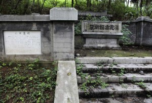

# 鹦鹉洲地名由来考辨

** **

鹦鹉洲曾是万里长江武汉段江面上一处著名的沙洲，唐代诗人崔颢一句“晴川历历汉阳树，芳草萋萋鹦鹉洲”[①]让这处沙洲妇孺皆知。除此之外，历代文人都留下过关于鹦鹉洲的记述，因此这处如今早已沉没的沙洲成为承载重要历史文化内涵的地理坐标，名列我国著名五大河洲之首。一直以来，关于鹦鹉洲地名由来的主流说法是它和汉末名士祢衡（173—198年）有关，但也有极少数研究者指出，鹦鹉洲地名由来与祢衡相关的说法纯属后人附会。这种非主流观点的声音虽然微小，但不禁让人产生强烈好奇，鹦鹉洲地名由来到底和祢衡有没有关系？本文希望通过对史料的细致梳理，还原鹦鹉洲地名由来的本原面貌，并求正于方家。

#### **一、今人关于鹦鹉洲地名由来的说法**

吴业新先生编著的《武汉风貌》一书中写道：“山东才子祢衡（173—198年）避难到荆州，刘表不容，转寄于江夏太守黄祖门下，一天，黄祖的长子黄射在洲上大宴宾客，有人献鹦鹉，黄祖请祢衡作赋，祢衡即席写成了著名的‘锵锵戛金玉，句句欲飞鸣’的《鹦鹉赋》（见《后汉书，文苑，祢衡传），鹦鹉洲从此而得名，后又因崔颢的诗而流传更广！祢衡后因讥讽黄祖是‘庙中之神，虽受祭礼，恨无灵验’，被黄祖杀了，葬在鹦鹉洲上。”[②]

李权时、皮明庥先生主编的《武汉通览》一书这样解释鹦鹉洲地名的由来：“因汉末文人祢衡在此写下著名的《鹦鹉赋》，死后又葬在这里，故名。”[③]

徐明庭先生主编的《武汉风情》一书中说：“洲则以东汉学士祢衡作《鹦鹉赋》于其上（祢衡后为黄祖所杀害，亦葬于此）而得名，……此洲始出年代无考，但从汉末有黄祖之子黄射在洲上大宴宾客，祢衡作《鹦鹉赋》于其上，可见洲上景色秀美，已为游览胜地。”[④]

肖志华、严昌洪先生编写的《武汉掌故》一书中称：“祢衡又讽刺黄祖是‘庙中之神，虽受祭祀，恨无灵验’，终被性情暴躁的黄祖杀害，终年仅26岁，葬于江中芳洲之上。后人为纪念这位刚直不阿的名士，便借《鹦鹉赋》将他埋骨之处称为鹦鹉洲，并在洲上建正平祠，供人凭吊。”[⑤]

李怀军先生主编的《武汉通史·宋元明清卷》表述则更加详细：“《太平寰宇记》说：‘鹦鹉洲在大江中与汉阳县分界，后汉黄祖为江夏太守，祖长子射大会宾客，有献鹦鹉于此洲，故名。’这就是鹦鹉洲名称的由来。山东才子祢衡（173—198年）避难来到荆州，刘表不能相容，转送江夏太守黄祖。一天，黄祖长子黄射在洲上大宴宾客，有人献鹦鹉，黄祖请祢衡作赋，祢衡当即写成《鹦鹉赋》（见《后汉书·文苑·祢衡传》）。此事说明在东汉末鹦鹉洲已很大，而且风景优美，是宴会游乐之地。祢衡是一位傲骨铮铮的书生，后因讥讽黄祖是‘庙中之神，虽受祭祀，恨无灵验’，被黄祖杀掉，葬在武昌江外洲上。”[⑥]

除此之外，今人谈到鹦鹉洲地名由来的文章还有很多，其观点基本和上面引述的这些资料相同，也就是说，今人的主流观点是——鹦鹉洲得名是因为汉末名士祢衡曾作《鹦鹉赋》于其上，祢衡被杀害后又葬在洲上，后人为纪念祢衡，所以将江上这处沙洲称为鹦鹉洲。

与这些主流说法不同的是，2009年《武汉船舶职业技术学院学报》这份不起眼的刊物上登载出了《鹦鹉洲文化变迁论略》一文，作者宗亮先生考察原始史料后敏锐地指出：“祢衡与‘鹦鹉’有关应无问题，但祢衡是否与汉末江中未命名的沙洲有关我们却不得而知了。因为无论是上引材料还是北魏郦道元所著《水经注》等均不曾提到黄射宴请宾客或黄祖大会嘉宾的地点是在‘鹦鹉洲’上，甚至连是否位处沙洲也无记录，《后汉书·文苑列传》只是说：‘黄祖在蒙冲船上，大会宾客。’说的是在战船上。至于祢衡的葬地，则更是于史籍无考。而关于祢衡赋诗洲上，洲因之而名‘鹦鹉’或者祢衡死葬‘鹦鹉洲’的说法，极有可能是祢衡稍晚时代人为纪念祢衡而生的附会，这种‘附会’最迟在魏晋南朝时当已出现。[⑦] 笔者在武汉大学图书馆以及网络上所查阅到的关于鹦鹉洲的全部文章中，正式提出这种观点的只有宗亮先生一人。略有遗憾的是，或是受《鹦鹉洲文化变迁论略》文章主题的影响，宗亮先生对这一观点的讨论不甚详实与全面。

#### **二、早期史料中祢衡与鹦鹉洲的关系**

关于祢衡生平的早期史料记载出现在裴松之注释《三国志·魏书·荀彧传》时所引用的《平原祢衡传》《文士传》《傅子》以及《后汉书·文苑·祢衡传》中。裴松之所引用的《平原祢衡传》《文士传》与《傅子》没有任何文字涉及祢衡与《鹦鹉赋》或者鹦鹉洲的关系，更没有祢衡死葬鹦鹉洲的记载。裴松之所引用的《平原祢衡传》这样描述祢衡之死：

将军黄祖屯夏口，祖子射与衡善，随到夏口。祖嘉其才，每在坐，席有异宾，介使与衡谈。后衡骄蹇，答祖言徘优饶言，祖以为骂己也，大怒，顾伍佰捉头出。左右遂扶以去，拉而杀之。[⑧]

裴松之所引用的《傅子》描写祢衡之死则比较模糊：

衡以交绝于刘表，智穷于黄祖，身死名灭，为天下笑者，谮之者有形也。[⑨]

《后汉书·文苑·祢衡传》是最早涉及祢衡与《鹦鹉赋》关系的史料，同时也详细记载了祢衡之死：

射时大会宾客，人有献鹦鹉者，射举卮于衡曰：“愿先生赋之，以娱嘉宾。”衡揽笔而作，文无加点，辞采甚丽。后黄祖在蒙冲船上，大会宾客，而衡言不逊顺，祖惭，乃诃之，衡更熟视曰：“死公！云等道？”祖大怒，令五百将出，欲加箠，衡方大骂，祖恚，遂令杀之。祖主簿素疾衡，即时杀焉。射徒跣来救，不及。祖亦悔之，乃厚加棺殓。衡时年二十六，其文章多亡云。[⑩]

南朝梁昭明太子萧统《文选》一书收录了祢衡《鹦鹉赋》全文，在这篇赋前有一段序文，所述与《后汉书》接近：

时黄祖太子射，宾客大会，有献鹦鹉者，举酒于衡前曰：“祢处士，今日无用娱宾，窃以此鸟自远而至，明慧聪善，羽族之可贵，愿先生为之赋，使四坐咸共荣观，不亦可乎？”衡因为赋，笔不停缀，文不加点。[11]

北魏郦道元《水经注》载：

江之右岸当鹦鹉洲南，有江水右迤，谓之驿渚。三月之末，水下通樊口水。[12]

山左即沔水口矣。沔左有却月城，亦曰偃月垒，戴监军筑，故曲陵县也，后乃沙羡县治。昔魏将黄祖所守，吴遣董袭、凌统攻而擒之。祢衡亦遇害于此。衡恃才倜傥，肆狂狷于无妄之世，保身不足，遇非而死，可谓咎悔之深矣。江之右岸有船官浦，历黄鹄矶西而南矣。直鹦鹉洲之下尾。[13]

南朝梁陈时期顾野王（519—581）《舆地志》云：“夏口江中有鹦鹉洲。”[14]

《水经注》和《舆地志》这两本距祢衡生活时代较近的地理著作，在提及鹦鹉洲时，均没有介绍它地名的由来，更没有谈及祢衡和鹦鹉洲的关系。

从这些早期原始史料中，我们可以发现，祢衡写《鹦鹉赋》的地点究竟在哪里根本没有任何记载。前文提到的《武汉风貌》《武汉通史·宋元明清卷》两本书中，作者都明确用《后汉书·文苑·祢衡传》来证明祢衡是在洲上写下了《鹦鹉赋》，这种论证显然不能成立。至于祢衡是否死于鹦鹉洲且葬于鹦鹉洲，《后汉书·文苑·祢衡传》只是说“黄祖在蒙冲船上，大会宾客”，祢衡在这次事件中出言不逊导致被杀，被害地点可能就在蒙冲船上。《水经注》说“祢衡亦遇害于此”，“此”指代“却月城”，这就意味着祢衡遇害地点不是江上的沙洲。

#### **三、唐代诗文中的祢衡与鹦鹉洲**

唐代文坛出现了众多吟咏祢衡与鹦鹉洲的诗文。如李白《望鹦鹉洲怀祢衡》：“魏帝营八极。蚁观一祢衡。黄祖斗筲人。杀之受恶名。吴江赋鹦鹉。落笔超群英。锵锵振金玉。句句欲飞鸣。鸷鹗啄孤凤。千春伤我情。五岳起方寸。隐然讵可平。才高竟何施。寡识冒天刑。至今芳洲上。兰蕙不忍生。”[15]王贞白《晓泊汉阳渡》：“落月临古渡。武昌城未开。残灯明市井。晓色辨楼台。云自苍梧去。水从嶓冢来。芳洲号鹦鹉。用记祢生才。”[16]胡曾《江夏》：“黄祖才非长者俦，祢衡珠碎此江头。今来鹦鹉洲边过，惟有无情碧水流。”[17]崔涂《鹦鹉洲即事》：“怅望春襟郁未开。重吟鹦鹉益堪哀。曹瞒尚不能容物。黄祖何曾解爱才。幽岛暖闻燕雁去。晓江晴觉蜀波来。何人正得风涛便。一点轻帆万里回。”[18]这些诗文都把鹦鹉洲和祢衡联系在一起，文人墨客们似乎已经确定，祢衡的故事发生在鹦鹉洲是毫无疑问的。

宋元明清时代，将祢衡与鹦鹉洲明确联系在一起的诗词、戏曲、小说等更是不胜枚举。

#### **四、唐代以后史料中的祢衡与鹦鹉洲**

唐代以后，史料中关于鹦鹉洲与祢衡的记载格外丰富，在此无法一一摘录，下面试选取其中具有代表性的部分史料作重点分析。

北宋初年《太平寰宇记》记载：

鹦鹉洲，在大江东，县西南二里。西过此洲，从北头七十步大江中流，与汉阳县分界。后汉书云：“黄祖为江夏太守时，黄祖长子射大会宾客，有献鹦鹉于此洲，故为名。”又荆州记云：“江夏郡城西临江，有黄鹤楼，又有鹦鹉洲。侯景令宋子仙夜袭江夏，藏船于鹦鹉之洲。”[19]

《太平寰宇记》的这段记载引用了所谓《后汉书》中的史料，但事实上《后汉书》中根本就没有这句话。《太平寰宇记》的这则材料也是前文提到的《武汉通史·宋元明清卷》介绍鹦鹉洲地名由来的重要依据，两相对比，显而易见，《武汉通史·宋元明清卷》作者引用史料时对其做了裁剪，更重要的是《太平寰宇记》所引用的《后汉书》中的相关记载纯属伪造。因此，《武汉通史·宋元明清卷》关于鹦鹉洲地名由来的论述完全站不住脚。

南宋诗人陆游在《入蜀记》这部日记体的游记之作中写道：

黎明离鄂州，便风挂帆，沿鹦鹉洲南行。洲上有茂林神祠，远望如小山。洲盖祢正平被杀处，故太白诗云：“至今芳洲上，兰蕙不敢生。”梁王僧辩击邵陵王纶军至鹦鹉洲，即此地也。[20]

陆游称“洲盖祢正平被杀处”，紧接着他想起李白《望鹦鹉洲怀祢衡》中的诗句，可见李白此诗对他认识祢衡与鹦鹉洲之间的关系有着很大的影响。

明末周圣楷《楚宝》是迄今最一部楚志全书，关于鹦鹉洲，其中有这样的记载：

鹦鹉洲在江夏城西大江中祢衡尝为太守黄祖作鹦鹉赋揽笔而作文无加点辞采甚丽后祖杀之葬于此洲故名或云即杀于洲上

李白望鹦鹉洲怀祢衡曰魏帝营八极蚁观一祢衡黄祖斗筲人杀之受恶名吴江赋鹦鹉落笔超群英锵锵振金玉句句欲飞鸣鸷鹗啄孤凤千春伤我情五岳起方寸隐然讵可平才高竟何施寡识冒天刑至今芳洲上兰蕙不忍生[21]

尽管《楚宝》“揽笔而作文无加点辞采甚丽”这些话明显来源于《后汉书·文苑·祢衡传》，但是《后汉书》记载的祢衡在黄祖子黄射大会宾客时作《鹦鹉赋》一事，到了《楚宝》一书中，却成了“祢衡尝为太守黄祖作鹦鹉赋”。《楚宝》更是明确声称“后祖杀之葬于此洲故名”，不过谈到祢衡被杀地点时，用“或云即杀于洲上”这样模糊的说法。与陆游相似，《楚宝》作者也想起了李白《望鹦鹉洲怀祢衡》一诗，并将其全文引用。

清代顾祖禹（1631—1692）《读史方舆纪要》云：

鹦鹉洲，在城南，跨城西大江中，尾直黄鹄矶，即黄祖害祢衡之地。梁大宝初湘东王绎使王僧辩帅舟师袭邵陵王纶于江夏，僧辩引军至鹦鹉洲是也。[22]

作者已经认定，鹦鹉洲即是“黄祖害祢衡之地”。

清末胡凤丹（1823—1890）是一位研究鹦鹉洲历史地理的集大成者，他的《鹦鹉洲小志》是研究鹦鹉洲不可不读的一部极其重要的著作。他在此书《自序》中说：“鹦鹉洲以祢赋得名，其忤黄祖遇害也，遂葬于此，故其地尤著。”[23]该书“首卷汇录各书纪载斯洲者”[24]，汇录的第一条史料是：

黄祖为江夏太守。时黄祖太子射宾客大会，有献鹦鹉于此洲，故以为名。《后汉书》[25]

这句话和《太平寰宇记》伪造的那则史料相差无几。胡凤丹在《鹦鹉洲小志》这部研究鹦鹉洲历史地理影响巨大的著作中，汇录这样一条虚构的材料，无疑会极大程度地歪曲后人对历史事实的认知。

今人在论述鹦鹉洲与祢衡关系时，受到各个时期材料的影响就更大了。同样以前文谈到的《武汉通史·宋元明清卷》这本历史著作为例，作者称，祢衡曾讥讽黄祖是“庙中之神，虽受祭祀，恨无灵验”，导致祢衡被杀。其实祢衡讥讽黄祖的这句话来源于《三国演义》这部历史小说：

人报黄祖斩了祢衡。表问其故，对曰：“黄祖与祢衡共饮醉，祖问衡曰：‘君在许都，有何人物？’衡曰：‘大儿孔文举，小儿杨祖德，除此二人，别无人物。’祖曰：‘似我何如？’衡曰：‘汝似庙中之神，虽受祭祀，恨无灵验。’祖大怒曰：‘汝以我为土木偶人耶？’遂斩之。衡至死骂不绝口。”刘表闻衡死，亦嗟呀不已，令葬于鹦鹉洲边。[26]

随意把小说中的话当做历史材料来使用是相当不严谨的。不过，这也恰好反映了《三国演义》一书对后世认识基本历史事实的深远影响。刘表葬祢衡于鹦鹉洲的说法，也偶见今人的文章之中。

#### ** 五、结论**

通过以上论述可知，在早期原始史料中，《鹦鹉赋》写于何处，祢衡葬于何处，根本没有任何记载。《水经注》认为祢衡遇害地点是却月城，而不是鹦鹉洲。南北朝后期，祢衡与鹦鹉洲的关系可能开始模糊化了。至唐代，纪念祢衡的文人墨客写下众多将祢衡与鹦鹉洲联系在一起的诗文，尤以李白《望鹦鹉洲怀祢衡》一诗为代表。唐代以后，论述鹦鹉洲的史籍，或伪造《后汉书》等早期史料的记载，或深受文学作品的影响，或没有明确依据就妄下结论，使得鹦鹉洲地名由来与祢衡有关的说法似乎成为一件毋庸置疑的事情。后来，人们又修祢正平墓、鹦鹉寺、正平祠[27]等等于鹦鹉洲上，不断丰富了鹦鹉洲与祢衡的关联。

自祢衡死后1800多年以来的历史表明，鹦鹉洲地名由来的演绎正好印证了顾颉刚先生的“古史层累说”，我们必须承认，今人的主流观点——鹦鹉洲得名是因为汉末名士祢衡曾作《鹦鹉赋》于其上，祢衡被杀害后又葬在洲上，后人为纪念祢衡，所以将江上这处沙洲称为鹦鹉洲——是完全没有可靠的历史依据的，也是根本不成立的。

 

### 【参考文献】

 [①] 崔颢：《黄鹤楼》，冯天瑜主编：《黄鹤楼志》，武汉大学出版社，1999年，第201页。 [②] 吴业新编著：《武汉风貌》，地质出版社，1984年，第100页。 [③] 李权时，皮明庥主编：《武汉通览》，武汉出版社，1988年，第97页。 [④] 徐明庭主编：《武汉风情》，华中理工大学出版社，1992年，第81至82页。 [⑤] 肖志华，严昌洪编写：《武汉掌故》，武汉出版社，2000年，第8页。 [⑥] 李怀军主编：《武汉通史·宋元明清卷》，武汉出版社，2006年，第333至334页。 [⑦] 宗亮：《鹦鹉洲文化变迁论略》，《武汉船舶职业技术学院学报》，2009年第5期。 [⑧]陈寿著，裴松之注，邹金德整理：《裴松之注》上卷，天津古籍出版社，2009年，第182页。 [⑨] 同上。 [⑩]（南朝宋）范晔：《后汉书》，中华书局，2007年，第778页。 [11]（梁）萧统编；（唐）李善注：《文选》第二册，上海古籍出版社，1986年，第612页。 [12]（北魏）郦道元著；史念林等注释：《水经注》，华夏出版社，2006年，第659页。 [13] 同上，第660页。 [14]（南朝陈）顾野王著；顾恒一，顾德明，顾久雄辑注：《舆地志辑注》，上海古籍出版社，2011年，第143页。 [15]（清）彭定求等编：《全唐诗》第6册，中华书局，1960年，第1848页。 [16]（清）彭定求等编：《全唐诗》第20册，中华书局，1960年，第8062页。 [17] 周振甫主编：《唐诗宋词元曲全集》（全唐诗 第十二册），黄山书社，1999年，第4817页。 [18]（清）彭定求等编：《全唐诗》第20册，中华书局，1960年，第7782页。 [19]（宋）乐史撰；王文楚等点校：《太平寰宇记》第五册，中华书局，2007年，第2279页。 [20]（宋）陆游著，蒋方校注：《入蜀记校注》，湖北人民出版社，2004年，第164页。 [21]（明）周圣楷编纂；（清）邓显鹤增辑：《楚宝》下册，岳麓书社，2008年，第841页。 [22]（清）顾祖禹撰；贺次君，施和金点校：《读史方舆纪要》第七册，中华书局，2005年，第3525页。 [23]（清）胡凤丹著+（清）胡凤丹著；李桂生，何诗海点注+杜朝晖点注：《大别山志·鹦鹉洲小志》，湖北教育出版社，2001年，第223页。 [24] 同上，第228页。 [25] 同上，第229页。 [26] 罗贯中著；毛纶，毛宗岗点评：《三国演义》，中华书局，2009年，第134至135页。 [27]参见《鹦鹉州古图》，（清）胡凤丹著+（清）胡凤丹著；李桂生，何诗海点注+杜朝晖点注：《大别山志·鹦鹉洲小志》，湖北教育出版社，2001年，第224页。 

（采编：彭程；责编：彭程）

 
