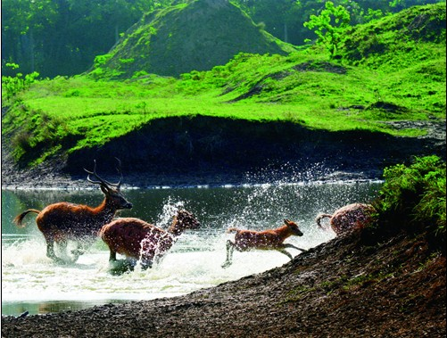

# 鹿之影

我的童年是在哈尔滨的一处老旧的“三合大院”中度过的。所谓“三合大院”，其实就是三个独立的单位家属院共用同一个大门洞出入，彼此间既独立又互通。院内的住户多是给自己儿女带孩子的老人，因此院里的孩子自然也多，成群结队玩耍的小学生总是大院里最主要的风景线。

不过对于一个不合群的孩子来说，同龄人越多的地方，往往也越显得尴尬，有些时候，这份尴尬甚至会演变成更为负面的情绪，比如悲伤与委屈。

年少时，我形貌不似男孩，加上年纪小，声音也没有变，走到哪里都会被错认是女孩。在我住的院子里，“人妖”一直是我在同龄人中的通用代号。我天生性格好静，家教也颇为严格，基本上从不说粗鲁的话，更不做失格的事。每天看着大院里的孩子们翻煤堆、爬车棚，只是觉得无聊。而看到他们干着给车棚里的自行车放气、往传达室的锅炉里扔沙子、用气枪打鸽子这些损人不利己的恶作剧时，更是厌烦非常，断然不愿意加入。配合我的外貌，以上的举动更在群童中坐实了我“不正常”的传言。很快地，除了被自家院子里的男孩们讨厌、排斥外，甚至有隔壁院的孩子不远几里地跑来参观“人妖奇观”。一大群只有十岁上下的孩子，把我围了个水泄不通，一边转一边摸这摸那，时不时用极其猥琐的声音喊着：“你是人妖吧？给大爷笑一个！”他们中的大多数，我根本不认识，而领头的那几位却都是自家院子里抬头不见低头见、每天上学都能一路聊一会儿的小伙伴。这种时刻的心情，我实在是难以言喻的，只有强忍住泪水，推开那些如蚊虻一般环绕的身影，回到家中再独自哭泣。此后事情远远没有结束，围观在后来的日子里逐渐变成了围殴。那时的东北，到了冬天菜源稀少，家家户户几乎都有屯白菜和大葱的习惯。我人生中一个难忘的下午，就是从放学回家进了大院遇到几个邻家孩子开始的。见我走了过来，为首的直接一句“人妖来了，给大爷摸摸！”便冲上来掐我的脸。被我一把推开后，颇有恼羞成怒之意，顺手抽出身边葱堆里已经冻结的一棵葱条，抽打在了我的眼睛上。随后几个孩子一拥而上，纷纷抽出葱条，兴奋而愉快地围着我进行抽打，在我的脸上留下了条条伤痕。事情的最后，他们把我按在地上，撕破邻居家囤积的白菜，将菜叶一颗一颗塞进我的衣服里。由于被心疼白菜的邻居看到，打开窗户出面制止，这场闹剧才算完结。不过邻居面对一哄而散的顽童，最终还是选择了朝倒地不起的我索赔，将我押回家中，要求我母亲好好管教，不要再让我带着孩子们撕他家的白菜了。

类似的事情发生了太多次之后，我基本不再下楼玩耍了。每天放学就回家，业余时间全部用来看书画画。无论母亲怎么生气，怎么骂我胆小又不合群，我也不愿再下楼自取其辱。闲暇的时候倒是时常在阳台上看其他孩子玩耍，心中充满了惆怅与疑问。看到他们追逐嬉戏，笑得喘不上起来，彼此仿佛毫无间隙，一派天真无邪的面孔，怎么会在面对我时就变得那么可鄙又可憎呢？我开始怀疑也许我是个多余的人，是个不该存在的家伙，只会招人讨厌。不过在我坐实自己的想法之前，我发现了自从我“消失”后，院里孩子们的第二“围攻目标”，那就是隔壁院的小鹿。

小鹿是个女孩，大名我已经记不清了。瘦弱，胆小，话很少，也不爱热闹。样貌上最大的特点就是永远是平头，从不像其他女孩那样留长发。衣着总是特别简单，夏天大背心，冬天羽绒服，远远看去就像个瘦小的男孩。据说她父母工作忙，爷爷身体不好，脾气也不好，很少在她身上花心思。每天只是给口饭，大多数时候根本不在意她的衣着和心情。所以她经常会因为害怕爷爷发脾气，即使不愿意在院子里呆着，也不敢回家。于是，在阳台上的我就很经常地看到发生在我身上的闹剧又重复性地发生在另一个孩子身上。只是她比我更孱弱，连最起码的反抗都不能，只能在失声哭泣中任人欺凌。因为她爷爷的人缘不好，院里的大人们很少会主动站出来替她解围，更多的则是无视她的遭遇，各聊各的。所以长久以来，我只要听到楼下有哭声，从阳台探出头来一看，九成就是小鹿。

其实跟小鹿的初次接触，缘起于另一场闹剧。

有一天，我再次听到院里爆发出震天的嚎哭，不过这个声音既尖锐又惨烈，有点熟悉又有点陌生。我照例打开窗户一看，原来这次被围殴的是另一个男孩。不知什么原因他与院里的“孩子头”起了争执，厮打在一起后很快被一拥而上的其他男孩制服，接着又是老规矩——坐脸，尘土沙子塞进衣服，还有少不了的拳脚相加。他哭得如杀猪一般，仿佛比从不招惹他人却比他受了更多殴打的我更委屈。我饶有兴趣地观看着，发现了“战场”旁边惊慌失措的小鹿。她在一旁流着眼泪，着急地喊着“别打了！别打了！”而实际上那个被按倒、踩踏的男孩，平时在欺负她时总是格外“用心”，对我也不例外。与我略带报复快意的心情不同，小鹿似乎不愿意见到任何形式的暴力和欺凌，只要见到了，就会发自内心地焦急和悲伤。年幼的我突然觉得心里有那么一丝伤感，这才想到，其实这样的心绪，我何尝不是没有？只是我心里囤积了太多的委屈与愤慨，竟然把它给忘了。

那以后，我再次开始主动下楼，看到小鹿在楼下就去与她聊天，给她看我的书和画，还邀请她有空可以去我家玩。很快，我们熟络起来。小鹿也会经常给我带一些他爷爷做的馅饼和韭菜盒子，味道也算不赖。小鹿的爷爷是资深票友，家里的广播总是在播戏曲，而我是从小学京戏的，时不时俩人还能对上一段，在她家院里的大树林中间唱一出《打渔杀家》。在其他孩子的眼里，这就是两个怪物的聚会，不过他们也并不觉得惊讶，本来就是俩怪物，聚在一起不也是很正常的事情。此后，这群小冤家自然也会时不时地打扰我们，不过这回我们是两个人了。而且，我也是从那一刻开始发现，原来叫我忍受自己的委屈，倒也不是件很难的事情，而要我眼睁睁地看着朋友在我眼前受委屈，却是万万办不到的。在一次次我自以为是为了保护小鹿而引发的激烈冲突后，全院的孩子也知道了原来“人妖”出手也是很重的，会伤人的。尽管为此挨了母亲不少责罚，但终归是让这些家伙知难而退，不再轻易刁难我。但若是我不在，他们仍旧喜欢变本加厉地欺负小鹿。而我跟小鹿分享的一切“反击经验”，包括跟谁要怎么打、打人要先打哪、打不过该朝哪跑之类的心得，小鹿似乎永远是左耳听右耳冒，每次遇到阵仗立刻手足无措，无论吃了多少亏就是记不起反抗的重要性，让我着实无奈。时间久了，我们似乎开始越来越说不到一起去了。因为我已经发现，不要说单打独斗，只要我认真一点，我的身手完全可以同时应付三四个同龄人，把他们打得挂彩流红而自己却毫发无伤。而小鹿却始终沉浸在那种无止境的战战兢兢中，不肯走出来，让我感到既心痛又生气，为此也逐渐开始埋怨她起来。面对我的不理解，她也仍旧只有沉默，流泪，别无他法。一来二去，互相都有些尴尬，话少了，碰头也少了。我照例放学回家，但已不再是因为惧怕别人的凌辱。而小鹿也依旧在院子里游荡着，委屈着，哭泣着。偶尔也会跟我在一起聊聊，特别是院子里有别的男孩子成群地出现的时候。

结识小鹿的第二个夏天，小鹿的爷爷去世了。她父母要把她从院子里接走，临别前的最后一次聚会仍旧是在她家院里的树林里，那个我们曾经一起合唱和“野餐”的地方。我记得我问了问小鹿，她将来想当什么（通常在东北孩子里，这个问题是问你将来想从事什么职业）。她沉默了良久，才回答我说，她想当个男孩。我颇有些诧异，既因为这是答非所问，也由于其实当时我不太清楚男孩女孩到底有啥本质上的区别。她解释说，只要当了男孩，就不会再被欺负了。我更加地不理解，告诉她我也被欺负过，很多次，还有谁谁谁，也是男孩，一样要被欺负……可是不等我说完，她已经哭了起来，第一次用我从未见过的、近乎歇斯底里的口吻喊着“我不管，我不管，我就是不想再被欺负了！”看着她揪着自己的小平头，兀自坐在树林里伤心地哭着，我的眼泪也下来了。可是我不知道该说什么，也不知道该做什么。等她情绪逐渐平息，我们又说了些无关紧要的话，便各自回家了。那是我最后一次见到她。从此，再未收到过有关她的任何讯息，就这么各自天涯了。

天长日久，关于小鹿的很多细节，早已被我淡忘了。然而到我自己被迫离家，只身进入所谓的社会之后，却总是能在一些不经意的地方看到她的影子。我十四岁离开哈尔滨，独自走南闯北，在漂泊的时光里，遭遇过了无数比大院群童的欺凌远为惨痛、残忍的折辱与伤害。有趣的是，这些凌辱与践踏，竟然一点一点地将我心中最为桀骜、最为坚实的部分剥裂了出来。我从小自认为是多愁善感而敦厚守序的人，面对伤害只有委屈流泪的份。却不料在他人的践踏之下，对践踏者露出了最鄙夷、最不屑的冷笑。原本因离群、离乡而痛苦迷茫的我，在不请自来的困境与打击之下，却不断地坚定、不羁起来。几年下来，我的性格与年少时几乎判若两人，不但气质，连形貌也发生了大变化。在这些时光里，我也遇见过了许多如同当年的小鹿一样的人，面对欺凌，他们束手无策，不思反抗，所能做的只有流泪与悲叹。奇怪的是，当年我对于小鹿的同情与惦念，在这些人的面前却逐渐不再起任何的作用。他们颤抖的身躯彰显着恐惧而空乏的内心，他们绝望的眼神再激不起我保护的欲望。我知道，他们的力量薄弱，但那不是放弃反抗的理由；我知道，他们渴望平静，但那不是在风暴中等死的借口。人的路是自己选的，即使是小鹿也是一样。

每个人性格不同，有人天生是狼，有人天生是鹿。我知道鹿不吃人，只想平平淡淡的享受岁月静好。但活在当世，若是软弱得脱了戏，便是要做鹿也做不成，只能做肉。我见过原始森林中的鹿，警醒而优雅，纵然少有伤敌的利器，却也绝不容肉食者轻易近身。奔跑洒脱，静时却恬淡和美。要做鹿，就做这样的鹿，否则，你就只是鹿肉，是他人愉悦身心的饲料。只有一颗慈悲心，空怀一心平和愿望却一无是处的人，并不是真正的慈悲和平和，只不过是软弱而已。若真不愿见到暴力、纷争，就应该去追寻真正消弭这暴戾之气的力量。当我意识到自己该做的是腾云的龙时，我同样意识到这世上有诸多的美好值得我去为之奋斗和保护。为此我才要不断地提升，不断地坚强，不断地创造，也不断地反抗。我不知小鹿现在的境况如何，是否早已如我一样有了巨大的改变。我始终希望，她能为自己找到坚强的理由，而不再只是颤抖哭泣。

“呦呦鹿鸣，食野之苹”，我每次念到这句诗，心中总是勾画出一幅恬淡的《鹿鸣图》。夕阳西下，鹿群在草原上觅食。千里平旷，无人打扰，每一只鹿都可以轻松而平静地享受着夕阳的余温，放纵自己在毫无危险的世界里小憩。小鹿心中的愿望，也许就是这样一个没有天敌、没有伤害，只有平和喜悦的世界。在这城市之中，这样的画面究竟会不会出现在人群里，我并不抱任何信心。但即使出现，大都也是转瞬即逝的虚像，如同一场最美好的绮梦。人不该只活在梦中，而是要把梦中期冀的情景一一在现实中实现。浮世十年，我已见过太多疯狂的狼，骄躁的虎，险诈的蛇和狡媚的狐，也见过太多只会流着泪任人啃食，再回过头抱怨命运不公的鹿。我不想成为他们中的任何一个，也不觉得天生为鹿就代表了要一生任人欺凌。我始终始终很期望，在这城市之中，再见一次那森林中茁壮而优雅、警醒而淡定的鹿影。小鹿，也许那不会是你，但我总是真切地希望，那其实就是你。

（采编：黄梅林；责编：佛冉）
