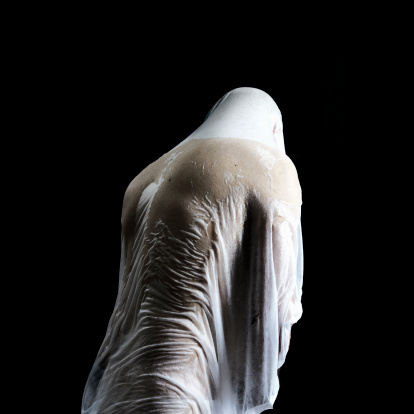

# ＜“诗心未逝，怀念海子”专题＞也许我一辈子也不会将你看清——海子忌辰纪念

**当我在看到海子的这几行诗之后，我想起往昔那些拼命想梦见你却“遇见了世上的一切，但不会遇见你”的日子而潸然泪下。那些曾经我用整个青春为你燃烧的日子，因为不再相见，已经化为灰烬，随风四散。**  

# 也许我一辈子也不会将你看清

# ——海子忌辰纪念

## 文/黄梅林（广东商学院）

 

代题记： 也许我一辈子也不会将你看清 一只空杯子 装满了我撕碎的诗行 一只空杯子——可曾听见我的叫喊！ ——海子《八月之杯》

我读海子，是M师姐引的路。

彼时M师姐高三，我正值高一。她的一篇文章在本省现场作文大赛获得了一等奖，此文的手写版刊登在校文学社的社刊上。那本社刊我至今仍保存完好。

那篇文章名为《我为海子塑像》。

于是开始读海子的诗，但也是囫囵吞枣地读，过目即忘。最记得大抵是最著名的“我愿面朝大海，春暖花开”，高三语文作文每次都会附庸风雅地写上这么一句。

可是我从没用心体会过，这么一句祝愿，是带着发自内心的绝望。

现在，已上大学的我在病榻上重新翻开淡蓝色封皮的海子诗集。这版诗集第一首诗是四姐妹。诗的最后一段如是说：

请告诉四姐妹：这是绝望的麦子 永远是这样 风后面是风 天空上面是天空 道路前面还是道路

一直在我心中，海子不曾这么绝望过。高中时代，读过的海子都是那样生机勃勃。《面朝大海，春暖花开》读着教人心生温暖，《祖国（或以梦为马）》诵着叫人热血沸腾。现在回想，大概是我潜意识中避开了那些让人熄灭希望的诗句，或是对那些潜藏于美好字词下的颓唐视而不见听而不闻。那种祈祷所有人获得幸福而自己独忍孤寂的落寞，一直淡淡地隐藏在“春暖花开”这样的铅字下。

或许所有的年少都是向着太阳所生的向日葵，主动追逐热度，而拒绝接受寒冷。

如果没有变故，我该是一直都不会读懂海子的诗了吧，我又怎么会懂得什么是“道路前面还是道路”？高考失败后的无数个夜晚，即使倦意袭来，我仍挣扎地张开眼。只是因为害怕闭上双眼醒来后便是明天。明天，风后面是风，天空上面是天空，道路前面还是道路，万物均不变改，只是永无尽头，看不见驿站，更没有终点，赶路的人真谓疲乏。

此时我患重感冒，骨肉酸痛，加上鼻塞。我躺在病榻上，闭上双眼，眼前浮现的景象竟像山海关。我看到一条铁轨，我感觉我就是躺在铁轨上面，背下冰凉，睁眼仿佛就看见蓝天白云，旁边是苍翠的树丛。脑海倏忽一闪而过的是那句遗言：

**我是中国政法大学哲学教研室教师，我叫查海生，我的死与任何人无关。**

耳边响起火车的鸣笛，再熟悉不过，学校旁的铁路，每个夜晚也会响起类似的呼啸声。记得大学入学的第一个夜晚，我一个人徜徉着去看那条铁轨，冰冷的无言的铁轨，一排高挑的松树，衬上一轮金黄得出奇的明月。那画面不知不觉就镶嵌在我的记忆里，在无意识的时候作祟。突然我看到M师姐在文中提过的，她那本蓝色的海子诗集，放在木桌的抽屉里。

突然地，我就惊醒了。

真是一个诡异的梦。

抓过枕边的闹钟一看，已过零时，恰好是3月26日。

醒来便再也无心睡眠，拿了小手电窝在被窝里再翻海子诗集。

今夜我不会遇见你 今夜我遇见了世上的一切 但不会遇见你 ——海子《山楂树》

曾经，我自认为最接近海子的时刻是高三。一整年的烦躁，外加一整年的思念，折磨人。可是我从没像今夜一样泪流，在看到这么简单的诗行后。

高三，在十七八岁的年纪曾经迷恋一个人，长达五年。正如海子迷恋他的波婉一样，他是我的初恋。是谁说过，最是心爱的，便最不会出现在梦里，所以即使在高三身心俱疲的日子里，我也从未梦见过你。高三的你越是冷淡我对你的念想便越浓。想念如在心口上的一盏长明灯，只要没有狂风吹刮，即使四周被黑暗吞噬，也熄灭不了爱情的微光。

只是，现在的我，已经梦见过你。

所以当我听到林宥嘉唱“我曾拥有你，想到就心酸”，会因为“曾”这个字眼而红了眼眶。

所以当我在看到海子的这几行诗之后，我想起往昔那些拼命想梦见你却“遇见了世上的一切，但不会遇见你”的日子而潸然泪下。

那些曾经我用整个青春为你燃烧的日子，因为不再相见，已经化为灰烬，随风四散。

我只是心痛我自己，怎么会在梦中遇见了你。

我怕，我忧心忡忡，在以后我们长得没有棱角的岁月里，我会否因此而忘记了你，忘记了过去握在掌心实实在在现而虚无缥缈的年少轻狂？

文学史课上，老师说：

不要学海子那样走进去了出不来。

走进去一个忧伤绝望的世界。

只是出来又要回到哪里去？

回来的世界会比走进去的那个世界更好吗？

我听见你的叫喊

也看见你撕碎的诗行

可是

也许我一辈子也不能将你看清

 

（采编：麦静；责编：麦静）

 
