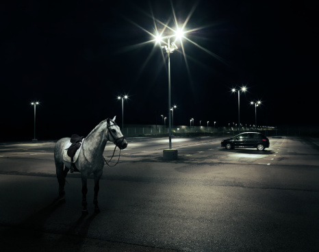
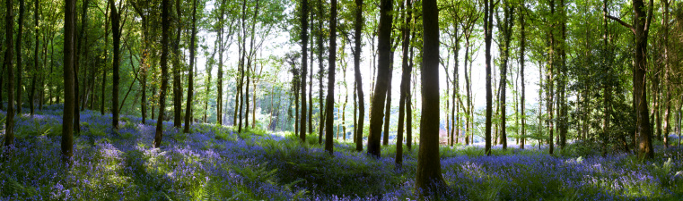
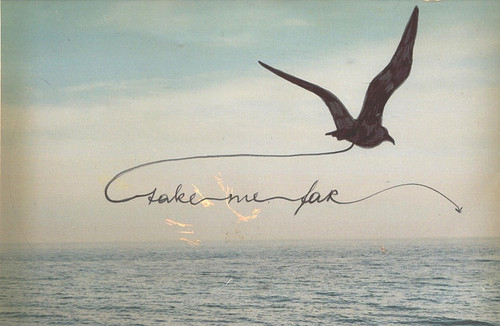

# ＜“诗心未逝，怀念海子”专题＞单翅鸟为什么要飞呢

**海子就是一只单翅鸟，他只有一片以幻梦织成的羽翼，缺了现实的另一片，只能飞得跌跌撞撞、痛楚万分。他用写作的方式坚持着飞过了许许多多个破碎的日子，然而他终于决定躺下来，头朝着天地，躺着许多朴素的光线，喝下自己的影子，揪着头发作为翅膀，离开。不知道在火车轰隆隆驶来的时刻，他会否依然在一遍遍地问，你们都不醒来，我为什么，为什么要飞呢？人们都不醒来，醒着的人永远留在了八十年代，单翅鸟还为什么要飞呢？**  

# 单翅鸟为什么要飞呢

## 文/麦静（中山大学）

 

单翅鸟为什么要飞呢/我为什么/喝下自己的影子/揪着头发作为翅膀/离开

你们都不醒来/我为什么/为什么要飞呢

海子：《单翅鸟》

有五年了，我每每想写点关于海子的什么，却只感到一种深切的无力与悲哀。无力的是我始终写不出有足够力量的文字，去描摹他的诗曾带来的撕裂我身体与灵魂的震撼，悲哀的是如今我已很少再翻开他的诗集，也不再反反复复抄录他的诗行了。昨日读到一位姑娘写的情诗，最后两行里她写道：“好心人啊只剩下那颗灼人的心，足够烧完整个寒冷的季节”。我轻轻叹一口气，那颗灼热的诗心，似乎早在某个黑暗的昨天，已在我身上蓦然熄灭了。

十七岁的时候，我是海子的信徒。那时我所读过的每一本书，不论是课本，抑或是小说、诗词、文论，每一本笔记上，都能找到海子的诗句，我把它们抄在扉页，末页，封面，封底，用油性笔抄在书桌上，用一种狂热的迷恋将它们抄在心里。那时我所拥有的仅是一本薄薄的选集，淡蓝色封面，上面有着海子那张头发蓬乱带着方框眼镜的著名照片，我把它随身带着，一来二往便常常弄丢，前后买过三本那个版本的《海子的诗》，终于最后一本在毕业那天漏在课室里，后来这个版本便不再出版了。

现在想来，那似乎是一种冥冥的预示，我把海子永远地留在了我的青春期里。

青春期的我，曾经永远不想步向成年，在十八岁生日前的几天反复地考虑着自杀。我对活着没有什么好感，也不觉得未来有什么好期待的，我在日记里郑重其事地写，以后我要住在查湾的村庄里，去当海子的守墓人，然后在和他一样的二十五岁上，卧轨自杀。十七八岁的我，似乎活在一个悬浊的梦境里，我读着各种各样的闲书，无心应对功课，每次周测月测模拟考总要在土黄的草稿纸上默写海子的诗句，如果是语文考试，作文里几乎必要引用海子，如果是数学或者综合的考试，总归是不会，便有大段的时间在草稿纸上写满诗行。很久以后，我读到一段话，顿觉用来描述我的高中时代再恰当不过，“在近似透明的青春之中，竟已孕育了死亡、黑暗，还有已成形的孤独——孤独是一个人的命运，无从逃避。”

那时的我实在是孤独的，处处感受着不被理解的痛苦，惟有从海子那同样孤独的诗句中寻求安慰。尽管这样的慰藉是极其荒诞的，“天空一无所有/为何给我安慰”。我从每一个音韵每一个字词里采摘他的痛苦，我试图读懂诗人的眼睛，却只从他的眼睛里看见更深的黑暗与死亡。有一天的语文课上，老师让我谈谈《面朝大海，春暖花开》这首诗，我站起身说，这是一首绝望的诗，因为“从明天起”割断了今天的所有可能性，将喂马、劈柴、周游世界的温暖图景化为不可得的尘世幻象。海子实在是个绝望的诗人，是海德格尔所描述的那种诗人，“是在世界的黑夜更深地潜入存在的命运的人，是一个更大的冒险者；他用自己的冒险探入存在的深渊，并用歌声把它敞露在灵魂世界的言谈之中”。然而，海子步入了存在的深渊，却再也没有走出来。

零七年末的时候，学校让我去参加一个全省的高中生现场作文比赛。那几天我正醉心于“坟”的意象，反复地默念着庾信的一句“霜随柳白，月逐坟圆”，我想，大约海子的坟上也是这般景象吧，空虚而寒冷的乡村里，一个小小的坟冢，遥望过去，隆起的泥土融着一轮硕大洁白的圆月，而那里埋葬着一个黑夜的孩子，沉浸于冬天，倾心死亡，不能自拔。后来那次的比赛，题目是个半命题，“我为___塑像”，我不假思索便填上了海子。我唤他作我的瘦哥哥，洋洋洒洒，写下了一篇当时自感真挚事后读来却似乎显得矫情的文字。而海子之于我，如同梵高之于他，确乎是一个“瘦哥哥”——“你的血液里没有情人和春天/没有月亮/面包甚至都不够/朋友更少/只有一群苦痛的孩子，吞噬一切/瘦哥哥凡?高，凡?高啊/从地下强劲喷出的/火山一样不计后果的/是丝杉和麦田/还是你自己/喷出多余的活命时间”。海子写给梵高的诗，难道不是一种自述么？

很难解释，我为何曾如此迷恋海子。我自小生活在城市，几乎从未见过他诗中惯常描述的村庄、麦子、草原与野花，十七八岁的我从未出过远门，根本不知道哪里是敦煌、青海湖、额济纳或者德令哈。但他的诗歌“是上卷和下卷合成一本/的圣书，是我重又劈开的肢体/流着雨雪、泪水在二月”，足以撕裂我的躯体与灵魂，迫使我去直视一种纯粹得刺眼的诗歌之美（犹如一场华美而无上的黄昏），迫使我去直面平庸而又不堪的真实生活。这让我心迷神醉，这让我痛苦不堪。

早两年读一些写海子的文章，每当读到有人评论他的诗歌是单纯依靠着一种年少的激情来写作，海子的诗只属于青春期时，我总要愤愤然地把这些报纸杂志扔到地上。我没法容忍这些所谓冷静而实际的人，我讨厌缺乏激情与梦想的人，他们永远无法理解海子的诗歌里那种涌动的张力与爆发力，也无法理解总有一些灵魂上的事高于生活，甚至高于生死。我每每想起梵高的一句话，“那些不信仰太阳的人是背弃了神的人”。

然而时至今日，我却想承认了，海子的诗只属于青春。而这也就解释了我曾对他的热爱。十七八岁时，我总想挣脱一切的束缚，甚至是我自身的束缚、生命的束缚，出走到一个极其遥远的地方——至于这个地方是哪里，我不知道。那时候，“生命，生命是我们与自己的反复冲突/生命在火光深处”，而我却无能为力，只能以梦为马，妄图将诗歌作为逃遁尘世的途径，我一无所有，却渴望着光辉绚烂，只能想着如何燃尽自己，将生命投入火光深处，熊熊燃烧，成为一座千年前起了大火的森林，成为千年后的敦煌。因此，渴望飞翔的海子最终死于大地，他的死亡如同他的诗歌一样充满了仪式感，因而显得难以揣测、纯粹而庄严。

今日，三月二十六日，海子逝去的整整第二十三年，我又再充满仪式感地翻开了那本厚重的《海子诗全集》，却无意中翻到了一首我从未读过的诗《单翅鸟》。我总疑心这首诗，是在他自杀的五年之前所作的一场预言。

单翅鸟

单翅鸟为什么要飞呢 为什么 头朝着天地 躺着许多束朴素的光线

菩提，菩提想起 石头 那么多被天空磨平的面孔 都很陌生 堆积着世界的一半 摸摸周围 你就会拣起一块 砸碎另一块

单翅鸟为什么要飞呢 我为什么 喝下自己的影子 揪着头发作为翅膀 离开

也不知天黑了没有 穿过自己的手掌比穿过别人的墙壁还难 单翅鸟 为什么要飞呢

肥胖的花朵 喷出水 我眯着眼睛离开 居住了很久的心和世界

你们都不醒来 我为什么 为什么要飞呢

单翅鸟为什么要飞呢？海子就是一只单翅鸟，他只有一片以幻梦织成的羽翼，缺了现实的另一片，只能飞得跌跌撞撞、痛楚万分。他用写作的方式坚持着飞过了许许多多个破碎的日子，然而他终于决定躺下来，头朝着天地，躺着许多朴素的光线，喝下自己的影子，揪着头发作为翅膀，离开。不知道在火车轰隆隆驶来的时刻，他会否依然在一遍遍地问，你们都不醒来，我为什么，为什么要飞呢？人们都不醒来，醒着的人永远留在了八十年代，单翅鸟还为什么要飞呢？

在一个再也看不见单翅鸟笨拙而天真地在天空飞翔的年代，我格外怀念海子，尽管我自己，也已长出了狡诈的翅膀。

愿海子离开居住了很久的心和世界时，确实是眯着眼睛的，脸上微笑，十分安详，不必得见身后的种种喧嚣与悲哀。

海子，我的瘦哥哥，祝你安息。

写于二零一二年三月二十六日晚

 

（采编：应鹏华；责编：应鹏华）

 
