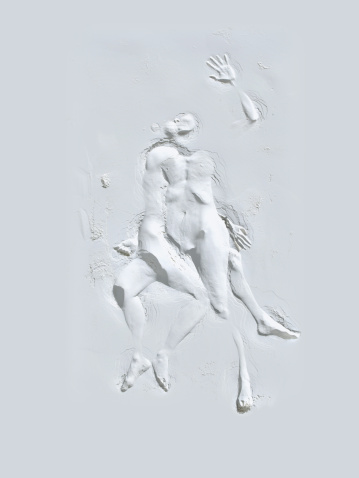

# ＜“诗心未逝，怀念海子”专题＞叶芝：时间没能改写这行诗

**我不敢说人一生只能爱一个人，也不该说人一生可以爱很多人。我只能说爱情是人心灵的容量，如果你的心灵是溪流，那么就只容得下一个人在自己的生命里流淌；如果你的心灵是大海，那么多少次的爱情也不过是其中的浪花一现。可最难得的就是，即便是一个人拥有海一样广阔深邃的心灵智能，却愿意一生只爱着一个人。**  

# 叶芝：时间没能改写这行诗

## 文/ 李维恩（北京师范大学香港浸会大学联合国际学院）

 

Cast a cold eye, 投出冷眼。 on life ,on death, 看生，看死。 horseman, pass by! 骑士，策马向前！

----------叶芝的墓志铭

（一）

威廉·巴特勒·叶芝。

艾略特说，他可能是那个世纪里最伟大的诗人。没有“之一”。

今天我们可以了解的叶芝并不深，因为他的诗篇并没有在所谓的教材里出现过。不过我想，大凡只要有人热爱或者研究诗歌，都无法避开“叶芝”这个名字。

叶芝的诗歌几乎没有失败的作品，许多诗篇是如此的饱满圆熟，又不失活力。在诺贝尔文学奖的家族中，很少像叶芝这样深入人心，具备永久魅力的。

对于已经越发残酷的世界来说，这实在是一种罕见的仁慈。那些精妙的、震撼的、激荡的词句，经历那么多战乱与动荡，经历了现代人有失水准的复杂选择，终于还是流传了下来，被后世所传唱。

比如这首最广为流传的《当你老了》（飞白译）：

当你老了，白发苍苍，睡意朦胧， 在炉前打盹，请取下这本诗篇， 慢慢吟咏，梦见你当年的双眼， 那柔美的光芒与青幽的晕影；

多少人真情假意，爱过你的美丽， 爱过你欢乐而迷人的青春， 唯独一人爱过你朝圣者的心， 爱你日益凋谢的脸上的哀戚；

当你佝偻着，在灼热的炉栅边， 你将轻轻诉说，带着一丝伤感， 逝去的爱，如今以步上高山， 在密密星群里埋藏着它的赧颜。

这首诗的意境很美。而且，诗中字里行间吐露出一种对爱与永恒的辩证统一。爱就是永恒，不在乎时间，也不在乎这段时间里，你变得怎样，或者是我变得怎样。就像《时间旅行者的妻子》一书里写到的：“我爱你，生生世世，时间没有什么了不起。”

全诗以一个假设性的时间状语开头，紧接着写老年人的睡思昏沉、炉火旁打盹、取下诗集慢慢读、一面读一面回忆过去，所有这些情景与人物的举止都是虚拟性的。

然而，不知怎的就是这些极其平易朴素的诗句，却让我感觉到一种超验的、神秘的气息。因为诗人在写下这首诗之后所经历的情感历程以及漫长的岁月都证实了当初他写这首诗时的感知，诗人仿佛一直义无反顾地朝着自己假设的、虚拟的时空走去，如同走向一种信仰。是无意中言中？还是生命本身的预感？还是人在极端的情感迷醉时笔下会透露出冥冥之中的“神启”？

（二）

谈到叶芝，绝对避不开一个人，也是他一生的挚爱，美丽的演员----毛德·冈。

如果真要用一句话要概括她与叶芝的关系话，我只能说：

她是他的罪人，也是他的圣徒。

这也是世间许多爱情的本质。

根据记载，1889年1月30日，二十三岁的叶芝第一次遇见了美丽的女演员毛德·冈。她时年二十二岁，是一位驻爱尔兰英军上校的女儿，不久前在她的父亲去世后继承了一大笔遗产。

毛德·冈不仅美貌非凡，苗条动人，还有一种其他女性身上少有的气质-----她还投身政治。年轻的毛德·冈在感受到爱尔兰人民受到英国人欺压的悲惨状况之后，开始同情爱尔兰人民，毅然放弃了都柏林上流社会的社交生活，投身到争取爱尔兰民族独立的运动中来，并且成为领导人之一。

就是因为这一点，毛德·冈在伟大诗人的心目中第一眼就留下了极其特殊的印象。

在后来的诗篇中，叶芝曾这样描述过她：

“她伫立窗畔，身旁盛开着一大团苹果花；她光彩夺目，仿佛自身就是洒满了阳光的花瓣。”

“我从来没想到在一个活着的女人身上看到这样超凡的美。”

这简直就是世间不应有的美。他遇上她，没有多一秒，也没有少一秒，都是在自身最好的年纪。仅此一点，仿佛就足以断定他们是天造地设的一对。也真是印证了那句诗歌：有谁能阻止两个美丽的人在一起呢？

就好像他拼却一生，只想给她铸成一朵不败的玫瑰。

 

（三）

这段感情，并不是世人想象的多么美好。

叶芝深深的爱恋着她，但又因为她在他的心目中形成的高贵形象而感到无望。

年轻的叶芝觉得自己“不成熟和缺乏成就”，所以，尽管恋情煎熬着他，他尚未对她进行表白，一则是因为羞怯，一则是因为觉得她不可能嫁给一个当时还是穷学生的自己为妻。

从另一方面看，毛德·冈一直对叶芝若即若离，他们有相当多的通信。1891年7月，叶芝误解了她在给自己的一封信的信息，以为她对自己做了爱情的暗示，立即兴冲冲的跑去第一次向毛德·冈求婚。她拒绝了，说她不能和他结婚，但希望和叶芝保持友谊。

我可以理解毛德·冈的选择，在那个时代，在革命的洪流中，这样一个女子实在是需要一个能和她并肩作战的男人。这也是爱情的另一个悲剧所在，倘若真正存在所谓的不般配就好了，那么很多爱恨情仇都能够得以解决。问题就在于爱情的双方都是在某种程度上伟大而高贵的，所以在后人看来，这是希望他们能够在一起。

后来，毛德·冈嫁给了与她并肩战斗的麦克布莱德少校。

二十三年后，1916年麦克布莱德少校在斗争中献身去世。

在这时，叶芝再次选择向毛德·冈求婚，仍旧遭到拒绝。

这时，叶芝还没有结婚。

此时，我们应该能够体会到诗人的痛苦。

古今中外，大凡伟大的刻骨铭心的爱情总是充满艰辛和痛苦的，一往情深、痴心不悔，而且往往还得不到回报，像一只执著的荆棘鸟，惟有滴血才有歌唱。

不过，造物主还算公平。即便爱情上无期的付出未得分文报酬，正是这不幸的情感经历反而成全了诗人叶芝创作上的幸运。也许诗人原本就需要在痛苦中磨炼，就像钻石需要烈火炼铸？

这位美丽的有着朝圣者灵魂光辉的女性成了诗人一生创作的力量和源泉，成了爱情的信仰、理想的象征。正如歌德诗中所说：“永恒的女性，引导我们上升”，叶芝后来也投身于爱尔兰民族自治运动。我猜，此中必然有毛德·冈的影响。

（四）

这是叶芝的另一首诗《白鸟》（傅浩译）：

亲爱的，但愿我们是浪尖上一双白鸟！ 流星尚未陨逝，我们已厌倦了它的闪耀； 天边低悬，晨光里那颗蓝星的幽光 唤醒了你我心中，一缕不死的忧伤。 露湿的百合、玫瑰梦里逸出一丝困倦； 呵，亲爱的，可别梦那流星的闪耀， 也别梦那蓝星的幽光在滴露中低徊： 但愿我们化作浪尖上的白鸟：我和你！ 我心头萦绕着无数岛屿和丹南湖滨， 在那里岁月会以遗忘我们，悲哀不再来临； 转瞬就会远离玫瑰、百合和星光的侵蚀， 只要我们是双白鸟，亲爱的，出没在浪花里！

爱情是人类一个永恒难解的谜题。这一点在叶芝身上得到了充分的体现。

叶芝一直等待着，即使他的意中人早已经是别人的妻子。

他直到52岁，才结婚，那是在已经死去丈夫的毛德·冈再次拒绝了叶芝的求婚后。

在叶芝向毛德·冈的女儿伊莎贝拉求婚被拒绝之后，叶芝终于停止了这种无望的念头。爱上一个人，竟然又把爱转移到她的儿女身上，叶芝实在无法获得世俗的理解。

但事实上，叶芝还是无法忘记毛德·冈。在他生命的最后几个月，他还给毛德·冈写信，约她出来喝茶，但还是被拒绝。而且，毛德·冈还坚决拒绝参加他的葬礼。

世上对爱情终生执着，却又无法得到哪怕是一点点回报，只有叶芝一人了。

是啊，爱情本身是否存在，在叶芝看来，已经不重要，因为他已经感受一生了；真理似乎是否获得，也不重要，因为他已经尝尽了追求的酸甜苦辣。

对于生命来说，这已经足够了。

对于爱情，每个人的理解各不相同。我不敢说人一生只能爱一个人，也不该说人一生可以爱很多人。我只能说爱情是人心灵的容量，如果你的心灵是溪流，那么就只容得下一个人在自己的生命里流淌；如果你的心灵是大海，那么多少次的爱情也不过是其中的浪花一现。可最难得的就是，即便是一个人拥有海一样广阔深邃的心灵智能，却愿意一生只爱着一个人。 就像是奥地利诗人里尔克曾经说过，“只有那种终极的爱才能使人达到在无限中去爱一个人。”

这就是叶芝。

没有热烈宣泄的激动，只有平静的真挚的倾诉。他的诗语言朴素而含蓄，调子优雅而舒缓，在流动和飘逸的画面中透出一抹淡淡的哀伤，却不乏亲切与温馨。

白鸟一般的叶芝。

 

结：

写完这些。我突发奇想地想去查查毛德·冈究竟是怎样的人。

很难想象，她身上是否真的有那种让诗人动容的美。

的确，现代女子的美大多娇嫩可人。可过于极端的我并不能认同这一点。

一个女子真正的美，应该能把这个世界向“更值得生存”的方向挪动一点，而不是一味地矫揉造作，也不能把这个世界映照的更加不堪。

就这样了。

 

（采编：黄美琳；责编：麦静）

 
