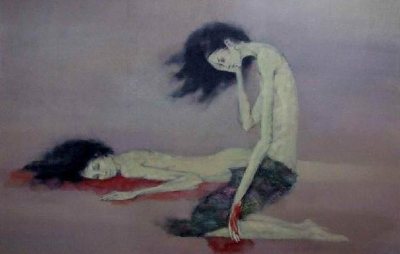

# ＜“诗心未逝，怀念海子”专题＞波德莱尔——一朵鞭挞麻木的灵魂的“恶之花”

**想象，如同眼睛和耳朵，如同理性和感觉，它们汇合而成。它把对精神和肉体的感觉，对孤独的感觉，对观照某种无限崇高无限美好的东西的感觉，对一种赏心悦目直至迷狂的强烈光芒的感觉延伸，延伸到想象的极致。想象把躲藏在感官世界背后的、事物内部的呼应关系揭示给世人，而这种关系，非诗的眼睛是看不到的。**  

# 波德莱尔——一朵鞭挞麻木的灵魂的“恶之花”

## 文/曾娜（四川大学）

 

“我们张开口呼吸，胸膛里的死神就像看不见的河，呻吟着奔出”，胸膛中的阵阵灼痛和永恒的、罪恶的欲望促使我们“每天都向地狱迈进一步”。波德莱尔用他的诗句鞭挞着人类厌倦、麻木的灵魂。邪恶、腐臭、肮脏、阴郁在死亡前的迷梦中令误入的人颤栗。驱散迷雾，啊，这可怖的怪物原来就是我们人类自己。

波德莱尔紧蹙的眉头下，犀利的目光直视我们的内心，热烈而专横，全然不顾那具皮囊的主人如置身于诗人所爱回忆那男女裸露优美胴体，健康与单纯并在的时代中，所感到的惊恐。诗人紧抿的薄唇，尖刻而有力地发出怒喊：“啊，没有衣衫而悲伤的畸形。”不要认为他会在开满恶之花的诗句背后欣喜或蔑笑，正如他言：“所有艺术家都是一样的，他们对正义和美的本能越是强烈，就越易于感受痛苦。”而落在纸页上的文字正是他精神上的痛苦。

**一**

《恶之花》像一株繁茂硕大、腥红如血的食人花，当你走进，它便一把抓住你的身躯，迅速而强硬，送入口中，让你坠入幽深、惊悚的迷梦中。诗人编织的梦使你紧张而专注，严肃地思考。这种感觉恰恰如波德莱尔对音乐家理查?瓦格纳的论述——“他具有一种艺术，能够通过精微的层次表达存在于精神的和自然的人中的一切过分的、巨大的、野心勃勃的东西。有时候，听着这种热烈而专横的音乐。人们似乎发现在黑夜的被梦幻撕破的背景上绘有令人眩晕的关于鸦片的观念。”——瓦格纳和波德莱尔都通过他们的艺术让观众发现世界现象之间的新的联系，而我们的眼睛在平常的清醒的状态之中是看不见的。

阅读波德莱尔的诗句让我不得不产生一种与聆听瓦格纳音乐同样的感觉。

在瓦格纳的《汤豪舍》序曲中，伴着缓缓传来的音乐低吟，我似乎穿越了一片深黑高大的树林，笑容随着音乐而扬起，转而旋转，身躯轻盈翩飞；忽然间如雷声般奏起，身躯厚沉猛然坠落，没有支点，抓不住任何东西，充满绝望之感；可是却轻飘飘落下，变身于一片黄叶，慢慢摇晃，慢慢倾吐的音乐带着平静却猛然不安地起伏，如风雨飘摇。不断转换的情绪时而愤怒，时而平静，时而快乐，时而惊恐。仿佛是汤豪舍在如梦般却临界地狱的维纳斯宫殿中的爱欲和厌倦，交杂的感情争着高位，沉迷或者醒悟？等待着终点，等待着音乐的结束。却同《漂泊的荷兰人》中的船长疲惫地在海上忍受着撒旦给他的命运，没有死，靠不了岸。曲子停滞却还没到结尾，下一个音符感情是喜或悲？汤豪舍序曲促使我专注，欢乐袭来却短促，音浪一个接着一个，把前一段情绪打翻。阴森、急促被神圣之光一扫而空，我看到天空中的光把黑云掏了个巨大的口子。一阵阴风却又扑来，亮光似乎要被乌云遮蔽。天空变换颜色，但明亮起来，狂风依旧不依不饶，就这样相互僵持，直到曲终。

《恶之花》也如此般。自然的庙宇，低语的深林，麻木的旅客、嬉笑的水手还有那腐臭的尸体，用他们的样子把那不明的心中所想，生动揭露。——瓦格纳说过“还不明确的东西将由造型来解释”。而波德莱尔正是这样肯定瓦格纳的：“以无数声音的组合来表达人类灵魂的喧闹”。诗人和音乐家用他们的艺术把人带入一种看似梦幻不真实之境，而让属于灵魂中最隐蔽的意识自由流淌。

这两位天才的艺术家正是源于共同的文学艺术观而产生了巨大共鸣。瓦格纳把音乐和诗相结合，以它们各自的有限与无限交融，产生了那些用任何单一艺术的手段无法表达的东西。波德莱尔认为瓦格纳不能不以一种双重的方式——诗的方式和音乐的方式来思想，就不能不在两种同时的形式下看见任何观念，因为“一种种艺术开始活动的地方正是另一种艺术达到极限的地方”。同样，波德莱尔笔下的诗不仅是文字的美，更是象征的意境之美和不安的节奏之美。他的诗总是让在读者眼前慢慢舒展的画面顷刻撕裂，像瓦格纳不断打破听众安逸的交响乐章。只有把想象和感官不可分割地连接，在诗歌与其他事物间建立一种相互类似而彼此表达的统一性，波德莱尔才能在不同的灵魂中启示关于痛苦的概念。我想也许想象和痛苦就是波德莱尔与瓦格纳的粘合剂，如同音乐和诗。

**二**

如果说我们用眼睛去阅读波德莱尔的诗句，用耳朵去欣赏瓦格纳的音乐，那么连接情感的便是想象。波德莱尔要让我们看见藏匿于灵魂深处的邪恶，瓦格纳要使我们听到潜伏于心底的矛盾，而想象不同感觉，智力与情感在此合理地施展它们的魅力。

眼睛象征着理性，如同俄狄浦斯遭遇不幸前拥有智慧的双目。我们用双眼去欣赏占领自然的文明，在我们周围文字、图案总是自动地跳进眼帘；我们极尽可能地去享受一切所谓的文明，消费着所谓的理性，却渐渐地把文明伪装成肮脏的外衣，把理性装裱成治于百病的灵药；然后那可悲腐朽的灵魂被厚重文明理性的外衣沤烂，我们的眼睛被脓疮遮住。《恶之花》就像一把利剑般毫不犹豫地剜去灵魂的毒疮。“魔鬼不停地在我的身旁蠢动，像摸不着的空气在周围荡漾；我把它吞下，胸膛里阵阵灼痛，还充满了永恒的、罪恶的欲望。它知道我酷爱艺术，有的时候就化作了女人最是妩媚妖娆，并且以虚伪作为动听的借口，使我的嘴唇习惯下流的春药。就这样使我远离上帝的视野，并把疲惫不堪、气喘吁吁的我带进了幽深荒芜的厌倦之原，在我的充满了混乱的眼睛里扔进张口的创伤、肮脏的衣衫，还有那‘毁灭’的器具鲜血淋漓！”在波德莱尔的诗篇《毁灭》里我们心中的欲望如魔鬼般，陷入肉欲的深渊，物质的文明为什么招致了使人濒于毁灭的恶魔？高扬的理性为什么无法通向上帝的跟前？厌倦，总是厌倦，对躯体，对欲望，直至那一天我们对生活的期待只是走向最后的毁灭。即使有厌倦，可是理想呢？也许我们可以谈论理想——“绝对不是那种面片上的美媛，那种无聊时代的变质的产品，脚踏高帮皮鞋，指上玩着响板”——能够满足诗人的是“罪恶的强魂，迎风怒放的埃斯库罗斯的梦，或伟大的《夜》”。原来理想是除去表皮后裸露的真实本身，战胜麻木的真实和罪恶。这个时代疲于奔命的人们，能否了解诗人心中的理想？身穿西装的中年人面无表情地经过苍白的乞讨老人身边，手拿警棍的城管把对机械生活的厌烦砸向街边的小商小贩，电脑屏幕前愤愤的青年咕哝了几句又继续低头拨弄鼠标。哎，谁能安静下来看看自己？

耳朵总是被冷落或被奚落一番——“眼见为实，耳听为虚”。可是看看上面的文字，眼睛又有什么好骄傲的。耳朵是去感觉的，虽无法触摸到东西，可是眼睛不也如此么？我们总是相信双眼，而轻视耳朵，因为我们害怕感觉。我们害怕那些说不明白的东西，我们害怕那些让我们去分析的东西，我们害怕一下就能揭穿自己伪装的东西——它们让我们犹豫，于是我们便失去了想当然的自信；它们让我们怀疑，于是我们便没有了可以说“是”的坚定。因为感觉让我们矛盾！瓦格纳的音乐处处充满了矛盾，和谐变成了在安逸中毙命的毒药，只有持续不断的对抗能让我们时刻警醒。波德莱尔用恶之花来与那个伪善的时代对抗，邪恶的美反而引起我们对司空见惯事物的思考。那些看似一尘不染的美与善蛮横地挡在思想面前，似乎不容置疑，我们却可以听见摇摇欲坠的嘎吱声。诗人他要怀疑，怀疑那放羊的亚伯何曾得到上帝的恩赐——“亚伯之子，真是耻辱；犁铧竟被猎矛打败！该隐之子，升上天宇，把上帝扔到递上来！”。诗人他要反抗，让那被世人痛恨的撒旦带走他的灵魂——“撒旦啊，我赞美你，光荣归于你，你在地狱的深处，虽败志不移，你暗中梦想着你为王的天外！让我的灵魂有朝一日憩息在智慧树下和你的身旁，那时候枝叶如新庙般荫蔽你的额头！”这个时代忙于奔命的人们，你们为何不听听自己的感觉？哎，或者听听诗人的话吧——“卑劣的凡夫俗子们结队成群，挨享乐这无情屠夫的鞭子抽，去到卑屈的节日上采拮悔恨，我的痛苦啊，伸出手，打这儿走，远离他们。看那悠悠岁月俯身在天的阳台上，穿着过时的衣裙，从水底冒出了笑盈盈的惋惜；垂死的太阳已在桥拱下睡熟，仿佛拖在东方的长长的尸衣，听，亲爱的，听温柔的夜的脚步。”

想象，如同眼睛和耳朵，如同理性和感觉，它们汇合而成。它把对精神和肉体的感觉，对孤独的感觉，对观照某种无限崇高无限美好的东西的感觉，对一种赏心悦目直至迷狂的强烈光芒的感觉延伸，延伸到想象的极致。想象把躲藏在感官世界背后的、事物内部的呼应关系揭示给世人，而这种关系，非诗的眼睛是看不到的。所以单纯对自然和外界的描写是不足够的，诗人必须给读者关于他在某一方面所进行的关于直觉的思和想，并借助于暗示——“真正艺术的作品的特性就是成为暗示的一股汲取不尽的泉水”。于是想象成为阅读波德莱尔的工具，这不仅需要我们看还要想。摆脱日常琐事中的烦躁之感，前往神秘阴暗的象征森林。然而想象不是信马由缰，不是想入非非，而是紧张的思考，严肃的沉思；不是感觉上的迷狂，而是情理中的陌生化。波德莱尔强逼着我们脱下伪装，揭露伤疤，拷问着人生的意义，迫使我们从机械生活中抽离。他就像一朵开在人类烂肉上的血红色玫瑰，吸取滋养着邪恶养料的血液，把根扎进灵魂，抽打着那异化矛盾的自我，用尖刺刺扎着麻木的思想！

 

（采编自投稿邮箱；责编：尹桑）

 
