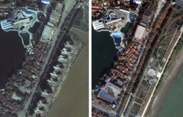
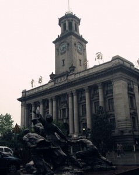

# ＜七星人物＞第七期：刘文祥：记录也是一种改变——瓢虫君专访刘文祥

**“记忆之于一座城市而言，是极其重要的，如同记忆之于人一样。一座城市之所以显得迷人，显得美丽，显得伟大，全部因为其所承载的城市记忆。” ——刘文祥《把我的爱献给城市——写在纪录片首映前夕》** **刘文祥，武汉大学人文科学实验班学生，2010年拍摄纪录片《汉口，汉口》，一部“追寻一座城市的光荣与苦涩”的影片。优酷、土豆上对这部电影的好评如潮，有观众说这部影片“复活”了汉口。在影片中，人们不单看到了正在消失的城市记忆，还看到了一种应有的对待历史的态度。** **2009年10月，他曾与民俗学家刘谦定一同向武汉市文化局递交申请，希望将位于汉口交通路的生活书店旧址认定为文物得以保护，遗憾的是最终生活书店还是没能得以保留，在地铁建设工程中被拆除。** **本期七星人物，关于武汉，关于城市，关于历史，关于文化。** **关于刘文祥。**

# 刘文祥：纪录也是一种改变

## ——瓢虫君专访刘文祥

 

#### ·《汉口，汉口》是我第一次拍摄视频

（刘文祥。图片来源于刘文祥人人网相册。）

**Q：《汉口，汉口》首次放映以来观众的口碑和反响你满意吗？** A：还不错吧，有些观众下来会有一些交流，说受到很深的感触，特别是历史文物保护这方面的。 **Q：拍摄过程中遇到的最大困难是什么？** A：最大的困难，应该是怎样去表现我想要表达的东西。有一些观众看完片子以后也给出了意见，说这个电影表现形式、技术手法太单调，太枯燥。 其实很多时候相当无奈，片子里面的许多建筑要么是正在拆、要么是已经拆掉了，不要说影像了，照片都要辗转很多层才能得到一两张。但电影这个东西又是个特别立体的表现方式，有就是有，拆掉了、没有了你就是拍不了，我也不可能像央视那样财大气粗地去请团队做特效。有些只能照片、加图片、加旁白，然后尽可能多一些史实、资料，在做片子的时候，特别头疼。 **Q: 你以前有拍过电影或者视频作品吗？** A：没有，这是我第一次拍片子，我的专业也不是这个。 **Q：“记忆之于一座城市而言，是极其重要的，如同记忆之于人一样。一座城市之所以显得迷人，显得美丽，显得伟大，全部因为其所承载的城市记忆。” 这是你的文章《把我的爱献给城市——写在纪录片，首映前夕》中的段落。** **我是否可以理解为： 你是希望借电影来留下武汉这个城市的记忆——并以此纪录和彰显她的美丽？** A：不能这样说。这个片子我主要是拍汉口，而事实上武昌这样的素材更多。我拍这个是想表达城市的记忆正在消失，我觉得这是对历史的一个态度，不是表现城市美。 **Q：我觉得这部电影的一个特别之处就在于它不但在纪录那些已经尘封的历史，还在纪录那些正在镜头前发生的事件，比如四大纱厂的拆除。你在拍摄过程中接触了很多这样的场景，会不会觉得很沮丧很灰心？** A：还好吧，我看到这些想到的就是用镜头纪录下来，尽可能多纪录一些。可能是因为见得多了，有些麻木了。 如果一定要说感触的话，就是觉得很可惜。你比如申新纱厂是08年拆的，还有裕华纱厂是我跑去拍的时候正在拆，结果只能跑到江堤高处去补几个镜头。我如果再早点开始拍，就可以拍到更好的素材了，留下更多材料。 人不能太多情，太多愁善感做不了事情。 

#### ·文革扭曲了武汉的城市性格

**Q：你并非土生土长的武汉人，而是黄石人。不过你好像也认同自己是一个“武汉人”，为什么？你如何看待武汉这座城市？** A：武汉和黄石地理位置上本来就不远，文化风俗也相近，我个人对武汉是很有感情和归属感的。 武汉的自然条件很好，在近代中国历史上是一座非常迷人的城市，但是同时它也是一座迷失的城市。很多外地学生对武汉的评价都不太高，我个人的观点是武汉的市民素质存在很大的问题，这包括文明的素质和风气等等。 **Q：我在武汉生活了三年，对于武汉的市民素质，有一种说法是武汉这个地方气候炎热闷湿，容易让人脾气暴躁，心急口辣。你觉得武汉的市民素质问题是什么原因造成的？** A：这个跟气候没有关系，长江沿岸很多城市都是这种气候，上海、南京、重庆夏天的时候一样炎热，但是别人就没有这样。 **Q：你觉得武汉的市民素质问题是什么原因造成的？** A：我之前有读到和听到一些学者的观点，很认同，就是武汉这个地方现在的城市性格和气质是扭曲的，源头是文革。 很多人说武汉是码头文化，这不准确。1949年以前武汉有这种文化因子，但也没有形成这种城市性格。一个城市的性格是由这个城市的upper（上层）掌握的，武汉的上层社会是商人，正源文化是商业文化、“和”文化。商人最讲究以和为贵，最讲客气，怎么可能会满嘴跑脏话，上来就问候别人家属呢？ 但是文革造成了社会结构的倒置，上层的商人文化被打倒、被砸碎，码头工人甚至地痞流氓们开始占领武汉的话语体系，整个城市的性格扭曲了。文革中的武斗实质就是拳头文化，就是不讲理只斗狠，这种影响我们现在也随处可见。 **Q：举个栗子？** A：你比如那句“你给老子等到”，这就是典型的在文革中被推置到上层话语体系的扯皮习气，这种话或许不是脏话，但这种充满戾气的话以前只有码头工人、地痞流氓这种人才会天天挂嘴边。 **Q：《汉口，汉口》里似乎引用了一位武汉作家罗时汉的一些文字，你本人对他《一声叹息——湖北武汉将愧对武昌首义百年纪念》一文中对于现代武汉发展的看法是怎么看待的呢？** A：这个问题有点儿太宏观了……我刚才说武汉是一座失落的城市，事实上这三十到四十年来武汉都很茫然，不仅仅是经济，而是政治文化等等各个方面。 前几年刚开始提两型社会的时候，我是很赞同的，我觉得这个东西在武汉搞是很适合的。但是你看现在那个楚河汉街，那个东西湖连接工程，它生态的部分还有多少？到头来还是在搞商业，这不仅仅是没有做到两型社会，简直就是背离嘛。 **Q：这样的情况应该很多吧，我在武汉生活了三年，感觉市政工程建设无处不在，有些地方就从来没有安生过。** A：重复建设的情况是非常多的。武昌火车站那个广场现在是地下通道，以前其实是个天桥连接，而那个天桥是94年才建的；之前在汉阳江滩那边建江景豪宅，建在长江大堤里面，审批的时候各个部门全部通过，最后闹大了还上了焦点访谈。一去查，这也违规、那也不能符合，最后全部炸掉，变成现在的江滩广场。 

（左图中沿江的违规建筑在之后被炸掉，右图中整修成沿江公园。图片来源于刘文祥人人网相册。）

**Q：这种重复建设到底是由什么造成的呢？** A：简单地说就是政绩。 **Q：那么对于黄石你是什么样的看法呢？** A：黄石有很多资源型工厂，工业气息很浓，污染也很重。我们小的时候大家都说黄石是个“光灰的城市”，到了90年代中期的时候国企开始倒闭，黄石受到的影响很大，变得没有生气、萧条、没落。我上高中的时候黄石的环境开始好转，现在可以说黄石的环境要比武汉好不知道多少倍了。 **Q：我记得《汉口，汉口》里还专门有一段讲到黄石的。** A：对，黄石的工业遗产保护做得很好，可以说是世界级的，关键是它找到了城市的亮点。你比如华新水泥，这是张之洞兴办的，也是中国在张之洞时代创办的水泥工业唯一留存到现在的，中国的很多大型工程比如长江大桥、三峡工程等都是使用这个工厂的水泥，所以说它伴随着中国一路到今天一点不为过。 **Q：黄石对你的影响似乎很大。** A：嗯，湖北最早通铁路的就是黄石，我家就住在那条铁路旁边，现在那条线路都还在使用。小时候我就对火车、铁路特别熟悉，对铁路有一种特别的感情。 

#### ·对待历史要诚实

**Q：“不过我一直以来想表达的基本意思仍然不变：希望更多的年轻人关注身边的历史，并用现代技术赋予我们的能力来记录它们。因为记录的意义是巨大的。”** **可不可以具体谈谈这种意义。因为确实越来越多的人——不仅仅是年轻人——不关注历史，不尊重历史。很多人觉得这是没有意义的，更愿意关注眼下。** A：哈，这个是我那个《小广告》里面的，专门鸣谢北斗的支持。 首先一个呢，就是技术手段的空前发达，让人们方便纪录。很多人质疑纪录的意义，其实“告诉”就是一种话语权，以后的人们不能只靠《人民日报》来了解我们这个时代。 **Q：那这个纪录的“告诉”的意义具体如何实现呢？** A：是这样，它也许不能改变什么，但是它可以纪录。纪录也是一种改变，也是一种生产力。对于建筑来说留下影像更是重要，比如南京的琉璃塔，鸦片战争以后很多外国人来到南京，所有见过这个塔的人都赞叹这座建筑，但是最后这座塔毁于太平天国时期。它如果再撑十年，就可以留下影像资料了——哪怕是一张照片，而我们现在只能凭借文字和残件去凭空想象它的样子。 还有以前哈尔滨拆除一座东正教教堂，当时的宣传人员拍了纪录片，虽然它的拍摄目的是很伟大光正地说要打倒苏修之类的，但这个影片我们现在看，也一样留下了很多关于那座建筑的信息，这就是纪录的意义。过去的门槛很高，现在很多人都有手机、有DV、有相机，可以很方便地纪录。 **Q：这里有一个问题，就是两个“历史”之间的矛盾：记录的历史和真实的历史。前者包括文字、图画、传说故事乃至近代以来的影音记录等，后者则是不具有实体，只存在于时光轴上的无数真实与现实。前者永远也不可能真正还原后者，甚至很多时候会扭曲、蒙蔽后者。** **你如何看待这两个“历史”之间的矛盾问题？** A：这个矛盾，对于史学工作者来说，要尽量还原历史，这一点非常重要。也许我们做不到真正还原历史，但是这个信仰对于史学工作非常重要。中国人对待历史非常不诚实，很爱说谎。 **Q：我记得你的一些日志里反复提到严复的一句话：始于作伪，终于无耻。** A：对，我非常认同这句话，这八个字是对中国文化劣根性的一个注解。 **Q：在曲解历史这个问题上其实还有一个需要分开的情况，就是一个人明知而故犯，与一个人无知而愚昧，是截然不同的两个概念。** A：对的，之前大陆学生与李登辉的那个事件，其实就反映了一些问题。首先，对待一个老人，那个学生的态度不礼貌；其次就是他对于历史有些无知，当然，无知无怪。但最可怕的是一些人已经知道自己在这个上面的不足和愚昧，还不知求学。 这就好像现在一些市民，最可怕的不是他们不知道素质差，而是大家都说素质差，他们反倒觉得这就是武汉的城市特色。无知不可怕，无耻才可怕。对于历史学习以及研究的态度，也是一样的。 **Q：无论是之前的台湾大选还是韩寒的台湾之行，民众都报以极大的热情，请问您是如何看待现在的民国热呢？** A：这个地方首先说一下，就是“民国”这个概念是不成立的，我不展开了。另外一个就是，果粉们心中的台湾和现实中的台湾是不一样的。 产生关注当然是好事情，对自身以外的世界多加关注当然是好事，但是要保持冷静，要去思考那些现象、表象的背后（的真实的本质）。 **Q：韩寒台湾之行写就的文章《太平洋的风》一度也是很受热议，在一定程度上也代表了相当一部分国内大学生对于台湾的看法，你对于这些观点是什么看法呢？** A：我是不赞成韩寒的看法的。很多人说台湾之所以现在更加文明、进步，是因为台湾保留和发扬了中华民族的文化精髓。我觉得恰恰相反，台湾之所以进步，是因为它改造了中华文化，而大陆才是真正继承了中华文化——的糟粕。 台湾有个标志性的良心文人，柏杨，他以及他这一类型文人的存在说明台湾在反思。 **Q：反思什么？** A：民族主义。从清末学堂至今，中国学生就没有摆脱民族主义，“不清白”（武汉方言，意为“脑袋不清楚”、“迷糊”、“犯浑”）的民族主义。蒋介石六七十年代在台湾大讲民族主义，被当时的台湾学界、思想界抵制和反思。台湾人对中华文化中的弱点以及民族主义的丑陋所进行的改造，在近几十年尤为突出。 **Q：你觉得能够完成这种改造的关键是什么？** A：社会现代化。 **Q：北洋时期的民国似乎是中国近代史上很特别的一节，那一时期的社会氛围似乎充满了很多与传统中国不同的“新”，我想你应该很喜欢这一时期的中国社会。** A：北洋时期的历史是被严重抹黑的，这种抹黑最早从国民党开始，给这段历史定性也是国民党的杰作。 以武汉为例，汉口历史上的五国租界都是清末就存在的，俄、德租界在北洋时期收回，但历史书上只提二十一条只提山东的德国权益转让给日本，闭口不提北洋政府的外交成就；此外英租界是国民党时期收回，法、日租界最早是汪伪政府“收回”的。 北洋时期的中国是很自由的，没有军阀喊主义讲“国父”，也不会讲“一个党一个领袖一个主义”，这是会被人们耻笑的。自由和民主的观念深入人心。所以我们不能用一两个简单的词汇去定义和理解一段历史，这是不尊重历史的。 

（图为汉口江汉关）

#### ·不动文物保护，政府要负责

**Q：其实古建筑保护的问题一直存在，最近湖南文物局斥责当地政府强拆“红色遗址”，郑州的市级文物保护单位“国棉三厂”半夜被开发商强拆，梁思成和林徽因的故居也被“维修性拆除”。** **你觉得不可移动文物拆与被拆的矛盾背后是什么？** A：背后其实就是文化留存与政府卖地经济的矛盾。 **Q：这种矛盾可以调和或者得到很好的解决吗？** A：我认为政府才有责任去保护文化，商人是没有这个义务的，让商人的逐利性让位，去讲道德讲文化自觉是不对的。 **Q：黄石关于工业遗址保护的经验或者说做法是否是解决问题的最好方法？** A：黄石只是一个个案，难以推广，黄石有它的特殊情况。我只是肯定黄石对于不动文物保护的态度，至于这种模式的效用几何，还要后观。 **Q：你走访游历过许多城市，对于不可移动文物的保护方面，你觉得哪些地方政府做得相对比较好？** A：杭州。大家对杭州的印象大概就是以宋式风格为主吧，但是我今年二月去杭州的时候发现杭州的民国建筑也非常有特色。就在中山路上，有保护得很好的整片民国建筑。 我走到那个凤凰寺和中山路附近的天桥，看到附近有一块施工拆迁区域，临街的那一面老建筑墙面全部都保留了下来，并且做了保护支撑措施，应该是以后要继续保留下来作为临街墙的。这个景象给我很大震撼，一是这种事情在中国十分少见；二是当年武汉江汉路地铁施工拆迁的时候，我曾经跟别人一起提出类似杭州这样的保护老建筑的方案，但是政府说技术上达不到。 但是杭州这边的情况就说明，是可以做到的，人家现在的中山路民国建筑沿着街，非常漂亮整洁。而武汉江汉路以前那些老建筑上都是乱搭乱建，各种招牌电线架在上面，现在接在一起百米长的老建筑彻底找不到了，很多都拆掉了。 **Q：我觉得在城市与建筑的关系之中，一个是古建筑，一个是新建筑。良性的循环是，古建筑被保护、或者复制、或者有限地有选择地拆除，而新的建筑也具有相当的水准。你对于我们国家现在的城市建筑是什么看法？** A：举个例子吧，比如北京的建筑，概况下来就是“标新立异的假大空+压抑单调的民居”。当然这不是说只有北京的不好，全国都是这样的状况，只不过北京典型一些。武汉、上海、包括刚才说的杭州也都是大同小异的状况。 我很赞同故宫博物院院长单霁翔的一个观点，就是中国现在的建筑同质化、庸俗化非常严重，只不过各个城市间程度不同。黄石的工业遗址保护其实就是反同质化，其中一些工厂遗址的地段甚至是坐山面湖的城市中心地段，而反观武汉，拆了三座近代纺织厂，建了个万达。 **Q：你自己最近有没有什么计划或者打算呢，将来是准备出国读研还是？** A：暂时还没有考虑那么多，还是想在学校多读读书吧！ 

### 延伸阅读

（1）＜专题聚焦＞[城市特辑：武汉](/?cat=4989)

（2）＜独立影像＞[第八期：汉口，汉口](/?p=13390)

（3）＜北斗玉璇＞[了解台湾的钥匙——观《1949大迁徙》](/?p=18310)

（4）＜北斗天衡＞[倒掉的北大](/?p=19815)

（5）＜北斗摇光＞[北京，你让我找不着北](/?p=6430)

（6）＜北斗摇光＞[你爱的是哪门子国？](/?p=3331)

 

（编辑：张苏樊 张丹宁 ；责编：张正）

 
