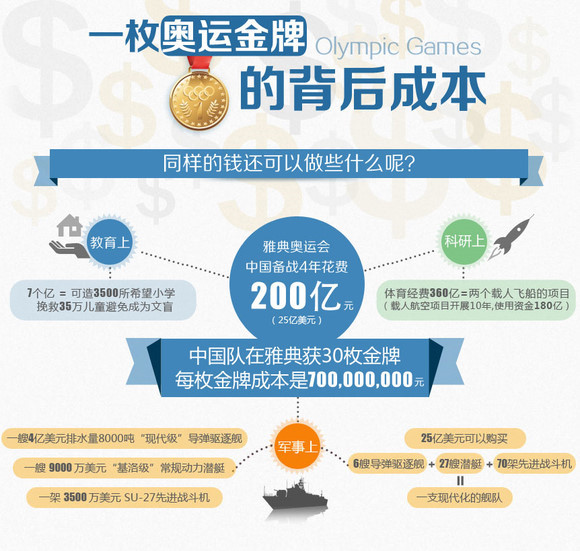
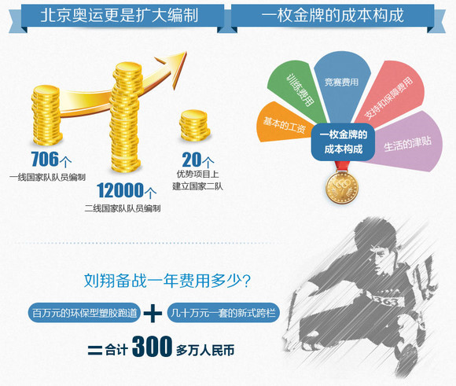

# ＜七星人物＞第九期：“白岩松：我所经历的北京，我所看到的伦敦”一文的真相——瓢虫君专访“原作者”陈行

**十几天前，2012伦敦奥运会如约开幕，从开幕式到之后的每一天，似乎每天伦敦都能提供大家各种新闻点，直到女双退赛，网络上的言论迅速分成了两派，一种是“理性的奥运精神派”，一种是“指责规则、力挺国手的爱国派”。** **几日前，网上一篇署名白岩松的文章逐渐被越来越多的人看到，文章名字叫：我所经历的北京，我所看到的伦敦。截至几天，这篇文章的网上阅读量已不低于40万，并在网上被广泛转载，而其在“人人网”的分享量，也至少有23万。细看文末的评论，仍然可以看到上述两派对峙的身影。** **极高的分享量似乎意味着极大的读者认可度，然后这篇文章的作者却并非白岩松，这只是一位理科生做得一场“病毒式营销实验”。从实验结果看，无疑他成功了，但就大众的心理预期、名人效应、爱国主义等等方面看，这篇文章以及相应的分享与评论却充分表明：在现在这个充满各种“矛盾”的国家里，即使仅仅是在大学生这一个群体中，相互间观点的差异也是如此之大。** **本期北斗人物，就带您走近文章原作者——陈行**。  

# “白岩松：我所经历的北京，我所看到的伦敦”

# 一文的真相

# ——瓢虫君专访“原作者”陈行

## 

 

### 一、初衷：一次病毒性网络营销实验，给自己一个注脚

**Q: 首先，能给北斗的读者朋友们简单介绍一下你自己么？**

A: 我是武汉大学数学基地班的2009级大三学生

**Q: 最近你的人人日志《白岩松，我所经历的北京，我所看到的伦敦》，被网友疯狂转发，我想请问你写这篇文章的初衷是什么？**

A: 初衷其实有两个。一个我在网上公布过了，是做一次病毒性网络营销的实验，我看过一些视频，例如NBA的欧文假扮老头打爆街头篮球，当时我觉得这个视频病毒流传得很酷。另一个原因是我没有公布的，我是想看如果署上了别人的名字，我的文字会不会有足够的欺骗性，会不会让别人觉得我像白岩松写的一样好。

**Q: 起初是为什么想做病毒性网络营销的实验呢？本身设想了一个什么具体的实验结果么？有没有想提高人气的成分？**

A: 只是因为觉得病毒营销比较酷。没有想提升人气 。但是有一种想让更多人认可我的文字的想法。

**Q: 文章想让读者认可你的文字，那文章的思想呢？想让读者认可你的思想么？**

A: 不是很在意思想，因为这篇文章思想并不深刻，而且有些地方是无法论证的。

**Q: 可你说特地运用了一些时下流行的心态和思想，想让读者附和？**

A: 我在论证中采取了辩论的技巧。不好说附和， 但至少我知道这些东西是大家心里想的 所以我集中在一起了。

**Q: 病毒要素是指白岩松这个名字，还是奥运这个话题？**

A: 白岩松是一部分，还包括文章运用的感染力行文方式、民族主义、反西方倾向、反思心态、“中国可以说不”等等，我认为时下流行的心态和思想。

**Q: 你也曾说过文章中留有很多破绽，能举几处例子吗？**

A: 最大的破绽，就是菲尔普斯这个例子。菲尔普斯药检次数很多，而且西方也一直在怀疑。还有就是文中出现了新华社杨明。作为央视记者，不可能公开指责新华社，这是明显的乌龙。 至于网友认为的BBC纪录片，则没有问题。

**Q: 这些可以算是你实验中准备不充足的漏洞么，还是故意放在里面考验公众辨识能力的？**

A: 这些是我刻意参照钓鱼文的方式留的破绽，但没有钓鱼的意思

**Q:对这个实验的结果，你自己评价怎么样？**

A: 实验的结果我很满意。在赋予文章我认为病毒的要素后，流传速度超出我预期，所以我八小时后就辟谣了，而且禁止评论和分享。

**Q: 截至到现在，这篇文章的阅读量是30多万、分享量是18万，不知你看到这样的数字作何感想呢？**

A: 这个阅读量、分享量的确令我吃惊，而且整个互联网上这篇文章阅读量远远超过这个数字，所以说还是会担心侵权，所以我八小时后就辟谣了，一来实验目的达到，二来不想搞大。

**Q: 为什么在有这么多明显破绽的情况下，依然每两个读者中就有1个以上的人分享这篇文章？为什么这个病毒性试验会那么成功？是公众缺少思考力的体现吗？**

A: 因为破绽只是论据，论点没有问题，而感染力的行文会让大家忘记我是怎么论证的。我觉得这篇文章说出了很多人心里所想但没能说出的东西，比如金牌战略，肯定有支持的。我不认为这是公众缺少思考力的体现，因为这篇文章的观点首先很正面，很多论点甚至老生常谈，比如西方是不是在国际事务上有定价权。

**Q: 为何不直接署名自己，而非要用白岩松的名义呢，又为何选择白岩松呢？**

A: 如果大家觉得这是白岩松写的，那我会很开心，这是私心，因为白岩松在我心中地位很高。

**Q: 你为什么会有些崇拜他呢？**

A: 因为他是中国少有的理性媒体人，他有很多故事，让我非常立体欣赏他。

**Q: 意思是，你心中的白岩松会写这样的文章？**

A: 大致相同，观点相似。在语言的分寸上我也学习他，没有把话说满，点到为止。

**Q: 会不会因为说了假话而感觉内心有愧？比如假借用白岩松之名。**

A: 不觉得太愧疚。用一句我很欣赏的回复来说——借用名人来表达自己思想自古有之。《孟子》、《论语》、《庄子》不乏伪作，但是伪作也不乏佳作，本文如是。

**Q: 当你发现自己真的可以裹挟民意时，那时是怎样的感觉呢？**

A: 说不兴奋可能挺虚伪的，我有兴奋，但也还蛮淡定的，毕竟都是大学生了。

**Q: 日志评论里有一部分是对事件本身的评论，还有一部分是对你的人身攻击，发这篇日之前想到这些后果了么？对那些并不了解你本人的人的评论，你持什么态度？**

A: 都有想过，而且我想的更恶劣，但事后来看，支持我的人比我想象得多；至于对我的攻击，确实有，而且不乏一些高学历的名校学生，但我也依然给予了礼貌的回应。很多东西，是立场分歧造成的，第一句话就说不到一起去。

**Q: 这篇文章纵然漏洞很多，但它也确实是表达了你内心真实的一些想法？而且，你相信这是很多人内心没有说出来的想法？**

A: 多数观点我的确是支持的，也相信多数人如此。

**Q: 这篇文章从发布到被疯狂转发，到你出面做出禁止评论的声明的这个过程，会对你的工作和生活产生什么样的影响？**

A: 在网络上似乎获得了名气，但影响也就集中在网上，好友人物会多很多，比如人人上就多了1000多个申请。同学也会说你很牛，骗了那么多人，但这种话听多了，也会觉得挺无聊的。在我心目中，做facebook才是酷，这种事情只能作为我的一个注脚。

 

### 二、对于民族主义，我很中立

**Q: 这篇文章，字里行间充斥着对外媒因质疑叶诗文服用兴奋剂及于洋、王晓理消极比赛被取消参赛资格等事件的不满，这些是你的真实想法还是为了迎合公众而说的话？**

A: 这的确是我的真实想法，我的确比较反感。

**Q: 在写这篇文章时，有没有特意去迎合大众的心理预期呢？从分享的结果上看，确实讨得了大众的欢心，那在你看来，大众的心理预期是什么呢？**

A: 有考虑，比如我会在一开始说西方偏见，会说西方不应该在艺术领域有定价权，这就是民族主义，民族主义是我认为公众的期待，另外，金牌战略我投了赞成票。

**Q: 民族主义也是你个人的想法吗？**

A: 一件事情本来就有正反两面。民族主义我不热衷，我很中立。

**Q: 你文章中提到“在中国媒体人日益开放、包容的今天，试图用新闻的眼光去报道新闻时，外国媒体对红色中国的解读掺杂着过去、现在和未来，其中理解与误解反复纠缠”，“而西方媒体往往宽己严人，他们在指责朝鲜运动员只知道为国争光、指责中国运动员是机器人的同时，却忘记了BBC在奥运前专门推出的纪录片子《戴利---为不列颠而跳水》”，**

**媒体有一个责任就是监督和质疑作用，像之前索普和菲尔普斯破纪录时也遭到了很多怀疑，“飞鱼”身子因此专门开了记者发布会，这次外媒同样对叶诗文和羽毛球女双退赛等事件加以评论进和质疑。抛去调动读者对民族主义的情绪，请问你个人是如何看待西方媒体的呢？仅仅从这一个两件事说看外国媒体对中国的误解，会不会有点片面和过于主观？**

A: 在我眼中的西方媒体是真正在做新闻的，因为管制少，也因为他们真正理解新闻。所以白岩松很感叹，911的时候，全世界都在播纽约，而中国什么也没干。我对西方媒体看法还比较中立，但是西方媒体的确有一些反华势力，但这只是一小股，不影响大流。比如这次奥运会，其实卫报、泰晤士报的看法就相当客观，只是BBC有两个排华的主持才闹得沸沸扬扬。当然，西方媒体也是媒体，依然为政府服务，虽然他们更自由、更高效。

**Q: 西方媒体的所谓的反华势力，我们谁都没有真凭实据说他到底是不是阴谋论，有可能像你之前说的，完全是立场分歧，第一句话就谈不拢；也可能就是媒体起到了它应起的监督作用。那单纯从反华或不利于我们的报道说西方媒体怎样，会不会是一种相对狭隘的民族主义？**

A: 其实是，当我们谈一件事情、一个人的时候，我们都是依赖于经验的，我们的经验当然有可能不客观，但是社会科学在我看来允许相当充分的主观性。也就是说，这样角度得出来西方媒体反华的结论依然有价值。如果这个问题是民族主义得出来的，那我们考虑很多社会问题都需要加一句，这是因时因地的考虑出的结果，可能是偏狭的，而这样的一句话显然是不需要特别添加的。

**Q:在一个比较自由，大家都受过一定教育，有独立思考能力和主动性的环境下，社会科学允许充分的主观性，没有人能做到对一件社会事件的完全客观。但事实，在中国并不完全是这样，18万人分享那篇文章就证明了很多人并不具有独立思考能力和主动性，也就是说他们极容易被其他人的思想和观点所左右。那作为一个信息源，你输出了一个并不是太客观、比较主观的民族主义，你有考虑过后果吗？**

A: 从传播学的角度，人们只接受他们相信的东西。所以，如果说我传播了民族主义，那也是人们内心深处自己的信仰，我觉得我做的工作对人们思想的“改造”甚少，这是唤起了他们心中的那些想法。

**Q: 你是如何看待民族主义与媒体职责之间关系的呢？**

A: 媒体可以宣传民族主义，这个没问题。

 

### 三、陈行眼中的奥运与金牌战略

**Q: 在你眼中，是奋力拼搏、挑战极限、尊重规则的奥运精神更重要，还是“讲人性”更重要？**

A: 两者都重要当然，这两者其实冲突的地方不多。对于选手，只要不恶意竞争，基本上这是可以兼得的。所以问题就是规则，就是裁判，我们在制定规则时要更人性。

**Q: 你是如何看待女羽让球事件的呢？**

A: 我依然认为是规则问题，至于会演得那么离谱，是很多意外造成的，中方让球有前科，而且世界上类似的做法屡见不鲜。如果不是这么极端，我觉得大家不会有意见。

**Q: 如果让你选一个，你觉得是选手问题，还是规则问题？或者你给两者的权重各是多少？**

A: 选手问题是零，李永波的责任是三成，规则占了七成。

**Q: 文中提到了政治、经济和奥运应该在一定程度上分开看之。还有一个相似的概念，运动员跟民众，奥运跟国家也不能完全划等号。你觉得奥运与国家是一种怎样的关系呢？**

A：这个问题很有意思，深挖可以获得很多，我从金牌战略入手。很多人说金牌战略不好，但是我们看，世界上最强的几个国家，美国、俄罗斯、英国、中国都是奥运金牌榜前几名。我们怎么解释呢？说别人是自由发展,我们是举国体制？问题的关键就是其实我们并没有证据。你怎么知道外国不重视？怎么知道没有花很多钱？这都是要量化

**Q: 网上有人计算出，雅典奥运会备战4年，我国共花费200亿，如果这一数据是真实的，请问您是如何看待的呢？**

 

（图片来源：“数据可视化”资料库）

A: 这个统计做得不错。但是我始终认为，没有奥运，体育一样要搞。有了数据，我们还要看我们的分析是不是错了。这组图最大的问题就是没有区分哪些是完全为了奥运？羽毛球也是奥运项目，但是羽毛球还有那么多世界大赛，为汤尤杯海外拉练的花费计不计算呢？当然，解释归解释，中国的金牌战略的确是有问题的。

**Q: 和西方国家相比，中国的奥运会奖牌数也许并不逊色，而体育运动这个概念在整体民众生活中所占的比重却相去甚远。你在文中也说：“北京奥运让我们看到了一个快速崛起的中国，伦敦奥运，我们能否看到中国民众的崛起呢？”你自己能回答下这个问题么？**

A: 这需要时间。其实，中国民众的很多观点都进步了，比如看待事情会慢慢辩证。但是崛不崛起，这涉及太多。很多时候我们觉得中国没有希望，所以我们说官无廉、富无善。但是现在理性声音多起来，人们学会了反思。我觉得，崛不崛起取决于两个关键问题，首先是普世价值，其次取决于看问题和自身辩证思考的角度，后者很重要，可以避免很多无谓的争论。

 

### 四、自媒体时代的“媒体、社会与民众”

**Q:“经济归经济，政治归政治，奥运归奥运”，然而这些元素彼此之间又不可能真正的独立存在。媒体报道跟经济、政治和社会等因素也息息相关。通过奥运的报道来看，是媒体影响社会，还是社会影响媒体？**

A: 如果是中国，毫无疑问是媒体影响社会。中国媒体很会引领民众，各种原因大家都明白，偶尔媒体会做一些互动，但也只是一种手段。我对中国媒体的看法非常悲观，这是一个没法去直播新闻的行业，所有的东西都要审批，永远没有破格，所以你会发现甬温线事故，大家对媒体、对政府意见那么大。

**Q: 有没有一种可能是，因为民众有了民族主义等等的想法，媒体才去反应、去为民请命？这个可不可以理解为，社会影响媒体？**

A: 表面上看似乎是这样。但是中国真正的媒体完全可以掌握风向，比如五毛，中国的确有相当数量的五毛，所以媒体可以完全吸收公众反馈。但是如果你指望它可以反馈读者并指引心灵，那是不可能的。手段为目的服务，中国媒体的目的很明确：维稳。它的手段很丰富，远超一般人所想，这就是我的观点。

**Q: 现在微博已经成为信息传播的一大途径，其传播速度和影响力并不亚于一些主流的传统媒体，比如数以亿计的人都会上微博，但上新华社网站、订北京晚报的人也没有以前那么多了。很多公益活动，如挽救留守儿童，都通过微博取得了很大成就。这个可以理解为社会影响媒体么？而且这样的事情越来越多。**

A: 这个问题上我看法可能比较偏激。中国媒体当然可以互动、可以反馈，但这都不是核心问题，这不是红线。比如感动中国，不触动核心，领导层何乐而不为？还有助于维稳。而中国怎么谈自由？怎么谈体制？这都是红线，根本谈不深，主流媒体更是不会跟你谈。这是我的观点。

**Q:网络2.0时代，每个人都可以成为信息源，但也因此，病毒式传播有了自己的土壤，因为人们不大会在意信息发布者是谁，更在意的是信息本身。一份稿件，会有坚定的分享者，也会有坚定的抵制者，似乎每个人在看文章前都有自己的心里预期，你觉得这种心理预期是怎样形成的呢，又为何会有那么大的差异呢？**

A: 就是环境。中国民众生活环境大不一样，观点的相异很正常。在中国，一个问题可以有一千种解读，比如刘翔退赛，你会看到很多版本的解读，而我觉得分歧就来自教育和环境。

**Q: 比如大众会不加考证、不假思索就盲目的分享一些病毒式的信息，你觉得其中有教育的问题？**

A: 有一些人实际并不在乎作者是谁，我觉得社交网络的确培养了一批屁股决定脑袋的人。“人人”这个平台也的确充满这种人，主要是教育的缺失，比如盐能防辐射的谣言后，大家就都去买盐，这个在西方很难想象。中国经常出现谣言，就是因为教育无法普及，而且质量不高。

**Q: 教育质量不高指的是学校文化教育，还是学生缺少独立思考能力？**

A: 主要是教育的畸形化，也就是独立思考的缺失。

**Q: “我们的形象依然不够伟岸，西方媒体不理解我们的情形时有发生。我们的国民心态依然存在不足，我们会条件反射去质疑自己的国家的一些东西。我们的民众神经脆弱而敏感”，你为何觉得我们民众的神经如此脆弱敏感？是因为我国的经济和政治还不够强大？**

A: 有一个词叫屁民，就说明了很多，至于造成的原因，我认为最关键的就是之前说的教育和长期封建压制造成的历史遗留。前者不需要延伸也很明显，后期仔细想想也知道，现在很多东西就是封建遗留，比如一些生活习惯，更比人微言轻这种典型的封建残留。

**Q: 能结合这次自身的经历，说说你是如何看待自媒体时代，媒体与民众间关系的吗？**

A：这篇文章很多观点就是这个时代所缺少的，所以民众想要看到有人说，比如中国要维护话语权，比如中国要学会说不，这是媒体可以把民众内心期待说出来的一面。如果这篇是白岩松写的，我觉得会让民众受到鼓励吧。但如果是我写的，我觉得影响有限，顶多帮他们梳理思路，让他们明白自己到底是怎么想的。我经常看微博、看新闻，所以我可能比较清楚民众的心态是怎样的、他们需要什么。

**Q: 最后一个问题，今后还会继续写这种文章吗？比如像纽约留学女那样，出系列视频进行反讽？**

A:应该不会，同类的文章不会写了。但我也许会做一些更特别的事情。现在还没想好，但是我很喜欢黑客文化，所以如果将来出现更大规模的恶作剧，也许你们第一时间应该想到我，呵呵。

 

### 采访者后记：

一篇拥有18万次分享及30多万浏览量的人人日志是被什么推上风口浪尖？在与文章作者，武汉大学数学系大三学生陈行探讨过文章“病毒性传播”的来龙去脉，我反而愈发肯定，真正铸就这篇文章成功的，并非他的某种思想、抑或单纯是这种可怕的传播方式，而是陈行本人的性格——理性、果决、甚至有些许偏激和自傲。

“写这篇文章的初衷是想做一个病毒性传播的实验……这件事只能是我的一个注脚。”天文数字的转发量似乎只是陈行一个唾手而得的目标，而当这个目标达到了，他又不以为然。在讨论中西方媒体作用的过程中，陈行更是毫不避讳地表达，尽管承认他的看法可能有点偏激，但仍绝不退让。他认为，在社会环境日益开放的今天，中国的新闻媒体仍然备受管制，基本不能为民服务。然而，陈行的性格和思想也有兼容并包的一面。比如，他对民族主义的态度就很中立，因为他认为社会科学应该容忍相当的主观性；关于金牌战略，我们也觉得不应只看单方面的数据，而应辩证的分析。

每个人都想成功，很多青年人都想改变社会。正是带着诸多分歧的观点交流，笔者才感觉到，从陈行身上带给青年人两点最重要的启示：一是直接，二是包容。这个社会需要青年人直抒胸臆地表达思想、传递信息，只有这样，才能突破一些桎梏、连接新与旧的概念和承接社会转变。而在遇到矛盾冲突的时候，唯有包容，才能化解矛盾，才能接受新的概念，才能进一步改造这个社会。世界上最伟大的城市都是能兼容并蓄最多不同种族和文化，最优秀的青年人也应该是能以一个理智的头脑和一颗包容的心接受不同思想的。

 

（编辑：张丹宁 王凌羽 欧阳银华 责编：张正）

 
