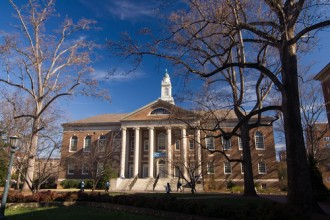

# ＜七星人物＞第二十一期:世界那边的他们——瓢虫君专访“留学生”（2）

** 之前，北斗人物组推出过“毕业生”选题的采访，因为我们想描述一个更为广阔大学生的群体，那三期稿件后，我们收到了很多不同的反馈，在此感谢各位读者。除了毕业生，也许对于大学生而言，另一个越来越不能忽视的群体就是留学生，那些身处海外的中国学生们。在网上，我们能看到他们旅游时光鲜亮丽的图片，也会遇到叫苦不迭的抱怨。我们希望用更低、更广阔的视角去描述一个更广泛的大学生群体，因此未来两期的北斗稿件将以“留学生”为选题。** ** 和之前“毕业生”不同，本期七星人物将通过记者的视角，以一种描述性的方式讲述六位中国留学生的故事和生活。他们很普通，不够神奇，但却透出讲述者内心足够的坚定与坚持。越平凡，可能会越真实。本期为留学生访谈的第二期稿件。**

**People:**** ****高聿超**

**Topic: _I wish to make a difference_**

“小时候体验过中美两国不同的教育方式，相比之下，我认为自己更适合美国教育。”目前在美国约翰霍普金斯大学念大四的北京女孩聿超这样向我解释她出国留学的原因。早在小学六年级的时候，聿超已随父亲工作调动而赴国外留学，初二回国。到了高中，父亲希望聿超能继续接受美国教育，而她自己也觉得“美国教育比较注重个人发展，注重每个学生的个性。相对而言，中国的教育方式过于教条，并且很多时候都是应试教育，让学习变成了一种任务和竞争，而不是一种对知识的渴望和追求。”于是，聿超在高二时再次出国，之后一直在国外学习。

第一次和聿超接触，就觉得她是一个性格爽朗的女孩。到了约定的访谈时间，聿超主动上线和我打招呼，“Hi”和一个亲切的笑脸就让这次访谈在轻松愉快的氛围中开始了。聿超的学习经历比较特别，她说自己“经常被好朋友戏称为非主流”。最初聿超是被约翰霍普金斯大学录取，但她选择了去一所女子大学，布林茂尔就读，学习环境和数学专业。经过两年的学习，聿超发现自己的兴趣点在地球科学方面，“这个学科挺有意思的，因为现在全球气候在不断恶化，觉得自己如果能出哪怕一点儿力，都是有意义的。”但当时就读的学校并没有聿超想学的专业，再加上觉得校园氛围不适合自己（因为该校注重教学，而约翰霍普金斯这种综合型大学注重研究），因此大三时候，她又申请转学去了约翰霍普金斯，开始学习自己感兴趣的地球科学专业。

大学期间的转学，对聿超来说是一个转折点，“大一大二和后两年的生活学习风格很不同。”这不仅仅是因为前后两所学校的风格不同，更是因为聿超经过不断的学习、经历、调整，慢慢明白了自己想要的是什么。之前在女校，聿超主要把时间花在活动、社交上。她觉得大学时期参加活动与高中不同，高中时参与各类活动主要是为了挖掘兴趣（聿超加入过学生会、数学社团、全国优秀生协会等），而大学的活动则“更像是利用机会不断遇到新鲜人和事物，并且进一步找兴趣相同的人，毕竟人以类聚”。聿超参加过很多志愿者活动。她去Animal Rescue League关照一些被抛弃的小动物，陪他们玩，帮他们找新家；去Public Library做志愿者，“美国的城市图书馆都是免费的，当经济萧条后被裁掉很多资助，所以我去当志愿者，每两三天放学后就去帮忙，码书，贴通知，帮助管理员弄当期的展览，给小朋友读故事，陪他们玩跟书有关的游戏等等。”同这两个活动一样对她影响比较大的还有参与Hospice Volunteer，“那里的人都很可怜，都是很老的重病的人，往往没有家人去看望他们，比老年院还带着伤感。”聿超和她的好朋友每两三个星期就去慰问这些孤苦老病的人，赠送自己做的糕点，给他们表演节目等。“我觉得看望这些老人让我更加珍惜生命，意识到人与人之间关爱有多么重要……其实要说能说很多收获，在hospice得到的一些对人生的启示是没法儿用言语一一表达清楚的，有时候看着当时拿的一个志愿者纪念挂链都能想起那段时光，然后鼻子一酸眼泪婆娑的……”

这个善良的姑娘不仅乐于做服务，大二时，为了挑战一下自己的领导能力，她还参与了国际学生会主席的竞选。因为性格开朗、人缘不错，竞选时选票拉得很成功，聿超顺利当选。在职期间，聿超的主要工作是组织活动，印象最深的一次是组织大家一起去Longwood Gardens玩，反响不错。“那一年我成长了不少，觉得那种职位很培养责任心。”

这种种经历让聿超慢慢找到了自己的方向，转学后，她开始将更多的时间精力投入学习。“那正好是个人生转折点，突然长大了，想明白了些事儿，碰巧那个时候转学了，转学后比较坚定自己想要什么了。”“想要什么”是指一些人生目标，和自己想做什么样的人。聿超说能想明白这些，与阅历、身边的人和读过的书有关。因为从小到大念过九所学校，聿超得以接触到很多不同的人，“跟来自不同家庭背景的朋友交流，对‘人生’和‘追求’的看法听得就比较多，想得多……”别人对人生的看法会对聿超产生很大影响，其中最重要的影响者是父母。“我爸妈特别特别注重教育，懂得跟孩子沟通（而且我不是独生子女）。他们思想很前卫，愿意接受新鲜的东西，因此我们交流起来很不费劲。父母跟我讲的道理帮助塑造我的人生目标。”除此之外，聿超喜欢看名人传记，听名人演讲，这些都给了她不少启发。 “总的来说比较希望能make a difference in the world，不想世界有我和没我一个样。当然那么说也太夸张，所以小一些的目标就是希望自己的存在能使接触到的人的生活有所改变。换句话说，希望能做一个有影响力的人，哪怕影响力再小，哪怕只有一个人在有生之年说‘我遇到过一个叫高聿超的人，因为她，我的生活有了改变。’可能也就够了。”我想，这种对自己的积极期待也是聿超最初想攻读地球科学的原因之一，“觉得自己如果能出哪怕一点儿力，都是有意义的”。尽管经过两年的学习，聿超“意识到科学研究是对未知的一生追求，这种追求的局限性（科技还不够发达等原因）和无限性（科学探索是无尽头的）让我觉得commitment很大，所以有些迷茫和犹豫。不过，至少现在我打算继续念博士。”明确和坚定了目标的聿超开始更加努力学习，“不像之前总是抱着开心就好的心态，回想起来，当时不够认真。我现在接触的人倒是不如以前多了，因为我想，只有达到一种自己满意的高度，才能有资格去影响他人，而现在我还没有那种经历、时间和能力。所以我会不断努力，向自己的目标靠近。”

**People:**** ****许蓝戈**

**Topic: ****_想种田的“宅”女孩_**

“我向往陶渊明的生活，想种个田什么的”，“我比较不会羡慕别人，因为知道自己想要的东西不一样，我只想回家种田嘛”，“要是让我不计后果，我当然是想回家种田”，这个在访谈中提了三次“想种田”的姑娘，实在是可爱讨喜。她会介绍自己说“哦，对了，我很宅的，非常宅”，会鼓励我说“把烦恼当成生活中必须克服的事情吧”，会调侃自己说“我人生第一次被采访，才不要化名呢”。

吉林女孩蓝戈，高中毕业后赴美留学，本科就读于美国明尼苏达大学金融与风险管理专业，现在在哥伦比亚大学念精算专业研究生一年级。谈起出国留学的原因，蓝戈说只是机缘巧合。高二那年，蓝戈赴美探望当时在美国做访问学者的妈妈，恰逢明尼苏达大学来妈妈所在的大学招生，虽然之前并没有出国留学的打算，蓝戈还是抓住机会报名了，异国求学之门由此打开。

笑称自己很“宅”的蓝戈在留学前后的生活好像并没有太大的变化。她说自己“很懒”，无论学习还是朋友，都是“重质不重量”。虽然学的是金融专业，但蓝戈用在学习上的时间并不多，因为“自己并不是刻苦型，而是那种玩不好就没法学习型，所以学习都是抽空学”。她的“玩”，大多是闲暇时间的上网、看剧，这种不需要出门的娱乐活动让她与新的社交环境几乎没有任何交集。在国内念书的时候，蓝戈在小学、初中、高中各有一两个好朋友；到了国外念大学，关系亲近的人也只有三四个，都是中国留学生。大家自然而然地认识，觉得相处愉快，就一起租房子、做室友，相处久了关系就密切起来。与室友之外其他人的交往，如老师、同学等，相对而言就少很多。除了暑假一般会回国外，感恩节、春假、寒假这类假期，蓝戈会与朋友们一起出去旅行，“要是没有朋友们一起做什么事情，我肯定就宅在家了。”

尽管“比较不会主动和人讲话”，但衣食住行等事还是需要与陌生人打交道的，蓝戈说麻烦是麻烦，但不得不做的事情还是会去做。“其实我之前也都蛮独立的，事情喜欢自己解决不麻烦别人，但到了国外则成了不得不自己解决了，因为身边没有父母，没有人会有义务来帮你。”蓝戈本科时在明尼苏达大学念书，她喜欢那的安宁、干净和“很农村”的感觉。之后念研究生，蓝戈来到了纽约，很多东西需要重新适应。相比明尼苏达，纽约的环境差了许多，“这边很杂，几乎都是外来人，白人很少。类似北京的感觉，外地人都去北京，纽约这里是全世界人都来纽约。”像房租贵、经常没有热水、建筑噪音很烦等等，都是来纽约才有的烦恼；也与租房中介发生过纠纷，甚至考虑过去小额法庭起诉他们。这种种事情，都需要自己学着去解决。

这让我想到之前采访过的一个留学生，当被问到“你觉得出国留学什么能力最重要”，他回答说“生活能力”，因为“在国外念书，是个把念书当工作的社会人，不是纯粹的学生。得交房租，得考驾照买车，得做饭，得去和人交流，得自己办credit card（信用卡）……所以生活能力重要”。

状况虽多，但蓝戈觉得为这些事情苦恼、抱怨并无益处，“把烦恼当成必须去克服的事情吧，而且不要总去跟人抱怨，抱怨多了就在意识里扎根了”。妈妈是蓝戈唯一的“垃圾桶”，不好的事情都只跟妈妈讲一次，“她会开导鼓励我，每次和她讲完就觉得事情过去了。”

至于留学生活带给蓝戈的收获，“阅历、朋友自然不必说了，比较多的是独立吧。而且觉得到处是牛人，好多人家世牛，好多人学习牛，好多人社交牛，让我感受到世界很大，不出来是不知道的，还有就是计划赶不上变化。”当被问到“到处是牛人是否让你觉得有压力”，她回答到：“我觉得人各有志，我比较不会羡慕别人，因为知道想要的东西不一样。”她想要的就是，陶渊明式的荷锄躬耕。不过，“考虑到父母（的）期望和他们（的）下半辈子以及对我的投资，还是想尽量在美国找个工作吧。我很现实的目标就是挣大钱，因为父母都是普通挣工资的人，家里也没什么背景”。

在美国， 蓝戈以她自己的方式、在自己的小世界中快乐优游。那是一种慢生活，也是一种极简主义。“有一天我会去希腊，住进海边上的白房子”，蓝戈一直用这句话作为她的qq签名，祝她美梦成真。

**People:**** ****常乃安**

**Topic:** **Life is a waking dream**

留学若干年，他的专业从传媒换到商科，学校从纽约州立大学布法罗分校换到北卡罗来纳大学教堂山分校，从一个在高中激情四射地排练着原创话剧的17岁男孩，成长为一个在投行与客户谈话的商科学子。不变的是,他对戏剧与文学的热爱，对一种不一样的人生的期待。他在日志里写，“曾经总是把梦想挂在嘴边，别人便问什么是梦想，现在回想起来，大概就是一种‘这世界不是我想要的’的感觉吧，于是创作出自己想要的世界，完美的故事，有意思的人生。即使失败也是完美的失败，‘失败’ was actually a part of my dream.（也是梦想的一部分）”。

******从传媒到商科：“****伟大的梦想必须有最实际的东西来支撑”**

_ __“__看看我，再闻下青橘__”__，是的，这就是__17__，想奔下山野保护你的__17__，篝火升到夜空中会变成星座的__17__，写着剧本演着故事导演着自己的__17__，唱着__“__曾经有一次，没梦想不能够呼吸__”__，我想念乃安了。_

_——常乃安《回不去十七》_

__17岁的北京男生常乃安，热爱人文戏剧，喜欢音乐剧《西区故事》、话剧《屠夫》，觉得它们都很有意思。“我当时在八一管乐团，排练《西区故事》，音乐非常感人，还特意去北展剧场看了全剧。”这份爱好最炽热的燃烧，是他在就读的高中自编自导自演了话剧《街》，除与一个现就读于北大中文系的高中同学合作剧本外，他还原创了话剧主题曲和其中一首舞曲。演出效果不错，这一成功实践也让乃安坚定了自己的戏剧梦想；当有机会出国留学时，他决定去国外“发展自己的长处，过和别人不一样的生活”。

本打算出国学习戏剧的乃安出于语言方面的考虑，觉得用外语学习戏剧同美国本土学生相比没有优势，于是决定学习传媒，“为梦想做传播与服务也很好”。因此出国伊始，乃安是在纽约州立大学布法罗分校修习传媒和商科双学位。但亲身的学习经历让乃安逐步认识到了当今传媒业存在的诸多问题，出于对这一行业某些方面的失望，乃安于两年后放弃了传媒专业的学习，而转入北卡罗来纳大学教堂山分校全心攻读商科。

谈到对传媒业失望的方面，乃安从昂山素季所说的“corruption”中的 intolerance （偏狭）方面说起。他认为现今传媒业的问题包括，“第一是偏狭——例如FOX电视台在默多克的意识形态下无法做到公正报道；第二是改变了人们的阅读习惯和生活习惯——即使内容吸引人，粗略的编辑也不可避免；第三是纯为吸引眼球的过度娱乐化节目导致人们失去情感灵敏度；第四是商业广告变成了某些电视台的核心，节目如果不能吸引广告不能赚钱就得下台，因此盲目地生产与广告相关或过度娱乐化的节目……什么样的媒体好呢？以我的观点，有专业性的媒体好。作为一个做经济节目的人，就必须得读过凯恩斯的《通论》或基本的经济学原理，否则无法进行评论或批判；作为一个报道民生的人，就必须得看过统计数据，否则无法提出有意义的问题。如果传媒人自己没知识，真的就只剩下娱乐至死了。”

乃安理解了传媒商业化的现实，于是放弃了传媒专业的学习，全心投入了之前作为双学位之一的商科专业，相信有道德的商业可以创造更好的文化环境。这不得不说是一个严肃的决定，毕竟学习传媒是乃安对戏剧梦想的另一种表现形式，那放弃了这一专业，是否意味着对最初梦想的遗忘呢？实际上，这个用“普普通通”来形容自己的男生对梦想有着清醒的或者说理智的坚持。“美国总统亚当斯的名言，说‘我们这一代为何要搞政治、学军事？就是希望下一代能学音乐、学文学、学美术、学舞蹈’，艺术是人类最高的追求。但是，现在最起码，我觉得我没有资格追求音乐、艺术。这些行业风险高，看那些演员导演在台前很光鲜，却只是极少的少数。在美国，剧作家危机重重，真的活得太苦了，收入不是很好，我相信国内更是如此。音乐和艺术，如果没有cash flow（资金）支持，我觉得，真的不是我追求的，因为短暂的激情背后总有撑不下去面对家人与现实的那一天。虽然有一些人，那些地下摇滚的人，可以拿着微薄的工资贫苦地过日子、搞音乐，但是，那不是我追求的……伟大的梦想必须有最实际的东西来支撑，精神力量总有支持不住的时候。”这个学着商科专业、GPA3.9的男生，始终认为“戏剧是人类最高的享受之一”；读着《经济学人》、行业咨询报告的同时，他仍会写故事、作曲，“以后有钱了，成立个基金拍电影什么的都有可能，但是现在不是想这些的时候。”

** ****“非常****Intense****，但非常****Rewarding****”**

乃安目前所在的学校，是本科商学院在全美排名第七的北卡罗来纳大学教堂山分校（UNC），“（学校所在的）小镇子安逸，很适合读书，每年招的中国人很少，有一种安静的自己积累实力的环境，让人静得下心来。”这所学校在商科方面的实力是乃安大三时放弃传媒、进而转学的动力之一。

谈到专业课的学习，乃安坦陈自己目前压力很大。“美国经济不是很好，经济不好对我们的直接影响就是不好找工作……学习压力很大，GPA很关键啊，平时花在学习上的时间很多。”

他们的课程很有意思，“基本上每节课都有Guest Speaker（特约嘉宾讲座），邀请某个公司的CFO等来参与课堂；还有Dean Speech Series（院长/首席讲座系列），有很多大牛来过，最近的是Bloomberg的创始人之一。上届毕业典礼Michael Bloomberg来给做毕业演讲，当时很震撼。”在课堂上，老师一般只起引导作用，“自己如果不看新闻不主动学习的话，老师说什么都听不懂。”课堂总有时事的部分，“比如聊欧债，最近哪个（国家）又不行了，为什么，都是大家聊出来的，不是老师一个人说了算。”这种更倾向于引导学生主动学习的方式让乃安获益颇多。

“印象最深的课不是老师讲的，是我们自己做的。有一节课叫Consulting Framework （咨询框架），其中一段时间的课程安排是：老师先讲半小时基本概念，（然后）立即分组成每组5人，在一个房间里做2个小时Case，最后半个小时大家回教室放PPT（不说话，只放PPT），然后评出一二三名老师点评。”在小组合作中，五个成员需要进行小组讨论、database （数据库）搜索、分任务、做PPT等，针对每一项内容，他们都需要写明背景、现状、措施和后果，而这一切都需要在两小时内完成，“非常intense，但非常rewarding。”这种与同学的合作非常频繁，课外作业除了少部分是需要自己独立完成，大部分都需要小组合作。当被问及团队协作是否顺利、是否会有文化冲突方面的问题，乃安调侃道：“冲突很少吧，我们爱和平……大家都是互相商量着来，世界也不能按自己的想法走，都是做出最不坏的决定，让组里所有人满意。”

除专业课之外，乃安认为世界史方面的选修课是一定要上的，“真的很有用，从古希腊讲到中世纪，查理曼王国，然后各大洲的历史，一直到冷战……现在大家都是Globalized people（国际公民），如果不了解各国文化历史的话，我觉得看现在局势看不明白。”另外一点，“历史人文是相通的，德国森林里必然有格林童话，伊利莎白年代必然有莎士比亚”。我想，对戏剧和文学的爱好从来没有远离过他。

看……不过还差的很远，看得太少。”这种“始终做得不够多、不够好”的心态好像时时处处都在乃安的思维中：“我们教堂山我算不怎么行的，我们这儿大牛我都相当佩服”；“我们学校是中等学校，常春藤一定有更好的资源”……

虽然总要花很多时间在学习上，但乃安并不是一个宅型学霸，“networking（社交）也很关键，平时都去和别人吃吃饭交流交流”；还有参加Consulting Club（咨询社团）、 Investment Club（投资社团）、 Economics Club（经济学社团）等。总体而言，他对自己的评价是，“不学术也少运动，属于那种不是很牛的人，就是普通人。”

**“实战是最好的学习”**

目前已经大四的乃安正在找工作，压力颇大，主要原因还是美国经济状况不佳。在这种情况下，美国公司、学校的“本土化”倾向给想在美国本土找工作的国际生们带来了很大阻力。公司方面，只有很小一部分会接收国际生，“现在30家有一家招International（国际生）就不错了，就是这比例”；学校方面，针对国际生的职业服务（career service）等都不尽人意。在乃安所在的教堂山分校，国际生人数只占学校总人数的2%，因此国际生不受重视也是可以被理解的；再加上“大学就那么点钱……美国政府也没钱给大学”，学校为国际生提供的服务也就很不到位。此外，乃安的学校、专业在美国本土也不太有优势。教堂山分校虽然商科实力雄厚，排名靠前，但在美国本土不如常春藤高校有竞争力；而且因为商科偏文，在找工作时并不如理工科那样受欢迎。“Mitt Romney（米特·罗姆尼，刚刚输掉选举的总统竞选者）想让美国所有学文科的国际生都回家去……学工的都给绿卡……Mitt Romney明显觉得国际生能给美国带来的是美国人不行的专业技术，就是各种工程啊什么的；文科，美国人也行啊，凭什么要你，（这就是）地方保护政策。一种人才政策吧，保护和驱逐。”乃安认为，尽管Romney输掉了大选，但Romney的态度代表了很多美国人的观点——国际生抢工作。

在这种情况下，在乃安所在的商学院，与他同届的、在美国找实习的中国商科留学生们除了两人以外“全军覆没”了。最终乃安在国内的投行实习。不过，在国内找实习、找工作的情况也并不比在美国乐观。“UNC最大的不幸就是国内不知名，排名再好公司不知道……我们只能自己努力，走自己的路。”比如国内某些银行，“只要清华北大的，好像也要常春藤吧……把我们这类学校都归为水校了，我们都没机会。”而且国内现在还是缺乏对国外教育的了解，目前越来越多对留学生的偏见。“其实国内对留学生偏见我们能理解。现在富二代太多了，都去边玩边学了……以前大家以为留学生都行，现在发现，有好多华而不实的，立即就觉得留学生都是假的都不行了……看过几集《非你莫属》，感觉张绍刚还是挺烦留学生的，我觉得代表了很多国人。这也是美国学校太本土化的问题，应该注重发展一下国际生的服务和国际影响力的宣传什么的。”

尽管寻找实习的过程不易，最终的实习经历还是很让乃安满意。“很开心，大家对我也很好，遇到了一些我很崇拜的人。见客户也是宝贵的经历，和各种不同行业的公司老板谈话开阔眼界。”因为在国内的投行实习，乃安与国内的商科学生有了许多接触；与他们相比，乃安觉得自己的优势在于与人交流。“我觉得可能由于我们商学院最重要的不是高数，而是人与人的交流，所以交流技巧上更多吧，就是能更加高效地交流……国内的学生们的确算期权比我们快，公式比我们扎实，但是还有不会写商业备忘录的，这是个缺点……但是我们回国没有优势，校园招聘先考试，国内的人比我们更会考试。所以……每一种制度在培养适合自己的人才吧，或者说每一种环境产生不同的适应者。但是我还是觉得美国的这种教育更加注重实用。”

通过实习，乃安觉得还是工作更适合自己，“实战是最好的学习。”因为目前情况不容乐观，所以乃安也在做读研之类的考虑，不过他更倾向于工作几年之后攻读MBA。采访完乃安，他给我的最深印象是：他有着强大的内在。从最初决定出国发展戏剧爱好，到选择学习传媒作为“曲线救国”实现梦想的途径，再到转学并放弃传媒专业而全心攻读商科，乃安在追寻梦想的过程中不断学习、思考、调整。富兰克林·罗斯福说：“要成大事，就应既有理想，又讲实际。”我想，乃安一直在梦想与现实中追求着属于自己的平衡。（终稿）

** **** **（ 编辑_：_ 李东瑶 万晓华 责编：张正 张丹宁）
