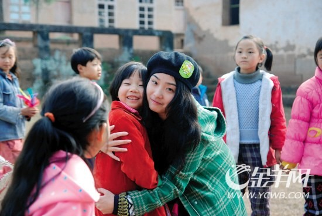
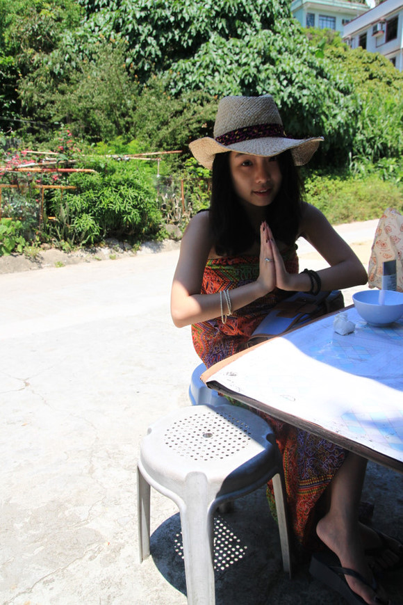

# ＜七星人物＞第二期：周菁——间隔年：转变的思想

 **“七星人物”，是瓢虫君出品的新栏目，瓢虫君的人物周刊，让你与更多优秀的人面对面。** **瓢虫君，是由北斗网打造的公共意见平台。** **本期人物是以间隔年来践行自己理想的周菁。** 

#  周菁——间隔年：转变的思想

## 文/[孙微阳](http://www.renren.com/profile.do?id=256712243&from=opensearch)（辽宁大学）

 当笔者第一次听到周菁的声音时，想到了多年以前一位非常著名的知心姐姐。 2010年，周菁以主持人志愿者的身份，跟随多背一公斤*TED组织以乡村演讲分享会的形式走访了青川、广元等地区的五所乡村小学。那时她刚刚从美国交换回来不久，还在南方周末新闻总部实习，为了这次行走，果断地请了近两个星期的假。这是她第一次走上间隔年的旅途。 当其他人都在忙着考研出国创业找工作，前赴后继的走在连自己都不知道方向的路上的时候，周菁选择了远离他们，走第五条路。 而这第五条路，就是少有人走的间隔年之路。 2009 年底，周菁在美国交换学习的过程当中，第一次接触到了间隔年这个概念。那个时候的她还是一名完完全全的理科生，学习的专业是统计精算。她当时只是模糊地觉 得，如果将来自己要像同学们一样，毕业之后做一个程序员或者数据分析的工作，然后忙忙碌碌地拿到绿卡，为了一个美国的身份而放弃掉一些东西，肯定会很不开 心。“以前我总是觉得会有一个American Dream之类的观念，可是到了那里之后才发现理想跟现实还是有一定的差距的。也有很多人为了一张绿卡就放弃了很多东西，这些事都让我想了很多。” 而当她的同学跟她说起间隔年时，她感觉到，自己的路途渐渐变得清晰。 在 美国的交换经历促使周菁开始思考。回国之后，周菁申请了学校的准记者训练营。“我在美国做间隔年的时候，想要做对比，我就要先了解中国，然后就想到了要 ‘在这里读懂中国’，正好新闻也是我的第二专业，就去参加准记者训练营。”一场很偶然的提问，让周菁取得了南方周末实习的机会。“当问题提到南周的主编时 我回答还的还不错，然后就填了南方周末，就很偶然的进去了。”刚刚进到南周的时候，评论部的老师给周菁开了一个书单，“我一看，啊，一本都没读过。就恶补 了一些东西。那个时候很疯狂的，从我们学校到报社半个小时的车程，路上都会看书。半年的时间看了两百多本书。每天都看很多想很多，就在那半年理科转文科 了。” 对于自己的转变，周菁认为，相比体制，思想更容易改变。而这也是她一直在努力的方向。 

### 母亲的去世

在周菁上初二的时候，她的母亲不幸去世。那个时候刚刚14岁的周菁，一时难以接受这个巨大的变故。“那时，我的性格变得特别叛逆。然后姨妈把我接过去和她一起生活。她给我的影响是很大的。可能现在大家看上去我会比较活跃一点，但是我十四岁之前是很自闭的。” 为了中考，周菁放弃了学习了六年的舞蹈和绘画。现在回忆起来，她也不知道当时是怎么选择的，“放弃了之后就没有再捡起来过，觉得挺可惜的”。她当时的目标只有一个：要考一个好高中，上一所好大学，至于后边的事情，“当时我也说不上来”。 周菁认为，“一个人的人生观和价值观形成的黄金时间是14到20岁，这个过程中会有很多的因素会影响你，父母朋友际遇什么的，一点点的影响叠加在一起，你才 会成为别人眼里的你”。母亲的去世，姨妈的影响，父亲的支持，对于周菁来说都是这点滴影响当中的一部分。她在高中的朋友们，以及和间隔年的偶遇，则促成了 周菁现在的坚持。 

### 一个小时赚过1400元钱

初 中毕业之后，因为曾经拿到过全国物理竞赛的一等奖，周菁进入到重庆南开中学最好的理科实验班。而南开中学的素质教育模式，让习惯了初中阶段的题海式学习的 周菁一度非常不适应，“成绩落下来特别多”。“但是家里给我的教育是，综合素质要更重要，然后他们就很鼓励我参加学生会，宣传部的部长，负责一些文艺啊宣 传的工作”。 周菁总是能够想到一些别人想不到的东西。在高中毕业的那个暑假，她突发奇想要去卖复习材料。看到班 里的同学都把复习材料扔掉，或者是去卖废品，她觉得有点儿可惜。于是她就把她在班上使用的复习资料都按照不同的科目整理好，拿到旁边的重庆大学去复印， “这样成本低一点儿”。因为她所在的班级是最好的班，“有品牌优势”，就拿着复印好的材料卖给下届的学弟学妹们。“当时也没想那么多，就是搞着玩儿一下， 可是谁知道好几千册一口气就卖完了。平均每小时有1400元的纯利润。很震惊的。” 

### 第一次的义工经历

在南开中学的求学过程，让周菁接触到了很多志同道合的朋友。“去了南开之后认识了很多人，影响也很大。我第一次义工经历是18岁，重庆孤儿院。感触非常深。” 第一次来到重庆孤儿院，周菁觉得看到了电影里面常常看到的场景。孩子们都很值得同情。但是当周菁真正地接触过孤儿院的情况之后才发现，这里每十个孩子只有一个阿姨来照顾。“我当时去给他们喂饭的时候心里就很难受”，周菁回忆道。 而 且，表面的平静之下，有着常人难以发现的故事。“我是活动的组织者，一群孩子围着我们闹啊。有一个孩子十四岁，我跟她聊天时觉得她很阳光，并没有因为她是 孤儿就很自卑，但是后来我跟院长聊的时候，他告诉我说，这个小女孩在背后经常会说，她以后可以靠男人吃饭啊什么的，然后我就很震惊。另外一个女孩，她也十 八岁，她跟我聊，她说她在工厂上班不开心啊就回来了，然后院长跟我说她在工厂上班不开心是因为她偷了工厂里的钱，然后我当时也很震惊。” 周 菁接触到的东西让她思考了很多。后来，那个十八岁的女孩要了周菁的QQ号码，每到过节时都会和周菁聊几句。“我当时我都不记得跟她说过什么了，但是她就是 说我跟她聊天对她影响很大，她觉得一直很感谢我。有一天她跟我说她都当妈了，她将来会带着孩子来看我。我当时并没有想到跟一个人聊一次天会有这么大的影 响，但是这就是发生了。如果其他的大学生也能走出去做一些实事的话，那这个影响就会非常大了。这次就离就给我现在做义工种下了苗。” 

### 理科转文科的大学

09年的交换之旅，间隔年概念的接触，以及在南方周末的实习，都让周菁开始从新思考，自己将来到底要做什么。半年时间的恶补，让周菁更加清晰地认识了她所生活的这个世界。 到 了大学的最后几段，周菁几乎完全变成了一名文科生。“大学的教育我不喜欢。点名啊什么的。到了大四下半年，我退掉了10几个学分的精算的课，去选了一些历 史方面的课。中国文化史的老师给考纲，中间有一个题，列举中国科举制度优劣，答案上优势和劣势的部分很多都是重合的，我就很无语，然后考试时我就按着自己 的想法去回答，但是最后成绩并不很理想。所以最后我就把课退掉了。所有要交论文的课分数都很高，但是只要是考试课成绩就不太理想。因为那个答案是很固定 的。我并不太喜欢去说体制，我喜欢从教育、思想方面上去考虑一些问题。” 承认体制是更根本的问题，在充分思考量力而为之后，周菁觉得，她所能做到的“就是去改变周围人的思想”。 访谈结束之后，笔者又跟周菁多聊了一会儿。提及周菁的性格，笔者认为她还是很执着的。“啊？还行吧，金牛座的。呵呵。” 

 后文更重要：[周菁：间隔年最大的意义在思想上](/?p=12708) [周菁的人人主页](http://anita-429jing.renren.com/?id=229341903) [安芯（周菁）的新浪博客](http://blog.sina.com.cn/jing0429anita)

**（采编：孙微阳；责编：孙微阳）**

