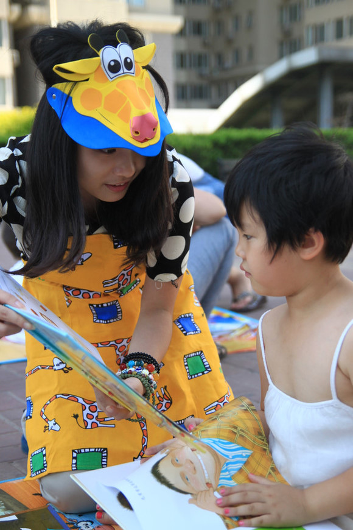
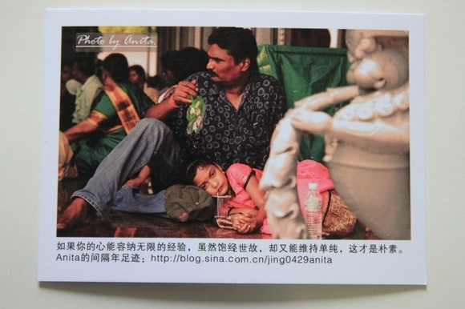

# ＜七星人物＞第二期：周菁：间隔年最大的意义在思想上

 **“七星人物”，是瓢虫君出品的新栏目，瓢虫君的人物周刊，让你与更多优秀的人面对面。** **瓢虫君，是由北斗网打造的公共意见平台。** **本期人物是以间隔年来践行自己理想的周菁。** [前言：周菁——间隔年：转变的思想](/?p=12700)

## 

 **“我不知道西藏的文化背景，我的高中和大学也没有学过。但是后来我读了很多书，又选了很多历史文化的课程，那么当我再去东南亚的某些国家的时候，人们再跟我谈 起这个问题，我就可以告诉他们，China 和 Chinese Government是不同的概念。我会重新给他解释，到底是China is a devil country还是谁谁谁是devil的。所以我觉得间隔年的意义的话，思想上的会很重要。”** 

# 周菁：间隔年最大的意义在思想上

  **瓢虫君：在你的眼里，什么是间隔年？** **周菁：**间隔年嘛，就是毕业之后的一年的时间，去旅行也好，做义工也好，或者是到一些民间的NGO组织实习的意思。 关 于间隔年，是我大三时去美国交换的时候就想到要做这个东西了。到了那边之后，有两点对我的冲击很大。第一个就是一直以来我所选择的专业并不是我很喜欢的。 其实如果我一直念统计精算，然后和大家一样，貌似可以在美国找到一个比较好的工作，然后做一个程序员啊数据分析员什么的，可是我觉得如果这样的话我肯定不 会开心的，因为我会去做我自己不喜欢的事情。然后在大三的时候就显得迷茫。第二个就是，刚到美国的时候，很多人跟我聊有关绿卡啊身份啊之类的，给我的冲击 也很大。以前我总是觉得会有一个American Dream之类的观念，可是到了那里之后才发现理想跟现实还是有一定得差距的。也有很多人为了一张绿卡就放弃了很多东西，这些事都让我想了很多。  **瓢虫君：你的间隔年套餐又指的是什么？** **周菁：**所 谓间隔年套餐，是我的一个小改进。因为就中国的现状来说，有一个应届毕业大学生的身份的限制，不像美国那样，福利机制很完善，学生们出去走可以大手大脚 的。然后我就把他改成了间隔年套餐，这个意思就是，从你高中毕业到你大学毕业，利用寒暑假的时间，与其在家里玩儿游戏，不如走出去做一些实际的东西。每个 地方都有很多的公益组织，**你可以用不同的时间拼凑在一起，拼凑起来的话其实也是间隔年。**没有一定要毕业以后去专门拿出一年的时间来做。  **瓢虫君：你的旅费问题是怎么解决的？** **周菁：**其 实像我的爸爸和姨妈，如果让她们拿出三四万来给我做旅费是完全没有问题的。但是我更多的还是要靠自己。因为我毕竟想要去告诉大家，你也可以的。所以我还是 希望自己攒旅费。因为有的人可能会说，你家里拿出三四万来做这个，但是并不是每个人都可以。比如明信片的这个，在国内我会用这种方式，就是我自己去拍片， 然后让我在广州的朋友帮我在国内发货。在国外呢，上次义卖还剩下很多明信片，然后我就打算一边走一边卖，每一张一美元的，每天卖出五张就够了。这个创意来 源于一本书，《和全世界做生意》，然后我就借用那本书上面的灵感，加上我自己的方式，就成了现在这样。  **瓢虫君：怎么想到要去做间隔年的？** **周菁：**在美国交换学习的经历给我的影响很大。另外就是，我一直认为间隔年可以给人带来思想上的变化。我并不太喜欢去说体制，虽然更根本的还是体制，但是以我个人的能力，能做到的还是思想上的改变。 我大三以前不太关注公众议题，但是后来参加的变多了，我发现很多事情只有当你真正的接触了，你才会有一个相对比较理性和客观的认识。 就比如，有的人在影响决策层面，有的人在影响教育，有的人就是进行一对一捐助。上次我做义卖的时候，有人评论说我在为政府买单，但是总得有人去做这个一对 一的捐助的。每个人都有它不同的分工。但是这个过程的每一个环节又都是在互相影响的。现在我在做间隔年，但是间隔年只是一个概念，实际上我真正希望的事更 多的学生来关注一些民间的NGO。很多不同领域的ngo都在做不同的事情，有环保的，有关注边缘群体的，**你关注了他们之后你会有一个比较理性的认识，而不会去随便当一个喷子什么的。**这是我大四以后做NGO的一个最大的感触吧。而这些都更坚定了我要去走用思想去影响别人的路。  **瓢虫君：你也提到了，目前有很多不同领域的NGO组织，在做不同的方向。你觉得有没有一种途径能够把这些NGO所做的工作串联到一起？** **周菁：**缺少一个媒体去串联。因为如果用某一个组织把他们串联起来的话，民间力量过大政府会打压的。就像公盟一样。如果是媒体的话，今天报道一下这个，明天报道一下那个，就会有很多人关注。 现阶段的话想搞通这些关节还是比较困难，因为政府会打压你的。但是还有一点就是，法不责众，**如果大学生都去参加间隔年，都去关注NGO，就像关注这次动车事故一样，政府最后还是要出来说话的。** 

 **瓢虫君：关于大学生义工群体，你是怎么看的？** **周菁：**我 们都知道做义工去帮助别人是一件好事儿，每个人他都有它追求的东西，而且做义工的人内心都有一种很强大的推动力，去推动着它做这样的一些事情，这个推动力 跟他自身的经验有关。但是有一部分人会有一种道德优越感，他们会觉得自己做了义工了，就会去想那些上班的人啊觉得他们生活很平庸。但是我不这么觉得，我认 为每个人每个群体做的一些事情都是有值得欣赏的部分的，**只要你过着你内心想要过的生活，并且努力着，那你就是值得尊重的**，并不能因为你做了好多好事才值得被尊重。  **瓢虫君：有的人的义工经历并没有很大收获。那你在做间隔年都收获了什么？** **周菁：**每一次的收获都不同，在四川的时候，认识了很多公益圈的人，有一个姑娘让我很感动，我一开始太粗心了，和她一起工作时没注意到她只有一只手，而她也是志愿者。她是全程画画记录的，这让我对她只有一只手这个事实毫无感觉。后来她在发了一条微博，给我的触动非常大，她说，**“遇到和你不一样的人时候，基本的尊重显得尤其重要。因为你无法体会，光是站在人群之中，她要战胜多少怯懦，鼓起多大勇气。”**她把我们之前一贯对于弱势群体的同情完全转化成了尊重，我当时看了这段话很有感触。后来我就找到她，让她帮我把我旅程中的故事画成画。她答应了。她对我的影响是很大的。在这个过程中你会很融入这个群体。 我自己也不是纯粹的义工，我对文化比较感兴趣，每到一个地方，就会很喜欢去艺术馆博物馆，也很喜欢和当地的人去交流，去参加他们的活动，穿着他们的服装，融入他们的生活，然后把他们的东西转化成我自己的。这就是我过程当中的收获。  **瓢虫君：还有很多人对于间隔年旅行跃跃欲试，但是走出去的人很少。你觉得这是什么原因？** **周菁：**惰性。人都是有惰性的。我也有。很多事都会一开始很有兴趣，后来都慢慢忘了。我们给自己的很多理由都不成其为理由。最大的原因还是因为惰性。  **瓢虫君：那你觉得，怎么帮助间隔年扩大它的吸引力，让大家能够克服这个惰性？** **周菁：**间 隔年的合理设置。南方已经有了间隔年发展的势头，有很多间隔年的组织去推动。那边的一些媒体都会去报到间隔年。我周围的很多大学生也都在关注。我也问过在 北京这边的朋友们，他们说，间隔年还处在一个萌芽的阶段。既然有了这个趋势，就需要一股主导的力量去推动它。而这个主导的力量就因该是已经做成功的学生。 所以我目前就在以很多种方式去做这个，比如摄影，拍摄dv，写一些东西出来。旅游卫视找过我来拍一个系列的片子，把一些好玩儿的事情拍出来，这样就成了一 种主导力量引领，各个环节去推动，这样就可以让更多人知道间隔年这个概念，让他们明白，**啊，原来还可以这样去生活**。因 为大家的思维会有一个定势，当你长期浸泡在一种教育方式的时候，你就以为，毕业以后就那么四条路，出国，工作，创业，读研。但是其实你有第五条路的。而且 很多时候第五条路能给你带来更多的东西。而当你参加了以后，你就会有很大的改变。还有，在五年或者十年之后，我们这群人都要当爸妈了，那个时候你就可以从 小就告诉你的孩子们，让他们接触到一些新鲜的思想，让他们明白，还有第五种选择。  **瓢虫君：这第五条路你想走多远？长期地走吗？** **周菁：**没有没有，要“间隔”嘛。我也提到过，我制定了一个间隔年套餐，就是把分段的时间拼凑起来的那种。那我可以在不同的时间段去做这些事，然后其他的时候还是去做我这个年龄段该做的事，比如读研，工作或者出国什么的。 

 **瓢虫君：想过要像国外一样，做一个网站来给国内感兴趣的学生提供信息服务么？** **周菁：**这个也想过，而且我也看到了这个缺陷，但是自己不会做。这其中有一个信息不对称。有很多人去问，我也想去做间隔年啊，可是要去怎么做呢？这个就需要有人来把 相关的信息给整合起来。这其中就包括很多方面，比如很强的整合能力，能抓住受众的心。我也尝试过去做一些，比如说之前马来西亚的那个，我就做了一些整合， 发到了豆瓣那边。但是其实还有千千万万的这样的信息，一个人把它们整合起来我做不到，但是现阶段我能够做的就是，把我知道的发出去，尽可能的去帮助一些 人。**间隔年论坛**。 在广州那边还有一个**骑天下游学馆**，刚刚开的，是一些比较细化的东西，比如给你设计旅游路线，帮你组队啊什么的。我觉得能在线下有这么一个实体的机构开设出来，这种方式是可行的。同时也还是需要有一股主导的力量去推动。  **瓢虫君：我注意到你现在在招聘校园代理，你想要达到一个什么预期？** **周菁：**那 个是我自己攒旅费的需要。毕竟我希望能走多远就走多远吧。里面会卖一些我自己拍的照片和故事。我是希望去卖一些故事，能够感动你的故事。能够让你看了之后 会觉得，我自己也要过我想过的生活。因为这是一个情感匮乏，信仰缺失的时代，我们都面临着精神危机。除了写文章，我还可以做一些实际的，比如我把我拍摄的 东西卖给你，也可以满足我攒旅费的需要。招聘这个校园代理呢，就是我出国了之后，要有人在国内做这个事儿。可以说是一举多得吧。  **瓢虫君：想过借助你现在的知名度来推广间隔年吗？未来的计划呢？** **周菁：**其实，在我做间隔年的时候，就已经能号召到很多人了。在我做完之后，可能还会宣传一下，然后就做我自己喜欢的事儿了吧。 其 实这个问题很不好回答的，因为一年以后在做什么都会变化的，至于怎么变化，现在挺难以预计的。比如一年前我很坚定的想出国，还写了六页的推荐信，但是那时 我知道自己可能会去做这个间隔年，推荐信就迟迟没有发出去，现在还在我电脑里面搁着。接下来的一年，还会发生好的事情来改变我吧。  **瓢虫君：对你而言，间隔年的意义是什么？** **周菁：换心。**在 我大四的时候，我曾经去到一所中学做了一个调查，关于梦想的调查。我就去问了40个人，问他们你中考完了做什么，有人说为了进一所好高中，进一所好高中为 了进一所好大学。我又问他你进了好大学之后要做什么呢？然后他就答不上来了。然后我就问他，你以前想做什么，他说他要当作家，然后我又问他，现在呢，他说 还是要中考。然后我就很震惊。因为我结合自己的经历就是这样的。 我自己给现在的定义是迷茫的一代。因为教育没有告诉我们喜欢做什么，适合做 什么，应该做什么，然后导致大家都很迷茫，不知道将来怎么办。甚至有师妹问我，她想读一个金融的双学位，我就问她金融是什么，她答不上来了。我在填志愿的 时候我觉得我也很喜欢经济，可是经济是什么没人告诉我。但是我到了美国，我会发现很多人在简历或者facebook上会写，我现在要做什么，我喜欢做什么 并且我在努力。但是这些话在中国的大学生中很少有人能说出来的。大家普遍都会很迷茫，不同的年龄有不同的迷茫。但是这些如果教育做的好的话，会告诉大家怎 么办，并且消除这种迷茫。 我接触到的一些国外的朋友，加拿大的一个叔叔告诉我他初中的孩子就已经在做临终关怀了，就是李嘉诚基金会的那个。 但是在中国，很多大学生都没有做过临终关怀。如果你去接触过了，你就会明白什么是死亡，你会近距离的接触到他，并且会促使你思考更多的有关家人，有关健康 的问题。你会去思考有关活着的价值和意义。有的人还在想，我活着是为了北京一环以内那四五万一平米的房子，但是这四五万块钱已经足够你去做间隔年了。 我 主要还是强调精神上的东西。你在和不同的人交流时，因为文化背景的不同，你会发现，啊，原来可以这样生活。之前又一次有人跟我说，China is a devil country。当时我就很伤心啊，我就想你怎么能这么说呢？但是他们谈论到西藏问题的时候，那些外国人就振振有词的说，西藏应该独立，然后他们还说从明 朝开始怎么怎么的。我当时就很无语，因为我作为一个中国人我都没有发言权。后来我就思考这些问题，我不知道西藏的文化背景，我的高中和大学也没有学过。但 是后来我读了很多书，又选了很多历史文化的课程，那么当我再去东南亚的某些国家的时候，人们再跟我谈起这个问题，**我就可以告诉他们，China和 Chinese Government是不同的概念。我会重新给他解释，到底是China is a devil country还是谁谁谁是devil的。所以我觉得间隔年的意义的话，思想上的会很重要。**  **瓢虫君：你之前也提到过教育的不作为。那是不是正是因为教育的不作为，才导致今天随便一个什么人告诉我们一些事情，我们就会去相信，去盲从呢？** **周菁：**我明白你的意思。我并不喜欢限制我自己接受什么样的资料和信息。就比如我一开始读书，我会拿起一本来都觉得这本书是好书，它说的很有道理，然后再拿起另一 本，又会觉得它说的也很有道理。这是一个由量变到质变的过程，比如说你看了一百本书，你会发现，原来也是有好有坏的，你自己会总结出一些你自己的看法，等 到看了一百五十本，你就能筛选出好的和坏的，达到一个取其精华去其糟粕的一个效果。 

 **瓢虫君：间隔年对你来说，既满足了你的个人需要，同时还让你尽到了大学生应尽的社会责任。这种统一很好。那对你而言，个人需要和社会责任哪个更重要？** **周菁：**是 这样的。对我而言，我还是会倾向于首先满足我的个人需要。就比如，一个人写作，你说他写作是为了给别人看呢，还是先满足自己内心的需要呢？我自己比较倾向 于前者。而且人的感情是共同的，当你在表达你自己某一个内心深处的感受的时候，你恰好也是在表达别人的感受，这样就引起了共鸣。所以我觉得，还是先把我自 己内心最真实的一部分表达出来。**我相信人性是共通的。**所以我希望通过挖掘我自己内心中最本真的东西，然后通过一些表达上的取舍，或者是图片，或者是文字，来表达一些共通的情感。就比如我这次做的那个礼品卡片，上面就记录了我从14岁到22岁的一个内心独白。  **瓢虫君：设想一下，如果把这些一直在世界各个角落做义工的年轻人的贡献都汇聚到一起，我们的世界会发生什么样的改变？** **周菁：**很大，大到难以估计。就像一个人从中学阶段就开始做间隔年的义工旅行，这会影响到他的人生观和价值观的形成，会完成一个从思想到体制的影响。大家都去关注一件事情的时候，这个影响确实是会大到难以估计。  **瓢虫君：对于你所属于的当代大学生的这个群体，你有什么想说的？** **周菁：**希望大家更多的去参与到NGO中来，更多地关注弱势群体。还有一个就是，希望大家能够更加关注人文教育这一块。既然我们的教育没有给我们，我们可以自己把它给补上，多去了解人文的方面。  **瓢虫君：明信片很漂亮，怎么能得到？** **周菁：**新浪博客，安芯的间隔年就能看到，或者直接和代理联系都行。新浪博客是最主要的吧。  **瓢虫君：对于北斗呢，你有什么看法和建议？** **周菁：**我偶尔也会看一下北斗的文章。因为我之前也往北斗投过稿子。我觉得北斗的存在是一个奇迹，尤其是，在现在中国大学生现有的接受的教育里面能够存在真是一个奇 迹。北斗其实做的也是思想上的影响，这一点我是很认可的。还希望北斗能更多的结合实事，然后在结合文章去进行更多的影响。所以我觉得北斗可以用这种方式来 做，这样的话，北斗的说服力和号召力会更广泛一点儿。   [凤凰网新闻链接 ](http://news.ifeng.com/gundong/detail_2011_08/02/8112464_0.shtml) [何谓间隔年](http://baike.baidu.com/view/1637881.htm) [周菁的人人主页](http://anita-429jing.renren.com/) [安芯（周菁）的新浪博客](http://blog.sina.com.cn/jing0429anita) [安芯的间隔年小店](http://shop68035732.taobao.com/) [豆瓣的间隔年小站](http://site.douban.com/106941/) [间隔年论坛](http://www.freegapper.com/) 

** （访谈人：孙微阳；责编：孙微阳）**

 
