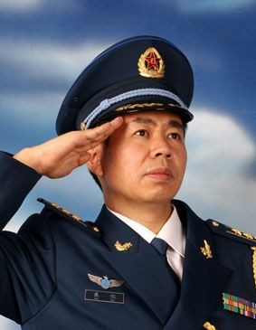

# ＜七星人物＞第五期：当代中国鹰派的代表？

 

# 当代中国鹰派的代表？****

## **——瓢虫君专访戴旭教授**

 

也许在当代中国，有两位来自河南民权县的公共知识分子正在被越来越多的公众记住，一位是北京邮电大学的法学教师、中国著名青年法学家许志永，另一位则是来自国防大学的教授戴旭。七星人物之前采访过许志永，他的中国法律梦和对权利的强调给读者留下了很深的印象（见[/?p=17599](/?p=17599)）；而这次，我们有幸采访到了另一位来自民权县、在社会上有相当影响力的戴旭教授。与许志永对中国社会的法学思考不同，戴旭教授出于军人的本能，更多的从军事、国力等方面思考当下的中国，其中，“C型包围”、“肢解中国”等理论也被很多人所熟知，我们本次的采访就是希望戴旭教授的一些见解和想法能够通过北斗这个平台，和更多人探讨。

戴旭，中国人民解放军空军上校，毕业于空军电讯工程学院（现中国人民解放军空军工程大学电讯工程学院）和空军政治学院（现中国人民解放军南京政治学院上海分院），与郎咸平、时寒冰、易宪容等人被30多万中华网的选民票选成为“2010中国互联网九大风云人物”。关于中华民族“生死存亡”著名的演讲——《2030肢解中国-美国全球战略与中国危机》让教授第一次大范围进入公众视野。发人深省的言论，极强的忧患意识，使得不少人将其认作当代中国公共知识分子的代表之一；但同时也有人认为他的观点有着极强的阴谋论的味道，是“地摊文学”的产物，有时甚至是刻意炒作、哗众取宠。

现在的戴旭不单是一名教授，还是一名军事评论员，并在《环球时报》、人民网以及乌有之乡等媒体开设了专栏。有些人可能会苛责戴旭教授的言论过于激进，但就像任何一个国家都会有鹰派和鸽派一样，一种居安思危和振聋发聩的“狼性”对当代中国的进步具有相当的价值，尤其当他还是一名军人。而且，一个优秀的国家也应允许存在不同的声音。

这次，我们有幸可以与戴旭本人近距离接触，在近三个小时的谈话过程中，他不单谈及了自己对国家和政府的看法，更对很多社会现状及其成因进行了自己的分析，也向我们描述了他心目中“理想国”的模型。也许和很多人想象的那个以“国家至上主义”、“威权主义”为代表的戴旭上校不同，其对心目中“国家”的描述更符合古典自由主义中“小政府”和“守夜人”的角色，他认为“政府（government）”不应局限在词根“govern”“统治”的含义，而应努力建立一种“服务型政府”，这也和近年来党中央提倡的施政理念相当吻合。

#### **心目中的政府与时局******

**问: 您心目中对国家的定义是什么?您认为政府的职能又是什么?**

答: 国家的产生源自于远古文明的人类自发结合成部落，以实现其安全需求。从根源上来看，国家的功能就是为人民提供安全。

我认为政府的功能就是为人民服务。国家是由人民产生的，不能像封建社会那样，谁打下江山谁就做皇帝。国家的功能应该像温总理说的那样：“所做的一切都是要让人民生活得更加幸福、更有尊严，让社会更加公正、更加和谐。”

**问：您著作以及视频当中的观点都引起了观众、读者强烈的反响，这是您预料之中的吗？**

答：09年前后我出版的一些书籍、文章以及录制的一些视频在社会上引发了激烈的讨论，同时引起了很多人的共鸣。但同时也有很多军事战略专家、学者等不同意我的观点。那到底是谁对谁错呢？我们来看一下现在的局势，从东海到南海，从南亚到中东，C型包围圈形成了吗？一个由美国编制的包围圈已经非常明显了。那为什么那些专家、学者会判断失误呢？因为他们没有用整体的思维去看问题。但为什么普通大众能产生共鸣？很简单的道理，当狼来了的时候什么人反应最快？牧羊人。在海洋上呢？渔民。渔民对海洋空气的反应是非常灵敏的。因为普罗大众是站在最前面的，所以感受非常强烈。那些躲在后方或者高高在上的学者、将军、皇帝等等，当然会后知后觉。

#### **常识与信仰******

**问：就是如时寒冰先生所言的要“回归常识”吗？**

答：没错。大道至简。只有用一个整体思维同时回归常识，才能做出正确的判断。但是整个社会现在非常浮躁，路线也越来越偏。因为改革开放，破碎的社会主义信仰在市场经济的冲击下被严重扭曲，人的判断也越来越局限于物质利益。

**问：您觉得国民需要怎么样的一个信仰？如何重塑？**

答：新文化运动将儒教价值体系几乎彻底粉碎，而后来引进的西方马克思主义也在改革开放后遭遇严重的冲击。我们目前国人的信仰，在封建主义、资本主义、社会主义等综合作用下以一种扭曲的形式出现，呈现出封建残余思想以及西方个人主义思想错综结合的怪胎。现在我们要重塑起一种信仰来是非常难的，因为我们现在在“摸着石头过河”，不知道前方会有什么情况。

当然，现在的社会民众，尤其是80后、90后的年轻人对民主、法制、自由、平等呼声日高，这是令人欣喜的，对这些东西的渴望说明你们是有理想、有追求的一代人。其实，民主、法制、自由、平等是西方的东西吗？是的。但也是社会主义的东西。因为这是全人类所追求的。人类对幸福的追求不应该被地域、种族、阶级、国家以及意识形态割裂开。

**问：您觉得造成当下令人堪忧的局面的原因是什么？**

答：我问你们几个简单的问题。你看看我家，有哪些东西是中国发明的？从衣着等软物，到家电汽车等轻工业产品，屈指可数！近代以来，中国几乎没有什么科技贡献。为什么？因为我们的进步大部分是停留在器物层面的，我们学习西方国家也仅仅是形而下的。为什么有“钱学森之问”？因为我们没有一个很好的环境去培育人才。自然科学方面，我国教育出来的人才是什么？是技术工人，是工匠。而西方国家呢？他们就能培养出科学家、大师。我们应该好好反思这个问题。日本的做法值得学习。当年的日本也是积贫积弱，但是自明治维新之后，在经济、文化、军事和政治同时做出了一系列的改革，让日本迅速走向了发达国家的行列。而我们当年的中国采取什么政策？”中学为体、西学为用。 结果怎么样？八国联军、甲午战争接连失利就是一个个惨痛的教训。打个比方，我们现在用的是马车，要更新换代。人家日本人就把马车扔到库存里，换一辆机车；而我们把车轱辘换成轮胎，这有用么？因此，我们要学习，就得从整体上着手，不能只有经济改革。

#### **不同的视角看忧患******

**问：我发现牛刀、时寒冰、曹建海、易宪容等学者都从不同的角度去阐述内忧外患的形势，您觉得多少中国人以及中国人在多大程度上接受了你们的观点？**

答：你提到的人当中很多都是我的朋友。我们都只是在各自的领域去解读问题，当然我也会从多个学科的角度去看问题、分析问题，他们也一样。因为一个问题的产生必然是多种因素共同导致的。我们的观点是否正确，现实可以证明。而我们做的，只不过是在尽自己的一份力量。我们的力量虽然单薄，但肯定会有人能借助这些光芒看清这个世界。在这个社会，思想者往往都是孤独的。我们想要做的，就是让更多的人能够拨开迷雾，看清现实。

**问：你们这一代人无法改变现状的原因是什么呢？**

答：我是60后，刚好生长在文革期间，虽然我也上过大学，但我们的理想早已被粉碎殆尽了；70后那批人，现实的社会也让他们学会妥协、服从甚至放弃，尽管这个过程是痛苦的。所以，中国的希望在你们这一代人身上，我们属于现在，你们属于未来。上一代人错过了，我们也错过了，你们不要再错过了! 我们虽然没有机会了，但在你们成长的道路中，我们就在你们的身前指引着你们，保护着你们。

#### **心中的理想国******

**问：您希望我们这一代人在哪方面做出努力？或者说，您心目中的理想国是怎么样的？**

答：简单来说，汉唐雄风。

**问：经济发达、科技先进的宋代不是您的理想国吗？**

答：宋代是成吉思汗铁蹄下唯一被完全灭国的朝代，所以日本人才说，“崖山之后，已无中国”，所以他们才以真正的中国人自居。一个毫无安全感的国度，所有的繁荣都是不可能让人民感到真正的幸福。

**问：最后您有什么想对我们说的呢？**

答：年轻人应该坚持自己的理想，前方的道路虽然坎坷，有刀枪、坦克、大炮，但不要改变自己的理想，坚持下去，这片土地会因为你们而更加枝繁叶茂！

#### **小编手记：**

作为国际政治的爱好者，笔者平时常常关注各家观点。近年来，民众心里对强国梦的追求与现实中国在外交上的绥靖政策之间的强烈反差，使得很多人急切渴望鹰派人物的出现。而这时戴旭教授以犀利的观点与强硬的言论在国际关系领域声名鹊起，引起了广泛的关注。去年年底，笔者发邮件向戴旭将军约稿，但他以自己没有新观点无法创作为由婉拒，不过希望与我面谈。于是经过几轮邮件往来，最终确定面谈时间。由于笔者对北京地方不熟，加之当时未加入北斗，所以同邀管思聪同学前往。

将军家中家具简略大方，气氛稍显冷清。待将军归家，三人由此展开深入交谈。从生活、社会、文化、军事到政治，谈话持续了三小时。虽然将军待客热忱，但难掩憔悴，言语之际似乎略感悲观。面谈结束后我二人回忆重点内容，由我撰写初稿，管思聪同学加以修改。最终成稿。

 

（编辑：李江，管思聪 责编：张正，朱腾越）

 
