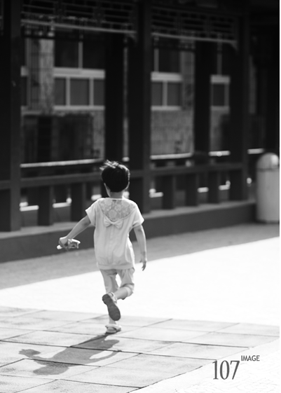
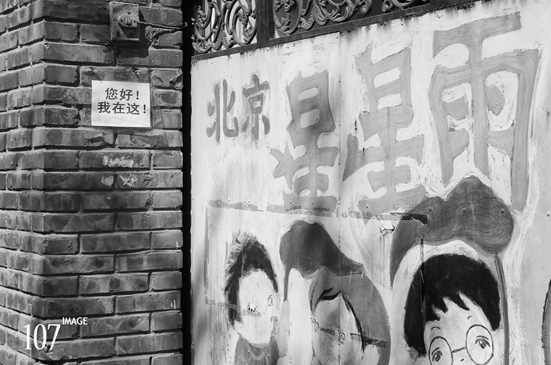
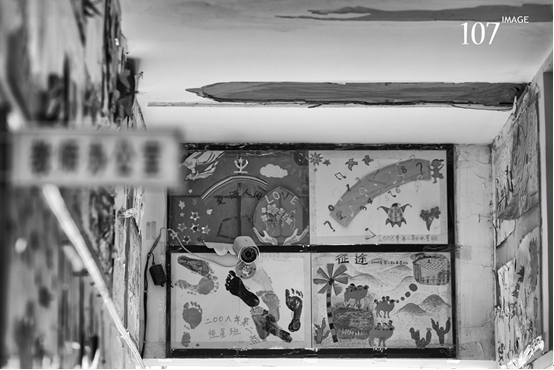
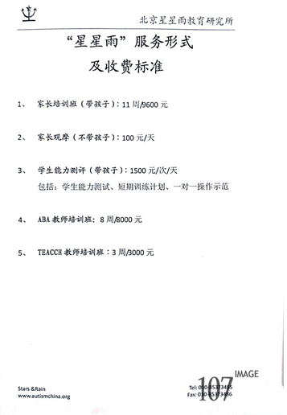
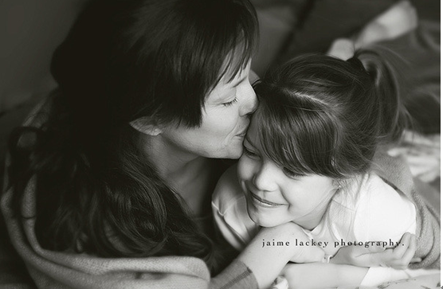

# ＜七星人物＞第八期：孤独，阵——瓢虫君特约“豆花纽“&《107调查》

**孤独症又名自闭症，是一种广泛性发育障碍，先天，无法治愈，2006年方被列入我国精神残疾类别。孤独症儿童欠缺基本社交能力，无法用语言表达自己，他们往往有一个独一无二的内心世界。** **美国电影《自闭历程》里有一句经典台词：“我们（自闭症患者）不比别人差，我们只是和多数人不同。”曾做孤独症志愿者的天浩告诉记者，长期的相处让他越来越多地发现孤独症孩子的可爱特质，“他们是这个世界上最单纯、最善良的人，就像天使一样。可是外界任何的非常规的动作，都可能让他们受伤。”**  

# 孤独，阵

# ——瓢虫君特约“豆花纽”&《107调查》

## 

 

天空渐明，缀着露珠的矮草丛里爬出许多蜗牛，泊在花坛边的水泥地上，粒粒颗颗，呆滞、滚圆，仿佛是从雨水打落的地方生长出来的。

立于屋外的母亲抬头望了半晌，回身搬出一澡盆衣物，手头忙活起来。她晾衣服的动作快得晃眼，目光一直驻留在不远处的身影上。男孩儿丝毫没有察觉。他一直在捡散落的蜗牛。蹲下，“啵”地拔起一个，站挺了，转向花坛，“啪”，将手上的那颗贴到黄杨树的叶片上。再蹲下，再站起……

窄路上出现一辆板车，吱吱嘎嘎，近了，骑车人高喊“小孩儿让一让嘞—喂！”男孩还在歪头凝望一只蜗牛，他的手臂已悬空了很久，不断地调整着下手的方位。“谁家孩子！听不见吗!”，母亲闻声慌忙撂下衣服跑过去。

骑车人把车靠边，朝母子俩大步走来，扯着嗓门“教育”。母亲后张臂护住孩子，一边赔不是，解释着。

“师傅您别这么大声！是我没管好，对不住您了。对不住！孩子他什么都不懂，别吓着他。真对不住了，求您！”

“都给宠坏的吧？你们这些做父母的……”骑车人叹息摇头，转身要走。

而这时男孩从母亲臂膀中挣脱开来，又继续搬蜗牛去了。母亲看看孩子，欲言又止。

#### 最简单的奢望

“我只希望能活得比孩子久。”小艾是一个孤独症孩子的母亲，习惯了在论坛里分享自己的经历，记录生活里的点滴感悟。

“对于孤独症孩子的母亲来说，白发人送黑发人不是悲剧，是梦想。但即使是这最简单的梦想，看来也是奢望。”一段段文字记录下母亲珍爱的回忆。然而最后这一行字，却是这么的清冷而锋利。

孤独症，为何会给“被选中”的家庭带来如此深重的苦恼？

孤独症又名自闭症，是一种广泛性发育障碍，先天，无法治愈，2006年方被列入我国精神残疾类别。孤独症儿童欠缺基本社交能力，无法用语言表达自己，他们往往有一个独一无二的内心世界。

美国电影《自闭历程》里有一句经典台词：“我们（自闭症患者）不比别人差，我们只是和多数人不同。”曾做孤独症志愿者的天浩告诉记者，长期的相处让他越来越多地发现孤独症孩子的可爱特质，“他们是这个世界上最单纯、最善良的人，就像天使一样。可是外界任何的非常规的动作，都可能让他们受伤。”

天浩（化名）来自中国人民大学马克思主义学院（以下简称人大马院），今年大一，在孤独症的专业治疗机构做志愿者已有一学期。

小航是他第一次带的小朋友，“这个孩子特别可爱。地上不是摆了很多小板凳吗，他把它们扣过来，在地上面摆成一排，特别好玩。”天浩口中的小航特别喜欢爬高。教室窗前有一书架，小航总是在每次往上面爬的时候被天浩抱下来。

“他很有意思，生气的时候会用下巴捅你的手，像这样。”聊到此处他情不自禁地模仿了一下那个孩子的动作，“有时候我为了看他是不是生气了，就把手放在他下巴下面。”

天浩做志愿服务的对象全称“星星雨教育研究所”，国内第一家服务于自闭症儿童的公益性专业机构。创始人田惠萍有个27岁的儿子，一个勉强能实现生活自理的孤独症患者。然而为这看似不值一提的成绩，田惠萍交付了她所有的青春。如今的她有一种淡定的气质，“看她的笑容能让人肃然起敬，很温婉，但是有一股力量，能感觉出她强大的内心。”

田惠萍曾在一次采访中说道：“照顾弢弢（儿子）就是我的价值和意义。也幸好他是我的孩子，因为我知道怎么爱他，保护他，尊重他。”

“弢”，同“韬”，弓或剑的套子，用于藏隐锋芒。这个生僻的汉字耐人寻味。

“孤独症孩子的内心世界是需要慢慢去走近体会的。如果有可能，我希望一直陪他们走下去。”

#### 身陷孤独“阵”

1985年，公派到德国西柏林行政管理学院学习人事管理专业的田惠萍，还只是一个新生儿的母亲，在众人艳羡的神情中起程，而后，满怀憧憬地坐上返家的航班。

中德之间八万多公里的飞行距离，每一厘都填满了思念。

“爸，妈，我回来了。弢弢呢？他乖吗？”

“乖是挺乖的，但是……这孩子不说话。”

她的视线越过父母的身形，看到了角落里那个小小的身影。儿子很漂亮，但冷淡、孤僻，他的“世界”是封闭的。

（图片为小女孩在星星雨学校内嬉戏，《107调查》提供）

而后儿子弢弢被确诊为孤独症。那是1989年，距离中国诊断出首例孤独症患者，仅仅7年。距离国际上给出孤独症的科学定义，也不过46年。孤独症一词，在医学界、教育界、儿童福利领域和普通大众的头脑里，还是一片空白。

田惠萍四处奔波后发现，整个中国没有一处权威的医院熟悉孤独症的疗法，没有一所能宽容接纳孤独症孩子的普教学校，没有一个有孤独症儿童专业陪护经验的福利机构。求助无门的田惠萍，有如一座孤岛，在苍茫大海中坚守着岛上唯一的树苗。四面烟波浩淼，小树苗却沉浸在自己的梦里，不知道夜幕降临，月起潮升。当时和田惠萍有相似境遇者，全中国，约有上百万。

“一直到上个世纪末，也就是1999年，我感觉好像全中国就只有我一个人在到处跑，告诉别人什么是孤独症。”田惠萍如是说。

那时候的这几百万家庭，大多连“孤独症”一词都未曾耳闻。

二十一世纪，“孤独症”逐渐走入社会公共话题。而推动力之一却是一场场无法挽回的悲剧。

2004年7月16日，川流不息的南京长江大桥。车辆疾驰而过，火车嘶鸣，涛声滚滚，淹没了乙肝父亲与孤独症幼子投入江水的声音。 “我可不愿意让此类事情发生在自己身上，所以昨天晚上我下定了一个决心：如果我老了，保护不了我心爱的女儿了，我就带她一起离开这个世界！”

“……昨晚妈妈梦见你躺在床上,妈妈用手去摸你,你身上肿肿的,湿湿的,突然妈妈的双手刺痛,然后边上有人说孩子你离开人世太久了,身子开始发腐,说是不能再去摸你了……”一位母亲写给墓碑下永远7岁的女儿。女儿玲玲患有孤独症，美丽漂亮。2006年，失踪7天的玲玲被发现裸死在一座废弃房屋内，濒临绝望的父母最终在这一周后等来了公安局不予立案的通知书。

2010年5月，辽宁沈阳一家医院的医生护士们正围着一个好动又不说话的小男孩不知所措。民警赶到现场，在孩子的上衣兜里发现了这样一封信：“我是孩子的奶奶，孩子的妈妈离家出走了，爸爸在外地打工，孩子患有孤独症，还有尿频尿急的毛病，希望好心人能收留这个孩子……”

然而，在我们视野之外的，还有上百万在与孤独症抗争的家庭。

破阵有望？

夜晚的北京火车站依旧喧嚣如昼。攒动的人影间，一位母亲艰难地拖着沉重的行李，牵着幼小的儿子，蹒跚在柏油大路上。跂望，可以看见一团璀璨的灯火，黑夜仿佛因此分野。这是1993年，田惠萍带着孩子独自北上。她一手创立的“星星雨”即将打破“孤独阵”的僵局。

“慧灵”是2000年入京成立第一家智障人士社区化服务机构，明确收纳学龄后自闭症患者。以琳自闭儿训练部2000年经民政部注册成立，创办人方静是最早一批尝试自己训练孩子的母亲。2006年浙江圣爱自闭儿童康复中心由基督教会发起创立，政府部门主管，发展最为迅速。至2005年，“星星雨”牵头建立“心盟”孤独症网络，目前约有54个成员，遍及全国，其中有的便创始自孤独症患儿的父母。对于一些尚未在民政部门注册的民办非企业机构，“心盟”的互助平台尤其重要。

与此同时，各类报道、关注、志愿服务、慈善捐助，开始源源不断地涌向孤独症群体。或者更确切地说，涌向相关服务机构。然而，当“星星”变成“星星雨”，我们是否已找到破解“孤独阵”的法门？

７月１６日，我们前往“星星雨”。离下午的活动开始还有半小时，大门紧闭，我们被告知须从小门与工作人员联系。因为事先未取得采访许可，我们只能在办公室等待临时安排。“不是不欢迎采访，问题是我们都不知道你们到底要做什么报道，员工又都在忙，没人有时间带你们参观，给你们做介绍。”“星星雨”负责志愿者联络的工作人员小喆（化名）一边忙着手头的工作，一边与我们沟通。

（图片为北京星星雨教育研究所正门，《107调查》提供。）

小喆答应去找能腾出时间的接待教师，中途却被突发情况打断。一位二十不到的姑娘进门，说是志愿参加下午与孤独症孩子的交流活动。因为不在确认名单上，小喆打电话给姑娘的联系人。

“你们程序不对。应该和我联系好了再安排他们（志愿者）一块儿来，而不是跟他们说好了就让他们（临时）来找我。”语速很快，但话音仍是很客气的。

“那你先去教室参加活动吧，下次一定要先联系好！”小喆挂掉电话即对姑娘说，一边已走到门口示意姑娘跟着。是日艳阳，小喆的文化衫上已湿了一片。当她急步回来时，告知找不到接待人员。我们便与她聊起志愿者的事。

“放暑假，学生都回家了，志愿者不够怎么办呢？”

“不只是暑假，平常也会出现志愿者短缺的情况。那样就得老师们辛苦点了，兼顾家长的教学、孩子的看管。”小喆平淡回应，但又急忙补充道：“但是绝对会先保证孩子们的安全。”

在之前的采访中已了解到，天浩所在志愿团队也在“星星雨”志愿项目上有过抱怨。有人提出该项目花费时间太长，每次活动路上往返就要折耗四小时。

高校志愿团队往往是下属于学校的公益社团，其活动项目确定、资金申请，都会受到学校管理部门的限制和监管。某北京高校校级青年志愿者协会的主要负责人告诉我们，协会的大型志愿服务活动和学校指定项目，团委有否决权。日常活动资金65%也来自团委。

相对而言，一些民间志愿服务团体则能较为自由地运行，民主商定志愿项目。南方某市的民间志愿者团队表示不愿参与“热门”对象的活动，另外，如果活动时间投入过大，会转而寻找相同时间内能提供更多服务的受助对象。“我们平时自主开展活动，路程、时间的投入与服务收效，都会考虑，费用都是组织层分摊的，人均一年也就几块钱。”问及类似“星星雨”机构所服务的孤独症群体，团队表示也曾考虑过。但一来路程远，二来团队内成员流动大，而孤独症儿童需要长期专业的一对一治疗，于是罢了。“每次去的志愿者若不一样，事实上不利于他们的训练和提高。”

从上世纪九十年代开始，国际上，特别是香港地区很多专业康复机构来访大陆时就提出过“以人为本”和“社区化（正常化）”的价值观念，而如今现实情况是：“你会看到很多挂着社区康复的招牌和关于社区康复的文件……但至今在常态的社区活动中还是很少看到残障人士的身影。它们被提起，大多数情况下是政府和残联的领导人在特定节日里的慰问活动。”

我们还想了解“星星雨”的财务状况，但小喆只负责志愿者的联络，表示确实不知情，“那是财务部的事了。”正欲前往，又被拦住，“你们到底要采访什么！跟你们说了，没有预约没法给你们安排！”我们表示理解，为打扰到正常工作秩序一再致歉，但进一步询问其中原因，工作人员也不能给出明确的答复。

事后浏览同类机构“慧灵”的网站声明，同样发现“采访必须提前预约”和“讲明采访目的”的规定。“任何采访应在不影响正常工作的前提下进行。”该声明措辞严厉，内容甚详，另择摘如下：

“第七条：摄影图片有用到学员特写镜头时，须和我机构联络，并征得其家长同意……”

“第八条：采访内容不得对北京慧灵的形象和服务方向有误导或篡改……北京慧灵有审核权。”

对于白手起家、自力更生的民办非营利组织，在规章的制定上往往需要亲自“摸着石头过河”。

“慧灵”自广州创立以来，已走过22年的NGO（不以营利为目的的非政府组织）历程。在行业规范、运行理念上，都较为领先。其创始人孟维娜可谓该领域的领跑者，她呼吁，在政府体制改革短期很难实现的情况下，应加强NGO自身的制度建设。在残障人群服务事业中，她认为NGO自身的弱点也会阻碍其发展：一是NGO之间合作的艰难，二是财务的管理与公开仍不够规范。

然而，即便是经验较为丰富、成立时间较长的 “慧灵”，目前每年欠款数额高达几十万。

#### 意外访客

采访似乎无从进展。此时，小喆又遇到一位计划之外的造访者。

倒也不是完全不请自来。

“之前约好的，但下午她（联系人）不在这儿。”来访者是个三十多岁的男子，穿着讲究。另一位同行者相貌上要年轻一些，着简单体恤，紧裹着肚皮，还随带相机，站在一侧不发一语，将相机上的带子在手上缠来绕去，体貌颇类专职司机。

男子把手机递给小喆看了一眼，大概是约定的证据。随即切入正题。

“我来是为办画展的事。明明（化名）你也知道，我是他姑父。”男子说话简洁，语调却习惯性拖得很长。明明是曾在“星星雨”接受培训的男孩，属于高功能的自闭症患者（即有某方面的突出才能），很有绘画天赋。

“嗯，那么您需要我们这儿做什么呢？”

“简单了解一下‘星星雨’。一会儿我们在这边呢拍些照片，回去可以做到宣传资料上。”

“基本介绍……”男子很快又补充说：“当然还有你们机构的资金管理啊、以前的一些财务资料啊，方便的话呢也让我们了解一下，到时候心里有个数。”

“那好吧，到时候整理一份给你们。照片么，主要可以是这边的场景，人不能拍！等会儿你们要想转转就转转，其他的随便拍。”

男子进一步说明，他们要在明明家乡办画展，以慈善酒会的形式邀请一些有名望的人参加，做公益拍卖。同时希望“星星雨”提供更多的优秀画作，甚至推荐有才艺的孩子去现场表演。

（图片为星星雨一角，孩子们绘画作品展示墙面的监控摄像头。《107调查》提供。）

“这次其实相当于是我们宣传部和残联，一起办了场公益活动。合作方提供了一个花园式的、很漂亮的会所。画作呢，最好要大一点。单口相声嘛．．．．．．最好是欢快一点的节目，比如让小孩唱个歌跳个舞什么的，你们再看看吧。”临走时，男子试问能否与田惠萍见面，但只得到“她一直都挺忙”的答复。

#### 歧途还是过渡？

合作举办公益活动，是“星星雨”资金来源的一小部分。今年4月2日至15日，“星星雨”主办的自闭症儿童美术作品展，就得到了某大型上市珠宝企业的赞助。

包括了合办活动的“项目”类资金占了“星星雨”历年总收入的将近四分之三，而其中来自各项基金的资金支持则成为“项目”类收入的主体，并有逐年递增的趋势。快人快语的孟维娜曾公开向基金会呼吁避免有意无意地加剧NGO内的“残酷竞争”和“贫富悬殊”。“希望实事求是并很自然说出需求的机构得到公平机会，而不是‘会哭的孩子有奶吃’。”

在众多同类机构中，“星星雨”算是比较幸运的。近年来，“星星雨”得到了“壹基金”的大力支持，是其“海洋天堂计划”的重要合作机构。 “壹基金”2010年底方在深圳民政部成功注册，拥有独立从事公墓活动的法律资格，这样的民办基金全国鲜有。此外，德国米索尔基金会长期以来为“星星雨”提供支持。“现在大陆活的比较好的民间机构都是得到国际援助的组织。但就更草根的民间服务组织来说，这样的机会又有多少？”孟维娜曾做如是感叹。

其他“项目”类来源中，属于国家民政部的残疾人联合会，对“星星雨”的资金援助仅始于2011年，全年总额为5000元。

（图片为北京星星雨教育研究所服务形式及收费简表，《107调查》提供）

剩余约四分之一的收入，来自“星星雨”的日常教学收费。自2012年起，机构调整学费为9600元（2个半月/期，其中含600元报名费），咨询费50元不变。机构执行主任孙忠凯曾对央视媒体透露：“为了保证教学质量，我们每期接受的学员数量有限，超出的就要排队了。而且这种一对一的特殊教学模式成本较高。”其口耳相传的“公益性质”，不免引来人们对其高额学费的质疑。可鲜有人知的是，以“企业”之名落户工商局（1992年时国家并没有设立民政部门，现则因程序繁复难以“入户”民政局）的“星星雨”，并不适用国家慈善税收的优惠条款，其所有收入需正常纳税。提供捐助的商业公司、个人也因此无法享有所得税方面的优惠。

在“以琳”接受过培训的一位家长不满于其高昂的学费和微乎其微的成效，发表了文章“揭露国内著名孤独症康复训练机构以琳的创办人方静的嘴脸”，激起了反对方与力挺方的口水战。有家长回应“‘以琳’做了那么多，竟然被一些家长这样指责，真是心寒！”民办残障救助机构的发展方式因此也引来热议。如何看待民办公益机构运营过程中商业利益的卷入？高额学费应由谁来承担？社会各成分应该担当怎么样的责任？民间公益与政府部门应该是一种怎样的关系？一系列问题悬而未决。

当投身公益者对媒体如此敏感，当民间公益机构如此谨言慎行，人们不禁要问，是什么束缚了民间公益的手脚，是什么让他们学会设防？

#### 未能解答的疑惑

我们结束了内部采访走进“星星雨”所在的东旭新村。村里商铺齐全，食品店、复印店、理发店、棋牌室、餐馆，服务设施一应俱全。村口的公交站牌边设有许多街摊，临近的商店近于小超市的规模，百步之内有较大型的娱乐场所。常住在这里的一位初中生说，可以常看到“星星雨”的孩子在那儿玩。

“你小时候会介意和他们一起玩吗？”

“不介意。我们都知道情况。不过其实也玩不到一起，他们要么顾自己玩，要么就很容易激动，很抓狂的样子。慢慢地就各玩各的了，不去打扰对方。”

东旭新村的居民们似乎对外界的采访习以为常，面对架着相机拿着笔记本、录音笔的我们，交流时就像拉家常。有大伯甚至好心提示，晚饭后，“星星雨”的家长会带着孩子在公路边的绿化带散步。

九七年迎来“星星雨”后，东旭村委为其提供了教学活动场地，而“星星雨”带给东旭住户的，除了周边显见的服务业（包括设施、工作、收入），更有源源不断的房客。村民自行定价，房租平均水平已由零九年的800元/月涨到了1000元。“星星雨”工作人员对此表示无能为力，“那是房东定价，房价上涨也是正常趋势。不过对实在困难的家庭，我们设有补助。”

我们不能肯定这种和谐氛围是否已普遍存在于残障机构和社区之间，但知道“星星雨”和东旭新村如今的这种稳定关系，渐近地走了十五年。

（图片选自Jaime Lackey摄影作品《依偎的母爱》系列）

一行十人在一家店铺门口坐等家长孩子放学。这里视野开阔，是社区内道路交汇点之一。东旭新村的形象介于“小城市社区”与“新农村”之间，有欧式的豪华别墅，可路对面的垃圾桶更像是一堆废铁，偶尔能听到极具乡土气息的狗吠。

等待间看到一位中年女人从右手边走来，黑亮短发显得很干练，居家的绸料衣裤，手牵一条金色长毛大犬。她从我们面前走过，又停下了，转身相对，打量我们一群人。三个大相机，运动装束，人手一个笔记本，我们的身份再明显不过了。就这样对视了一会儿，女人牵着狗，气定神闲地掉转头，走远了。一颗豆花突然醒悟：“这不是田惠萍吗？我看过她的照片！”我们多数人没看过，不能确定，犹疑间，女人和狗已不见了踪影。

我们在烈日下等到“星星雨”活动的结束，并伺机采访一些家长。小喆突然从门内跑出来，眼睛微微发红：“你们不能这样! 不能擅自采访家长！”她的呼吸和语速都显得很急促。

“为什么不能？现在是非工作时间。”

“家长会以为是我们安排的你知道吗！”

没有更多的解释，众人不欢而散。

在此之前我们和一位母亲有这样的对话。

“您觉得一学期下来孩子进步大吗？”

“看来你们是不了解！这边的培训是教家长怎么带孩子，回去自己带。自闭症这个毛病又不是三天两天就能好的！小孩就像……”母亲眼睛向上一翻，终于想到了什么，“就像蜗牛一样，每天爬一点点！”这是自闭症教育者最常借用的比喻。母亲的回答格外大声、肯定，语气却像受到了冒犯。

“您有没有想过如果有一天你带不动孩子了，怎么办？”

母亲愣了。

采访意外被孩子的吵闹中止，母亲没有再做招呼，孤自牵着孩子走了。她似乎决计不再回头，是的，她再也没有。留给我们的，除了一个中年女子在夕日下的仓皇背影，还有一个她不愿面对的疑问。

 

原作者：豆花纽；指导老师：叶凝

 

 

### 豆花纽：新声带植入计划

致力于建立学生媒体与公益群体、个人的合作，达到关注弱势群体的目的，参与式报道社会敏感话题、边缘性话题。最终通过有影响力的新媒体、校园媒体呈现。

多关于豆花纽纽的情况，可关注豆花纽纽人人网主页、小站与微博（新浪、搜狐、腾讯）。更可与组织者直接联系沟通，十分乐意为您带来更为全面详尽的信息。

联系电话：18911167925 邮箱：[2267179004@qq.com](mailto:2267179004@qq.com)

（注：豆花纽是独立于北斗网之外的大学生媒体信息纽带。）

 

### 【延伸阅读】

本文于2012年8月5日首次刊发于北京外国语大学校园媒体《107调查》，原文请点击：[http://www.107investigation.com/www/1/2012-08/303.html](http://www.107investigation.com/www/1/2012-08/303.html)

豆花刊载网址：[http://page.renren.com/601417800/note/864388594](http://page.renren.com/601417800/note/864388594)；[http://zhan.renren.com/profile/380991451?from=post&ggid=3602888498028787561](http://zhan.renren.com/profile/380991451?from=post&ggid=3602888498028787561)

相关摄影作品链接：[http://zhan.renren.com/picworm?gid=3674946092066764923&from=reblogSynFeed&ref=share](http://zhan.renren.com/picworm?gid=3674946092066764923&from=reblogSynFeed&ref=share)

 

（编辑：张苏樊 王凌羽 责编：张正）

 
