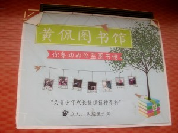
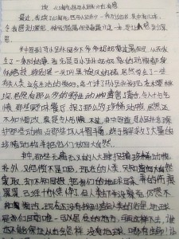
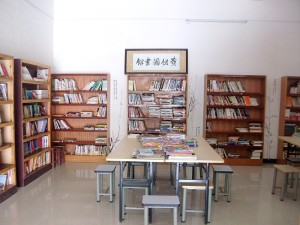
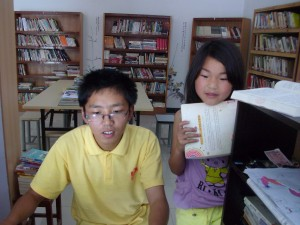

# ＜七星人物＞第十一期：立人乡村图书馆：在乡村浇灌灵魂——瓢虫君的“立人乡村图书馆”之行

**立人的全部行动，是要在乡村地区找到那些不屈的向上的灵魂，慰藉他们的孤独，温暖他们的心灵，为他们的成长和自我完善打开一扇门，并为其精神发育提供必备的精神食粮。教育很烂，但是他没有阻碍你的自我成长。这是一个扭曲的社会，做公益事业阻力重重，不可控制的因素太多，但在可以争取的空间里立人乡村图书馆在走自己的道路，做可以做的事情，和压力和乡村和教育一起成长。**

# 立人乡村图书馆：在乡村浇灌灵魂

# ——瓢虫君的“立人乡村图书馆”之行

## 

八月过去大半，暑假已接近尾声，青石中学还未开学，学生还没返校，被父母接去城市过暑假的留守儿童也大多还没返乡，学校对面的黄侃图书馆（立人乡村图书馆第一分馆），门掩着大半，墙上贴着“内部整理，暂停开放”的通知。青石镇显得格外安静，这和去年第一届立人暑期大学在青石中学举办时热热闹闹的场景形成了强烈的对比。

走进黄侃图书馆，摆满了书籍的书架占据着三面墙壁，也因闭馆显得冷清。立人乡村图书馆总干事李英强正在馆内看书，小女儿宗道安静地坐在一旁，馆长陈远良坐在电脑前整理图书馆的资料。

#### 在乡村浇灌灵魂

家住青石中学的丁磊（化名），父亲是学校的老师，在父亲的引导下，从小在图书馆看书，办了黄侃图书馆的第一张借书证，看书的习惯已然养成，现在每个星期都会抽时间看书。

去年参加高考，目前就读于中央财经大学的蔡伟也是随图书馆一起成长的第一批读者，在这，他跟义工们“混”得很熟，一有空就过来帮忙，空闲时就看书，是图书馆的常客。

黄土坳村的陈文佳（化名）马上上初二，爸爸妈妈在外地打工，爷爷奶奶关系不好经常吵架。她很不喜欢自己的家，今年报名参加了图书馆的暑期夏令营活动，和各大高校来的志愿者度过了一个很愉快的暑假，至今还念念不忘；她常常骑着自行车来图书馆，或是看书，或是馆长聊天。

图书馆保存的一个文件夹里不少读者留下的读书笔记，留下了许多幼小心灵在书里边飞翔的痕迹，稚嫩的文笔下依旧写出不少朴素的道理。

一个五年级的小朋友看完《淘气包马小跳》后写道 ：“书中那些无情无义的人大肆捕捉珍惜动物，书外，又何尝不是呢？现在的人类只知道向大自然索取，却不知回报，把我们的地球弄得伤痕累累，十分憔悴。地球是唯一可以居住的地方，可再这样下去，谁也不能保证以后会怎样，没有地球，哪有生命！让我们醒醒一起保护地球吧！”

“从《笑猫日记》中，我懂得了一个人一定要有童心，做好自己，不管别人怎么说。人生中我们做每一件事都贵在坚强，贵在执着追求，永不放弃。”一个六年级的孩子看完杨红樱的书写道。

“《感动中学生的100个故事》里边的每一个故事都使我受益匪浅，特别是那些写父母的故事，才让我明白每个父母都爱自己的孩子，我想很多孩子读完这本书后一定会更理解她们的父母。”出自一个初二的学生。

此行中，一个我一直想问的问题就是：立人乡村图书馆为何存在？立人做什么样的工作？“立人的全部行动，是要在乡村地区找到一些不屈的向上的灵魂，慰藉他们的孤独，温暖他们的心灵，为他们的成长和自我完善打开一扇门，并为其精神发育提供必备的精神食粮。教育很烂，但是他没有阻碍你的自我成长。”在面对这个问题时，李英强给出了这样的回答。

自2007年9月发起到现在，立人乡村图书馆已经在全国建立了12个分馆，正常运营9个分馆。山西晋城志翔图书馆是运营最好的一个分馆，有时能达到每个星期700册以上的图书借阅量。

除了提供免费图书借阅服务之外，立人乡村图书馆还有“读书小组”“电影赏析”“周末选修课”“乡村女孩教育”“访问学者”“暑期夏令营”等其他旨在促进青少年精神成长的服务。比如今年七月在黄侃图书馆举办的暑期夏令营，就为17名留守儿童提供了一个别样的暑假活动，而在黄侃的这个活动还属于报名人数较少的。据了解，其它做了夏令营的分馆，一般报名的营员都会在五十人以上。

去年开始举办的立人大学暑期学校，更是让“立人”芳名远播。今年第二期立大暑期学校虽然因为受到阻力被迫遣散，但最后仍以分小组游学的方式完成。

#### 书没有人读，就没有价值

在几天的接触中，李英强反复强调：“整个社会在观念上的错误，导致对教育狭隘的认识，对阅读的不重视。大人不重视阅读的作用，不引导小孩阅读，错误地理解教育是我们当前面临的最大问题。”

家住陈坳村小学附近的王梅（化名）是一个很爱看书的孩子，一直很想去镇上的图书馆看书，但其妈妈表示：“去镇上的路那么远，最近又有小孩在蕲河淹死，不放心小孩出去。”

同村的小伙伴刘娜（化名）则连看书的想法都不曾有，刘娜的暑假意味着责任，意味着家务活。八月正直青石的农忙，爸爸妈妈都在地里干活，因此两个年幼的弟弟就全交给刘娜照顾。

正在家里上网的刘浩（化名）也是青石中学的一名学生，却很少去图书馆。“看电视上网比看书有趣多了”是他的理由，聊天的过程中，他提到“班主任说看课外书浪费时间，让我们好好学习”，不得不承认，这样的答案会令人听得有些目瞪口呆。

不难看出，送书下乡并非易事。三个月前武汉大学一名女生从黄侃图书馆做完短期义工回来后，在自己的感想里这样写到：图书馆就在那里，没有任何门槛，张开双臂迎接着每一个渴求灵魂充盈的心灵，但并不是每一个孩子都把那当做天堂。人们以各种各样的理由去图书馆，也有各种各样的理由不去图书馆。

但其实，立人乡村图书馆并不缺书。黄侃这一个图书馆就有将近10000册书，这些书基本来自社会各界的捐助，其中有很多适合青年人读的好书，可是“一本书摆在那里没人读，并没有价值”。

“怎样推广阅读，怎样吸引青少年对爱上看书，才是我们的当务之急。”李英强表示。

立人乡村图书馆目前在全国运营10个分馆，15个图书馆，除去总部配备的人员，每个图书点的日常工作基本只有一个到两个义工在包办，显然27名专职义工是不够的。

“学习的方式有很多种，有一种很重要的渠道是跟人学习，义工在图书馆发挥的作用远远不止管理图书。”言谈中，李英强传达了义工的重要性，也透露了人手不足的现状。

#### 阳光下的阴影

黄侃图书馆最近放的一部片子是《武训传》，讲的是一位为了兴办义学乞讨做工卖艺，一生省吃俭用的老人的故事。片中的武先生颠沛流离，困难重重。同样是做公益文化，事实上立人乡村图书馆也是“亚历山大”。

去年南方周末记者方可成来蕲春呆了八天，写了一篇文章《大学在人间》，立人大学被描写得很诗意，但事实是相关部门不“配合”，学校顶不住压力不再借教室，立人图书馆迫于无奈把授课地点挪到外面，于是才有了“在山坡上朗诵诗歌，在田野中办讲座，在小河边开篝火晚会”如此美妙的场景。

今年第二期立人大学暑期学校原定于北京举行，再次受到阻扰。紧接着，原定于黄侃馆内的第二届立人年会（立人乡村图书馆全体员工会议）也受到了驱赶，而不得不被迫转移至武汉。

与此同时，房东也被施加压力，表达了不愿再出租场地的意愿，加上每年18000元的开销，李英强正在考虑给黄侃图书馆换新的馆址。

中学生王亮（化名）接受记者采访时说：“我去了好几次图书馆（黄侃图书馆设在校内）借书都是闭馆，后来就没去了。”运作的不连续使得黄侃图书馆成为整个立人乡村图书馆运作体系里“效益”最差的一个馆。再往前推，黄侃图书馆原本位于青石中学内部，是立人图书馆的兴起之地，也是办得最好的一个馆，但从去年和第一期立人暑期大学一起被“请”出学校后，风波不断。

在这，我也能感到义工之间弥漫着深深的悲观情绪。“这是一个反义的社会，好人被打压。不被招安的事情一定被打压，这是扭曲的时代和正义沦陷的社会。”李英强虽然这么说，但依旧对自己的事业却是充满信心，不单因为自己所做的事情，也因为一颗颗年轻的心扑向这里。截至目前，一共有63人来立人乡村图书馆做过长期义工，在这里奉献过自己的青春。现在，立人乡村图书馆共有27人，除李英强夫妇外，其余大部分都在三十岁以下，85后构成了员工的主力，他们之中多为刚毕业的本科生或研究生，而且其中不乏名校的学子，有鲁力这样的外交学院毕业的研究生，有王一夏这样放弃人民大学研究生学位的女孩子，也有像黄侃馆馆长陈远良这样“从国企离职”的例子。今年，新加入了的义工有华南师范大学毕业的两位女生，广西师范大学毕业的一个男生，和两个辞职的年轻人。

从李英强创立立人乡村图书馆的那一天起，立人的员工中，一直不乏传奇。

#### 和压力一起成长

对于大家最为关心的“政治压力”，李英强表示不想谈，轻描淡写地说了句“在国内做公益都会遇到的”。

“但尽管如此，还是有很多空间可以争取的，在是与非之间存在着过渡地带。”

立人网站上最新发布的运营总监丁书奇写给新同事的一封信上有这样一句话：“一个理想主义者倘若对现实估量不足，过于乐观，他在直面现实后，就更容易陷入迷茫与困惑。文化之兴，是千秋大事，一年十年都不太可能改变大气候，遇到诸如此类的事情时，不要理想幻灭，灰心丧气，不要怀疑自己，放弃理想，存在本身就是一种意义，存在本身就是一种希望。很多事，努力却不能达到期待，但我们还是要努力。”

黄侃图书馆的黑板上写着这么一句话：“和压力一起成长！”在这个乌云密布的夏天，立人乡村图书馆北京分馆在紧锣密鼓的筹建中，武汉新洲分馆也即将运营。

附一：【立人大学和立人乡村图书馆关系】立人大学是由立人乡村图书馆运作团队打造的一个民间大学，服务于18到22岁的青年群体，其宗旨和立人图书馆一样，但实行专门募捐，与立人乡村图书馆财务独立。并且据李英强透露，明年还会再办第三期立人大学暑期学校。但运作方式上会更灵活，最好能把立人大学从立人乡村图书馆独立开来，以避免今年这样“被迫转移”的尴尬局面。

附二：【立人乡村图书馆现行运作模式】刚刚召开的第四届立人年会对运营模式做了很大的创新。理事会下设总干事一名，目前由李英强担任。总干事分管六个职能部门，分别是：人事、运营、财务、教育、行政、传播，每个职能部门各设总监一名，视为立人乡村图书馆机构的职工，享受每个月1800元的工资+1000元的岗位津贴+600-1000元城市生活补贴（仅限于城市）。具体到各个分馆，则由长期义工负责日常事务，每月可领得800元生活补贴（一些服务期超过一年以上的义工补贴在此基础上有所增加）。

 

（编辑：欧阳银华、张苏樊；责编：张正）

 
