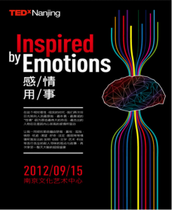
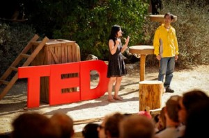
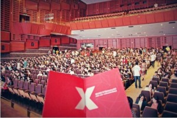
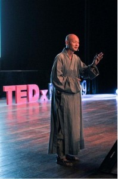

# ＜七星人物＞第十七期：TED之南京，“Inspired by Emotions, 感情用事”

 

# TED之南京，“Inspired by Emotions, 感情用事”

## ——瓢虫君专访TED中国区大使段新星

 

**在理性判断的统治下所有直接的东西都毁灭了，所有行动的力量和勇气都窒息在有限的反思中。到处都是理智：没有绝对的热恋，取而代之的是理性的婚姻；没有绝对的顺从，取而代之的是以理性判断为基础的顺从；没有冒险的行动，取而代之的是可能性，精明的计算；没有行动，取而代之的是事件。 **

——克尔凯郭尔

现在这个年代，我们关于理性还是感性的讨论少了，因为我们变得越来越“理性”，我们是不是需要重审我们引以为傲的理性？我们将情感放在哪里呢？……

2012年9月15日，在南京，TEDxNanjing举办了一场名为“感情用事”的年会，它们说希望“在这个相对理性、现实的时代”的年代里，我们可以再次将目光“转向人类最原始，最朴素，最真诚的‘性情’，那些藉由骄傲、喜悦、孤独、愤怒、渴望、脆弱等情愫所激发出的发明、创造、文学、艺术、科技等各行各业的耐人寻味的观点与故事”。TED是technology, entertainment和design的缩写，但这次它们想诉说一些和“感情”有关的事情。 

**“我们的目标：A ball , not a bubble .（创想不是一剂春药，TEDx也不只是昙花一现或过眼云烟） **

——段新星

另一方面，作为一次公益活动，这次年会无疑是成功的：活动地点位于南京最繁华的地方——南京新街口，与中国移动进行了M值换票的合作，预定票在几天之内发尽，演讲的嘉宾有浦口定山寺的主持，华盛顿大学的哲学博士，也有微软（中国）公共事业部战略合作总监…..不单这次活动主题的设计在中国现有的语境下如此吸引人，同时，成功举办这样一场千人级别公益活动的经验，也有些值得其他中国一些非盈利组织借鉴的地方。

段新星，作为TED中国区大使之一，全程负责了本次的筹备和运行，本期北斗人物从TEDx和段新星开始。

 

### 一、TED与TEDx

**Q：对TED，很多人都耳熟能详，但TEDx很多人却未必清楚，能先简单介绍一下TED和TEDx二者的关系吗？**

A：TEDx是基于TED传播有价值想法的初衷创办的旗下组织，是非官方、自发性的活动项目，其形式与TED基本一致——邀请一些有趣、想法奇特的人来做18分钟以内的演讲。总的来说，TED是一个跨界的idea分享的会议名称；而TEDx则是基于本土的、独立策展的活动，其目的是给本地TED粉丝带来类似TED大会的体验。 

**Q：这能算TED进入中国的一种方式吗？目前，TEDx在中国的组织架构又是怎样的呢？**

A：TED从来没有进入过中国，并且TED在美国以外没有办公地点和全职人员，大会都是通过TEDx开放授权实现的；而TEDx是各地的组织者独立策展，以区域为划分各自准备活动，可能并不存在你所说的组织架构，没有统一的领导者往下划分部门、分派任务、整体统筹各个活动之类的现象，但是各组织之间会有合作交流。 

**Q：不过听说目前中国区的有三位TED的大使，没有整体统筹的话，大使的身份又承担什么样的角色呢？**

A：主要是促进区域间协作、交流、经验分享、组织者工作坊等。 

**Q：比如参加组织者工作坊？**

A：对，今年年初我到加州做了一个TEDx全球组织者的工作坊和讨论聚会。就是几位组织者从舞台设计，胸牌，赞助等等方面，每人4分钟做一个presentation，讲述TEDx世界各地的组织经验。我和Ellen讲的是区域间的合作，我和她都在中国，一北一南（TEDxFactory798和 TEDxNanjing）组织TEDx，从来没有见过面（事前被通知建议做一个joint presentation，于是来美国前几天 skype 邮件商讨过许多次，ellen做了key note），这次却在美国第一次会面，的确是件非常有趣的事情, 当时还迅速在现场做起了彩排，探讨了区域合作的目的和方式，以及一些成功的例子，整场下来，效果很不错。 

**Q：嗯，那这么说，TEDx是TED下面的一个地方性的衍生项目，我能问一下，TED有直接进入中国的想法吗？**

A：目前根本没有这个计划。 

**Q：你知道TED没有付诸行动的原因吗？**

A：这个问过Chris Anderson和Lara Stein了（小编注，二人分别是TED 和 TEDx的boss），因为TEDGlbobal和TEDxSummit已经牵扯太多精力了。 

**Q：接下来具体介绍下TEDxNanjing吧。**

A：TEDxNanjing是基于南京本土的一个“神奇部落”，由关注科技Technology、娱乐Entertainment、设计Design以及文化创意、社会创新等不同领域个性鲜明、充满活力、积极行动、努力拼搏的年轻人组成。 

**Q：TEDxNanjing是什么时候成立的呢？这些工作人员大概都是怎样的社会身份？**

A：正式成立于2011年3月，有1～2名全职、20多名成员以及90多名志愿者。主要由企业家、软件工程师、公务员、记者、经理人、学生、公益人、风投、媒体人、金融家等组成。 

**Q：除了这样的年会，TEDx南京的日常工作是怎样的？**

A：主要是前期筹备及团队建设和维护。 

**Q：那我们知道有一个TEDxChange系列活动，考虑或者开展过吗？（小编注：TEDxChange是TEDx与其战略伙伴梅琳达·盖茨基金会共同发起的一个特别计划，旨在促进人们对疫苗、脊髓灰质炎（小儿麻痹症）、疟疾、爱滋病、新生儿健康、农业发展等话题的有益讨论。）**

A：开展过了。2012年4月7日，全球包括南京近200个地区对柏林TEDxChange进行转播，并且我们组织了当地的演讲，嘉宾葛莎莎也对该话题进行了探讨，与我们一起分享他们对改变的思考与关切。（葛莎莎工作于联合国国际劳工组织CP-TING项目江苏省项目办公室，她主要为我们分享其目前协同负责的预防拐卖项目的工作，综述国内与国际范围内的拐卖现状，阐述她对放眼全局这一主题的看法。） 

**Q：所以我能不能理解为，你们更多的为了理想和TED的一种传播精神在一起的了？**

A：可以，based on passion。

 

### 二、活动经验分享

**Q：从最初报名到现场等看来，这次活动举办是非盈利的，请问你们是如何解决经费问题的呢？并且，你们的会场还设在南京新街口如此繁华的地方。**

A：目前看来，这种活动还是比较依靠赞助支持的。 

**Q：今后有想过一些其它的“售票”方式吗？**

A：会考虑目前各个TEDx 通用的票务制度，就是门票收费和定向邀请有贡献的听众。 

**Q：无论是TED本身，还是你们这次TEDx，我们都注意到邀请来的嘉宾不同于一些学术演讲或者读书会活动，那些活动更多时候会邀请一些时下知名的学者或者公共知识分子，而你们对嘉宾的关注点似乎和那些活动不一样。能和我们谈谈你觉得你们和那些活动的差别在哪吗？**

A：好的，首先我们希望演讲嘉宾有独特的经历和想法，同时愿意传播和表述他的故事/观点，我们希望这些内容是有启发性或值得去体味和传播的，另外，不能涉及宗教和政治。具体选择的时候，我们有自己的评判标准。 

**Q：考虑过兼顾怎样的受众吗？**

A：未考虑过于迎合大众需求，更多的从切题方面考虑。 

**Q：从微软公共事业部战略合作总监，到浙江大学软件学院系主任，到南京大学中美文化研究中心国际法的教授Thomas，再到浦口定山寺的主持，可以看出，你们这次邀请来的嘉宾阵容很华丽。在邀请这些嘉宾时，有遇到什么困难吗？还是因为你们是TED中国化的一种组织，使得邀请变得特别顺利呢？**

A：有困难，也被拒绝过，但总体比较顺利，主要是依靠团队成员的隔热关系来邀约的。有邀请者不了解拒绝的，因为我有朋友在美国驻上海领事馆也不知道TED为何物，一些外企驻南京负责人也不知道TED是什么，美国也是如此；还有行程安排比较紧而拒绝的；也有因为经费问题拒绝的。 

**Q：就是说在中国，TED的影响其实并不是特别大，是吗？**

A：可以说影响力不够大，但是慢慢会变好！ 

**Q：你刚才说到经费问题，那这次邀请来的嘉宾需要付出场费吗？**

A：不需要。 

**Q：嗯，我们也注意到了你们和中国移动的合作。一般而言，很多公益机构会感觉自己和这种行业巨头谈合作时不被待见，或者担心他们不愿提供支持，那你们这次又是如何解决这个问题的呢？**

A：我们没有找，是他们找到我们的。因为 TEDxNanjing是中国大陆做的最好的几个TEDx 活动之一，相对还是有一定影响力，所以可能他们愿意来找我们吧。 

**Q：能简单介绍下你们工作人员和志愿者的招募情况吗？**

A：上一次招募，大致2天招募了将近100名志愿者，受众基础还是比较大的，因为TEDx南京、上海、台北、广州算是中国比较大的几个TEDx community。但比较缺乏有专业技能的志愿者，所以有些方面还是很欠缺，比如摄像、视频录制剪辑、网站建设、平面设计等等，因此，下次会招募一批具有专业技能的志愿者。 

**Q：中国的NGO组织，很多时候无法得到政府的支持，你们租用的场地是南京文化艺术中心，是当地文化局或者其他政府提供的吗？**

A：不是，场地费用花费了将近5万。 

**Q：那在你们的活动准备中，遇到的最大困难是什么？**

A：主要还是经费问题，活动赞助支持。 

**Q：为何选择使用“Inspried by Emotions 感情用事”这样一个主题？有没有一个宏观背景下的归化和约束？**

A：有过往2011演讲者的启发，也有个人经历的原因，以及TEDxNanjing本身的使命，想传达什么、改变什么，是几方面的因素综合导致选择这个主题的。

 

### 三、古城南京的创意与灵感：情感记事

**Q：通过“感情用事”，这次活动的主题想传达给大众什么吗？比如，希望人们能相对摆脱现在设计的枷锁，回归人类的“真性情”？**

A：是希望从不同的角度重新审视“情感”，它的本质、作用、以及在人类社会中扮演的角色。我们不尝试直接告诉人们这样或那样，而是启发每个人的独立思考与行动、改变，所以也并不完全要求人们抛弃理性，拥抱真性情，而是说你要去观察、审视和思考。这也是TEDxNanjing区别于其他TEDx event 或说教类活动的一个特点，我们尊重每个人的思考判断能力，所以甚至很多嘉宾的观点也是相互冲突的。 

**Q：嗯，是的，这似乎也可以解释现场观众的疑问了：智光禅师的演讲试图通过比较，人与机器人共同之处，来探讨程序对人的生命的制约，以及超越这种制约的可能与办法。他演讲的内容似乎太多的是在从理性分析展开的，这会不会和这次“感情用事”的主题不契合呢？**

A：是的，“Inspired by Emotions，感情用事”是一个意译，不能字面理解或只言片语下结论。有人说主题有误导，但我向来主张我们说自己的话，观众做自己的理解。如果真的遇到精神或智力的残疾者，我们只能表示遗憾。一千个读者，一千个哈姆雷特。因为的确有听到这个题目表示反对和不愿参与的，我们尊重他们的选择。

当然智光禅师是一个比较有争议的演讲者，有非常多的拥护者和粉丝表示受益，也有很多人表示无聊和愤怒，没有一个特别清晰的评断，他应该是这次演讲者反馈中的一个特例，所以我们也无法去满足所有人口味和需求。这次活动就像一个艺术创作一样，有听众只喜欢谷逍驰一个（小编注：谷逍驰时当天最小的一位嘉宾，一名17岁的机器人制作者，现场展示了他制作的可以微笑，懊恼，生气的机器人“万向轴”），对其余很的不感冒，也有听众只喜欢智光，觉得其他网上都可以看到，完全没必要听现场。每个人都有自己的特色，见仁见智。 

**Q：就个人而言，不知你对现场观众的反应是否满意？**

A：现场气氛吗？我个人觉得还好。 

**Q：对于观众的反应，有什么觉得遗憾或者想改进的地方吗？**

A：太多，摄像和视频这次尤其要改善，在其它的设计方面也有很多需要提高的，也包括活动的节奏、交流场所等。 

**Q：能简单回顾介绍下TEDxNanjing 的第一年 2011年度的状况么？**

A：从一开始聚集，我们就有能力迅速组织一届隆重的TEDxNanjing大会。但思索之后，大家决定这只是TEDxNanjing的第二个目标，毕竟在南京这座不南不北，不洋不土，传统风韵强于现代文化的城市，一个长期的新文化聚合的平台才是更加必须和值得期待的。所以我们从3月份的WE（跨界展示四个不同行业人士的风采），4月的创意设计（艺术、创意类分享），5月的南京大学（Bigbang 关于书籍）、南京师范大学（Changing the future 关于建筑设计）专场，6月份的当公益遭遇创意，8月份的潘多拉的礼物（关于灾难），9月份的Black 80 90尖峰青年论坛逐期分主题，基本全是在面向本地（一度苛刻的拒绝外语演讲者）。通过半年长期不懈的努力，南京本地的电影导演，基金会，NGO公益人，建筑师，公务员，警察，中医，武术爱好者，教师等各界的嘉宾都参与到我们的活动之中，逐渐在实现着作为南京乃至长三角跨界思想文化聚合平台的梦想。 

**Q：你自己对对TEDxNanjing还有什么别的设想吗？**

A：TEDxNanjing 应该发展或进一步强化的自己的优势：1、本土精英力量的融入、积聚、行动力；2、激情与无畏；3、大视野，长远的发展计划；4、创想力量的发挥，改善世界的能力，流行+理性+感染+启迪为TED的特色（尖峰创想，引领未来的作用）

 

### 四、段新星和TEDx的中国之路

**Q： 好吧，说了这么多，能和我们介绍下你自己吗？**

A：男，南大小硕，毕业6年，市拳术冠军，Motorola /Lucent软件工程师，某公益组织负责人，TEDxNanjing策展人，某人的老公，哈哈。 

**Q：哈哈，那你最近在做些什么呢？**

A：最近主要身份是两个公益组织的负责人，具体的可以不提吗？ 

**Q：可以的，我注意到你无论从本科在西安交大的学习，还是研究生在南京大学的学习，都是和计算机方面的相关的。很多人会感觉这样的领域的人更多的是程序猿，而您个人似乎对于感情用事，或者对于TED这种思想和人文知识传播的平台很感兴趣，能说说这种不同在哪吗？**

A：这个，很好理解啊，TED的T就是Technology，所以在我看来，可以说是没有什么不同的。 

**Q：你决定做TEDx的原因是什么呢，莫非也是“感情用事”？**

A：出于三点原因：1、喜欢；2、觉得对社会他人有意义；3、对未来没有恐惧，于是就做了。 

**Q：TEDx日常的管理需要牵扯你很多精力吗？坚持有多久了？**

A：需要很多，忙时24小时，闲时0小时，并没有所谓坚持。 

**Q：会遇到因为得不到身边人支持的这种情况吗？**

A：因为一直有人支持，所以一直不会痛苦；一直有新的发现和遇到快乐，所以无所谓痛苦的坚持。 

**Q：有没有过在坚持这种的事业的付出时候，因为其没有达到自己预期的社会效益或影响力，而想放弃的时候？**

A：No，没有太大的野心，故而也没有太大挫折。 

**Q. 这次活动，从开始报名的9月1号，到你们9月12日零时，很短的时间内，你们的活动就报满了，你觉得引发大家如此热情的原因是什么呢？**

A：一句话，美味遇到老饕。 

**Q：嗯！有没有想过和其他地方的TEDx做一些互动，因为我之前有在网上看到陶喆在台北TEDx的演讲，或者和几个地方共同举办一次年会？**

A：做过，和100多个各国组织之一起做TEDxChange，直播、转播柏林的TEDxChange活动，其中有梅琳达、盖茨等，我们现场也有嘉宾。像组织者工作坊就是，我记得当时TEDxTaipei的组织者从9个大问题出发，邀请可以解答这些问题的演讲者，逐渐追踪并明晰出一次次演讲的嘉宾，他们还特别与合作伙伴一起打造一个讲述台湾故事的平台，并同听众建立紧密的联系，从听众中进行学习发掘。 

**Q：这次出现了门票供不应求的情况，有想过下次再扩大一些规模吗？**

A：No，厨师饥寒交迫，宴席最终散场。不鼓励不劳而获，下一次12月的月度活动准备定向邀请，但我们会录制视频，并保持免费观看的发布方式。 

**Q：那么下一阶段的筹划就是这个12月月度活动了？**

A：是的，但是这只是一个内部活动，只针对团队贡献者及赞助方代表，不会有太多外部名额。 

**Q：那你个人觉得TED在中国未来之路是怎样的？继续坚持TEDx这种模式，而是希望TED本身也可以进入中国？**

A：这个要让Chris Anderson 或 Lara Stein回答（小编注，二人分别是TED 和 TEDx的boss）。 

**Q：你如何看待TED目前在中国的的社会反映呢？**

A：数量上遍地开花，质量与影响力上，南北沦陷、中部尚存。其中有些本土的会议现在已经发展的很不错了，比如说北京果壳网的“万有青年大会“，香港的“MAD” 都是后起之秀，目前在南京和上海两地尚未见到比TEDxShanghai 和 TEDxNanjing优秀的类似活动。 

**Q：有没有担心过舶来品和相似本土产品竞争的问题？**

A：我觉得这不是坏事，我们期待着本土品牌的出现，并非竞争或你死我活的关系。 

**Q：另外，对TEDx在中国的未来之路，您有什么想表达的吗？**

A：不可一概而论，事因人显吧。希望本土的组织者能更多的注重活动的意义，不要忘记做事的初心，例如TEDxUIC，TEDxGDUFS就是大学TEDx活动中的佼佼者和榜样。因为公益和免费，而把TEDx活动做成一堆烂屎的例子，数不胜数；但这并不能成为一种借口，我觉得做事还是需要一定的责任心和付出相应努力的，所以有时候不在乎做什么，也要看是谁去怎样做。 

**Q：举个例子？**

A：譬如我身体素质过去并不强，纯粹外行，到后来练习内家拳拿拳术冠军；我过去是一名软件工程师，并不影响我作为公益人拿南京市公益创投的最大的奖项。

人的惊喜与成就是自己带给自己的，不要问我们能从TEDx中得到什么，想想我们能为发展TEDx做些什么，很多事情都是有变数的。 

**Q：嗯，因此作为一个公益人，应该有自己的态度，是吗？**

A：对，一批优秀的组织者可以让TEDx 在中国的土地上发扬与壮大，成为一个创新交流的平台；一批不负责任的组织者，也足以让TEDx迅速烂掉，名声扫地。在中国，两者是并存的，所以有时，有些问题不是打上TED的标签就可以了的，怎样的人就是怎样、就会走出怎样的路、做出怎样的事，仅此而已。

#### **附：**

1. TEDx南京，“感情用事”活动宣传链接： [http://blog.renren.com/blog/419504114/869107382?bfrom=011300082](http://blog.renren.com/blog/419504114/869107382?bfrom=011300082) [http://www.tedtochina.com/2012/09/15/tedxnanjing-2012-emotions/](http://www.tedtochina.com/2012/09/15/tedxnanjing-2012-emotions/) 2. 本次TEDx南京“感情用事”，演讲视频： [http://www.tudou.com/listplay/n3dgdHouQBE/cC7Dzp2TEdA.html](http://www.tudou.com/listplay/n3dgdHouQBE/cC7Dzp2TEdA.html) 3. TEDxNanjing人人账号： [http://www.renren.com/419504114/profile?ref=searchresult_0&q=TEDx|p=|s=0|u=257745806&act=name&rt=user&in=0&ft=1&hh=1](http://www.renren.com/419504114/profile?ref=searchresult_0&q=TEDx|p=|s=0|u=257745806&act=name&rt=user&in=0&ft=1&hh=1)  

( 编辑：王凌羽 张正 张丹宁 )

 
