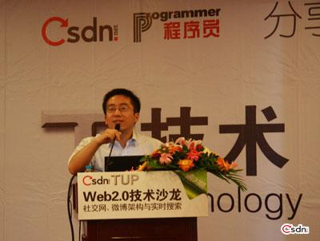
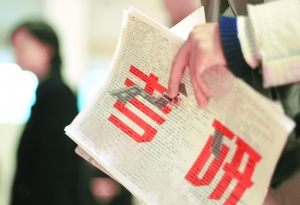
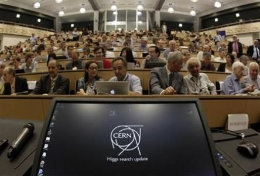

# ＜七星人物＞第十二期: 毕业几年，我们走在各自的路上——瓢虫君专访毕业生

 

# 

# 毕业几年，我们走在各自的路上

# ——瓢虫君专访毕业生

## 

毕业，总是一个沉重的话题，当我们试图描述它时，心中总会泛起种种涟漪，因为它意味着一种离别，一种对于分开的无奈，甚至是一种眼泪。从6月初到8月底，人人网上也逐渐没了那些觥筹交错、对酒当歌、或哭或笑、伤离别的场景，08届的毕业生如往届一样，会被时间被慢慢翻过，在这里慢慢淡去他们的痕迹。

就像每一个过来人都会或多或少觉得新人浅薄一样，08届和之前的毕业生对于现在“人人网”上的种种，表现出更多的是沉默或者转身离去，也许看着现在人人网上的各种吐槽和分享，他们只会唏嘘一句：当时这个地方还叫“校内”时，你们都不知道在哪呢。也像很多后来者不懂前人的世界一样，现在活跃在这个平台上的学生们可能不会懂他们之前的毕业生们，或是也根本不想懂那些毕业生。

他们都是从6月毕业，然后开始走向自己的世界，对08届而言，到现在可能是2个多月，而对之前的毕业生而言，可能意味着2年，3年。每个人在毕业后选择的道路不尽相同，但anyway，不管去哪，不管做什么，他们都相应有了自己的去处，或出国、或读研、或工作，也或结婚，等等。这一次，我们再看毕业生，不去追述大学兄弟姐妹间的情感，不去慨叹距离将爱情阻隔得太远，也不去赞颂那些勇于选择自己、坚持理想的青年，我们只想描述选择了每种道路的毕业生，他们的生活。这不单算是一种纪念，它更像是一种了解社会的方式，毕竟当公务员和去一般的民企工作在这个国家，差别还是很大的。本期北斗人物组，基于毕业生们不同的去处，大体将其分为9类：出国，公务员或事业单位，研究生，再考研究生者，北漂，一般民企就业者，知名民企就业者，外企工作者，军人，直接嫁人和其他（比如去gap year之类的），这只是我们做稿件时的一个大致分类，并不意味着最终的采访人物会完全对应上述9类，但我们会尽量选取不同的采访对象，也许他们没有那么的有话题性，不是那么的形而上，但这确实是这个社会大多数人的生活状态，北斗本身也希望可以更多的用一种较低的视角来关注这个社会和这个国家正在发生的事情。

本期北斗人物，带你走入他们的世界。

阅读提示：毕业生选题共分3期，第1期选取的三个采访对象分别是：考研成功者，再考研者和留学生。为了更好的展示每个人的生活，我们将文章分为三部分，第一部分是对每个人和相应选择的简介，第二、三部分是采访问题，由General question 和 Specific question构成。其中8道General Questions是一样的，这些问题的答案会构成文章的第二部分，以“一个问题，四个答案”的方式给出，最后，是针对每个人不同的选择而设计的6-8个Specific Questions，为文章的第三部分。我们知道这样的分类可能略显粗糙，可能不够考虑每个被访者自身的经历，但我们总希望通过他们的答案看到一些一样、或不一样的答案，所以希望这次人物组新的采访和组稿方式，您能喜欢，也能包容其中出现的一些问题。

 

### 一、人物简介

考研成功者：

宁完美（化名）毕业于武汉理工大学，在那里读完研后开始了自己在深圳“华为”的写程序之路。作为典型的工科生，他乐观谦虚，严肃谨慎。对于他们而言，生活有时候简单得如同ABCD的选择题，不到考试结束，永远不知道最后得分。

再考研者：

海波，男，1989年出生，辽宁人，本科为兰州大学地质学，连续两年准备考清华金融学的硕士，显而易见，这个硕士，对跨专业的人而言，更加难考。

留学生：

俞杰，1983年出生，本科毕业于上海大学，专业为机械工程。硕士与博士分别毕业于南京大学和巴黎第十一大学，专业为高能物理。现工作于欧洲核子研究中心。

 

### 二、 常规问题

Q1: 能描述一下你现在的生活状态么？

考研成功者：程序员啊，网上不是有个很好的词么，屌丝一个。现在只有工作没有生活，每天都是加班啊加班啊，加不完的班，跟想象中的差不多吧。来华为前就知道要天天加班，但是比想象中的更恐怖。公车，上班，吃饭，休息，上班，休息，很无趣的上班都是写程序——没有意思的工作。工作压力不算大，但是很累，每天上班的时候太长，早上九点半上班，晚上九点半下班。我们公司很单纯，只需要把事情做好就OK，不过计算机领域多，知识更新很快，需要不断地学习新东西。工作环境也比较单调，整个开发部就一个女的，上百号人，严重不协调，没有什么变化啊！

再考者：每天5点多起床，晚上12点睡觉，有午睡。周末起得会晚一点，下午会去跑步。我觉得还挺安逸的，比工作会轻松很多。

留学生：我们正在做的是粒子物理实验，这是一个几千人共同参与的大实验。简单来说，就是在地下挖一个管道，让粒子（此处是质子）高速运动（99:999%光速），然后碰撞，将得到的结果与理论相比较，以验证理论的正确与否。我自己这一块儿是负责其中的一个project，和程序员差不多，每天对着电脑跑程序。我的生活比较规律，每天早上七点多去实验室，一般工作到晚上七点左右，其间除了跑程序，还有讨论和会议，忙的时候晚上和周末都要加班。我们工作时间蛮长的，超出8小时之外的部分不算加班，没有加班费，但工作时间和地点都很灵活，由自己安排，只要把分配的任务完成就行。我周末有时候去爬山、远足，一些户外活动，平常会在家看电视、电影。

Q2. 你以前对这个选择的想象是怎样的？当初这个选择对吸引你的地方是什么呢？

考研成功者：其实我读大学前是什么也不知道，亲戚帮我填了个计算机，我就读了计算机。上大学前连电脑都没有摸过 ，那时QQ号还是上大学后申请的。

再考者：大学期间看了很多相关金融的新闻和书籍，就慢慢产生了兴趣。我还没有工作，对它的想象或许还停留在表层吧，我觉得金融可以涵盖其它任何一个行业，因为都要涉及到资金融通。如果能考上，应该会以实践为基础，理论上的东西学校学学也差不多了。也想在研究生期间，把各个行业都大致了解一下，看看各个行业之间有什么关联，做一下整理。

留学生：以前我把这个工作想象得很美，觉得能用一个方程式描述整个宇宙万物最本源的运动规律是件很美的事，对期刊上看到的那些课题会有很多idea；但真的学习了专业知识后，发现以前的那些想法是不切实际的，轮到学术上真的需要idea的时候，我发现自己没想法了。我觉得是因为自己天赋不够，加上对这个职业只是比较喜欢，不算特别热爱，投入的时间也就不是特别多，所以学术上没有太多idea。当初最吸引我的地方除了觉得能用一个方程式描述整个宇宙万物的最本源的运动规律很美以外，还有两点：一觉得物理学给人一种很纯粹的感觉，尤其是纯理论；二是很渴望了解这个世界，而物理学正是解释这个世界的一门学科。

Q3: 你选择这个方向，是自己的想法还是听取了他人的意见？你对现在的生活满意吗？会后悔己毕业前做出的这个选择吗？

考研成功者：现在发现我的长处不在此，其实我很想读个师范大学然后当名教师，可是离这个梦想越来越远。准备再工作几年，就会朝自己的梦想改变；总不能做一辈子的程序员吧，再看吧，如果条件允许的话……

再考者：是我自己的选择，爱上金融是一个渐变的过程，而不是心血来潮。我是在为自己的爱好而努力，当然是满意的。我没有什么关于家庭的压力，我想要继续念书，家里就会支持。所以我没有什么可后悔的，有的只是珍惜。

留学生：是我自己的想法。大学时期有段时间我受到了有关建立量子力学那段历史的影响，觉得物理学非常有意思，所以就被它深深吸引了。我父母都是普通农民，对职业的选择没什么了解，但他们很信任我，支持我的选择。我也很满意自己的生活，毕竟物理吸引了我。

Q4: 对生活或现实有什么抱怨吗？有感受到什么压力吗？比如购车，生活压力，居住条件差，购房，恋爱，结婚，照顾父母等等。

考研成功者：购房吧，房价太高，吃不消，所以现在还不是房奴。购车啊，当然希望能购到，我九点半下班，坐公交到家就快十一点啦。至于父母，目前不需要照顾，以后他们也有退休金，应该还好吧。

再考者：第一次考研的时候会想得比较多，有时候觉得不知道自己在干嘛，就没动力了。第二次了就比较轻松一些。或许是因为那些知识点都已经大致掌握了，就不太会去太过于关注这些问题了。跨专业考研，原先本科完全没有知识积累，所以第一次会没有自信，也怕时间来不及，想要什么课程都学。

留学生：肯定有，以前有，现在也有，主要来源于工作，生活上倒没什么压力。对于买车买房，我没什么压力，并不是说我有钱买得起这些，只是我对自己的生活一直都没有很高的期望值，我是指房子车子之类的。这些都应该是我做喜欢的事情的副产品，如果没有这些，也没什么。没有车子我可以骑车，没有房子我可以租房子，小一点的。反正这些不会给我什么压力，我平常也不会思考这些问题。

但是赡养父母的压力还是会有的，主要是长期不在一起，我担心父母的健康，因为要工作，要挣钱，要养家，所以没时间陪他们。赡养父母的压力还来源于这个社会体制，这个社会是不提供普通老百姓一点保障的，父母虽然勤恳工作几十年，生病什么的还是生不起的，所以我会留出一部分钱给他们作保障。我这个工作工资不算高，但是也还可以，足够给他们养老。

Q5: 在这一段时间里（小于半年）遇到过的最大的挫折是什么？有没有思考过这个最大挫折的来源或者本质又是什么？

考研成功者：当然是嫌公司发的奖金少撒，觉得付出了，公司给的回报不理想。其他就没什么，至于来源啊，本质啊，我也没有深究。

再考者：那就是第一次考研失败吧，当时觉得自己付出了那么多，却什么都没有得到。很沮丧。不过也还好吧，也就几天，因为原先就准备好了考两年的，有一定的心理准备。也没有因为没考上而产生巨大心理反差，就是觉得不敢出去见人了。当时的我还是准备不够充分，这就是我会失利的原因。

留学生：分手是最大的挫折，当时很难受，很痛苦，不知所措，这让我的生活和工作几乎到了停滞的状态，每天醉生梦死，心态可以说是这几年来最糟糕的。我们是异国恋，她在国内，我在瑞士，导致分手的原因有几点，首先是我对感情这个东西不够了解，对对方不够关心，表达感情的方式也存在很多问题，比如不够细致，没表达清楚，这样会导致很多误会；还有就是双方思维的差异，表达的差异，经历的差异，性格的差异等等。

Q6：从毕业到现在所有的经历对你产生的最大影响是什么？

考研成功者：更加清晰的认真自己的兴趣所在。其实读工科的人到后来从事工科的工作，都是面对数据、电脑啊，做些很闷的工作，也不是每个人都能坚持熬下去的，工作后相比大学时更闷，所以比较清晰知道自己要什么吧。

再考者：对任何事情不会看得太重，不会再觉得一件事情没做好，未来就会万劫不复。目标性没有那么强，现在的生活态度会更随意一点。

留学生：这份工作让我更加沉稳冷静，做事情也更理智，能够独立判断一个问题，坚持自己想做的事情不气馁。这些都是在长期的工作当中养成的，当然，也有一部分是天生的性格。

Q7: 如果能再做一次选择，你愿意改变吗？

考研成功者：回到高考，读个师范大学然后当名教师呗。很多时候，我们都是“被选择”，所以只要做好就好了，慢慢来吧，选择做了，就没有什么能回头的，乐观接受现实更好。

再考者：会选择同样的道路，当时选择地质，虽然我也不太了解，只是朋友推荐的。但我觉得，因为人生总是要经历这样一个阶段，才能明白自己要的是什么。况且，我希望自己能多了解不同的专业和行业。

留学生：首先这个工作我蛮喜欢的，也许还不是十分热爱，但是肯定不讨厌。然后就是自由，虽然工作时间长，但是比较自由，有时候不想来实验室，也可以在家工作。然后也有一定的成就感，当自己做的事情发表在纸上的时候很开心。还有就是工作环境，大家都比较互帮互助，气氛蛮好的。若再做一次选择，如果我没有遇到更喜欢的事，我还是会选择这个职业的。

Q8：对于可能选择和你相似路线的后来人，有什么想说的吗？或，通过这个采访，你最想对他人说些什么呢？

考研成功者：Follow your heart！选择没有对错，选择了就认真的走下去；努力，终究会有回报的。

再考者：好好学习，天天向上呗！（笑……）好吧，因为我是一人北上，人生地不熟，因为不是本校的，所以常常找不到教室在学习。这样的话，最好能认识一些和你考同一个学，最好同一个专业，也在这里学习的人。或者学长学姐，也能给自己很多建议。我在这里学习也认识很多外校考清华的朋友，我们会经常一起聊聊。另一方面，跨专业考研的学生一般会没有自信，也是因为本科没有对此学科的积累的缘故，所以最好能提前准备吧。

留学生：我想对他们说，如果他们真的想做一件事情，那就去做吧，不要因为一些世俗的观念（比如房子，车子）而左右。只要自己真的努力去做，收获会很大，会帮助你认识这个世界，认识自己。

 

### 三、专门性问题

#### 3.1 考研成功者：

毕业后继续深造的道路，除却申请留学，大部分都不得不走上类似高考一样狭窄的道路——考研。在读完研之后，很多人还是要回归社会，去寻找一份令自己满意的工作工作。

Q1：你在大学时就读的专业是你喜欢的吗？你觉得自己合适这个专业吗？

A：计算机科学与技术啊，谈不上喜欢吧，但是选择了主认真的去学，刚开始觉得不适合，后来觉得还是比较适合的。

Q2：所以你选择继续本专业的研究生，也是基于上面的原因了？

A：是的，感觉还不错，我如果不喜欢，是不会勉强自己读研的，毕竟我可以直接就业。

Q3：网上有人说：害怕机械生活，害怕求职失败，害怕面对复杂的现实，不少人因为缺少一技之长而难以找到满意的工作，所以到头来他们选择了考研这场“鸵鸟式的战争”。对此，你是怎么看的？

A：首先我不是害怕求职失败才考研的。其实考完研后我签了一家不错的公司，但是由于后来要读研就没有去了；现在想来，其实不读研，我现在可能混得更好些吧。他们这种心态只是一种暂时逃避的心理，读完研终究还是要就业的，还不如早点面对。比如说读工科的女生，如果你怕这种机械生活，但又读本专业的研，到后来还不是找工科的工作？除非你换一个文科一点的读或者放弃自己的研究生所学，选择一份文科类型的工作。

Q4: 你当时读研是孤军奋战吗？媒体上经常有关情侣读研的报道，你怎么看呢？

A：情侣读研我觉得很正常啊，两人有共同的目标，相互勉励。既然是真心想考研，就不需要回避什么情侣问题。我当时是跟我们班一个女生一起考研的，但是不是情侣！她每天给我在自习占位子，哈哈，所以就跟她混了。大家一起分享，一起讨论，然后最重要的是分工占位子！

Q5：你有同学在国外读研吗？在国外读研是不是更有优越感？你觉得在国内/国外读研的差别在哪里？

A：有同学在国外读研，也没什么优越感的。我当初也想啊，只可惜没有出得去。在国外读研当然也要看学校了，可以出去体验一下更好，毕竟国外那边可以学的东西更多！如果是国外的野鸡大学就算了……

Q6：在中国考研和读研中有不少“灰色地带”，而几乎所有学生面对这些只能默默忍受，你在之中是否受过不少委屈？会觉得失望或者有什么想说的吗？

A：还好吧，我倒没怎么遇到过。付出后就有收获，虽说在灰色地带，但还是相对公平的。假的终究是假的啊，正规公司都会验文凭的。再说漏网之鱼也常有被揭发出来的，不是有方舟子嘛。

Q7：不少国内读研的人说研究生后的学习生活比本科时还要轻松，你是怎么看这个问题的呢？你觉得大家是为了更好就业需要那一纸文凭，还是为了学到更多呢？

A：最开始的初衷是想有真才实学，但是上着上着就变成混文凭了，可能跟大学的培养模式有关吧。一般啦，上面那句话说的是实话：满腔的热血，上到最后发现读研就是混日子……

#### 3.2 再考研者：

考研失败的人，大多不面临两个选择：或就业，或继续坚持。大部分人可能会选择前者，因为花费两年的时间准备一场考试可能是一种浪费，甚至是对现实的逃避，但就有这么一群人，有一些东西在支撑着他们继续考第二次，这群人很勇敢。

Q1: 第一次考研时想考哪里？觉得失败的主要原因是什么？这一次准备考研准备过程中有什么变化吗？

A：两次考研目标是一样的。只是情况有点不一样了，去年是招学硕，今年学硕一个都不招了，只能读专硕了，两年。由此就有一个学费的问题了。原本就准备两年考上的，因为是跨专业嘛。当时什么课都想学，时间安排不好，精神就很差，效率提不上去。现在完全只是看应试的东西了，不会像之前那样想太多。

Q2: 二次考研是大多数人不太会做出的选择，你是否有十二分强大的理由推动你去做呢？这个理由是什么？

A： 主要还是想多学一点东西，也不是因为我不喜欢我的本科专业，地质我觉得也挺好的。不过我觉得金融覆盖面很广，我考研一般出于兴趣，一半出于现实考虑。还年轻呢，多做一些尝试吧。

Q3: 你觉得研究生和本科生的差距有什么看法？很多人都认为读研究生是浪费时间，这个社会是实践经验大于理论的。两年考研加三年读书，五年时间倒不如从基层做起来得稳固？

A：看个人选择了。实践中虽然能够积累，但是学校学到的是一个很完整的体系，很多理论知识无法都在实践中弥补。还因为我希望以后能在学校工作，学校对学历会有要求，也对理论有所要求。另外我想在读研期间做一些自己想做的事情，这也算是读研的一部分原因吧。

Q4: 很多人第一次考不上会选择先工作再考，到最后可能就不考了；也有人会选择读在职研究生，对此你是怎么看的？

A：对我而言，如果这次还考不上，那我也会去找工作，毕竟人的青春有限，不能视考研成功为唯一目标。等到日后有机会，就会考虑再考研究生这条路。但是目前还年轻嘛，时间和精力也更充沛些，以后工作了再考，和现在的状态肯定是有不同的。

Q5: 会不会感觉到外界那种无形的压力，会不会觉得十分压抑或者很累？

A：不会，已经第二次考研了，心态好了很多，没有必要过分给自己施压的。

Q6:毕业以后有什么样的打算？在这个行业中，最想做的是什么？

A：如果考研成功，毕业后想投资银行，然后继续深造，最后还是想留校的。对投资银行方面还没有什么特别定位，因为我也只是大致定了方向，其实并不十分了解，况且如今让我做并购啥的我也根本不会。

Q7:如果这一次考研又失败了，你有什么计划？

A：找份工作过先干着呗。因为我大学期间也没有什么实习经历，原本也没有考虑过就业，所以对就业市场其实很不了解。随便找一份工作，多了解一些之后再调整目标吧，现在也没太去想这个问题。

#### 3.3 留学生：

大多数人在拿到硕士学位后会选择步入社会，但仍然有不少人因为专业需求或对因为怀着对知识的渴望而选择读博，甚至做博士后。他们历经了多年的读书生涯，不单要耐得住寂寞，更要有一份对知识的喜爱，读博、做科研远没我们说出这几个字时那么的轻松。

Q1：现在读硕士的人越来越多，但读到博士的还是少数，而且有些学生读研是出于逃避社会或者工作的考虑，你当初有这种心理么？

A：当时我就是想做这个就做了。社会就在那里，没有什么好逃避的。就算进了社会，我也会尽量选择自己的生活，而不是被生活左右。

Q2：你觉得在国内和国外做研究的差别在哪里？

A：国外更加自由，思想也开放，和老师是合作关系，能学到很多东西；国内的博士硕士更像是一个打工的，负责科研生产，这种状况下，其实很难出成果。

Q3：有人说博士论文很难写，导致有些博士很难毕业，你如何看待这个问题。

A：还好，只要认真做事情，还是可以通过的，这个和学科有关，不可一概而论，我的经验不带有普遍性。

Q4：在研究所工作的压力是否也是很大呢？

A：压力主要是，工作量大、时间紧张，而能力又不太够。我们每一次任务都有一个deadline，有时我们需要赶紧把手头上的工作做完，以发表文章，有时又需要赶在其它团队之前完成任务，之前我有提到，我们正在做的是一个几千人参加的大实验，里面有很多团队，大家都想争先完成结果，所以我常常在和时间赛跑，需要尽快的得到数据和结果，但我能力又不是很强，所以有时完成不了任务，那压力就很大了。

Q5：在国外生活的这几年，你所接触的东西相对来说可能更广，比如国外的社会体制等等，请问你如何看待当下的中国社会状况。

A：整体而言，我们的制度还很不完善，而且没有朝着好的方向前进。我们的制度总是朝那些不好方向去引导，无论是有意还是无意的。比如，这个社会引导人拜金，追求物质享受，这里我不说是某一个个体，而是社会的大方向。这和现行的制度有很大关系——这个制度的构成很大程度上决定了这个现象。政府带头新闻作假，鼓励物质享受，宣传各种所谓爱国的民族情绪等等。新闻不独立，司法不独立，军队所有权的问题，这些都导致这个社会的不公平和不安定。这个一时半会儿也说不完，大致就是这样。

对社会个体而言，我觉得大部分的人都没有很大的问题，只是少一点独立精神，比如说还是会更加倾向于成为一个不劳而获者，或者少劳多获者。这样是顺应这个社会的宣传的，但是实际上是对社会整体不利的。人人为己的结果是人人自危，整个社会也是会变得越来越冷漠。

Q6：在国外生活久了，如果回国会有不适应么？

A：可能会有，有些习惯还是不同的，做事情的方式也不同，现在我更习惯国外的方式。国内存在太多体制问题，言论不自由，正如我刚刚提到的那样。这些都让我觉得没有安全感。

Q7：如果在责任和梦想之间选择，你会选哪个？

A：如果不能兼顾的话，我会首先选择责任，不过我不会忽略梦想，只要有可能，我还是会去实现自己的梦想。

（未完待续）

编者手记：和这一期每一个被采访对象谈话的过程，就像是看一场由七八个片段组成的蒙太奇的电影，他们就是那么不紧不慢的播放着，让你看到他们各自的世界；是的，就那么不紧不慢、有条不紊“磨着”你对未来生活的看法，或把你拉回现实，或让你更加坚定理想。有些人的选择令人敬佩，有些人的生活则令人羡慕，但不管怎样，北斗人物组希望他们每个人都能找到各自的幸福，都会尽量在现实中实现自己的理想，best wishes！

 

（编辑：叶馨文，张森森 ，陶靓，孙娜，罗晓；责编：张正）

 
