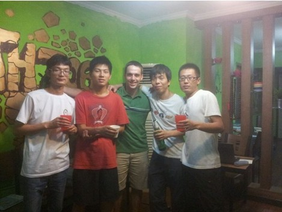
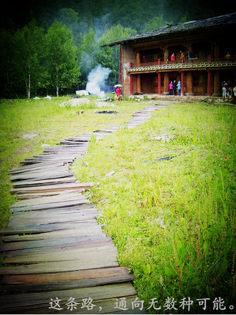

# ＜七星人物＞第十五期：706青年空间：让青年人互相取暖——瓢虫君专访邬方荣

**“让一些青年人可以在思想和理念上面互相学习，互相支撑和取暖，或许他们过了10年20年还会记得在年轻时候，曾经有过这么一个组织，这么一个场地，带给他们刻骨铭心的记忆，让他们以后保存年轻时候的理想和理念，而不至于被社会和环境淹没，我觉得这个就够了。” **

---邬方荣

**对于整个五道口来说，少个光合作用，少几个706青年空间，根本无关紧要；可是，我们有没有反过来想想，为什么一个高速发展的国际化都市，一个人文气息号称浓厚的五道口，容不下这些独立书店和独立青年空间？容不下这些理想和梦想。**

** …… ……**

**而过分商业化和实际主义，将特立独行，有梦想有理想的人，降低到平庸的水平线的时候，那这个只会导致一种类似钱理群老师说的“造就一批精致的利己主义者”，和有梦想的青年人被全面吞噬的悲剧。 **

** ** —— 邬方荣人人日志 《[我们需要706青年空间，那有书，还有灵魂](http://blog.renren.com/GetEntry.do?id=862889038&owner=1096912800&ref=minifeed&sfet=601&fin=3&ff_id=1096912800)》

**孵化的力量来自社会而不是政府……我不相信政府主导的各类基金会等官方机构，会真正俯下身子，在理念和感情上面认同我们，而没有这样的认同，任何好听的支持诺言都只是水中楼阁，除非你有中国语境中的“关系”。**

—— 邬方荣人人日志 《从“706青年会”谈谈云孵化组织（为什么需要信任/开放/分享/观念认同）》

邬方荣，江苏江阴人，中国青年公益交流组织ICU （跨文化交流协会）、706青年空间创始人和主办人之一。706空间早已小有名气，一些外地的学生也慕名而来，但其实这个名字却来得极为自然：因为原来的场地是在北京五道口华清嘉园甲15号楼706单元。

 

### **一、 ****五道口有个706**

（图片来源：邬方荣人人相册。邬方荣：右二，图片摄于706空间搬迁前一天晚上。）

**Q: ****由你为主要负责人之一的706青年空间（以下称706）和ICU开放大学（以下称ICU），跟北斗一样，都是国内影响力比较广泛的学生组织，从建立初期到后期发展，组织的理念是怎样的？ **

A: 做协会的时候没有想过公益，就是有一些韩国朋友，自然而然就做了一些中韩学生的交流活动， 后来发展成ICU协会了。ICU协会其实分为ICU跨文化协会和ICU开放大学。ICU最初起源于中韩交流协会，形成了一个ICU跨文化协会，这个协会有四年多了，后来改名为ICU的，Inter-Culture Union（跨文化交流协会），活动主要是中外交流，包括聚会、组语伴学语言、和简单的讨论活动。2011年，我和北大的韩国学生崔珉祯在ICU跨文化协会的基础上，又做了一个ICU开放大学。

ICU开放大学的宗旨就是集合大家的力量，一起来创造一所没有围墙，没有课堂规矩，致力于教育资源平等化、提供人文教育、通识教育和社会创新的自由开放的新型大学。一所基于网络的虚拟大学。 开放教育的理念包括自由讨论、分享、社会化网络学习、融入生活、教育公平等。希望可以让北京上海等大城市的教育资源，可以让二三线城市的学生来共享。

706是我们ICU协会里的4个人 ，和另外8个人（包括北斗的薄然）一起发起的平台，日常运营由ICU协会来运营。我现在负责的是706青年空间的筹备，和见与行项目。 706叫706是因为我们以前的场地是在五道口华清嘉园甲15号楼706单元。

**Q: ICU****和706前段时间搁置了，现在还要做下去么？ **

A: ICU跨文化协会还是照常做，目前会长是刘洪。ICU开放大学也是要做的，目前负责人是崔敏贞，她目前在找核心的技术团队，珉祯说ICU开放大学准备参加哈佛的一个GSVC社会企业比赛，因为ICU开放大学是一个社会企业项目。由于房子合约问题，青年空间将会搬离706，等706的新场地定了以后，ICU跨文化协会和ICU开放大学的活动都是会在里面进行的。 以后是否叫706还没有确定，有可能叫往来书院（云南见与行项目的基地的名字）。 现在处于一个转型的阶段，需要看接下来的发展。

 

### **二、 ****见与行-**** 理****想国在室外桃园**

### 

 **编者注：**

“见与行”是由往来书院主办，联合ICU开放大学，一起在云南香格里拉吉沙的一次国内有志青年关于探讨社会问题和人文思想的集会活动。有人说这是“一场35人，为其两周的超现实主义实验”，宣传初期，组织者说这个活动里会有“苏格拉底式平等对话”概念；现实中，参与者也大多用“理想国”、“十日谈”来形容这次活动。（“见与行”部分引述均摘自邬方荣人人日志《**[无用之用，方为大用。-----记云南“见与行”项目。](http://blog.renren.com/blog/1096912800/868846568)**》）（图片来源： 邬方荣人人日志： **[无用之用，方为大用。-----记云南“见与行”项目。](http://blog.renren.com/blog/1096912800/868846568)**）

#### **2.1 ****见与行其事**

**Q: ****这次活动的特别之处在哪里？活动参与者可以说是百里挑一，最后选取的什么样的人？这个项目又为何选取这样特定的地点和形式？**

A: 这次活动是在我的人人网上发布的，分享了2000多次，浏览量有1万多，共有1300人报名，最后选择了30人，这些人都是各个高校的学生，也有部分已经在工作了。最终入围不是拥有社会企业领袖、创业领袖、社团会长或者公益圈牛人这些好头衔的人，而是那些我们觉得有想法的人，或者说是符合我们预期的人，他们的说话和我们在同一个频率上。一般类似的项目面试会问一些社会、政治等问题，而我们这次的面试则纯粹是聊天和讲故事，很有意思。

另外，去云南之前知道了关于那个地方的很多故事，而我们后来在那边住的也是藏式别墅，那个地方之前因为一些过去的冲突空了七八年，我们是那里的第一批客人。其实选择了对的人，并有一个比较封闭和自然的环境，就自然会有不错的效果。活动本身并没有要培养大家什么能力，我觉得更多是一种感情的归属和对大自然的回归吧。在云南香格里拉这个封闭的环境里，大家也没有哪儿可以去了，而且还不能上网，心是静下来的，就有更多的时间来交流和讨论了。

**Q: ****你个人怎么看这个活动，以及这个活动给你个人思想和706未来发展带来了什么转变吗？**

A: 这个活动给我带来的最大的收获就是认识了那么多有趣的朋友，而且可以真正的从内心交流，这个体验是很难得的。另外就是，要不断的修行，包括转变思维方式、突破二元论和线性思维、多从历史和社会结构的维度考虑社会问题、多一些批判性思维、少一些盲从等等，还有通过各种学习和其他途径，不断让自己的内心更安宁、更强大。至于参与者，很多人的收获，就是得到了一种理想主义的情怀，认识到生活有更多的可能性，并且大家互相取暖、相互勉励。

我很难说短短两周的活动给我个人的思想和706带来多少改变，只能说之前一直有一些对公益和ICU协会的思考，云南“见与行”的项目更加确定了我的一些想法。大概这么说吧，有什么样的政治大环境就会有什么样的小环境，人才是需要去发现和挖掘的。学生团体里活跃的人也可能良莠不齐。所以，还是要花心思去挖掘人才。

此外，在中国推广公民社会和公民理念的这个过程很难，那就先从一小部分的优秀年轻人开始，给青年人一个空间来交流和提升，所以这个也是我先暂时不做ICU开放大学，而改做706的原因之一吧。目前在筹备的咖啡馆只是形式，重点是需要一个青年空间，这个咖啡馆还会在在五道口开，但不会在华清嘉园了。我担心的是，我们几个人都不懂咖啡馆的经营和管理，所以估计要赔本，呵呵。（笔者：可以请706这么多朋友里懂得管理的朋友来帮忙或者大家经常去捧场啊！）

#### **2.2 ****想做好事，没那么简单。**

 **① 人的思维的局限性**

“现实当中，很多人不是有眼病，而是带着各种有色眼镜，这个有色眼镜就是各种价值观，和 种种由自身生活经历，教育等等形成的一些特定的思维方式。”

—— 邬方荣

“从五四运动以来的国人的“二元思维”模式急需改变，传统/现代，中国/西方，对/错，这种思维模式不再适应新时期的中国社会。包括讨论药家鑫案，我们也会陷入这种二元思维模式。”

——邬方荣

**Q: ****历史、教育、政治等原因造成的习惯性思维很难避免，您觉得怎样通过文化交流性教育改变这些问题呢？**

A: 我觉得改变习惯性思维方式还是应该从个人着手吧。首先，要有这个改变的意识，其次可以通过个人教育，比如对人文和社会科学等领域知识的学习，更好地认清楚自己；至于文化交流，我觉得只是补充手段吧，通过多方面的视角、国内外的对比等等，视野扩大以后，相应的思维方式或许也会跳出旧有的模式。

 **② ****价值的局限**

“为什么从清末到现在，我们思考制度政治和各种社会问题，潜意识中间总有美国，好像，我们离开美国就不能思考一样，特别有些知识分子，张口斯密闭口哈耶克， 只能用洋符号来表达自己，比如影响了不少年轻人的许知远，就是个典型。对于一种普适性的价值，每个民族都可以用自己民族的象征符号来理解它。比如，缅甸的 昂山素季用佛教经典来解释自由主义和民本之类的概念就是一个很好的例子。中国在这个方面，还任重而道远。”

—— 邬方荣

“我们现代人的思维方式是向前看的， 以为前面就是好的，发展就是好的，科技进步就是好的，现代化就是好的。可是，我们有没有问过，难道，现代生活一定比古典生活更幸福吗？科技进步带来的弊端 还少吗？我们该不该停下来考虑下，发展带来哪些问题？

—— 瑜伽姐姐

**Q: ****人用潜意识思维不仅是中国人的问题，全人类都有这个习惯。比如西方也会有人会支持马克思批判资本主义带来的人性丧失，但我们不能逆转历史，当今的社会也不可能让现代化止步。从这个角度说，我们无法判断一个价值的正误优劣，因为所有价值都必须在特定的环境下发生、并被评判。那在中国的价值观里，你觉得我们缺少的和需要改进的，到底是什么呢？ **

A. 我觉得有几个问题需要考虑的。

一个是中国模式和中国特殊论。目前有一种官方叙事，试图用稳定、国家利益、民生等来替代自由、个人权利、民主这些普世价值的东西。我觉得用特殊性代替普遍性，是不足取的，这个是未来20年非常非常关键的一点。从人类学和哲学的角度来看，各个国家有各自的历史传统、民情等不同的因素，不过毕竟都是人类，还是可以有一个人类社会进步和制度演变形成的一个普遍性的东西的。在我看来，自由、民主、市场经济、宪政民主、法治社会，这些不是西方社会特有的，而是各个国家会普遍经过的道路，只是美国、欧洲先行了一步而已。你不能因为美国、欧洲先行一步，就说这个是西方的东西，中国不要被和平演变；关键在于，自由、民主是深深隐含在人类的共性和本性中的，如果你硬要拒绝自由民主，搞民生乃至民族主义、民粹主义那一套，还是会出现类似过往的那种“文革”悲剧。所以，我比较赞同招商局董事长秦晓说的一句话“秉承普世价值，开创中国道路”。

第二个是，我觉得任何一个个体，需要区分他个人层面的信仰，和社会层面的理性追求与思考，而不能将二者相互纠结在一起。比如，我在社会和国家制度层面考虑，认为宪政民主是制度现代化所追求的目标，中国还是最终会走韩国、台湾那种民主国家的道路的；而个人层面，我对中国传统文化和佛学等情有独钟。我需要指出的是，我认为需要区分这两个层次或者领域，从这个意义来说，我反对所谓的儒家宪政或者蒋庆等搞得通天院等东西。

**Q: ****那你觉得，如何才能做到像瑜伽姐姐说的那样“真正认识内心”？**

A: 这个属于精神层面的问题了，从外部来看的话，尽可能多认识社会和这个世界，考虑我们这一代青年人在历史长河中所处的位置，和我们中国在整个世界的位置。相应的，我们也要清楚我们个体在这个社会里面的方位和方向。从内部来看的话，你可以通过各种修行认识自己，不管是瑜伽还是宗教还是儒家等等，都是途径，选择自己合适的途径吧，这个话题太大，我就瞎扯几句，见笑。

“我觉得未来30年，信仰是最大的问题。”“信仰是以后需要解决的问题，这股力量和民间信仰和帮派，不得了的。” 

——朱家华，ICU成员、见与行组织者

**Q: ****中国的一些社会动荡，尤其是民众缺乏独立思想，盲目任由媒体误导，是否是一种缺乏信仰的表现？谭翊飞老师在文章中写到，药家鑫案中民意推泼助澜，不够理智和情绪化；同时朱家华又提到了宗教一旦广泛普及、入侵政治的可怕后果。那么我们需要的到底是什么？一种宗教信仰，还是一种广阔的心胸和眼界、一个明智的头脑？**

A: 我觉得，我们需要的是一种精神贵族或者君子，亚里士多德将“贵族”定义为“道德高尚，情趣高雅”。我记得秦晖教授有篇文章中提到这个说，贵族之所以高贵，是因为他们心系不幸者，他们抗议并且纠正社会不公，维护社会正义。我们应该在社会和大学里面培养一些超越既得利益、捍卫社会正义的人，这样才会造就一个有活力和前途的社会，而不是类似钱理群教授说的像现在这样的一群“精致的利己主义者”。当然，对于社会大众，我觉得浅薄也无所谓，因为这个就是人性，大部分人就是从既得利益出发的。这个里面没有任何价值判断，而是一个客观事实，任何社会都是存在社会优秀分子和普通大众的。

 **③ ****在现实中实践的局限**

“大家不觉得，目前，我们讨论土地问题，户籍开放和包括计划生育问题，往往是从人权和道德角度考虑的，可是，从客观事实来看，这些讨论都是值得怀疑的。”

—— 某活动参与者

“破除意识形态的迷信，不管这个意识形态是“左”的还是“右”的，我觉得，还是需要“设身处地，感同身受”，一种接地气的方式。”

—— 邬方荣

**Q: ****理想主义者有再多好想法，在现实中实践的时候还是会遇到各种各样阻力和问题。你觉得这种时候是应该坚持自己还是选择妥协？何谓“接地气”？**

A: 我觉得这个也是要具体问题具体分析吧，如果实在玩不起，在不违背自己原则的情况下，该妥协还是要妥协吧。我现在只是在做我可以做的、想做的事情，我觉得一步步慢慢做，总会有一个结果的吧。

“接地气”包括两个层面的东西，一个是实地的社会考察，比如我们这次去云南香格里拉，和藏民聊天沟通，让活佛来讲本地的信仰等，这些是在书本和学校里学不到的；二是我们需要给各种思想和不同的利益群体一个交流的平台，只有在交流、争论和竞争中，才会让我们对社会各个群体有更深的理解，这会加深我们对社会现实的理解，这个也是“接地气”的一种方式。

“我笑笑，这次云南见与行，不也是我们和这个世界玩的一种方式吗？从开始开幕式到现在，我们总是这样没有正经的聊天，开玩笑，唱歌喝酒，我觉得这个是很有趣的方式，首先需要有趣，然后才有然后，对吧？”

—— 邬方荣

**Q: ****如何才能以有趣的方式“跟这个世界玩”，而不“被玩”？**

A: 首先自己内心要强大，有逻辑的东西在支撑着你，这个应该属于思维方式方面的问题。我觉得，一个人的勇气应该是靠逻辑来支撑的。一个激进的，或者跟随社会时髦理论的人，本来就是只接受自己愿意相信的东西，那么只要有一点怀疑，他的逻辑支撑点就会有裂痕，这样他就被世界玩了。

其次呢，心态很重要，你可以心态很平和，也可以玩世不恭。不过，不要自视甚高，或者不把自己看成平凡人，往往将自己看作英雄和青年领袖的人，会在看客的起哄赞扬生中，迷失掉自己。

 

### **三、公益、青年人与老师、社会**

#### **3.1 ****公益，是为何物？**

**约翰列侬《****Imagine****》歌词里有一句：You may say I'm a dreamer, but I'm not the only one. I hope someday you'll join us, and the world will be as one. **

——邬方荣人人日志《[我们需要706青年空间，那有书，还有灵魂](http://blog.renren.com/GetEntry.do?id=862889038&owner=1096912800&ref=minifeed&sfet=601&fin=3&ff_id=1096912800)》

**Q****：大多数人都觉得公益太理想主义了，在这个纸醉金迷的现实社会里，搞公益、尤其是把公益当做一项事业来做，对于大多数人来说简直就是白日梦。追根溯源，是什么能从本质上感染别人，让大家感受到公益的力量，甚至投身公益？公益传播的到底是什么，一种理念、力量或者别的什么？**

A: 个人觉得公益并不是一种理想主义，而是目前中国社会现实需要的一个缓冲中间层。也可以这样说，公益是组成公民社会的很大的一块，比如广东已经放开社会组织登记。 所以，我觉得政府应该鼓励公益和民间组织的发展，这样有利于缓解社会矛盾，让社会冲突得到制度化的解决方案（也就是公益组织可以起的作用），让弱势群体或者个人可以通过NGO等公益组织理性的、制度化的，解决一些社会冲突和问题。当然，在这个转型的过程中，也需要压制一些极端势力和组织。

从个人层面来说，你可以说我想奉献我的爱心，为社会做善事好事，扶贫支教等等。笼统的说，公益传递什么理念，我也不是很清楚，有为了环境保护的，有为了公平教育的，有为了民主宪政的等等，或许抽象的概括，可以说都是为了更美好的社会。

我觉得公益如何从本质上感染别人并让大家感受公益的力量是很重要的，要让大家知道这个公益所传达的理念、情感和价值观，比如说通过组织成员共同创造一个故事的方式来感染大家投入到公益。这个很好理解，你可以说，马克思主义当初的传播也是让大家相信了美好未来的实现，这样一个理想和美好的故事像超级病毒一样传遍世界。

**Q****：公益一定要利他而不能利己么？如何平衡这个关系？如何让利己者也能参与到公益中来，让他们感觉做公益也能利己呢？**

A: 我个人觉得，我们做公益，不会去单独利他或者利己，做公益除了付出自己的时间精力等等以外，也是为了自我实现吧，这个可能更多是精神方面的满足和收获，所以我还真无法知道如何让利己者也能参与公益，因为人本来都有两面性的，所有人都利己也利他。问到公益如何利己，这个更不好回答，做公益的人如果一边考虑做公益，一边考虑利己，这个心态好像还是有点问题的。

**Q: ****大家都很好奇，做公益的人是怎么养家糊口的？还有，做公益难么？**

A: ICU协会是没有工资的，刚开始向家里面要一些钱，后来自己做点兼职啥的稍微赚点，因为开销也不大，所以没什么问题。当然，目前也在寻找一些基金资助什么的。

公益难不难这个问题，做做就习惯了，也没啥难不难的感觉。

**Q: ****似乎每一个在中国带独立二字的事情，都会显得很难，比如独立中文笔会，独立电影，独立参选人什么的，你觉得他们背后的原因是什么？** A: 我觉得独立董事不难啊。也要具体看吧，比如广东的一些社团组织，其实是会获得政府支持的，政府也会出钱购买NGO的服务。目前的情况下，环境保护类，或者不那么敏感的NGO还是相对可以获得一些政府支持的。有些地方的政府不够支持，但怎么说呢，民间社团处于地下状态的时候，也会更自由自在，所以政府不来关心岂不是更好，呵呵。

#### **3.2 ****青年人与老师**

“**罗素曾言：参差不齐，乃是幸福本源。”**

——邬方荣人人日志《[我们需要706青年空间，那有书，还有灵魂](http://blog.renren.com/GetEntry.do?id=862889038&owner=1096912800&ref=minifeed&sfet=601&fin=3&ff_id=1096912800)》

**Q: ****每个人的经历和背景不同，难免想法有冲突；而大家都是凡人，相信没人能够完全包容跟自己不同的人。当“文艺青年和普通青年”认知水平或角度出现矛盾的时候，706的活动能体现出什么现实意义？**

A: 我想，现实意义就是提供一个允许各种观点竞争的平台。大家看问题或许都会有多多少少的盲点，那么通过所有人不同角度的观点和分析，可以弥补彼此观点的缺陷；即使互相冲突和对立的观点，也会让自己通过反驳和讨论，更好的反思自己的观点是否真正有效和准确。我觉得，共识是通过观点的碰撞和交流形成的，而这种方式，可以拓展人的视野，可以改进自己的思维方式，这本身也是一种自我提高吧。让一些青年人可以在思想和理念上面互相学习，互相支撑和取暖，或许他们过了10年、20年后，还会记得在他们年轻时候，曾经有过这么一个组织，这么一个场地，带给他们那些刻骨铭心的记忆，供他们保存年轻时的理想和理念，而不至于被社会和环境淹没，我觉得这个就够了。说句题外话，我们706准备有条件的时候弄一个通铺房间，提供给青年人在那通宵聊天聚会喝酒，以后也欢迎你们来玩，呵呵~

**Q****：在这样一个过程中，也许我们不得不谈及老师这个角色。这使我想起两句有点对立、但却强调一个意思的话：**

“很多时候，老师只是触动了你的内心，而不是去改变你的内心。而，真正的力量，也只存在于自己的内心，如果自己没有力量的话，别人也无法给你。”

——刘华老师

**Q：我可不可以这么理解：老师和教育的职能应该是给人们提供一些事实，帮助他们探索他们自己内心的价值和信仰，以及启发他们探索的能力，而非简单的灌输知识和概念？ **

A: 我们希望理想的老师是这样的：他（她）可以提供给我们各种信息和案例，来让学生看清楚这个社会和它所存在的问题，可以让我们看看社会已经有的各种人文和社科的经典知识， 让我们知道应该如何学习和参考，有哪些角度和思考方式等等。老师的本意不是让我们接受某种政治或者社会观点，而是传授知识，解答疑问。比如，这次“见与行”项目，我们上课的时候讲论语、理想国等等，是从文本到文本的，尽量少夹杂老师自己的是非评判。当然，这个素质对于学生也是必须的，他必须聆听各种不同的观点，不管是左的右的，保守的还是自由的，他需要学习选择和判断。 

#### **3.3**** “云孵化”及社会******

**Q****：简单谈谈706青年会衍生出来的云孵化这个概念？**

A: 分享你的人脉资源，你的朋友，分享你的理念、想法和创意，你也就成为了社会孵化器的一部分，你将会和大家一起孵化出各种项目和组织；而当你坚持分享的时候，社会网络也会对应的回报你社会资本和各种情感支持，这个已经足够完成一个初具规模的社会运动了。 

**Q: ****我有个问题很虚，就是你对社会未来有什么期望？对自己未来的展望呢？**

A:当然是期望一个好的社会了，一个比现在好的社会。至于如何定义好的社会，比如，社会会有一个基本的价值信仰，不至于出现种种匪夷所思的恶性事件。从人类学和哲学的方面来说，人类共同需要走向带有普世意义的政治体制和社会结构，这个社会也会共享一些共同的价值观，比如自由、民主，我觉得无论那个社会再怎么样，也不能否定这些吧。

我对自己的发展目标啊,其实我从来不做职业规划的，呵呵，大概就是自我完善吧。个人层次上希望提高修养，内心安宁；社会层次上，希望有所成就，目标就是做个好人啦。

**Q: ****未来可能会有什么原因导致你不再做公益了么？**

A:这条路遥遥无期，核心负责人离开，缺乏社会支持，生活压力和家庭责任变重，种种问题如果夹杂在一起，可能会不做了吧，这个还是看个人生活的技巧问题和是否有足够的勇气和能力吧。我是那种希望到处走走的人，应该不会一直呆在北京吧，不过最近两年会在北京。如果在上海开个分支机构的话，我会考虑去上海，因为离家近。像前面说的，我们也可能会开咖啡馆，或者做一个书屋什么的，其实，主要是有个大一些的场地就可以了。

 

### **【笔者后记】：**

 第一次见邬方荣是我去探访706青年空间时的短暂会面，他轻言轻语、白文化衫，是个再普通不过的青年。第二次是跟他合作举办一次沙龙，其间坎坷不断，我问，“方荣，你这么忙，一定很烦吧？”他只是淡淡一句，“还好，习惯了，呵呵。”活动那天人头涌动，在听众排队跟嘉宾自荐时，方荣到处忙着给嘉宾拿吃的、协调摄影、给听众指厕所在哪，一边手里还拿着好几个椅子在摆，身上仍是一件白色文化衫。 方荣特别认真，采访提纲发过去两天，等到要开始采访的时候，他把采访提纲发回给我，上面竟写满了他的回答！谈到青年人、思想、社会这些话题，他总是逻辑清晰、妙语连珠。然而当谈到他自己，却总是淡淡的，“人生的关键经历啊，好像还真没有，就是这样平平淡淡走过来的”，“我自己不好好学术，一天到晚在外面瞎忙，论文改来改去不好通过”…… 我们青年人需要激情，但很多时候更需要一颗开发、包容、宁静的心。这世上很多事并没有去追求一个定义和结果的必要或可能。把我们放在一个历史的长河里，大多数事业也并非丰功伟绩。重要的是我们要有一个空间，去交流、分享、理解、修炼、互相取暖、寻找自己心灵和理想的归属，然后更好地走以后的人生路。这个空间里永远有人愿意成为你旅程的一部分。 邬方荣就是这样一个人，有着淡淡的、宁静的人生哲学的好人。 而706就是这样的一个空间，那里有有灵魂的书，也有有灵魂的人。  

（编辑：张丹宁 责编：张正）

 
