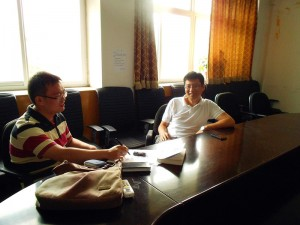

# ＜七星人物＞第十八期：要如何叫醒一个装睡的人？

** **

 

 **人物简介：周濂，1974年12月生于浙江，先后获得北京大学哲学学士、硕士学位，香港中文大学哲学博士学位，2005年11月至今在中国人民大学哲学学院任教，著有《现代政治的正当性基础》，随笔集《你永远都无法叫醒一个装睡的人》等，并在国内外期刊上发表过多篇学术论文。作为一名学者，周濂一直在循着维特根斯坦和罗尔斯指出的道路，向哲学大厦的顶层攀登；作为一位公共知识分子，他试图在“一阶”和“二阶”世界之间找到自己的位置。在刚刚过去的暑假里，周濂担任了立人大学的导师，全程参与了Co-china夏令营，出席了上海书展，并接受了《南方人物周刊》的专访。对于当今的哲学和哲学界，他持有怎样的看法？面对西化的浪潮，我们要如何构建自己的话语体系？“理性爱国”是不作为吗？大学如何在社会中明确自己的角色？在当下的中国，有热情有理想的青年应该做些什么？今晚，瓢虫君将带你走近周濂，让我们一起聆听他给出的答案。** 

#### **一、随笔集和人生**

**Q****：为什么想选“你永远无法叫醒一个装睡的人”作为随笔集的书名呢？没看过您那篇文章的人，单从书名考虑会很容易联想到当下的中国———个叫不醒的国家。这个标题有这样的双关含义吗？**

A：有一点双关。但其实这后面还有半句话没有说出来：除非那个装睡的人自己决定醒来。单看这个书名，很多人可以说我们可以打醒他，可以在他旁边敲锣打鼓，可以放鞭炮；当然叫醒的方式会有很多种，我同意，但我始终觉得真正有价值的醒来方式是他自己决定醒来。我借用威廉斯的一句话：如果苏格拉底问题是有答案的（苏格拉底问题：一个人应该如何生活），那么一定是要他自己去recognize的。一个人应该如何生活？这个问题是抛给每一个人的；而答案其实有千百种，各种各样。要使这个答案有价值，必须是当事人意识到这个答案是他赋予自己的，而不是别人灌输给他的。所以我最后才说：除非这个装睡的人决定自己醒来。

**Q****：您在本书的序言里提到，这些文章虽然涉及“时评政论、影评书评、思想笔录”等多个主题，但归根结底有一个内省的视角。您是怎么理解“内省”这两个字的呢？**

A：内省就是反思，哲学就是一个反思的学问。我当年读哲学有很多动机，其中很重要的一个动机就是我想活得明白，而内省是活得明白的非常重要的途径。这本书里很多文章都不是仅仅在记录这个时代，或者纯粹描述我的思考和阅读，更多的是通过观察这个时代，通过阅读某些文章或是看电影的方式，反观到我自身，思考我的自身和这个时代有什么变化。

**Q****：您曾说您在做的哲学研究介于形而上和形而下之间，就是一阶世界与二阶世界的接口，怎么理解这个1.5阶哲学？**

A：我们日常生活常使用一些超级概念，比如说幸福，正义，人权，自由，其实都是在一阶的意义上使用，但是哲学的反思都在二阶的意义上——我们会问所谓的定义是什么，用法是什么。哲学家都是活动在二阶的概念反思阶段，但是如果过分沉浸其中，就会和一阶的世界渐行渐远；以至于如果你去读今天中国的很多哲学论文，你根本不知道他们在干什么，因为他们讨论的问题，他们思考的方式和我们现实生活是没有关联的。我想一个好的哲学思考应该把这个渐变的过程次第地展开，呈现出来。我在上哲学课或者写专栏的时候就在试图把这个1.5阶世界给端出来。

**Q****：为什么会想到去香港读哲学博士呢？有港大学生说香港的大学往往外在很丰满（国际排名很高），但却缺少精神内核，很多人更在乎的是如何赚钱，因而香港的环境不适合沉下心做学术研究。对这种说法您怎么看？**

A：我去香港很偶然。我硕士毕业以后工作了三年，但一直身在曹营心在汉，向往着回归学术。其实那个时候大家申请国外大学都处于瞎猫撞耗子的状态，并不是有的放矢。我当时只申请了三所大学，一所是香港中文大学，一所是耶鲁大学，还有一所忘记了。那两所拒了我，自然而然就到了香港。关于香港的氛围，我觉得是这样的：没错，香港的确是一个高度商业化的城市，但香港老师都接受了非常严格的学术训练，所以在香港学习能够得到更好的学术训练是毫无疑问的。我建议国内读本科的同学可以读硕期间去香港，作为一个跳板；香港可以作为你去欧美国家留学的一个缓冲地带，她的语言，她的文化，她的饮食，都跟我们比较接近，不会那么陌生，同时又高度的国际化。

#### **二、哲学家眼中的哲学**

**Q****：您多次盛赞维特根斯坦和罗尔斯，他们对您产生了怎样的影响？**

A：这个一言难尽。我大概是94年开始读维特根斯坦，02年开始读罗尔斯，分别读了将近20年和10年。维特根斯坦的课我开过一年，罗尔斯的课开过更多次。维特根斯坦对我的影响可能更根本一些，在读维特根斯坦之前我读哲学始终觉得有点不得其门而入，读到的哲学跟我的思想和气质都格格不入。打个比方，思考问题就像站在跳台上扎猛子，站的高那个猛子就扎得深。我觉得自己在读维特根斯坦之前是站在1米高的跳台，所以那个猛子扎得浅；当我读完维特根斯坦，我觉得我站到了十米高的跳台，使我能够深入到问题的最深处。而罗尔斯的政治哲学是非常缜密和精心打造的一个艺术品，不像我们看到的流俗的哲学家，把话说得很满；罗尔斯会把话说得很有分寸，他的每一句，每一论点都是言之成理，言之确凿，都有自己的考虑。罗尔斯是一个非常真诚的学者，是专业化研究的典范，维特根斯坦是一个非专业化的典范。理论化和体系化上，他们俩都走到了极端，都做到了极致。

**Q****：作为一个哲学研究者，您会不会感觉前人已经穷尽了各种哲学观点，以至于后世的人们很难再进行原创性的工作？**

A：原创性的哲学家在过去100年确实很少，除了维特根斯坦，海德格尔也许算一个。不过如果按这样的标准，2500年能出一个，也是非常了不得的。我很愿意谈谈中国学术界的一点现状，我的感觉是中国学术界目前就像在做一个拼图游戏。中国面对的情况是模板已经丢了，每个人面对同样的素材，根据自己的想象去拼接各种各样的建筑，比如说出现了儒家宪政主义，儒家社会主义共和国等等。这些拼图看似很有想象力，其实只是一堆光怪陆离的建筑。玩这种游戏的人只求新巧，不在乎是否实用，是否住得下去。

**Q****：有人曾经说，哲学家可以分为两类，一类是哲学大家，即康德、海德格尔之类的人物；另一类是哲学工作者，即从事哲学研究和译著的人。因此，从第二个意义上讲，他认为中国当代还是有哲学家的。不知对于这一问题，您又是怎样看的呢?**

A：按照康德和海德格尔的标准，中国当然没有哲学家，西方当代也没有哲学家。不过我觉得中国当代还是有一撮人，在试图用自己的概念、自己的语言去表达比较独特的思想，比如说陈嘉映、赵天阳。这些人我觉得就比较具有哲学家气质，或者说就是中国的哲学家。

**Q****：您会担心科学的发展使得哲学可研究的方面变得越来越窄吗?**

A：会啊，我觉得过去两三百年哲学学科就是变得越来越窄了啊。很多学科可以用实证的方式，用精确的计量来给出一个比较确定的答案，那么这些学科就要从哲学里分离出去了。其实物理学以前就属于哲学嘛，经济学、政治学、心理学等很多社会科学都是从哲学里剥离出来的。

#### **三、回归传统****VS****全盘西化：我们应当何去何从？**

**Q****：您怎么看待当下年轻人中间出现的鼓吹全盘西化的思潮？**

A：我倒是看到了一种回潮，比如说开始穿汉服，开始读四书五经。其实各种文明的核心价值区别并不大，只是具体形式不一样，比如说孝道的形式：爱斯基摩人把父母放进冰窟让他们自生自灭，中国的话则可能是卧冰求鲤。不要小看这些具体仪式在人类生活中发生的作用，我觉得我们所有的价值都是通过外在的仪式以及礼节来表现和固化的。过去100多年，尤其是共产革命之后，仪式基本被打掉，导致我们内心的价值和信念无所依托。今天我们面对很大的一个问题是我们是不是可能借尸还魂，我们是不是可能把那些信念和礼节重新移植到我们现在的生活当中。我个人是怀疑的，因为要把这些仪式强加给每一个人，会造成压迫，违背了自由的原则。

**Q****：汪丁丁老师说过，中国人的价值观中从来没有自由这个维度，因此他觉得有必要在中国的语境下重构关于自由的话语，对这个观点您怎么看？**

A：我觉得我们需要在中国语境下构建所有的话语，或者说需要找到和我们现实土壤的接榫点。我是学西方哲学的，对西方哲学有很强的亲和性，但我从来不认为可以把它直接拿到中国来用。比如说人权这个概念，我们今天对人权的讨论已经陷入僵局：自由主义会说天赋人权，那反对者会说根本没有天赋人权这一说，天赋人权就是臆造出来的想象物。我觉得我们需要重新梳理天赋人权这个脉络，所谓的天赋人权其实背后蕴含了一个很强的假说—自然法，自然权利的传统。但我们知道在中国的传统里是没有自然权利这一说法的，那我们说天赋人权的时候，的确有些人可能不会接受。我经常在想，我们能不能构想另外一套对当下中国人有吸引力的人权理论，一方面与西方的理论有勾连，同时又能呼应我们中国的文化传统以及我们对美好人生的向往。举这些例子是想说明，对于自由人权等超级概念的讨论，我们需要给出一个具体的location，很多争论拿到具体的语境下讨论，分歧就不会那么大。

**Q****：那您如何看待宗教的作用？**

A：宗教在我们生活上留下了很多痕迹，可能我们日用而不知，比如说美国总统在就职需要对基督教进行宣誓，所以说以纯粹的自由主义原则立国，我觉得可能太单薄。我们日常生活经常会出现“你应该做什么”和“你需要做什么”这种带有神命论意味的道德语, 也是宗教留下的痕迹。上帝已经死了，可是上帝的阴影依然存在，我觉得这是现代人在很长一段时间都难以走出的一个大的思想背景。宗教无论是对于古代人还是对于现在人而言，都是心灵安稳的一个基本要素。在这个价值多元的时代，你不能从一个国家的角度去确定某种宗教作为国教，无论这个教是儒教还是基督教，但我觉得在公共生活层面，尽可能多地鼓励各种宗教生活，对于我们这个无根基时代人心的安慰是很重要的。

 **四、公共知识分子，还是“公知”？** 

**Q****：****您是一个经常参与公共讨论的学者，也写过关于公共知识分子如何变成“公知”的文章，您认为公共知识分子和“公知”的界限在哪？**

A:我相信每个人小时候都有绰号，“公知”和公共知识分子的差别就跟你小时候的绰号和你的大名的差别一样。绰号都是带有贬义和嘲讽的，并以某种漫画的形式夸大。“公知”在今天的语境下，特指有自由倾向的公共知识分子，那我觉得这个说法就更加荒诞和滑稽。你比如说吴法天、胡锡进，其实完全符合公共知识分子的特点；他们受过高等教育，经常对公共事务发言。但他们又经常用“公知”给别人扣帽子。我觉得这特别伤害健康理性的公共讨论氛围。今天中国的很多学者，很多公共知识分子也陷入到人身肉搏，污言秽语的攻击当中，这是让我非常遗憾甚至愤怒的一点。

**Q****：您微博上最后一条状态是：“从今天起，挑水砍柴，读书写字，做一个远离围脖珍惜生命的四有新人。”之后再无更新。为什么您选择远离微博这个时下被热捧的新媒体？**

A:不能说逃离吧，我只是回归到常态的生活。我很欣赏微博在传播信息方面的功能，但是微博上的信息高度碎片化、同质化。就我个人来说，作为一个学者，我认为应该把更多的时间放到教书，放到研究上。做研究是需要大把连续的时间，时间碎片化，我就不能focus on我的研究。我现在偶尔也会上去看看信息，比如说钓鱼岛事件，但是不更新。

**Q****：说到钓鱼岛事件，您怎么看待“理性爱国”的主张？有人说那实质上是一种不作为。在面对类似问题的时候，我们到底应该用“干净的手”还是“肮脏的手”？您知道，当年萨特和加缪也为此吵得不可开交。**

A：我当然坚决反对暴力。我倾向于加缪，不认同萨特。我认为如果暴力是一个备选项，那么这个备选项是用尽了一切选项后的备选项，而且暴力所指向的一定不能是无辜的平民。我始终觉得我们在批判体制的时候，批评社会不公的时候，一定要谨慎把矛头指向具体的个人；个人可能存在某种平庸的恶，但绝对不是恶的主动制造者，他们只是被动的或是不自觉的参与者。如果我们把矛头指向广大的普通人，会把矛盾扩大化，会抓了小鱼放了大鱼。我觉得当前体制导致的一个荒谬现象是，体制内所有的受害者彼此倾轧，相互斗争，相互折磨，但不去追问，不去反抗体制本身这个最大的造恶者。这种做法变相地纵容了专制主义，这不公平。

**Q****：您是否认为这次的反日游行是一种“从犬儒主义到爱国主义的过渡”呢？**

A：我不觉得这是犬儒主义，我觉得这就是思想愚昧，是脑子不清楚。在我看来，这些人是彻头彻脑的软蛋，是彻头彻尾的孬种，因为他们知道打着爱国的旗号，是一个非常安全的幌子，可以胡作非为。

#### **五、大学·青年·启蒙**

**Q****：一直有这样两种观点：有人说大学应该更理想主义一点，更象牙塔一点；也有人认为现在大学生毕业找不到工作，因此大学教育应该更世俗一点，更功利一点。您认为这两者应该如何权衡取舍？**

A：我觉得我们现在的大学教育需要做一个巨大的调整。这些年来，很多专业化的院校统统改成大学，我个人觉得这个做法很不明智。真正的大学就是应该象牙塔式的，就是在灌输和培养人文素养，但是并不是所有学生都有资质，都应该接受这种教育。如果说所有的大学都只提供人文教育，不提供专业培训，那有些孩子的确不会适应社会。我们要保存一些专业院校，但现在的大学都声称自己是综合性的大学，其实是在进行职业化的教育，搞得学生和老师都无所适从。我觉得应该给你们一个备选项，比如说你要进人大，你就要做好打算：你是来接受精英教育的，接受非常纯粹的人文教育的。如果你想做工程员，技术员，做办事员，那就去某类专业院校好了。

**Q****：您曾说过“理想主义的黯淡”是这代大学生给您很深的印象。那您觉得这种现象的发生主要是由资本主义带来的生存压力，还是由政治压力导致的呢？**

A：我们说我们今天的社会是权贵资本主义，所以就不仅仅是资本主义。八九年之后，权贵介入经济生活，导致社会经济文化的彻底扭曲，让我们每一个年轻人都感到很强的无力感。这种无力感是全面的，是彻底的——政治的无力，经济的无力，文化的无力。所以我始终说中国的问题是全方面的，不是说从某一个渠道去切入就可以撬动的，我觉得是需要全方位去改造的问题。

**Q:****那您认为要如何改变年轻人这种普遍存在的心态呢？是寄希望于自上而下的改良，还是自下而上的公民参与？**

A: 现在的情况是，越来越多的年轻人意识到身边在发生什么，也慢慢了解到中国的历史、现实甚至未来；现在缺的是为他们提供的参与渠道，勇气和信心。过去十年，我觉得普通人政治意识的觉醒是很明显的，但是政治参与的渠道越来越窄。前者给我更多的信心，后者需要我们自己给自己创造条件。我个人觉得自上而下的改革是一种恩赐，即便有意义也不大，何况我们几乎无法预见它何时会出现。真正有意义的改变需要我们每个人做出努力，比如说NGO，比如说独立参选人，甚至包括我们在微博上的不依不挠的人肉和反腐倡廉。我始终认为，不要一厢情愿等待上层某个开明人士赐给我们一个机会，这种等待是遥遥无期的，甚至是等待戈多。

**Q****：您提到了“普通人的觉醒”，但是我们做北斗经常能看到这样一种现象：很多大学生在“觉醒”，或者说被“启蒙”之后，反而会有更多的意识形态偏见，更热衷于去进行攻击，而不是更多独立的思考，您对这种现象有何看法？**

A：我非常理解你的意思，就是年轻人经常犯的毛病嘛。因为他们在日常生活中很难通过别的方式来证明自我价值，当通过阅读和思考掌握某个利器之后，就迫不及待地想要展示自我；而他们展示自我的方式是攻击别人，笔头或者口头地战胜别人。不过我个人觉得这可能是一个阶段性的问题。我觉得启蒙很重要，哎呀，在今天的中国说启蒙是一件很艰难的事情。首先启蒙的概念已经污名化了，很多人在反启蒙；其次启蒙的方式也很艰难。不过我还是抱有乐观态度，因为中国政府一向在以反启蒙的方式在启蒙大众：它通过打压言论自由让人们意识到言论自由是重要的，它通过打压结社自由让人们意识到结社自由是重要的，她通过任意侵害人们的财产权让人们意识到财产权是重要的——从这个意义上说，中国政府是最大的启蒙者。

 

（编辑： 欧阳银华 王也 郭斯维；责编：张正）

 
