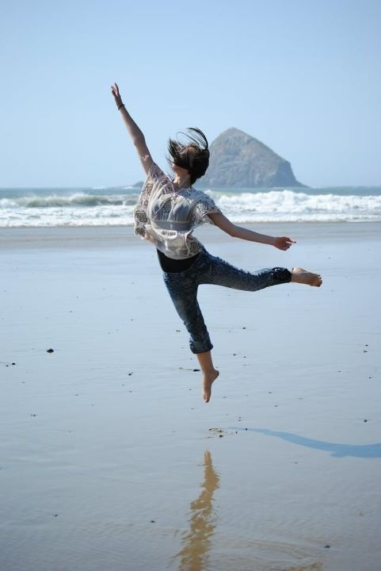
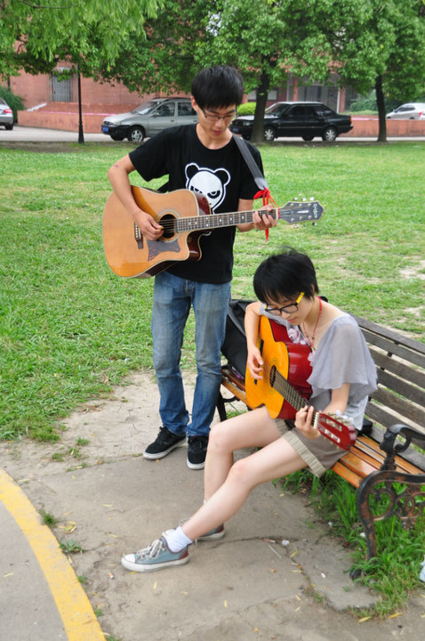
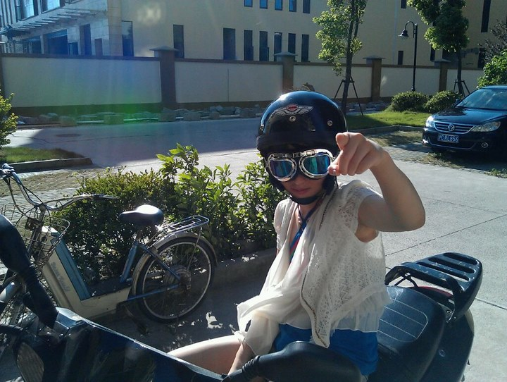
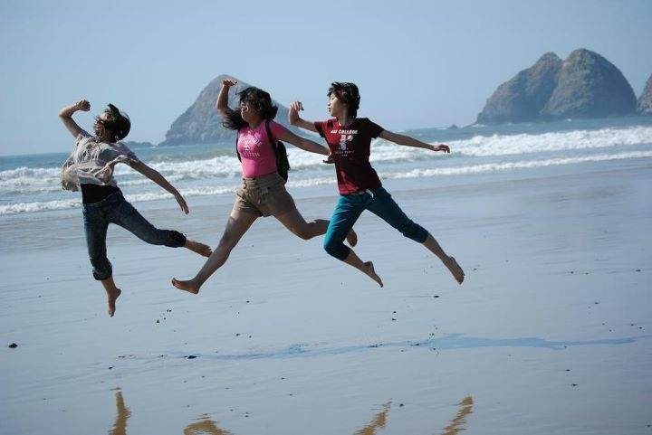

# ＜七星人物＞第十期：大学生活千万种，有一种叫做自我放逐——瓢虫君专访上海交大陈若怡

**《世说新语》曾有言：其山崔嵬以嵯峨，其水浃渫而扬波，其人磊砢而英多。看到陈若怡家乡的照片我不由得想起这句话。** **年轻的人们总会幻想着有那么一个简单的梦想踏上青春的旅途，经历各种奇闻异事，收获快乐与友谊，像《花仙子》、《宠物小精灵》或者《中华小当家》里所描绘的那样，然而我们却在捉襟的账务、慵懒的习惯和不断找借口中消磨了那个最有胆量的自我，这可能也是当下如此多的人喜欢把“在路上”“奔向远方”“背包流浪”之类的词当做自己的签名的原因吧——只因为我们终究无法完全的得到那些。直到有一天，上海交大BBS上出现了一篇短时间内迅速蹿红并被广为转载的帖子——《【自曝末班车】被放逐的肆年》（http://bbs.sjtu.edu.cn/bbstcon?board=CS&reid=1341245706）。我想这篇帖子迅速蹿红的原因还在于我们自己，在于自己曾经的那些梦想：我们以报偿的心态去观赏陈若怡的旅途，赞赏她的磊砢，希望自己也能够获得如此强大的心灵，或许这才是她能在宅圈爆红的根本原因。** **这位姑娘喜好音乐，嗜弹吉他，收藏专辑无数；以大地为家乡，有时跷课旅行流浪，有时也出国实习，浪迹在他乡；时而暴走街头，时而半夜玩滑板；写得了程序，上得了球场，打过地痞，斗过流氓；爱美食，爱舞蹈，也爱看书，她是工科女是程序猿，她也是自由达人是生活控…..其实，你我都知道这种丰富的经历是很难用上述一个个孤立的名词贴标签的，更何况那些所谓的“标签”下，还有着一个依旧甜美与纯真的内核。** **她名叫陈若怡，是上海交通大学08级计算机专业的一名女生，本期北斗人物带你走入她的经历，她的内心。**  

# 大学生活千万种，有一种叫做自我放逐

# ——瓢虫君专访上海交大陈若怡

## 

（远方的远方，除了遥远一无所有。在这贫穷的时代，诗人何为？）

#### 一、生活在别处，得失寸心知

**Q：在那篇令很多人认识了你的帖子中，你给人最大的亮点就是去过很多地方和有着极广的兴趣爱好。可以说说大学四年都去过哪些地方吗？都有哪些兴趣爱好吗？**

A:嗷，我觉得我去过的地方不是很多呐。我喜欢音乐，文学，美食，舞蹈...那些能让人动起来的东西都让人感觉到血液在流淌。生命不是静止的，它们其实都内在相通，给人最自然原始的快乐，比如篮球、滑板、舞蹈、唱歌等，他们看似差别很大，但其实带来人们的快乐都是类似的。

**Q:你的爱好如此广泛，要怎么去均衡呢，会不会觉得生活很累或者时间不够用呢？所以你半夜还在练舞、玩滑板，并用疯狂暴走方式压缩你的休息时间？**

A:我虽然没什么不愿意尝试的东西，但是很早开始就努力节制不发展新的爱好啦。这才是生活：没有一堆喜欢做的事情在背后支撑着，那真的太索然无味了。它们只给我带来快乐而已，不会带来任何压力，我又不追求什么成绩，怎么会累呢？我放弃那些爱好的时候生活反倒挺累的！时间永远不够用的，跟爱好多少没有关系。

没有啊，我最喜欢的就是休息，我只是总是失眠而已。我基本都睡不着觉，大多是在翻来覆去睡不着之后，才起来出去转转，都是强打精神的；如果能休息，我绝对在睡觉了。

**Q:你开始节制发展新的爱好，是觉得喜欢很多东西不太好么？又或者觉着是因为时间和精力有限，生命承受不起如此多重量呢？**

A:嗯，我不想有那么多爱好，我可不想喜欢那么多东西。对嘛，喜欢什么总想去多了解一些，去做的更好，所以时间只能分给有限的几样东西。

**Q:你笔下写出的生活似乎充满坎坷和辛酸，但又一路欢歌，一路收获。自我放逐的四年中，你觉得你最大的收获是什么？**

A:最大的收获是心智上的成长，是终于明白了听从自我的声音有多么的重要，同时从封闭的自我走出来，懂得了如何与他人交流，收获了很多珍贵的友谊，不再是单枪匹马、孤身跋涉了，而这些也都是从经历和教训中得来的。我终于发现自己是再也不可能受不了很大的委屈了，我只能年轻一次，只有对自己负责才有办法对爱我的人负责；不会再像以前一样把别人的期望都承担在自己肩上了。

**Q:那你为此付出了哪些代价啊？**

A:付出的代价好大啊，哈哈。首先是健康，我以前是个习惯很好、很健康的小孩，到大学之后全丢了。现在可谓遍体鳞伤浑身是病，前面说“经常听见死神的声音”就是因为我这不争气的身体状况，然后是我觉得我辜负了自己，也辜负了很多原本喜欢我的人，我一步步从谷底爬起来的路上，很多朋友对我从开始的喜欢甚至崇拜，到后来渐渐失望，甚至远离。

我知道我一定伤害过不少人，因为太沉浸在自己的世界里，为自己的烦恼而整日整夜地思虑，根本无暇顾及他人。关心我的人，我纵使很感激很想给予回应，也总是无暇让自己分出一点心思去关心他们。

**Q:从帖子来看，你是一个昂着头往前走的人，不后悔不回头的人。那作为一个过来人，回首走过的路，你是否心有遗憾？有哪些遗憾？**

A:遗憾嘛，当然就是因为很多方面我自己做得不好。年少无知的时候，不该那样委屈自己去读一个并不热爱的专业，高考失败后带着自责的心理把自己封闭起来，放弃了一切爱好和与外界交流的机会，这真是亏大了。过了很久，醒悟之后，算是放下枷锁和压力。我很遗憾自己没有找回之前那种努力的习惯，我感觉大学后两年都不再那么努力了。无论做什么都没有尽全力，导致我一直想去的巴黎高科也没考上，最最遗憾的是失去了健康（或者说健康的生活习惯），因为这个坏影响是无法弥补的。

#### 二、自由在高处，一直在路上

**Q:从你的文章可以看出，你特别追求对生活的体验和对自由的践行，是吗？**

A:算是吧！痞子气的说法，那简直就是凯鲁亚克的风格——“活在当下”，起码我现在会这么回答你。我可以骗你说only good things happen么？ 我追求的是没有羁绊和束缚的人生、自我价值的实现，但我的“自由”并不是指刻意规避现实中的障碍、规则和不顺，这些都是命运交给、自己无法改变的事实，我能做的只是接受它。

**Q：事实上，你常常自由地让周围的人“恨得痒痒”，请问你是怎么理解自由的呢？**

A:自由就是我现在站在这里，无论是泥沼还是浪尖，我都保有全部的权利走开。不要禁锢自己的思想，进而禁锢自己的行动，所有已经发生的一切都是应该发生的，都是好事，我没有多余时间拿来抱怨和哀叹，只有迅速接受事实然后继续朝着自己想去的方向走下去。

**Q:你为什么想要过这样的生活呢？从你的经历可以看出，大一时，你是专业第二，每天过着预习、复习、做题、编程的生活，是什么因素改变了你对那种生活的态度呢？**

A:首先，我就是从自由淳朴的环境中长大的，大概一生都在寻找回归吧；另外在成长的时间里，自己经历了太多压抑、彷徨和不顺，最后跌跌撞撞站起来时，才明白什么于自己是最重要的。PS：大一、大二、大三时，我都是专业第二呢，而且大一、大二时我们还没分专业，那时候我可是全院第二，整个电院的！

**Q:自由很重要的一个前提是独立。同时，自由也常常伴随着孤独，独自一个人在路上时，会害怕吗？**

A:你说的很对哦，一个人必须独立才能游刃有余地面对外面的世界。这个独立首先就是经济独立，好在我基本都能自己解决。我从来没感觉到害怕什么的，黑暗和行走中的风景倒都让我觉得很安全。小时候爸爸妈妈带我出去玩时，也总是会把我“丢掉”——我会很自觉地走丢，然后一个人跟树水沙石玩好久。

**Q:你是怎样在大学里做到经济独立的呢？是完全的独立，从不问家里要钱吗？**

A:主要是奖学金呀，比如大一得过两个奖学金，一个是三得利奖学金9600，一个是学校的一等优秀奖学金1500，这两个都是只看成绩的，再加上每年也许会有几千助学金，学费肯定没问题了。大一大二可能生活还算拮据，反正我唯一的花销就只是吃饭而已，别的也没啥~~大三开始实习，所以有收入之后就更好办了。我从来没问家里要过钱呃，虽然家里可能偷偷给我卡里存过钱。

**Q:在路上遇到了各式各样的朋友，你觉得他们在你的体验中充当着什么角色呢？有因为哪位朋友而失望过吗？**

A:朋友就是天使呢！朋友给了我自己一个人无法获得的力量，让我重拾对生活的热情。他们给我源源不断的存在感，他们就是那些无论我多落魄、多难堪，也会陪在我身边、鼓励我、支持我的人。没有一路上各种朋友的影响，我看到的世界根本不可能那么宽旷。

还没有朋友让我失望过，只有我觉得自己不够努力，而让他们失望的，哈哈。每个人身上都有闪光的值得学习的地方，我很感激他们。

**Q:非洲有一句古老的谚语：要想走得快，请独自上路；要想走得远，请结伴而行。对于你的同学而言，你独自而行走了另一条路；但你的生活并不孤单，一路上你结识了很多朋友。你是如何看待“走得远”和“走得快”的关系呢？**

A:哈哈，那句话说的挺好“走得快”，我“小时候”可以说，就是独自一人走得很快吧，都把同龄人甩在后面啦。但是在自己的世界里一意孤行，只和书中那些遥远的亡灵交流，看到的风景真的很有限。后来我结识了越来越多的朋友，他们也就成了我分布在世界各个角落的“眼睛”，让我看见各个维度里的世界，教给我各种生活的哲学，分享各种文化中的精彩和乐趣，于是，我终于可以走得比我自己更远了。

#### 三、放逐的边界，明天的明天

**Q:自由是有边界的，你认为作为一个学生，追求自由生活的下限是什么呢？**

A:对自己负责，不给人添麻烦。可以学习不好，可以人缘不好，但是一定不能虚度光阴，要用所有年轻的时间去尝试，要知道自己喜欢什么；不能再依赖别人。

**Q:能分享下，你用哪些现实的路径来实现那种你想要的自由吗？**

A:呃，我觉得自由是一种心态，先得有这淡然的态度，才会有如鱼得水的生活。现实途径的话还是挺多的，人的自信不能只有一个支点，可以培养自己的几个专长，每个都能或多或少地养活自己。

**Q:我记得你在一篇日志里写到：“学校什么的，是资源，是港湾，也是桎梏。”并在不想学习时给出了理直气壮的理由：“厌恶的不是知识本身，而是那一套病态的培养体系以及随之而来的经年累月的巨大压力。”你如何看待国内的大学教育呢？**

A:说这个好累的，我想其实大家都明白呀。国内的大学教育太像高中的延续了，但是又不像高中那样步步紧逼，这样单方面填鸭的结果就是效率极低。我觉得太缺乏对兴趣的挖掘、引导和培养了，我极少看见凭着自己的热情在钻研的学生，只见过留学生如此。

首先大学的制度就很死板，很不人性化，我们不能自由选择自己想学的课程、发现选了不感兴趣的专业也很难“转行”。然后师资力量也很不够，我大学里遇见那么多老师，说实话，让我有兴趣去听课的真的寥寥无几，很多老师自己都不热爱自己教授的那个领域，学生问的问题也都是敷衍过去。对学生本身来说，我觉得教育也是整个社会的投影，现在中国的各行各业都给我一样的感觉，那就是人们不是凭借着热情在做事，包括在校园内外，人们都习惯性地把事情当做任务来做，甚至只是单纯为了获得经济利益，所以不在乎质量和手段。我多希望能像我在美国看到的那样，人们都为自己拿出的“作品”而感到骄傲。

**Q:当下，中国年轻人的现实压力很大，甚至远高于一些西方国家。这无疑增加了追逐梦想的成本和代价，你是怎么看这一点的呢？不会说“挑战更多意味着机会更多”这样的话吧？**

A:对，确实在中国生存不易。如果没有很牛的一技之长，很难挣得一席之地了。但是中国还是一个迅速成长的社会，一切都在调整和完善之中。我相信复杂纷乱的环境会提供更多的机会，正是因为她的不完善和不完美，年轻人才有用武之地啊。我觉得现在这个物欲横流的社会有些像the beat generation(垮掉的一代），一定有很多年轻人正在迷惘（所以中国摇滚才会遍地开花），他们会上路、会探索、会做很多疯狂的事情，但是最后也总会有重见天日的时候。

坚持努力的人一定会有好果子吃的，犯错的人也终会被原谅。说这么一句话吧：Everything would be alright at the end; and if it's not alright, this is not the end，反正我一直是乐观着的。

**Q:你决定进入职场，那以后的工作意向是什么呢?**

A:以后是指多远以后呢？我觉得我会一直换工作的吧,因为我不知道我最擅长又最喜欢的到底是什么，但肯定不和计算机相关。对我来说，现在我要先做自己能做好的事。等到不想再坚持的时候，自然就是换一个环境的成熟时机了。因为我知道自己对另一些事业更具热情，而平素又有些积累，所以总会有另一条路在等我。

**Q:作为一个大学毕业的学姐（虽然你的长相常常被人逗趣为小学生的面庞），你想跟还在上现在这种大环境下上学的大学生说点什么吗？**

A:呃。Follow your heart. 别再观望别人的生活，别再静止在电脑前，抓紧享受青春吧，抓紧开始自己的生活。

 

### 【小编手记】

人物组前面几期采访的人，都是一定社会轰动事件里的主角，相比之下，陈若怡似乎不值得采访，比如，她没有轰动全国的壮举，也没有号令粉丝的影响力，可是她用四年完成了一个惊艳的大学生活，比起坐在电脑前follow other’s way去生活的人，她真的精彩很多。

灵魂的面孔有千千万万种，生活的模式也绝不止于一种。然而最精彩的生活模式一定存在于内心，静卧在灵魂深处；最精彩的人生也一定包括实现了自己内心那份最原始的冲动。这是一个最好的时代：梦想遍地开花，机遇无处不在；这也是一个最坏的时代：现实步步进逼，理想节节败退。当社会阶层的流动性变得越来越低，当体制的高墙开始日益高涨，太多的年轻人因为害怕被撞成碎了一地的鸡蛋，而向生活投降。于是这个社会开始抱怨，年轻人也不再年轻。

过自己想要的生活，成为自己喜欢的人，不之于人反求诸己。从这个意义上说，陈若怡的大学生活无疑大气而高贵，但她高贵得与人无关。每一个人都有这样的机会，但真的每一个人都愿意为之努力吗？生活在别处，生活更在自己的脚下。

 

（编辑：欧阳银华 罗晓 杜青铃；责编：张正）

 
