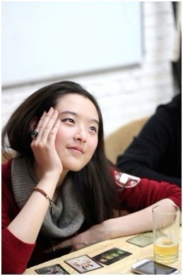
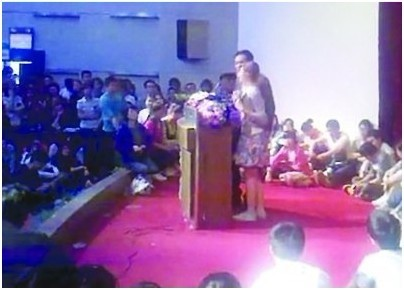
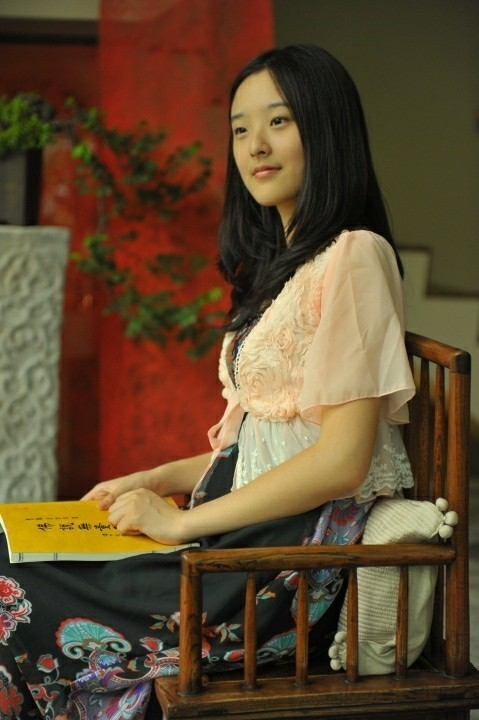

# ＜七星人物＞第四期：从“踢馆门”到“北漂女”——瓢虫君专访杜阿姨

**当年毕业之后，杜慧颖为了和男友相聚，离开家乡，北上京城，开始了她的“北漂”生活。如今的她，在异乡过得如何？从“踢馆门”的一炮而红，到“北漂女”的琐碎辛酸，她又走过了一段怎样的心路历程？今天的七星人物，我们将带您走近杜阿姨，去探访这位出身平凡，而又特立独行的上海女子鲜为人知的内心世界。**  

# **从“踢馆门”到“北漂女”**

## ——**瓢虫君专访杜阿姨**

 

#### 人物简介：

 杜慧颖——熟人们更愿意叫她“杜阿姨”，上海人，南京大学哲学系2007级本科生，目前在北京一家活动公关公司担任客户经理。2011年4月27日，号称“打工皇帝”，当时正身陷学历造假风波的新华都总裁唐骏，在南林举办了一场主题为“我的成功可以复制”的讲座。在讲座最后的提问环节，杜慧颖出人意料地冲上讲台，当面向唐骏抛出了一连串尖锐问题，并在现场散发“西太平洋大学”——传言中唐骏真正的美国母校——的学历证书复印件。这一“踢馆”事件被国内各大媒体竞相报道，并在网络上引起了广泛而热烈的争论。当年毕业之后，杜慧颖为了和男友相聚，离开家乡，北上京城，开始了她的“北漂”生活。如今的她，在异乡过得如何？从“踢馆门”的一炮而红，到“北漂女”的琐碎辛酸，她又走过了一段怎样的心路历程？今天的七星人物，我们将带您走近杜阿姨，去探访这位出身平凡，而又特立独行的上海女子鲜为人知的内心世界。 

#### 第一部分：“踢馆门”，那些你不知道的事

 瓢虫君：我想大部分人听说你应该还是因为“踢馆门”的事儿，那咱们就还从这儿说起吧~当初是怎么想到要去“踢馆”的呢？ 杜阿姨：一开始是在南京的一次朋友聚会上吧，有人提到唐骏下周会去南林做讲座。然后大家就都觉得，像唐骏这样的人怎么还好意思去大学里开讲座啊？聊着聊着我们就说起前一年伍皓[i]演讲被人扔五毛的事情，就有人建议说，我们也来搞一下（类似的活动）吧！大家就都同意了。这个主意最早是谁想出来的现在我已经记不太清楚了，反正那之后一个星期，我们就去了（唐骏的讲座）。  瓢虫君：然后就发生了这个事情（指踢馆）？ 杜阿姨：对 

（现场图片）

 瓢虫君：我们都知道呢，“踢馆”这个新闻被国内各大媒体转载，然后你就“出名”了。这个事情对你有怎么样的影响？你的生活因此有怎样的改变呢？ 杜阿姨：可以说有非常大的改变，之后就一直有记者过来采访，那一段时间，有半个月吧，都处在走路轻飘飘的那种状态里。但是过了一段时间呢，就发现还是得面对现实的生活，写毕业论文啊，找工作什么的。到后来开始工作了，我就不太愿意跟人家提起这件事情了。  瓢虫君：那你身边的同事知道你过去有这么一段经历么？ 杜阿姨：我现在的同事都不知道这个事情。我其实不太想让这个一瞬间的事情跟随我一辈子了，好像打在身上的logo一样，后来有段时间一直在避讳这个话题。但是到现在呢就觉得也蛮接受这个事情啦，就是别人谈到的时候我的态度也比较坦然。  瓢虫君：跟你比较亲近的人，比如你的父母啊，老师啊，同学啊，对你“踢馆”这件事有什么看法？ 杜阿姨：大部分的人还是蛮支持的。比如说我妈妈吧，这个事一开始的时候我没告诉她，直到第二天要见报了，我才跟她讲，妈妈你明天去买一份扬子晚报吧，然后她才知道了这个事情。  瓢虫君：就是说你妈妈是从报纸上才知道你做了这么一件事。 杜阿姨：对的，因为当时我在南京上学，我妈妈在上海嘛。她看完报纸之后，就又到网上去找了视频来看。其实我当时非常忐忑，因为我不知道我妈对这个事会怎么看。你知道家长总会教育孩子“枪打出头鸟”什么的嘛。但是我非常感动的是，我妈妈后来给我打电话，第一句话是：“哎呀，你当时要是别那么紧张，说话再清楚一点就好了。”我就觉得我妈妈真的是非常通情达理的。至于其他的老师啊同学啊，也没有给我一个特别负面的反馈吧。  瓢虫君：那“踢馆”这件事还有什么后续的发展么？你跟唐骏还有没有再产生交集？ 杜阿姨：没有没有，之后就是他过他的生活，我过我的生活，就是每次网上一有唐骏的新闻都会有人（在人人网上）@我……  瓢虫君（笑）：好吧~其实我觉得吧，在生活里你应该还是一个蛮腼腆的人，像你这样的一个人怎么会去做像“踢馆”这样在外人看来有些“出格”的事情呢？ 杜阿姨：其实我只是外表很羞涩，而内心是一个重口味的人（笑）。我小时候是一个特别闷的人，然后长大了就成了一个特别闷骚的人。闷骚积累到一定程度，就要找个口子释放出来嘛…… 

 瓢虫君：所以唐骏等于是撞上了你正好积累了很多闷骚的那几天~ 杜阿姨：对的~  瓢虫君：那你现在在北京了，如果唐骏哪天在北京某个大学里办演讲，你还会不会再上门去“踢馆”呢？ 杜阿姨：首先我得看自己有没有那个时间和精力；其次呢我当时做那件事不是为了炒作，只是一腔热血，但现在我已经有了铺垫在前面了，再做类似的事就得考虑会有什么样的影响。毕竟我现在也有自己的工作和生活。 

#### 第二部分：家乡诚可贵，爱情价更高

 瓢虫君：那接下来呢希望杜阿姨能跟我们分享一下你现在的生活。我知道你当初是为了爱情放弃了上海的工作，一个人来到北京，那在家里肯定会遇到一些阻力吧？ 杜阿姨：对  瓢虫君：那你是怎么克服这种阻力的呢？ 杜阿姨：我从小跟我妈妈的关系都蛮好的，父母也都习惯于听我讲我为什么要做某件事情。他们也知道我做的每件事都是为自己负责任的，所以他们对我也都很放心，一贯的态度就是，不支持，不反对。我妈妈当然觉得还是留在上海好了，不过既然我有我自己的理由，他们也就没再说什么。  瓢虫君：你妈妈知道你是因为感情的缘故来北京的么？ 杜阿姨：我没有明说啦，不过我妈妈是个很聪明的人，她必然猜得到会有这方面的原因。  瓢虫君：能不能讲一讲你认识你男朋友的这段故事？ 杜阿姨：哦，我们是前年10月8号在一个朋友聚会上认识的。刚认识他的时候我觉得，哇这个男生怎么这么能说，结果后来才知道他在朋友圈子里是一个出了名的很闷的人。有个朋友说，他那天晚上说的话比之前所有聚会加起来都要多。  瓢虫君：这么说来他是对你一见钟情啊~ 杜阿姨；嗯，他那天晚上见了我就像打了鸡血一样……当时我觉得诶怎么会有那么屌丝的人，不过接触久了就发现这人还蛮好玩的。  瓢虫君：那能不能描述一下，你男朋友是一个怎么样的人，居然可以让你放弃在上海的工作，一个人跑到北京来投奔他？ 杜阿姨：感情这种事是很难用理性来描述的啦，我其实自己也斗争了很久，理智上讲当然留在上海发展会比较好，但是他因为某种原因不能来上海嘛。当时我们最长有将近六个月的时间没有见面，其实是蛮痛苦，中间也分分合合，吵过很多次。在我来北京之前我们还差点分手了，不过最后还是和好了，所以我觉得我们还是在一起会比较好，因为两个人发生矛盾的时候距离会把矛盾加剧嘛，现在我们发生矛盾的话，一般当天晚上就可以解决。而且原来异地的时候，要见一次面就要花很大的代价，无论是金钱上还是时间上，有时候还会导致家庭的矛盾。像现在这样虽然离得还是挺远，但至少每周可以见一次面，方便很多。  瓢虫君：其实你上面讲的这段话应该叫“杜阿姨谈异地恋”~ 杜阿姨（笑）：没有啦，其实杜阿姨的异地恋是比较失败滴~ 

#### 第三部分：北漂女的职场生活

 瓢虫君：毕业之后为什么会想到要进入艺术这个行当呢？ 杜阿姨：其实我毕业之后第一份工作是房地产的管理咨询，但后来就觉得咨询这种苦逼的生活实在不适合自己。后来就回到上海了，正好看到一个画廊在招聘。我自己是学哲学的，对艺术这种有一点了解，就决定试一试。后来感觉发展前途不大，工资又低，加上决定来北京，就没有做下去。到北京之后呢因为比较准备比较仓促，之前的工作经验也是在画廊嘛，于是就投了一家艺术杂志，然后就被录用了。但做了几个月还是觉得自己不适合艺术圈，和上级相处得也不愉快，所以在转正之前就辞职了。那段时间我我住在一个闺蜜家里，可以说是非常落魄啦，如果自己是个男人的话就肯定是胡子拉碴的那种感觉~然后我就想自己到底适合做什么，想来想去发现自己在学校做活动策划的时候工作状态特别好，于是就投了一家公关公司。面试那天是总裁亲自主持，当时真的就有一种一拍即合的感觉，就是说我觉得，对！这就是我要做的事情，他也觉得这就是他要找的人。所以到现在呢工作什么的都还蛮顺利的。  瓢虫君：那现在你从事的是你理想的职业吗？ 杜阿姨：嗯我现在做的就是我理想的职业。我觉得是这样，人不可能一生出来就知道自己要做什么，这是一个漫长的寻觅的过程，像我就是在大学里做商业实践类的社团做得非常开心，后来在公关公司做了一段，感觉真是在这个环境里自己的能量可以完全爆发出来，感觉这就是我要做的事情。  瓢虫君：来北京小半年来，对北京的印象怎么样？ 杜阿姨：这个很难讲，其实我适应能力还蛮强啦，但作为一个南方人，对北方的很多事情也确实挺无奈的。  瓢虫君：比如气候？ 杜阿姨：对，比如北京的气候很干燥嘛，我就只能在家里放加湿器，然后平时多喝水。再比如说北京的交通很差，那就没办法只能去适应了，每次出门都要先把路线搜好。然后北京的地铁的换乘总是莫名其妙地要走很远，每个包都要安检我觉得也挺没必要的。  瓢虫君：那北京有没有什么地方是你特别喜欢的？ 杜阿姨：我觉得北京让我特别喜欢的一点就是我在这边朋友特别多，很多在网上认识的朋友，平时可以一起出来打个麻将吃个烧烤什么的~（笑）  瓢虫君：如果成本不是问题的话，你更愿意和你男朋友去哪里生活，或者说你更愿意过一种怎么样的生活？ 杜阿姨：我其实还是想出国，因为国内的商业氛围还是比较差，而且从人身安全的角度来讲可能国外更有保障一点，从环境到食品安全，还有财产安全的角度考虑，都还是做个外国人比较好……  瓢虫君：特别是对于女生来说要考虑孩子的问题~ 杜阿姨：对对对，像我现在周围的朋友大多都会觉得生孩子还是生在国外比较好。  瓢虫君：我知道你学过德语，那是不是还是会倾向于去德国？ 杜阿姨：对吧，我从高中开始看F1嘛，特别喜欢舒马赫，顺带着就开始了解德国，然后就非常想学德语。大三的时候比较闲嘛，当时想到再不学可能这辈子都没机会了，就下了决心去学。当时为了学德语，冬天的时候每天五六点起床去市中心学德语，一直到晚上再赶校车回宿舍。当时我对德语沉迷到天天泡图书馆，非常来劲地整整一天都用来背德语课文，你想我要是读哲学书读两分钟就睡着了……不过我要是带着我男朋友一起的话应该还是会尽量去一个英语国家…… 

#### 第四部分：大学啊，我的大学

 瓢虫君：作为一个已经进入社会一年的毕业生，你对在校大学生，特别是即将进入社会的大四学生有什么建议么？ 杜阿姨：好有成功学讲座的感觉（笑）~我是觉得在职业发展上呢，一个人只有特别的踏实，特别的坚持，才能有一个比较好的发展。人生中总有去尝试各种事情的冲动嘛，但是还是要把当前的事儿踏踏实实做好，把握好最值得自己花精力去做的事，而不是总觉得这个也很好那个也很好。我觉得给自己的选择太多可能也不是一个很好的事儿。  瓢虫君：你觉得四年的大学教育带给你的最重要的东西是什么呢？ 杜阿姨：我觉得大学只是一个平台。从这个平台走出来的人，好的也有坏的也有，关键还看你自己怎么去利用和把握。对我来说大学里最大的收获一是社团经历，二是很多的好朋友，还有就是有大把的时间可以去做自己想做的事情。很多人的大学浑浑噩噩就过去了，我觉得其实可以利用这个平台做一些更有意义的事情。  瓢虫君：大学里有没有哪位老师让你印象特别深刻呢？ 杜阿姨：肯定是高华[ii]老师了。我在大三的时候认识的高老师，那时候他已经是肝癌了。我从来没有看到任何一个病人像那他那么坚强，他就一直相信自己是有希望的，然后去找各种不同的手段来维持自己的生命。你知道肝癌（病情加重）是很快的，但是高老师硬是撑了四年。我觉得要是我应该就放弃了然后回家等死这样。 

 瓢虫君：当初为什么选哲学系？ 杜阿姨：因为我从高中时候就觉得，像外语啊商科啊会计这些，都只是一项技能。技能这样的东西呢，其实并不一定要在大学里面学的。我妈四十多岁的时候还能转行去做会计，所以我觉得上大学应该去学一些对人生来说更重要的东西。  瓢虫君：你是上海的考生，今年年初有传言说上海要放开异地考生参加高考，网络上对此议论纷纷，特别是上海学生意见很大，你怎么看这件事情？ 杜阿姨：我觉得这件事从道理上讲没什么问题，但是实践中有很多问题需要解决。这其实是一个利益分割的问题嘛，但我们这个国家现在的问题就是民众对社会议题的讨论放得还不够开，同时也很难影响上层的决策。我觉得应该让利益相关群体“打一架”，打完之后做出的决定大家都心服口服。这个“打架”的过程就是利益分割，相互妥协的过程。否则上面命令式的决定，不管怎样都会让人觉得是自己吃亏了。  瓢虫君：你认同是否如网络上一些言论，就是说北京和上海的考生在现行的高考制度下是既得利益者？ 杜阿姨：我觉得这个问题还是要分开看吧，比如说很多上海小孩子呢其实都是没有童年的人，从小就要学英语学奥数学弹琴等等。有的外地小孩子呢可能只是小时候都是玩过来的，就是中学时候苦了那么几年嘛。那我们从小吃了那么多苦，又要去跟谁说呢？我这不是在为北京上海的学生辩护，我只是认为谁都不容易。我觉得解决这个问题的思路应该是把“让全国各地的学生都能上北大复旦”的资源，用到“每个省市都有好的教育资源”上来。这样还解决了人才滞留北上广，城乡发展不平衡的诸多问题。  瓢虫君：最后一个问题~你是北斗的老读者了，能不能谈谈你和北斗结识的故事，以及对北斗的看法和期望？ 杜阿姨：结识北斗呢主要是通过我男朋友吧。作为北斗的老读者呢，我觉得现在北斗上文章越来越多样化，很多作者我都没有听说过。这当然说明北斗在进步嘛，但是有的时候我就会想，我以前熟知的那些名字都去哪了呢？  瓢虫君：这个你可以放心，我们马上就要推出北辰专栏，到时候很多大家熟悉的撰稿人会在北斗主站上通过专栏的形式和大家沟通，敬请期待。那么感谢杜阿姨接受我们的采访~ 杜阿姨：啊不客气不客气~ 

#### 小编手记：

第一次知道杜慧颖这么个人，是在去年的四月份，“踢馆门”风波之前。那时候我刚加入瓢虫君团队不久，杜慧颖还是瓢虫的一名工作人员，不过在群里并没怎么露过面。但“酱油杜慧颖”这个令人忍俊不禁的的群名片，着实给我留下了很深的印象。那年的4月27号晚上，人人网上突然疯传开唐骏在南京林业大学演讲，遭到南大女生“踢馆”的新闻。点开标题，看到女主角名字的一刻，我不由呆住：杜慧颖！？那个敢于当面向唐骏“呛声”的奇女子，竟然会是她？我在人人网上看过她的照片，但怎么也想不到，照片上那笑容温婉的江南少女，竟做得出如此刚烈决绝的事情。之后的一次瓢虫团队聚餐上，我第一次见到了这位传说中的“杜阿姨”。一袭蓝色长裙的她，看上去羞涩腼腆，说起话来细声细气，丝毫不见“踢馆”时的犀利和霸气。后来我想，或许这就是江南读书人的本色？平日里温文尔雅，而一旦触及底线，则据理力争，寸步不让，就如同在崖山投海的陆秀夫，和明末抗阉的东林党人那样。

后来我到北京读书，不久便听说了她也要北上的消息。我颇为讶异——我在上海生活了四年，很清楚当地的父母大多不愿自己的孩子离开生于斯长于斯的城市。在北京我和杜阿姨也见过几面，然而大抵是在朋友聚会上，一直未能与她作促膝长谈。此次瓢虫团队提出采访杜阿姨的计划，我自然自告奋勇，欣然领命。两个小时的访谈里，我不但对杜阿姨有了很多全新的认识，也从她的人生经历之中获益匪浅。其实对我们来说，身边人的故事，反而比那些遥远的英雄事迹更能引起共鸣，更加振奋人心。最后，感谢你花时间看完了这篇长长的访谈稿，希望从她的生活点滴中，你能找到自己人生的缩影；希望她的奋斗经历，也能给你启迪和教训。我们创办七星人物这个栏目的初衷，也正在于此。

 

### 【相关阅读】

 腾讯网科技频道新闻《[唐骏南京林业大学讲座遭女生“踢馆”](http://rrurl.cn/oAxQli)》 七星视点第十五期 《[唐骏南林演讲遭遇“踢馆”，快来瞅瞅大家怎么看！](http://blog.renren.com/blog/362359989/724730119?frommyblog)》  [i] 伍皓事件：2010年4月22日，云南省委宣传部副部长伍皓应邀到中国人民大学思科网真演播室演讲时，被三名网友当面抛撒60张五毛面值的人民币。事后伍皓称尊重对方行为：“出现这种情况是很正常的，是表达意见的一种方式”。 [ii] 高华，南京大学历史系教授，“新党史学派”代表人物之一，写有《红太阳是如何升起的》等著作，2011年12月26日因肝癌不幸辞世。  

（编辑：王也）

 
