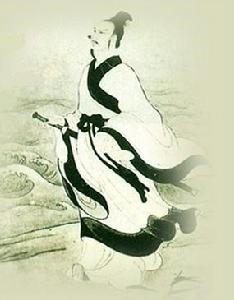

# ＜七星微语·一周状态撷萃＞第九期：幽默感和人生，西红柿和城管，《建党伟业》六部曲，雷声中的四六级

 

# 七星微语·一周状态撷萃

## 第九期：幽默感和人生，西红柿和城管，《建党伟业》六部曲，雷声中的四六级

  **瓢虫君：**各位读者，小瓢虫这厢有礼了。七星微语第九期来了！如果你也想在七星微语中看到你的微博，请在人人网**@瓢虫君**或新浪微博**@七星瓢虫君**！  在此每条微博前标注的作者名仅仅表示瓢虫君能看到的转发的最源头，大多是该微博的原创作者，但**并不排除是其转发的可能呦**。链接点点更健康！ 

#### 【说事】

[常遠](http://www.renren.com/profile.do?id=188752901): 一个人活着最重要特质是什么？聪明？好奇？有趣？我想是幽默感。人生是苦的，幽默可以抵御虚无和绝望，幽默的人更达观、爱生活；幽默给他人带去欢乐，有趣，人缘不可能差；有幽默感的人善于自嘲和解构，而自嘲本就需要底气和智慧，所以幽默的人又是聪明自信的。但很遗憾，幽默感往往是天生的。 

 [常遠](http://www.renren.com/profile.do?id=188752901): 莫让别人轻意入你大脑，告诉你要做这那，不买房就不能结婚不考公务员就没有前途，要在内心划出清醒的边界。你是谁？你要去哪里？你对世界的sight是什么？外界的嘈杂不能阻止在你内心横冲直撞那挺立的自我，为什么你不敢对那些想要同化、标准化你的现有社会化力量说一声，去你X的，谁才是未来？ [朝夕](http://www.renren.com/profile.do?id=200486331) :怎么区分社会工作者是爱惜羽毛还是沽名钓誉？一、前者从不轻易承诺；后者到处许诺；二、前者对于立场不屈服；后者轻易屈服众论；三、前者谨慎说牺牲；后者动不动就无量头颅无量血；四、前者讲理性；后者讲博爱。根据我的标准，某个人是前者还是后者，实在了然。 [王倩茹](http://helenwang.renren.com/?id=248657965): 将来如果我没做记者也没做律师，那你十有八九能在某个NGO找到我。我会欣喜你的到来，拉着你滔滔不绝的说我们帮助了很多贫困学子，说越来越多同性恋们敢于公开自己的身份，又或者说我们努力延续了一个濒临灭绝的物种。无论是何者，我能肯定的是我会骄傲的说：这里每一项开支都透明公开、有据可查…… 

#### 【吐槽】

[翟恩南](http://www.renren.com/profile.do?id=53693018): 论文中作者顺序和实际贡献情况：美国高校论文，香港高校论文，大陆高校论文，中科院写论文 …… [李剑](http://www.renren.com/profile.do?id=277246568) :阿甘Beta ：打越南，我觉得应该是海陆空全方位立体打击，铁血论坛用户从水路进发，强国社区用户从地面进攻，然后空投乌有之乡用户轰炸。 [张备](http://www.renren.com/profile.do?id=245374019) :来自剑桥的Keith教授说卖电脑要像卖蔬菜，周转要快。他打了个比方“40度烈日下，你在马路边守着200公斤西红柿要卖掉，你最担心什么？”同学们异口同声“城管”……K教授很迷茫的换了一个案例…… 

 [陈轩](http://www.renren.com/profile.do?id=235008536) :《建国大业》毛泽东和杨开慧除夕夜一场戏，毛泽东先是饭前在姑娘面前装逼卖弄学问，给她讲解文昆（李大钊）的文章，顺便扯俄国革命——但全是别人观点。然后在人家说不会喝酒时还强劝酒。最后雪地里看烟花就把人抱起来。唉，一百年过去了，宅男泡妞手段一点进步也没有。（编者注：应为《建党伟业》） [陈轩](http://www.renren.com/profile.do?id=235008536) :《建军霸业》什么的弱爆了，这样起名才有好莱坞大片的气势：“伟业六部曲：建党伟业I：新希望； 建党伟业II：介石的反击； 建党伟业III：长征归来； 建党伟业前传I:幽灵； 建党伟业前传II:巴黎在燃烧； 建党伟业前传III:红色十月”（转） [张汇泉](http://www.renren.com/profile.do?id=123305399): 强国伟业I主席的狂吼；强国伟业II林育容的逆袭；强国伟业III侏儒之野望；强国伟业IV血与火的帝都；强国伟业V江胡激斗；强国伟业VI太子与北大学生会主席。 [朝夕](http://www.renren.com/profile.do?id=200486331): 我准备把建党前少半部分截成MV叫《共和之殇》 保准比这电影立意高一百倍 这么多帅哥 绝对不能浪费啊！ 

#### 【杂烩】

[王昊](http://www.renren.com/profile.do?id=222458203) :转：有个朋友，体育生，省青年跳水队的。 他的头像是一个古人。 之前一直以为他装高雅。。后来某天，他说：这是他们祖师爷。 我再仔细一看！我擦！这不是屈原吗！！！ 

 [董斌.mp3](http://www.renren.com/profile.do?id=297818002) :section 1,雷声,section 2雷声,section 3雷声，听力结束 [陈延云](http://www.renren.com/profile.do?id=232593163) :人生的悲剧在于：你花100块买了一本叫做《制服诱惑》的书，看完才发现“制服”原来是个动词而不是名词！ [王艺欣](http://www.renren.com/profile.do?id=335221212) :期末复习有什么捷径呢？贾斯汀·比伯说得好：背呗，背呗，背呗，噢~~背呗，背呗，背呗，噢~~ [薄然](http://www.renren.com/profile.do?id=278394739) :有爱的人都是一样的有爱，伤不起的人各有各的伤不起。 [孙皓](http://www.renren.com/profile.do?id=1387784949): 据说这是最早的呻吟体：……密……封……线……内……不……许……答……题…… [刘一舟](http://www.renren.com/profile.do?id=264848815): 其实文理还是有区别的，文科生被叫傻逼，觉得很正常，因为立场太多哪个都有道理。而理科生被叫傻逼，一下子就急了，他想哥还懂怎么浇灌预应力混凝土怎么可能是傻逼呢。 [洪一玮](http://www.renren.com/profile.do?id=266094458): 一小贩在街边卖枣，遭城管驱赶，遂改换至一偏僻小路继续摆摊。路过一老人，对小贩说，这个枣好，我来三斤。当年我还做八路的时候，就推着这么一车枣在敌占区边卖边刺探敌情，转眼六十年过去了。小贩不解的问，大爷那时候鬼子咋没赶你呢？老人怒道，卖个枣有啥赶的，鬼子再浑也不至于那样啊！！！ [林祎辰](http://www.renren.com/profile.do?id=232870383): 受不了，我是一个彻底的直男，我不能接受世界上竟然有gay，我一想到我就恶心，头晕，失眠，多疑，所以我的另一半，也必须要是个直男。 

（责编 陈造极）

 
