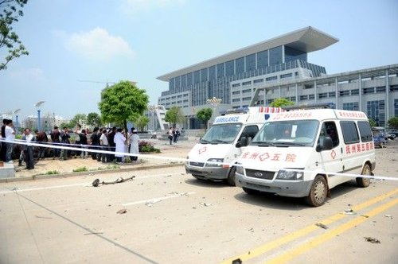
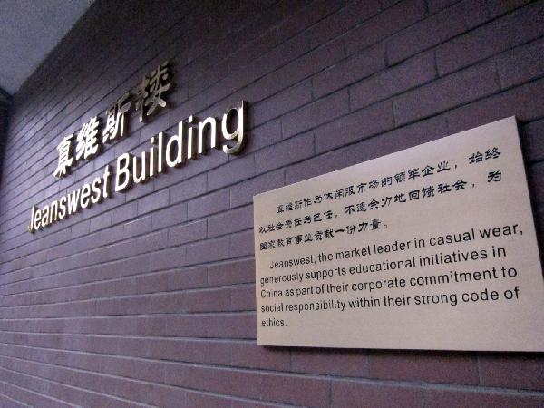

# ＜七星微语•一周状态撷萃＞第七期：民主融化制度，爆炸终止无助，冠名引发呕吐，《建党》真是进步？

### 

### 

# ****七星微语•一周状态撷萃****

### **** ****

## ****第七期：民主融化制度，爆炸终止无助，冠名引发呕吐，《建党》真是进步？****

瓢虫君：各位读者，小瓢虫这厢有礼了。七星微语第七期来了！如果你也想在七星微语中看到你的微博，请在人人网[@瓢虫君](http://www.renren.com/profile.do?id=362359989)或新浪微博[@七星瓢虫君](http://weibo.com/2079236837)！ 在此@某某仅仅表示瓢虫君能看到的转发的最源头，大多是该微博的原创作者，但并不排除是其转发的可能呦。链接点点更健康！ [常遠](http://www.renren.com/profile.do?id=188752901): 昨晚跟遥遥兄在烤串店门外畅谈对酌，小桌矮凳，浊酒几只，聊人和命运，聊生死，晚风拂面，夜色渐暗下来。四季有常，而人生无常。有那么一瞬间我认识到，要尽 力把生活细节都记录下来，哪怕是友人的会面，哪怕用手机摄像头，因每个场景都可能是最后一次出现。人生的偶然和记忆的局限让人无所适从。 **【说事】** 佚名 :“伊朗总统内贾德近日发表言论称，西方制定计划利用高科技手段窃取了本属于伊朗的降雨云，导致了伊朗干旱。”——我们还真的不能笑内贾德是臆想狂，出了问题就把黑锅丢给西方，这事天朝干的也太多太多了。其实独裁国家都一个样。 [洪一玮](http://www.renren.com/profile.do?id=266094458) :Tuberculosis，全球最重要的针对艾滋病和肺结核等人类严重疾病进行救援和捐助的组织，宣布停止为中国捐款。理由婉转详细一大片，总结起来就是捐过来的钱都被派对瓜分了，根本分不到病人手里，捐了也白捐，另外中国政府在世博和奥运上花了4万亿人民币，给这么有钱的国家捐款纯属脱裤子放屁，多此一举。 [姚邈](http://www.renren.com/profile.do?id=229661236) :各行各业乱七八糟各色人等都去参选人大代表，看看这些人们到底是可以稀释傻逼的浓度呢，还是最终溶化于这个制度。 [田鑫龙](http://www.renren.com/profile.do?id=253458603) :昨天看电视，喇叭里蹦出一句：“万众一心跟黨走”我笑着跟旁边的人说，黨自己知道他要去哪里吗？？？ [谢至理](http://www.renren.com/profile.do?id=228537234): 有毒食品丑闻一般流程如下——媒体“这个里面有屎”；厂商“有屎是行业规则”；专家“有屎不可避免，不超过一定量就无害”；五毛：“别国产的这东西也有屎”。 每次看到这些我就想抓住对方，像马教主一样脸咆哮：“我告诉你食物里有屎的时候你想的为什么是含多少屎是合理的？这里面有屎！有屎啊！！” [古董](http://www.renren.com/profile.do?id=223502490) :前两天微博和人人上我因为点出村霸姓名热心网友搜索出其联系方式给于公布。他勾结政府、一手遮天、做了亏心事害怕鬼敲门，现在已对我家人进行恐吓和包围。父母小弟人身安全受到极大威胁。恳请正义媒体支援！别逼我们学钱明奇！！！ [古董](http://www.renren.com/profile.do?id=223502490) :村里的其他人都敢怒不敢言。村里大家视为阎罗的朱汉良居然在恐吓村民时放话：“没有我朱汉良办不到的事情，我要送谁进去坐牢，谁就必须坐牢。你们谁能分得到地，谁分不到，都要先问问我。老子政府里有人！”有骨气和志气一点的人就站出来，和我家一起反对他的恶霸行为。 

 **【论道】** [沈华光](http://www.renren.com/profile.do?id=283548470&ref=hotnewsfeed&sfet=502&fin=6&ff_id=283548470) : 胡适还没有决定离开北平时，西山的中共电台已宣布：只要胡适不离开北平不跟蒋走，中共保证解放后仍让胡适担任北大校长和北京图书馆馆长。北大同仁下属也有劝留下的， 胡适主意已定，知道留下不会有好果子，他说“在苏俄，有面包没有自由；在美国，又有面包又有自由；他们来了，没有面包也没有自由。” [洞感超人](http://www.renren.com/profile.do?id=348246541) :【不赞成太极端，易伤及无辜】你想想啊，你一政府机关最底层混饭吃的小喽啰，某天看着新闻上着校内，正准备发个状态大骂世道黑暗，忽然就被炸死了！~~~死就死了吧，死后广大网民还会欢庆你的死亡：死的好！死的妙！死的呱呱叫！又炸死一直狗奴才.....你说你的冤魂该多伤感....... [曲三窟](http://www.renren.com/profile.do?id=234055265) :做 大事就别惜身，要折腾就不能怂，放真炮胜放嘴炮。不杀白不杀是功利主义机会主义，杀了也白杀是投降主义犬儒主义，白杀也要杀是革命英雄主义浪漫主义。钟表 党呼吁一切绝望亡命报定必死心之徒，干一票。分期分批，有组织有纪律，为推动改良而死，重于鸿毛，钟表党给你们烧高香，愿你们温吹补锈！ [张舒迟](http://www.renren.com/profile.do?id=274670309) :当 一个国家强行拆毁一个公民的房屋，对他的妻子施暴，让他的家人因得不到有效的救助而病死，剥夺宪法赋予他的各种权利，不给他任何申诉的机会，不提供任何有 效的救济手段，他疾呼公正，没有回声，他恳求帮助，没人理睬，那么我认为，他与这个国家间的契约就已经破裂了，再也找不到什么立场去谴责他了。 [陈金晖](http://www.renren.com/profile.do?id=250645615) :被 洗脑者喜欢以统治者自居，这是被洗脑最确底的人，所谓愚民教育就是这种效果，目的是期望最底层不要反抗，自觉服从统治。当不断有弱势群体被欺负被打死的时 候，可以用鸡群来比喻，当某只鸡不合群，捣乱，被抓去杀掉或者单独关押的时候，那群鸡是没有意见的，只要还有得吃，是不会跳出来跑掉，呆若木鸡。 佚名: 制造问题然后叫嚣只有自己才能解决问题，并为解决自己制造出的问题而歌功颂德的独裁集团最无耻！改革开放是某党最喜欢夸耀的“英明决策”，但改革开放本不应存在，是同一个党搞了三十年的倒行逆施、闭关锁国才让回归正常变成“改革开放”。也许以后官媒又要这么歌颂：只有伟大的党才能解决三峡问题。 

**【吐槽】** [韩宁远](http://www.renren.com/profile.do?id=248825802): 根据购买力平价理论，五毛党对应的不应该是五美分党而是八美分党。而根据亚当斯密的理论，被人们厌恶的工作的收入水平往往更高，比如入殓师之类的职业。因此，现实中五美分党的工资水平低于五毛党说明，人们非常厌恶五毛党，有木有！！！本条纯属搞笑，不许严肃。 [遇春霖Protoss](http://www.renren.com/profile.do?id=248061435) : 在饭堂见一男生牵着一女生的手下楼梯，不料那男的不小心摔倒，但他没有松手，于是拉倒了该女生，两人沿着楼梯一路滚了下去，情况惨不忍睹……这个例子告诉我们，有一种爱叫做放手。 [怡婷eating](http://www.renren.com/profile.do?id=263590995) :清华大学新闻学院李希光老师：“真维斯楼”是“真理维护者居于斯楼”。班尼路同意，他们将冠名哲学系大楼，意为“班班读尼采，人人走大路”；鸿星尔克冠 名图书馆，意为“鸿鹄飞星，尔辈克己”；但杜蕾丝冠名食堂失败，“杜康之醇品于味蕾斯斯入扣”意境不高，被杰士邦击败——“杰出之士护国安邦”。 [李霁昭](http://www.renren.com/profile.do?id=306817279) :24位女嘉宾好，孟飞老师好，乐嘉老师好，黄涵老师好。我叫金正日，今年72岁。我来自美丽富饶，英雄辈出的朝鲜，我的爸爸是伟大的金日成大元帅，我是 朝鲜劳动党总书记。我身高1.65米，体重90公斤。这次来南京，我一定会牵着心动女生的手离开这里的，一同奔向共产主义的殿堂，相信我！ [静鸣](http://www.renren.com/profile.do?id=355233683) :网上的“四大名著”：官员们背后都有一个《红楼》，有钱人的子女全部《西游》，地方政府正在上演《三国》，老百姓们也只能酝酿着《水浒》了。 [冯纪辞](http://www.renren.com/profile.do?id=237652827) :好奇怪啊，自从发生了抚州爆炸案之后，老爸老妈就不再逼我考公务员了。 [蒋一梦](http://www.renren.com/profile.do?id=345771572) :美国议员年龄下限25岁 中国人大代表年龄下限18岁 结论：穷人的孩子早当家。 [陈海马](http://www.renren.com/profile.do?id=201316225): 三峡大坝不仅是个坝，而且是坝个。 [陈琦业](http://www.renren.com/profile.do?id=225747655): @丁晓妍ღ(231515286)问我三个人被困在山洞最先要干啥，我说找水，她严肃的告诉我我错了，首先应该成立党支部。 

 **【杂烩】** [黄薄码Live](http://www.renren.com/profile.do?id=326955432) :每一条微博都将是你的墓志铭。 [谢霸天](http://www.renren.com/profile.do?id=327893347) :奇怪，每天镜子里的那个人都对我反复说着什么，仔细看那口型，嗯，他说的是：“你是最牛逼的！” [周旭仑](http://www.renren.com/profile.do?id=358156077) :今天论文答辩的时候急了，对老师喊了一声大胆，结果我被斥退了 [猫扑话题](http://www.renren.com/profile.do?id=600002336) :抄作业其实不叫抄作业，语文上说是借鉴，数学上叫类比，英语上叫copy，地理上是迁移，生物上是转录，物理上是参考系，化学上叫同分异构体，政治上叫求同存异，历史上就是文化大统一。 [毛笑笑](http://www.renren.com/profile.do?id=278499506): “我能想到最痛苦的事，就是和这个制度一起慢慢变老。” [叫兽小星](http://www.renren.com/profile.do?id=600626367): 小道消息：据说《建党伟业》没能通过有关部门的初审，因为有关部门觉得，这戏讲一群进步青年如何集合起来推翻独裁政权，怎么看都不对劲。 [陈威震](http://www.renren.com/profile.do?id=223177160) :@多梦B啦：甲开着一辆宝马。乙：“哥们，宝马怎么来的？”甲：“那天在酒吧遇见个美女，晚上她开着她的宝马把我拉到了山顶上，然后脱着自己的衣服跟我说‘你可以要你想要的’。于是..我开走了她的宝马。”乙思索半天，说：“兄弟，你做的很对，她的衣服你也穿不了。” [曹炜PrinceQiao](http://www.renren.com/profile.do?id=243051597): 楚 国发言人说，屈原之死完全是楚国内政，其它国家无权干涉，屈原之死与政治无关，完全是一个经济问题。记者问，是什么经济问题？发言人说，屈原作品丰富，但 我们没有看到他交税记录。记者问，屈原是不是遭陷害。发言人说，那完全是国外敌对势力编造的谎言。楚国人民将在楚王领导下，成为崛起大国。 

[http://blog.renren.com/blog/362359989/729187980](http://blog.renren.com/blog/362359989/729187980)

（责编 ：陈造极）
