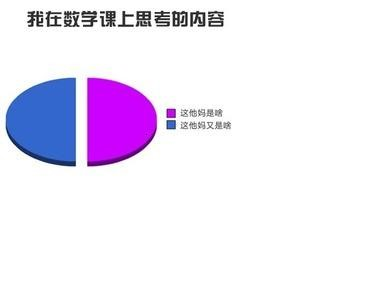
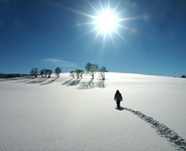

# ＜七星微语•一周状态撷萃＞第三十三期：南方人抗冻，属性高；北方人抗冻，装备好。。。

**瓢虫君：各位读者，小瓢虫这厢有礼了。七星微语第三十二期来了！如果你也想在七星微语中看到你喜欢的状态，请在人人网@瓢虫君！** **在此每条状态前标注的作者名仅仅表示瓢虫君能看到的转发的最源头，大多是该状态的原创作者，但并不排除是其转发的可能呦。**  

# ＜七星微语•一周状态撷萃＞

## 第三十三期：南方人抗冻，属性高；北方人抗冻，装备好。。。

 

#### 【说事】

**谢至理**: “我想买辆坦克。” “那就买呗。” “买不起啊，那么贵。” “拿信用卡刷呀。” “刷了信用卡要还的，还不起怎么办？” “怕什么，你有坦克。” 

 **刘一舟**: 也不能怪文科生，启蒙理性以来，自然科学迅速把人文思想挤到边缘地位，社会科学则在拙劣模仿自然科学范式，在中国还有个原因，学苏联搞院系调整重理轻文，社会氛围就是这样，所以大多数文科生难免怀疑自己转自**陈萱Rosiel**: 说得好啊！！！热情和定力最重要。转自**谷 卿**：大多数文科生被人轻视、瞧不起，恰恰缘于他们自身没有坚定的信仰，他们对自己学习和研究的对象缺乏基本的认知和必要的情感，他们常常担忧这门“手艺”是否真的“有用”、常常怀疑传统的价值观在当下是否“吃得开”。凡在人文学科领域卓有建树者，无不具有坚定的信仰、清醒的头脑和真挚的感情。 

 **单国巍♥BJ**: 在微博上看到了精辟的一句话：“本来是可以轻松愉快平凡地过一生。可是你选择放弃一切追求不平凡。于是你其实过的是不轻松不愉快而且平凡的一生”。据说是本院某位大牛女博说的~这姑娘，真有见识。 

#### 【吐槽】

**苏小蛰**: 老有外国人说批评我国网络审查制度，我的美国朋友D**id就是一个，我看全是*说八道，哪里有什么不能说的。 **刘柯艾**: 差役：“大人，上海外滩一男子暴尸树上，死因不明。”元芳：“大人，这尸体是自己吊上去的还是被人挂上去的？”狄仁杰：“依你之见呢？”元芳：“回大人，小人认为，和谐盛世枯木逢春，这——应该是树上结的～” **艾纵纵**: 我才不相信餐馆服务员也开的起车租的起公寓，《生活大爆炸》肯定是科幻片。 

 **喜樂:** 在看《比我老的老头》，同学问我是什么样的故事，我说 sad stories，人问为什么，我说因为里面的文化大家们经历了文革，虽然书中没有正面描写但我还是会觉得伤感。人问：文革是不是不许他们发表自己的作品了？这真的很残忍啊。 呃····白人的想象力实在太有限了。 **石蓬勃**: 有一种关系在认识和不认识之间——我有他人人… 

#### 【杂烩】

**佚名**：“男生宿舍的阿姨对待男生像是自己的儿子，女生宿舍的阿姨对待女生像是自己的儿媳妇……” **陶李要办杂志** : 深秋，一个学生找到道士说：“道长，我的宿舍里经常阴风阵阵，我怀疑闹鬼！”道士问：“这种情况多久了？”学生答：“7月份以来天天如此。”道士大惊：“那你为何现在才想起来驱鬼？”学生挠挠头：“我们宿舍不是没空调嘛……”~ **何唯**: 珍惜上海的女生吧。她们肯定甜。。因为温差大。。。 **吴依然❤Iker**: 最近听了一首歌感觉很好听，叫《一觉睡到国庆节》，英文名字是《Wake me up when September ends》。不知道大家听过没有啊 

 **苏袖**: 萨特的《存在与虚无》出版后竟然挺畅销，萨特自己都觉得很意外。经过调查才发现，原来是因为二战时德国需要金属造军火，把家庭磅秤用的砝码都收走了，后来有人发现《存在与虚无》这本书的重量正好是一磅，于是法国家庭妇女开始抢购这本书当砝码用。 **查东**: 近日，吉林大学珠海学 院计算机系老师研发出一套新鲜点名系统，要求学生用个人学号命名手机蓝牙，老师轻敲电脑，逃课者立即现形。学生惊呼：“人类已经无法阻止老师点名了。 **王川**：南方人抗冻，属性高；北方人抗冻，装备好。。。 **陈小发**: 雪是否可积要看它是否连续…… 

 **蓝湛恒**: (吐槽向，勿较真) 话说一个白衣书生出游，于湖光山色之中寻得一寺，寺中有一老僧。二人相谈甚欢，便携手入内院详谈。老僧见书生谈吐不凡，遂生考较之意。见院内瓜果藤蔓，老僧出上联曰：“一阶石桌两个闲人三尺小院，四顾春色静看五月石榴。”书生羽扇轻摇，蛋定一笑：“这有何难：五维空间四次齐次三角函数，二重积分必然一致连续。” **郭益嘉beta1.0**: 宅不是我的错，我只是害怕当幸福来敲门时，没人去开门！  

（编辑：苏幕遮）

