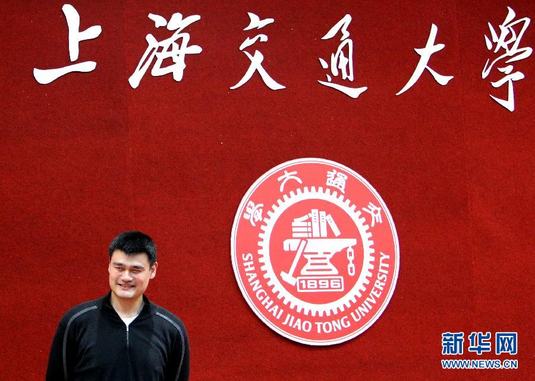
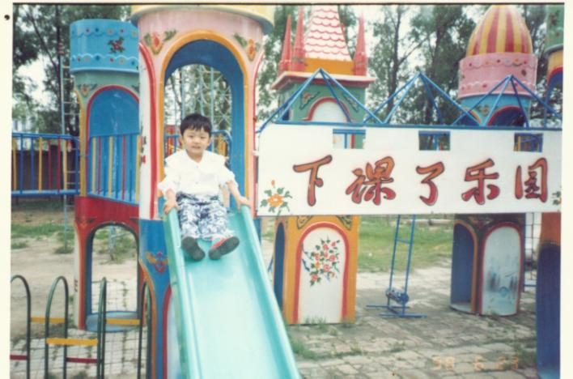

# ＜七星微语•一周状态撷萃＞第三十期：粉身碎骨浑不怕，welcome to China！

**瓢虫君：各位读者，小瓢虫这厢有礼了。七星微语第三十期来了！如果你也想在七星微语中看到你喜欢的状态，请在人人网@瓢虫君！** **在此每条状态前标注的作者名仅仅表示瓢虫君能看到的转发的最源头，大多是该状态的原创作者，但并不排除是其转发的可能呦。**  

# ＜七星微语•一周状态撷萃＞第三十期：

# 粉身碎骨浑不怕，welcome to China！

  【说事】 陈铖 :上海交大新生杯篮球赛上，经管学院男子篮球队凭借2011级新生姚明同学的神勇发挥以场均净胜对手85.5分的巨大优势轻松夺冠。姚明同学也以场均82.5分、45.6次封盖的表现获得赛事MVP。 

 刘冰萧 :俺们泛函助教说了…11月11号神马的不是光棍的节，其实是“范数节”…||.||…范数的节… 麻世川 :两只母鸡在聊天，看到一只公鸡无精打彩的走来，母鸡问：“咋地了？没精神？” 公鸡说：“做点生意！” 母鸡问：“做啥生意累这德性啊？” 公鸡不好意思的说：“嗯……卖点鸡精……” 楚楚街: 一个不起眼的中国青年走进苹果公司总部，用很不流利的英语对负责人说:我想应聘为技术顾问，我知道你们在研发中文 Siri 的过程中遇到了前所未有的麻烦，我能帮你们列举所有汉语里语意模糊，双关等情况。负责人不屑的说:我凭什么相信你？我甚至还不知道你的名字。青年扶了扶眼镜说:我叫小明。 叶翀: 当联防队员踏进杨武家里的时候，悲剧就已经不可避免了：他没冲出去，被道德超人们骂为懦夫；他冲出去秒了施暴者，他就成了夏俊峰；如果他含恨在心之后血亲复仇；他就成了杨佳。在这个法律和功德都已丧尽的社会里，魔鬼找你跳舞，你能做的只有等音乐结束 罗天: 说有些话是再容易不过的了。就拿“我支持台湾人民自己决定自己的命运”来说，这是一句无比政治正确又无比空虚的一句话，什么样的人叫台湾人民？什么事务属于他们自己的命运？这个决定又是如何决定？这种表态还不如“肯德基最近的午餐变动真是坑爹鸡啊”来的有实际意义。难怪曼昆先生向我们指出：“穷逼谈经济，怂逼谈政治。顺便说一句，退我课的都是傻逼。” 党凡: 转自王老师：终于盼到了投票日。居委会投票站前彩旗飞舞，人头攒动，热闹非凡。投票站挂出了红底白字的醒目横幅：“珍惜民主权力，投好庄严一票”。于是领了选票在候选人姓名旁果断地画了叉，在下面端端正正地写上了“好庄严”三个字，并圆圆地画了一个圈，郑重地投入了票箱。回来的路上问邻居，“‘好庄严’是谁呀？”，“我也没听说过，不过既然号召大家投他一票，一定错不了！”  【吐槽】 王蕾: 临床医学听起来太苦逼了。。。以后别人问我什么专业。。我就说我是治愈系的好了。。。 吕博 tiamo: 但凡在11.11能面表白于寡人者，受上赏；能上书表白于寡人者，受中赏；能表白于市朝，闻寡人之耳者，受下赏～！-.- 顾震川 wayfarer: 每年光棍节的时候总是大一男生闹的最欢，因为他们喜欢的还是女生。 左弦: 无言独上西楼，月如钩，why you are still single? 赵图南11.11: 经历了前世五百次的全反射，才换来今生与你的耦合交错。只是能级低的好可怜，害怕再也跃迁不到你的身边。为了得到你的case，我需要怎样的switch语句。多少次的for循环？纵使你我之间的带隙不断扩散。心儿逐渐出现本征缺陷。也不能改变我对你的依恋。你向我输入一个又一个的尖峰脉冲。不断触发着我心情的上跳和下降沿。总喜欢在光谱中苦苦寻找只属于我的那条线。经过你心的掩模板。用逻辑符号写下不朽的诗篇。从此Verilog便成了爱的语言。用Quartus将誓言烧进相变存储芯片，锁存在心的一边。即使掉电，永不改变。 孙越: 如果湖南是辣省的话，那四川就是麻省了，四川理工就是麻省理工。 陈智俊Ethan: 失恋33天并不可怕。可怕的是失恋33天后，大姨妈还没有来。 夏亮亮: 我是水一样的男子，因为党说我是流动人口。 宋鑫♥羊咩咩 : 历史老师是最邪恶的…他们只告诉我们有文艺复兴，而故意漏掉了普通复兴和二逼复兴…… 沈湘源LM: 可以当最佳了么~笑死了~粉身碎骨浑不怕，welcome to China！ 叫兽小星: 每次听到 从食堂窗口喊出 “ 要什么同学”？我都忍不住想说 “要一个女同学，打包带走！”.... 

 陆小鸟: 郎咸平有许多个秘密，却都告诉了你。 【杂烩】 朱梦轩 TYIO: 上一辈子自习的扫地僧没有媳妇，上十年自习的萧远山和慕容博妻离子散，有个爱上自习老爹的萧峰和慕容复下场凄惨，只有从来不上自习但导师牛逼后台强大的虚竹和段誉携美而归生活美满，世界一直就是这样，Loser们不要再自欺欺人了.... 黄薄码Live: 四个战士看到特警冲上来说，这样，我们比赛叠被子吧。 朱睿 :每个出轨的男人都应该引用《肖申克的救赎》里那句台词来为自己辩护：“You know some birds are not meant to be caged, their feathers are just too bright. ”——有些鸟是关不住的，它的每一片羽毛都闪耀着自由的光辉。 人人大笨钟: 那些喜欢叫“妹纸”的男人,在他们眼里妹与纸的用处是一样的。 冯小亦: 没事就在名人的微博里淡淡的留下两个字：上Q，顿时整页评论就看我一个人。 陈勖Sharine: 在冬天的周一早起，和在雪山遇险本质是一样的，都会陷入“喂！不能睡！闭上眼就再也醒不过来了”的状况。所以在闹钟响后的十五分钟内爬起来是特别重要的，这就是沉默的十五分钟⋯⋯ 李泽昱: 突然发现师兄分三种，有的是师兄，有的是二，还有的是二师兄。。 大姨夫 :取个名字叫夏课，就没有老师叫你回答问题了～ 

（编辑 高琦琛）
