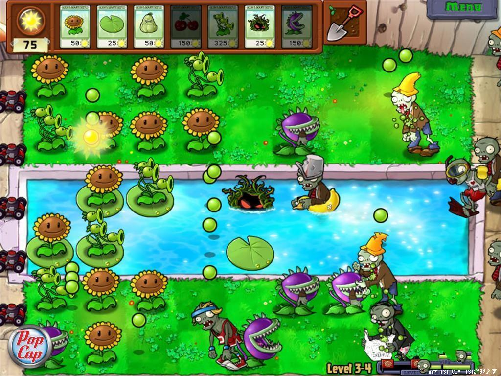

# ＜七星微语•一周状态撷萃＞第二十八期：普通男青年有一个女友，文艺男青年有一个男友，二逼男青年的女友有很多男友。

**瓢虫君：各位读者，小瓢虫这厢有礼了。七星微语第二十八期来了！如果你也想在七星微语中看到你喜欢的状态，请在人人网****@****瓢虫君！**  **在此每条状态前标注的作者名仅仅表示瓢虫君能看到的转发的最源头，大多是该状态的原创作者，但并不排除是其转发的可能呦。**  **【说事】****** [常婧](http://www.renren.com/profile.do?id=327482344): 发现一个有趣的现象：所谓路人，一定是冷漠的一定是没良心的一定是看客；所谓网民，一定是义愤填膺的一定是正义感十足的。由此观之，路人不上网，网民不上街。。。==||| 

[罗天](http://www.renren.com/profile.do?id=225618178) :关于支那不支那，我就一句话，“名从主人”——事实上尼格罗这个称呼在人种学上依然在沿用并且不带贬义。不过要是不怕死你大可去黑人区高呼“Hey，Negro dude.” [丁雨岑zoe](http://www.renren.com/profile.do?id=339540994): 世界上的妹子分三种，第一种很虚荣，只要找个有钱的；第二种很单纯，要个有钱的就可以了；第三种很现实，不用别的，有钱就行… [刘一舟](http://www.renren.com/profile.do?id=264848815) :寝室新疆来的焜哥说，我辛苦考学出来就是为了摆脱新疆那里危险动乱的环境，没想到上了几年学要毕业了全国到处是新疆了。  **【吐槽】****** [钟成](http://www.renren.com/profile.do?id=228612720) :"卡扎菲挂了!" 普通青年:跟我有毛关系? 文艺青年:独裁者还能有什么下场? 2B青年:哪门课? [于世祺](http://www.renren.com/profile.do?id=278882312) :普通少将：卡扎菲绝对不在苏尔特 文艺少将：辣妹子辣 二逼少将：民办教师 这个怎么讲呢 [王琟林](http://www.renren.com/profile.do?id=314013031) :普通男青年有一个女友，文艺男青年有一个男友，二逼男青年的女友有很多男友。 

[史小杰](http://www.renren.com/profile.do?id=232315457) :不看清宫剧，不过分享给看清宫剧的人们，你们粉的那个什么四爷不管多么痴情吧，最后娶的，是还珠格格里面的老佛爷。 刘柯艾 : 每当打扫卫生时，学校会说“学校是你家”；可当你一迟到，学校会说“你当学校是你家呢？ [黄薄码Live](http://www.renren.com/profile.do?id=326955432) :人人网今晚取消了最近来访。同学们再也不需要用小号去看前女友们的页面了。 [黄薄码Live](http://www.renren.com/profile.do?id=326955432) :请珍惜那个在人人网维护好之后出现在你最近来访名单里的人。 [郑州市](http://www.renren.com/profile.do?id=600014817):11月11日按十进制是光棍节，按十六进制是2B节。。。 （转自伟大的网友） ** ** **【杂烩】****** [马君怡](http://www.renren.com/profile.do?id=331857219): 生命的宽度就在于 走在路上 看见一个老人摔倒 所有人都上去扶她 让他不知道一时讹谁…… [王泽＠义理僧](http://www.renren.com/profile.do?id=254549757): 刚刚在饭否上看到的，如果有人跟你说，我们一辈子是朋友，那么这就是，好人卡之终身成就奖 [姚兆华](http://www.renren.com/profile.do?id=239782389): “每天最幸福的时刻 就是下夜班后你骑着单车载着我一起到街角吃卤肉饭。”“说重点。”“和你一起到街角吃卤肉饭。”“说重点。”“卤肉饭。” [杨霏辰Alex](http://www.renren.com/profile.do?id=272119195): 传说顶级科学家都住在一个村子里，后来有一群僵尸听说科学家的脑子特别好吃，就集体进攻那个村子，结果被完虐——因为村子里有孟德尔。 

[江珊](http://www.renren.com/profile.do?id=238085192) :问室友：“‘攻’的反义词是什么？”她说：“母。”疑惑中，又问：“我说的是‘攻击’的‘攻’。”她说：“我说的是‘母鸡’的‘母’。”…… [赵庞劲](http://www.renren.com/profile.do?id=230511347) :某女暗恋班上一散打的帅哥，怎么暗示都不明白。某天鼓起勇气，把“xx月xx日晚xx时，操场第三棵树下，不见不散。”的字条家在他的课本里。羞涩的没署名。那天，某女很飘逸的等在树下。那帅哥来了身后还跟着一群人影。月光皎洁，帅哥看到树下的人影，大喝：“是你下的挑战书？！” [李竹](http://www.renren.com/profile.do?id=230415130) :zz话说善解人意的美女如同有理数一样多。你不仅知道她们存在，还很多，甚至可以列举出一堆；但是在实数域里面随机抽取到有理数的概率为：0！而我们生活的真实物理世界至少是个3D复数域空间，连TMD碰到个实数的概率都是0！所以，当你碰到一个无理、不靠谱、虚得不行的女人的时候，你应当知道这简直是必然的。这就是为什么那么多男生退而求其次，在2D空间内寻找有理妹 子，或者至少是实妹子的原因。以上的论证就是所谓的技术宅男的数学基础。 [张智凯](http://www.renren.com/profile.do?id=264612137): 公司新来了一个男同事，88年，河南的，我俩关系好，啥都聊。有天聊到恋爱，我问他：“你以前谈过恋爱吗？”他说：“大学的时候有交过。”我明知故问：“是河南的么？”他大惊：“你怎么知道是和男的啊？” [俞正彦双下巴](http://www.renren.com/profile.do?id=249080853): 看到一本讲留学的书题名叫嫦娥，心想嫦娥和留学有什么关系。后来翻了翻才知道change指的是改变 [白泽宇](http://www.renren.com/profile.do?id=280016183): 学了那么多年物理，我才发现…I，一直为U而改变…… [袁源Leeloo](http://www.renren.com/profile.do?id=229017875): #微科学# 徐福道：“陛下一定会长生不老，绝无衰变老朽之事。秦皇奇道：“先生何以如此笃定？” 徐福道：“陛下年少时不是当过质子么？” [林应超Dei](http://www.renren.com/profile.do?id=220894831): 半年前，为了鞭策自己减肥，我坚持每天记录自己的体重，填入Excel表格，生成一个走势图……今天，同事经过我的座位，只见他走过去了又若有所思地倒了回来，趴我耳边悄悄问：那个……能不能透露一下，你这是哪只股票啊？走势蛮好的…… 

 

** **（编辑：陈造极）

 
