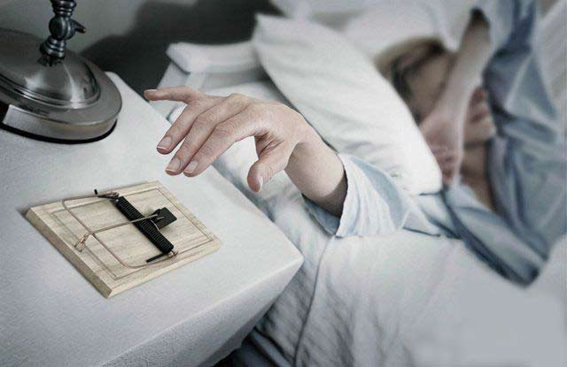
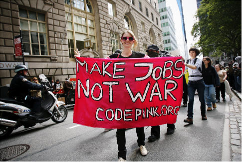
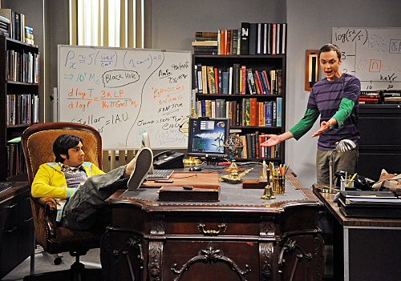

# ＜七星微语•一周状态撷萃＞第二十六期： 顾客就是上帝，但是食堂信佛••••••

**瓢虫君：各位读者，小瓢虫这厢有礼了。七星微语第二十六期来了！如果你也想在七星微语中看到你喜欢的状态，请在人人网@瓢虫君！** **在此每条状态前标注的作者名仅仅表示瓢虫君能看到的转发的最源头，大多是该状态的原创作者，但并不排除是其转发的可能呦。**  

#  ＜七星微语•一周状态撷萃＞

## 第二十六期： 顾客就是上帝，但是食堂信佛••••••

 

#### 【说事】

佐々木心: 比尔盖茨死的时候肯定会有这样的段子:上帝给你关上了门(Gates),却给你留下了窗(Windows)... 慕容嗷嗷: 世上有这么一种苦逼生活：你身心疲惫的工作了两天，然后当你第三天早上艰难地从床上爬起来，一看表，发现是周一。 

 蔣夢予CheM.Y: 中国现在的年轻人的真实写照是这样的：不懂法律，不懂外交，不懂政治，不懂历史，却觉得自己什么都牛B。他们在网上有时候是政治家，有时候有会变成医生，还会成为工程师，警察，律师，365行他能精通364行，除了他所学的那行。只有立场，没有智商，只有反对，没有思想。 西蒙: 小偷在鸡舍偷了只鸡。逃跑时，撞翻了鸡舍里的灯，鸡舍着火了！鸡回头看见燃起的大火，明白了，小偷救了它。当小偷用谷喂它，它觉得小偷关心它。当小偷东躲西藏，把它藏在怀里时，它觉得小偷爱它。有一天，它看见小偷挥起了屠刀。它觉得小偷一定是要自杀，所以用身体挡住了小偷。它幸福的死去了... 毕文丹: 我总覺得男生用下半生解決下半身的問題,女人用下半身解決下半生的問題~ 

#### 【吐槽】

佚名: 大学就是：老师假装讲课，我们假装听课。老师假装留作业，我们假装写作业。老师假装收作业，我们假装交作业。最后，我们假装考试，老师玩儿真的了…… 松壑: 乔布斯去世后，米帝人民自发聚集到华尔街共同悼念这枚脱离了低级趣味的超级CEO，口中呼唤着他的名字：Jobs。 

 殷雪刚: 顾客就是上帝，但是食堂信佛•••••• 霍家炜: 开我东阁门， 坐我西阁床。 脱我白大褂， 著我旧时裳。 当窗理云鬓， 对镜帖花黄。 出门看导师， 导师皆惊惶。 读博好几年， 不知木兰是女郎。 佚名：突然明白，有人说高考完你们就解放了，这是对的。因为解放后还有抗美援朝、三年困难时期、文革... 

#### 【杂烩】

唐斐: 最近很流行的Stay hungry,stay foolish.虽然我知道翻译成求知若饥，虚心若愚比较好,但是我更喜欢“做个吃货，做个傻逼。”这个版本。 佚名：咖啡的本质是一种豆浆~ 佚名：太萌了有木有：有人说，香蕉买回来要挂起来放这样会容易保存，因为香蕉以为自己还没被从树上摘下来… 张越: 校十佳歌手大赛是七度空间赞助的主题是今生为爱狂倒过来变成狂爱卫生巾赞助商心机很重阿。。。 Esports海涛: 你知道周岁和虚岁的区别么？周岁就是你从妈妈身体里出来的时间，虚岁就是你从爸爸身体里出来的时间…… 谢至理: 今天看到一个段子。物理教授告诉自己的学生：“物理之于数学就好像啪啪啪之于撸管。”学生：“这是不是就是说两门学科都很好，但是如果不试图去了解宇宙，那研究数学就没有意义呢？”物理教授：“我的意思是虽然你是一个物理学生，但是你本科四年基本都在学数学。” 

 佚名：他打开新买的iphone4S，发现siri语音助理竟是男声！“完了，山寨的”然而男版siri的人工智能异常强大反应灵敏服务贴心，渐渐他发现生活已离不开他。有一天他开玩笑地问手机“你有喜欢的人吗?”siri沉默，壁纸换成了害羞的淡红色，自动打开摄像头拍了一张他的照片，然后关机了。 

（编辑：刘一舟）

 
