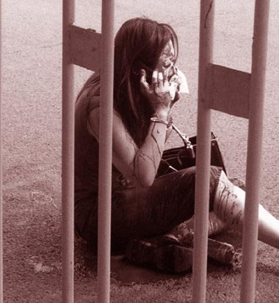
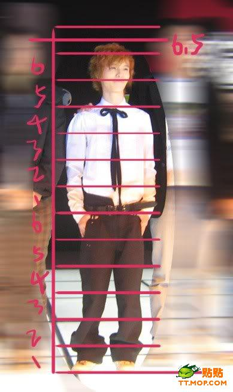

# ＜七星微语•一周状态撷萃＞第八期：作文里的司马迁；大学里的dota；人人网里的傻逼；体制里的原罪……

# 七星微语•一周状态撷萃

## 第八期：作文里的司马迁；大学里的dota；人人网里的傻逼；体制里的原罪……

  **瓢虫君：**各位读者，小瓢虫这厢有礼了。七星微语第八期来了！如果你也想在七星微语中看到你的微博，请在人人网[@瓢虫君](http://www.renren.com/profile.do?id=362359989)或新浪微博[@七星瓢虫君](http://weibo.com/2079236837)！ 在此每条微博前标注的作者名仅仅表示瓢虫君能看到的转发的最源头，大多是该微博的原创作者，**但并不排除是其转发的可能呦。**链接点点更健康！   **【说事】** [叶翀](http://www.renren.com/profile.do?id=259099701): 明天注定会有无数的马拉多纳、约翰列侬、梵高们的命运就在几个小时内被几张纸决定；他们被贴上失败者的标签扔进三本、专科甚至落第，几年后为了房子、女人和汽车而卑微的摸爬滚打。  [黄陀](http://www.renren.com/profile.do?id=241495620): 南科大如果没有教育部的为难，是一定能够成功的。最起码的，南科大的学生可以去清华北大学生都要打破头才能进的国外名校继续深造。教育部刁难南科大，与体育官僚曾经对李娜的刁难一样，都是因为明白如果举国体制被打破、“社会主义国家集中力量办大事”的神话被戳穿，他们就无法继续肆意妄为中饱私囊  [陆遥遥](http://www.renren.com/profile.do?id=6182) :我的处事方法是：①我不会去割人鼻子，②见人被割鼻子了我会第一时间叫救护车，③待她伤好了劝她离开央视。  [杜慧颖](http://www.renren.com/profile.do?id=229889874): 体制是一个一个人组成的，就像柏林墙就是一块一块砖垒起的。不把体制的恶归到个人头上，就像不敲砖就想推倒柏林墙一样。虽然我对身边某些挤进日人民报的朋友面无微词，但内心，呵呵。  [林柏墙](http://www.renren.com/profile.do?id=348190551) :我要纠正王昊同学一个基本错误，本人对这个央视女员工毫无同情可言，体制这台机器要不是有一帮子拿“这是体制的错不是我的错”这种弱智借口来替自己打掩护的齿轮，怎么可能转得起来？  [丰钊](http://www.renren.com/profile.do?id=312034193): 总结一下：1.广义上讲，所有人都是体制的同谋者，所有人都有罪2.罪有大有小，但没有谁有资格在法律以外为其他人罪行的大小量刑3.打着反体制的旗号行使暴力，其本质只不过是另一种体制内的恶4.非暴力运动才是正道  [叶子ღYaphetS☞](http://www.renren.com/profile.do?id=305720754) :差不多接下来那些孩子的状态就会是——【终于解放咯——明晚聚会啦——等成绩好紧张呢——全国各地摆剪刀手啊——啥都做完了真无聊哎——终于被录取啦——新同学还不错嘛——教官你们不要走啊——大学生活真有趣——我怎么好怀念高三啊】……最后是【大学真TMD地坑爹啊！为什么我要去高考！！！】 

 **【吐槽】** [戈文波](http://www.renren.com/profile.do?id=46590): 定期唱红歌的好处可能是会培养一些歌手，香港和西方很多歌手也是从唱诗班出来的，一个歌颂党一个歌颂上帝，两个犹太人弄的东西，虽然一个无神一个有神，但都有个乌托邦还有相似的活动形式，唱歌什么的。  [叫兽小星](http://www.renren.com/profile.do?id=600626367) :著作等身的意思是，一个人的书作堆起来几乎与他等高，形容一个人作品很多。造句：郭敬明的出书不多，但早已是著作等身的大作家  [吕诚](http://www.renren.com/profile.do?id=229331460) :《建党伟业》上映的时候是不是考虑打个字幕：“危险，请勿模仿”？” 以下表演由专业人士完成，普通观众模仿可能会导致监禁或失踪。  [林柏墙](http://www.renren.com/profile.do?id=348190551) :其实砍鼻事件的真相是这样：央视员工因长期说谎导致鼻子太长，“骗子”两字等于写在脸上，砍人者处江湖之远而忧其君，见此情景，痛心疾首，为了维护喉舌的形象，遂提起砍刀，对央视员工施展失传绝技“还我漂漂斩”，事毕酷酷的留下一句：你们负责掩护政府，我来负责掩护你们。不用谢，我是五道杠。  [張楷東](http://www.renren.com/profile.do?id=374726200) :建党伟业的海报上竟然写着1921-2011，而不是1921-?。  张师: 人人网政治圈中数量最庞大的不是毛左，不是五毛，不是美分，而是傻逼。  [罗天](http://www.renren.com/profile.do?id=225618178) :文科生有两种，第一种认为除自己之外都是傻逼，第二种认为第一种是傻逼。理科生也有两种，第一种是傻逼，第二种是比第一种还要傻逼的傻逼。  [睿智牛](http://www.renren.com/profile.do?id=220821196) :科长拿着我给一把手写的讲话稿叹口气：小牛啊，你写材料还是不过硬啊～知道领导讲话最关键的两个字吗？就是：“性感！” 性：必要性、重要性、长期性、艰巨性、复杂性。感：使命感、责任感、危机感、紧迫感、荣誉感。你记住：领导讲话也像叫床：要，要，不要，还要……留着我一个人在风中凌乱～  [任宏达](http://www.renren.com/profile.do?id=52332448) :报计算机系吧……花一个人的钱，听两个人的课，做四个人的作业，和八个人抢女朋友……  佚名：高考只是决定了今后4年你将在哪儿打dota。   **【杂烩】** [秦铭三♥L](http://www.renren.com/profile.do?id=314371006) :一大波考试正在接近...!MD 我连向日葵都没种好呢...!  [刘华菁](http://www.renren.com/profile.do?id=227231745) :06年上海高考作文"我想握住你的手"，11年"一切都会过去",Beatles 63年写了首"I Want To Hold Your Hand", 68年写了首"All Things Must Pass"  [郑 鑫](http://www.renren.com/profile.do?id=334113808) :广东：回到原点——司马迁接受宫刑回到原点，忍辱负重写史记。江苏：拒绝平庸——司马迁拒绝平庸，忍辱负重写史记。山东：行走——司马迁宫刑后继续在人生路上行走，忍辱负重写史记。江西：拥抱——司马迁拥抱坚强，忍辱负重写史记。安徽：时间在流逝——受宫刑后的司马迁时间越来越少，忍辱负重写史记  [CHOCO陳秋可](http://www.renren.com/profile.do?id=233801858): 走出考场的时候，他哭的一塌糊涂。考生们都目瞪口呆的看着这么一个漂亮的男孩子哭的梨花带雨。他不顾旁人的眼光，一把揽过他，凶狠狠的说，“再哭我就当众吻你。”他哭的更厉害了，“数学好难，我们不能上同一所大学了啦。”“笨蛋，就知道你不会，后面的大题我都没做。”  [逯楠](http://www.renren.com/profile.do?id=76807846) :有个博士大哥说，算命先生曾经说他二十岁结婚，二十三岁抱娃，但是现在快三十了还没女朋友，真是知识改变命运啊！  佚名：给07级学弟学妹们的忠告：毕业散伙饭趁酒能表白表白，能拥抱拥抱。否则，心里这邪火憋到毕业十年聚会，一顿晚饭能拆十几个家庭。  [http://blog.renren.com/blog/362359989/731479340](http://blog.renren.com/blog/362359989/731479340)

**（责编：刘一舟）**

** ** 
