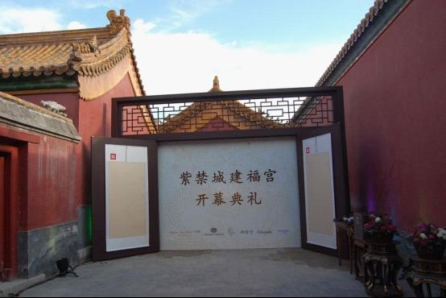

# ＜七星微语•一周状态撷萃＞第六期：刘萍参选人大代表假戏真做，方校长为躲扔鞋各处奔波，三峡遗留问题下届解决，故宫豪华会所一墙之隔...

# **七星微语******•******一周状态撷萃**

## **第六期：刘萍参选人大代表假戏真做，方校长为躲扔鞋各处奔波，三峡遗留问题下届解决，故宫豪华会所一墙之隔……**

 

瓢虫君：各位读者，小瓢虫这厢有礼了。七星微语第六期来了！如果你也想在七星微语中看到你的微博，请在人人网[**@瓢虫君**](http://www.renren.com/profile.do?id=362359989)或新浪微博[**@七星瓢虫君**](http://weibo.com/2079236837)！ 在此@某某仅仅表示瓢虫君能看到的转发的最源头，大多是该微博的原创作者，**但并不排除是其转发的可能呦**。链接点点更健康！ 为了更好地和读者互动，并调动读者对于微语的参与兴趣，在本期的七星微语当中，瓢虫君第一次安排了一个“读者互动”环节，精彩在文章最后，耐心读完，参加互动，还有奖品送出哦~  [常遠](http://www.renren.com/profile.do?id=188752901) : 人们宁愿自我欺骗，也不愿意相信自己是被欺骗的。他活在自己愿意看见的世界里，那里有一堵思维的墙，高耸入云。  **【说事】** [陈皛](http://www.renren.com/profile.do?id=352264532) : 受不了了,喜感.今天台湾TVBS新闻报道,一个四十多岁和一名六十岁左右的大叔国粉分别划皮艇到金门被金门警方抓获. 他们宣称要"投奔自由"和"加入国军"反共复国. 结果台湾警方宣称,时代不同了,目前大陆人以这种方式去台湾都会被以"偷渡违法"移交法办,之后会遣返回大陆. [姚翼](http://www.renren.com/profile.do?id=1351663136) : 抗战期间，那些从延安回来的记者热情颂扬共产党的正直、理想精神和为事业的献身精神。宋美龄听后说：如果你们告诉我的有关他们的事是真的，那么我只能说，他们还没有尝到真正的权力的味道。 [周秉志](http://www.renren.com/profile.do?id=258699848) : 转自徐逸寒: @雷磊：“这正拍戏呢，突然闯进来一当真的。剧本全乱了，这戏还怎么拍？”——网易网友评论江西刘萍独立参选人大代表。 

### 

[刘柯艾](http://www.renren.com/profile.do?id=232021512) : 新华内参: 告诉你一个真实的三峡：14个专项论证报告，有五个报告专家组不签字，都挡不住政治工程的强硬上马。可能没有哪个国家敢于在地质情况如此不明，超过1／3 工程论证报告专家组不签字的情况下，还能强行上马。论证时，反对者排挤出去，赞成者拉请进来 [http://rrurl.cn/6S9ff2 ](http://rrurl.cn/6S9ff2) [陈琦业](http://www.renren.com/profile.do?id=225747655) : 中国国务院第一次宣布自6月4日起放假三天，以纪念死去 的……………………………………………………………………………… 屈原  [浦闇缇](http://constance0203.renren.com/?id=232779917) : “中國是最適宜居住的國家之一，否則很難解釋爲什麽有13億人選擇中國最為他們的祖國”转自滑单板的宋凯: 依然经典。转自石渡君BISON : “中文是世界上最容易学的语言之一，否则很难解释为什么有13亿人选择中文作为他们的母语”－－中国外交部长杨洁篪 [刘柯艾](http://www.renren.com/profile.do?id=232021512) : 【故宫宫廷公司因会所曝光疑有内鬼 开除所有员工】一直在微博上爆料故宫建福宫内幕的微博@不要脸爱面子 再次发力，称因怀疑有“内鬼”，故宫建福宫下属的北京故宫宫廷文化发展有限公司已开除所有员工。从“失窃”到“错字”再到“解雇”，这一场场“闹剧”让故 宫在漩涡里越陷越深  **【论道】** [龚知宇](http://www.renren.com/profile.do?id=260237904) : 看到某北邮同学说不要怪方，要怪体制，我也释然了，当年某人也说过，不是他要当主席，是人民要他当主席。个个都把责任推得一干二净。其实体制是什么？还不 就是方这样的人一点点砌出来的么？不就是你，是我这样的沉默者所间接认同的、维护的么？主导犯罪是罪犯，胁从犯罪也是罪犯，纵容犯罪，还是罪犯。 

[黄陀](http://www.renren.com/profile.do?id=241495620&ref=hotnewsfeed&sfet=502&fin=12&ff_id=241495620) : 我也反对死刑，我反对死刑是因为从程序正义的角度讲，死刑不可挽回地剥夺了冤案翻案的机会；从实质正义的角度讲，我不认为任何人有杀人的权利，特别是一群人杀一个人，哪怕这个人做了再罪恶滔天的事情。但反过来，某些学者借药家鑫案来宣扬废除死刑，是典型的书呆子行为。 [张斌本纪](http://www.renren.com/profile.do?id=252864197) : 有些人想要消灭穷人，也行，他们也说社会是金子塔，那就把金字塔底层全拆了吧！最好一瞬间突然拆了！ [韩宁远](http://www.renren.com/profile.do?id=248825802) : 发条历史状态：媒体蜂拥着曝光食品安全问题未必是因为今日食品比前些年糟糕，只是因为曝光食品已被证明是种能为媒体获得大量社会关注且没有政治风险的事 情。当食品安全和官员升官也挂钩了，结果未必是食品变安全：因为管媒体比管食品容易，结果很可能是食品一个样，媒体变老实一点。[@杜枫](http://www.renren.com/g/247269645) [常遠](http://www.renren.com/profile.do?id=188752901) : 每次跟留学生讨论起体制问题，我都感觉自己是个坏汉奸。他们倾向于讨论举世瞩目的经济发展速度，我却失语，因为我总不能说你去读了何清涟袁剑黄亚生中国特 色“权贵资本主义”的相关论述再来讨论。单一信息害死人。讨论也是有基准线的，基准不是共识，而是大致相当的信息量。 [王箐丰](http://www.renren.com/profile.do?id=251347137&ref=hotnewsfeed&sfet=502&fin=30&ff_id=251347137) : 笑蜀：读完了百年中国革命史，三百年世界革命史，我对从法到俄到中国一类的革命和革命家，早失兴趣，无论新旧；对简单的政权更迭也早失兴趣。我更坚信我两 篇旧文的主题：重申权利，更须重建信仰；重建人性的微循环。但若致力重建信仰、重建人性、重建公民社会需要代价，我愿付出代价，如许志永君 [郑艺](http://www.renren.com/profile.do?id=297652015&ref=minifeed&sfet=502&fin=2&ff_id=297652015) : 我一直觉得，诚实就算不能算作优点，那好歹总不能算缺点。我有时候诚实的发个状态，说我平生最喜欢的事就是做爱和看书。然后我好友就会很诚恳的告诉我，你 不应该这么直接。这样会让人觉得你不靠谱没安全感的。我有时候就想不明白，喜欢做爱跟靠不靠谱有没有安全感有关系吗？诚实真是奢侈的品质。  **【吐槽】** [黄薄码Live](http://www.renren.com/profile.do?id=326955432&ref=minifeed&sfet=502&fin=0&ff_id=326955432) : 环球网：成都富士康现场人士称昨天的爆炸是被雷击中导致的。昨天方滨兴在四川大学访问。 [王乃华](http://www.renren.com/profile.do?id=259715403) : 2月14表白！3月14表白！4月1还表白！5月20又表白！！表白是你大姨妈啊！一个月一次啊！每个月总有那么几天想表白啊！！！ [刘小宇](http://www.renren.com/profile.do?id=274802735) : 叶老师表示帝都为什么高入学率？因为派对要收买帝都，保证帝都的年轻人都能上学有工作，否则那些没学上没工作的年轻人就会闹事。所以必然不会让外地户籍的孩子有占名额的机会。 [張楷東](http://www.renren.com/profile.do?id=363784984) : 看了国务院关于三峡的新闻，基本讲了3点：1、三峡是上届政府建的，与本届政府无关；2、本届政府在三峡问题已经做了大量工作；3、出现的问题只能让下一届政府去完善了。 

[李长磊](http://www.renren.com/profile.do?id=221085571) : 南理工两风云学长同时向一学姐表白，学姐淡定道：“你们周游世界后再回来跟我说。” 两学长遂携手离开。 一年后致电学姐 —— we fall in love。 后续：南理工两风云学长同时向一学姐表白，学姐淡定道：“你们周游世界后再回来跟我说。”一学长立马收拾包裹准备出发，另一学长绕学姐转了一圈，说出历史性的一句：“you are my world.”瞬间秒杀..后来选了准备去环游世界的那个，因为他家有钱…… 南理工两风云学长同时向一学姐表白，学姐淡定道：“你们周游世界后再回来跟我说。”一学长立马收拾包裹准备出发，另一学长绕学姐转了一圈，说出历史性的一句：“you are my world.”瞬间秒杀..后来...学姐说：“你英语既然这么好，怎么四级都还没过？” 南理工两风云学长同时向一学姐表白，学姐淡定道：“你们周游世界后再回来跟我说。”一学长立马收拾包裹准备出发，另一学长绕学姐转了一圈，说出历史性的一句：“you are my world.”瞬间秒杀..后来...学姐选了另一个胸大的学姐。  **【杂烩】** [颜冬](http://www.renren.com/profile.do?id=220979054&ref=hotnewsfeed&sfet=502&fin=31&ff_id=220979054) : 宝玉又问黛玉“妹妹可曾上过youtube，”黛玉听了便忖度着他有‘代理’，说道“我上不了那个，想也都是些罕物视频，岂能人人见的”，宝玉听了登时发 作起痴狂病来，拿起IPAD狠命砸去“什么稀罕鸽子，连人高低贵贱也不分，还说墙内墙外的唬骗人，我也不要这劳什子了” [FT中文网](http://www.renren.com/profile.do?id=600099109) : 读者评论:小时候,故宫是一枚小小的邮票. 我在这头,庄严在那头. 长大后,故宫是一集集的电视剧. 我在外头,皇阿玛在里头. 而现在,故宫是一个不锁门的保险柜. 我在外头,文物在里头.再后来,故宫是一个错别字. 我捍这头,你憾那头.其实一直,故宫是一个会所.我在外头,领导在里头 

### 

[朱赟](http://www.renren.com/profile.do?id=256522665) : 方滨兴：“听说他们在讲座之前就在讨论这个事情了，你们怎么没有一点应对措施？”“那个网站我们打不开，不知道他们说了什么。” [吴万c](http://www.renren.com/profile.do?id=294937945) : 天堂的门坏了，准备重修，招标中。印度人说：只要3千块就弄好，理由是材料费1千，人工费用1千，我自己赚1千；又来个德国人，德国佬说：要6千块，理由 嘛，材料费2千，人工费2千，自己赚2千；最后跑来一个中国人，中国人说：这个要9千块，3千块给你，3千块我的，剩下3千给那印度人！ [乌生](http://www.renren.com/profile.do?id=227472490) : 昨晚在麦当劳吃东西，邻桌一男亲密依偎在一女孩怀里，说：“我男朋友是艹圈的，现在还在刷人人呢。   [http://blog.renren.com/blog/362359989/728010558](http://blog.renren.com/blog/362359989/728010558)  

（责编：孙微阳）
