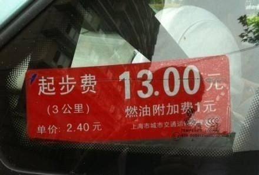
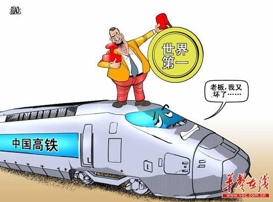
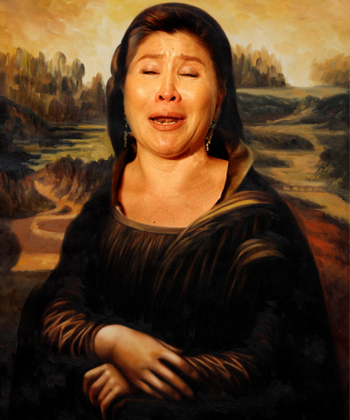
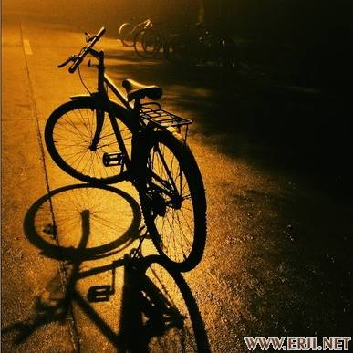

# ＜七星微语•一周状态撷萃＞第十三期：厦门市长德国通，便民交通出租车，从不故障是高铁，奢华进口达芬奇

#  **七星微语****•****一周状态撷萃**

****

## **第十三期：厦门市长德国通，便民交通出租车，从不故障是高铁，奢华进口达芬奇**

****

[瓢虫君](http://www.renren.com/profile.do?id=362359989)：各位读者，小瓢虫这厢有礼了。七星微语第十二期来了！如果你也想在七星微语中看到你的微博，请在人人网[@瓢虫君](http://www.renren.com/profile.do?id=362359989)或新浪微博[@七星瓢虫君](http://weibo.com/signup/signup.php?c=&type=&inviteCode=1670285792&code=&spe=&lang=)！ 在此每条微博前标注的作者名仅仅表示瓢虫君能看到的转发的最源头，大多是该微博的原创作者，**但并不排除是其转发的可能呦。**链接点点更健康！  ** **

### **【说事】**

### 

 [鲁学锟bobo](http://www.renren.com/profile.do?id=234527123): 上海夜间出租车超起步价每公里3元，折合333米/元。晚上跑高架路能到70千米/小时，折合约20米/秒。算一下就是16.5秒/元。人体平均眨眼的频率是7-10秒一次。也就是眨2次眼就跳一块钱。也就是眨2次眼就跳一块钱。也就是眨2次眼就跳一块钱。也就是眨2次眼就跳一块钱  [林柏墙](http://www.renren.com/profile.do?id=348190551): 租房还是国内便宜，不过买房吗……年初去不莱梅参观某君45平米新居，出门电车站到市中心20分钟，5万欧元搞定。前几天在中介装逼看房子，看到一200平60万欧元的，心想德国房价也蛮贵吗……结果仔细一看……带2400平方米花园 [林柏墙](http://www.renren.com/profile.do?id=348190551): 厦门副市长臧杰斌关于德国老百姓上网难、费用高、要通过层层审批并接受意识形态管理的发言，已经证明了一个铁一般的事实，那就是平行宇宙之间终于可以实现相互交流了…… [李岩](http://www.renren.com/profile.do?id=225761437): 厦门市副市长称德国上网手续繁琐，监管严密。德国媒体回答说：“德国只有对有严重犯罪前科、信用记录不良的人会采取较为繁琐的管制，对那些色情和宣扬纳粹主义的网站进行严密监控。”所以副市长同志说自己在德国上网不方便，应该是真的。 **[吴忄亘](http://www.renren.com/profile.do?id=245473694): 前两天看到厦门市长针对德国网络的发言后，就知道这哥们肯定悲剧了。一是欧洲的网络状况绝对不是他说的那样；二是以德国人的严谨与较真，肯定会对他的言论做出反应；三是以我这一年来的所见，关注中国的外媒中，德国之声已超过美国之音了。奉劝市长一句，下次还是用意大利来当例子吧……** **[龙匡夔](http://www.renren.com/profile.do?id=248926174): 你知道什么是裸婚么？小两口合租在憋屈的小屋，除了双人床几乎没有落脚的地方。临着街，旁边是混乱的市场。老房子又漏水又充斥着飞虫蟑螂。你和你合租的人可能很不融洽，甚至一年几经搬迁。生长在温室的小孩哪里知道这些** **[黄晨](http://www.renren.com/profile.do?id=302519269): 在大城市、内地、边疆这三个地方,你认为高考分数线制度应该怎样设计？按“程序性正义原则”,三个地方分数线一样,大家公平竞争；按“补偿性正义原则”,让边区分数低一点,其他两个地方一样,因为边区贫穷,教育条件有限；可是现实却是大城市分数线低,这尼玛根据的神马原则？** **[折翼の天使](http://www.renren.com/profile.do?id=600038849): 中科院候选院士回应私生女事件，称只是出于同情而捐精，并一再强调他当时已经看穿了某些慈善机构的嘴脸，捐精没有通过红十字会，而是直接捐给了求助者本人。** **[郑紫浩](http://www.renren.com/profile.do?id=202864936): 综合下最近的新闻，我有这个感觉，就是带套子呢，不算强奸；不带套子呢，算捐精。是不是这个意思？** **[松壑](http://www.renren.com/profile.do?id=229537473): 我对“陈丹青说两千年血脉已断”“崖山之后无中国”等等的论调一向无法认同，难道体现在他言论和思维上的这种“断裂感”，不恰恰是一种血脉延续的证明么，真正的断裂，是一种麻木和茫然，而不是一种激愤和悲悯，是灯火阑珊，而不是天崩地陷，是种你不知道你是谁，不知道也不想知道你从何而来的虚无感。** **[洪一玮](http://www.renren.com/profile.do?id=266094458): 正常的社会，上层应首重荣誉，追求各界尊重。中产则看重希望，以勤奋才能赢得向上流动的机会。下层需要物质，无论如何总要以吃饱穿暖为保障。而当今中国，上层享尽物质而得不到尊重，中层被尊为精英却看不到希望，下层不断得被许诺以希望，物质却依然贫乏。妖孽横行，人心错乱的国度。你正在干嘛？** **[李兰希♥tomorrow](http://www.renren.com/profile.do?id=255456996): 同理，男人说喜欢成熟有智慧的女人时，女博士女先生千万不要马上对号入座，有的男人说的“成熟”，是无条件服从、牺牲与包容的“成熟”，而“智慧”，是砍价骂街和作官太太的智慧。转自[陈纯](http://www.renren.com/profile.do?id=253681438): 女人说喜欢成熟有智慧的男人时，政治控学术男千万不要马上对号入座，有的女人说的智慧，是宋思明和唐骏的智慧，而不是孔子或苏格拉底的智慧** **[胡哲文T-MAC](http://www.renren.com/profile.do?id=257645241): 高铁建设的技术----“世界一流”； 高铁停运的原因----“天气原因”； 高铁晚点的餐饮----“没有规定”； 高铁晚点的损失----“乘客承担”；**

**** **[程海东](http://www.renren.com/profile.do?id=227313076): 铁道部：京沪停运证明安全性好。我表示：买张高铁票然后停着不动确实安全性最高，但尼玛买高铁票不是为了坐下来练瑜伽啊！！！** **[春运](http://www.renren.com/profile.do?id=600542384): 4天3次事故，京沪高铁轻松打破了日本新干线保持的4年2次事故的纪录，这也彻底粉碎了京沪高铁是抄袭新干线与TGV的谣传！** ** ** ** **

### **【吐槽】******

[杨页闻](http://www.renren.com/profile.do?id=230991701): 海飞丝赞助的节目安东和胡启志你们还想拿冠军，想多了吧？ [艾纵纵](http://www.renren.com/profile.do?id=272806021): 一打开校内，铺天盖地的全是投票，谁说天朝木有选举权投票权？ [李长磊](http://www.renren.com/profile.do?id=221085571): 说句心里话：中国红十字会还是干过很多好事的！设立了很多医院，宁波时疫医院、仁济医院、救助伤病者无数！又设立上海虹口平民时疫医院，穷人和重病住院，医治手术医药住院费用一概全免！他们还投身教育，创办很多学校，向学校捐款...哦！对不起！这说的是1931年，当时红十字会副会长，名叫杜月笙。 **佚名: 我国实行的是一房一妻制，无房就无妻，多房就多妻。** **[王雪涛](http://www.renren.com/profile.do?id=223652741): 天若有情天亦老，人学法学死得早，垂死病中惊坐起，司考你妹伤不起！** **[王昊伟whwkaj](http://www.renren.com/profile.do?id=263686220): 每天缴税得不到应得的公共服务，捐款到不了需要的人手里，看不到想看的书，买不到eminem的正版碟，访问不了部分网站，有些话永远无法和网友说，感觉真他妈对不起说生活很美好要脱离网络回归生活的人。哼。** **[柳楠](http://www.renren.com/profile.do?id=319243725): 看到这条状态之后我才意识到，我这20年中毁了多少少女们的旅程。。。。转自[刘梦颖](http://www.renren.com/profile.do?id=317537061): 留首武汉的人们，我走了。。。车上很凉快，我也有位置，唯一不好的只是对面的哥哥不帅 其他一切都好** **佚名: 达芬奇家居总经理潘庄秀华接受央视采访，坚称百分之百在意大利生产。后经记者调查发现，他们的一个车间挂了个牌子，写着：意大利 **

** ** ** **

### **【杂烩】******

**[李小茉（♬嫫__茉❤）](http://www.renren.com/profile.do?id=287286115): 京沪高铁再一次的故障，让他再一次错过约会的时间，她关掉了手机，但是有发来短信：我就知道你从来都没有在乎过我，我还是回澳洲算了。他一路追到浦东国际机场，看到她一个人坐在候机室里，脸上是未干的泪痕。很久以后她问：你为什么没有放弃。他答：我就知道飞机会误点 本片由高铁和航空公司联合赞助** **[陈纯](http://www.renren.com/profile.do?id=253681438): 在苏格拉底之前，雅典的公民要么是政治控，要么是学术男，苏格拉底第一次把政治控和学术男合于一身。他控政治的方式和现在的政治控有点不一样，他不发日志（演讲），也不转状态（口号和语录），而是很喜欢到别人的日志状态下面留言（对话），偶尔也被别人@到要求回答问题（《理想国》）** [金良Ⓐ](http://www.renren.com/profile.do?id=202418667): 無意中看到高中時狂寫了三年情書的暗戀對象的結婚照，心裡一下子平衡了。。。她。。發。。胖。。了。。。。。。。。。。。。。 [刘勐川](http://www.renren.com/profile.do?id=237751711): 小蒲公英哭着问爸爸：爸爸，爸爸，我为什么要和同性相恋啊？爸爸拍了拍小蒲公英的肩，一起痛哭的说：因为，世界上没有蒲母英啊！ [张骁♥Liverpool](http://www.renren.com/profile.do?id=248860507): 我已经快要基不择食了 [廖越](http://www.renren.com/profile.do?id=236609244): 上网不翻墙，犹如吃西瓜不吃瓤 **[陶李要办杂志](http://www.renren.com/profile.do?id=200077211): 一个陌生号给我发信息：“爸，我生活费没了，你再给我打几百过来，还是原来的号XXXXXXXXXXXXXX。” 我愣了5秒钟，这样回了过去：“孩子，你是从未来来的吗？ 能告诉我我什么时候才可以遇见你妈妈么？”**

****

###  

[李伯凯 Alfred](http://www.renren.com/profile.do?id=230168073): 不要总拿三国做商业战略分析了，开始挖战国吧。。。。这帮燕王齐王赵王啥的都是董事长，乐毅之流就是职业销售经理，田单之类就是挽家族企业于狂澜的旁支总经理啊。。。 **[刘天宇](http://www.renren.com/profile.do?id=229532991): 南京市主页发表：选出你心中的青奥会口号 楼下回复：吊青奥好滴一比** **[周旭仑](http://www.renren.com/profile.do?id=358156077): 路人甲碰到了阿拉丁神灯。神灯：我可以满足你三个愿望。路人甲：真的？屌爆了！然后…… 神灯：第二个。路人甲：把它长回来…… 然后…… 路人甲：诶哟，真的长回来了呀？屌爆了！然后……** **[沙耶博❤Доктор](http://www.renren.com/profile.do?id=349751336): 原来…… 北京是帝都、上海是魔都、西安是废都、南京是旧都、东莞是性都、重庆是陪都、广州是妖都、武汉是伪都、深圳是雌都、成都是成都，香港是港都....** **[刘柯艾](http://www.renren.com/profile.do?id=232021512): 领导去汨罗视察，当地旅游局负责接待。走到一座山下，导游对领导说：“前面有一处名胜。” 领导问：“什么名胜？” 导游说：“是一口泉，屈原泉。” 领导又问了一遍：“什么泉？” 导游复述说：“屈——原——泉。” 领导怒道：“就你懂拼音！”** **[黄薄码Live](http://www.renren.com/profile.do?id=326955432): 去年11月郭敬明的公司搬家，他在当时的博客里写道：“哪一款电脑，才能在让它在一堆ARMANI和达芬奇家具中间每天相处而不自卑。”** **[马慎独](http://www.renren.com/profile.do?id=264734959): ：真人真事：在Boston Cambridge某家超市，某MIT学生推着一大车东西在柜台排队，收银员看到他东西很多却站在了10 items or less的一列，看看旁边显眼的说明，忍不住问道: "Are you from MIT that you can't read, or are you from Harvard that you can't count?"** **[郭政](http://www.renren.com/profile.do?id=235665741): 宿舍的空调有除了有“低风”和“高风”选项，在它们中间还有个“中风”选项，我一直不敢用它** **[张小强](http://www.renren.com/profile.do?id=89201519): 原来左留就是左派的留学生啊，我终于知道草榴是什么意思了** **[李照彦卐Rose](http://www.renren.com/profile.do?id=246505522): 玄奘西行前问菩萨：佛祖相貌何如？菩萨笑曰：佛无常相，但若有“面如满月、光头阔口、身材丰盈、手持法宝”者，必定是佛祖显圣。玄奘默默记下了，到天竺后，四处寻找有如上特征的人，果真让他找到一个，玄奘激动地上前执掌躬身道：请问尊驾可是如来佛祖？对方说： 私はドラえもんだ！（我是机器猫！** **[李小茉（♬嫫__茉❤）](http://www.renren.com/profile.do?id=287286115): 乾隆下江南，乌龟挡道。乾隆问:“王八们有何事上奏？”乌龟们道:“我等有王八蛋进贡，欲求乌纱帽！”乾隆大笑:“好，哪日灯头朝下时，就让你等全部当官。”看乌龟们扣谢而去。乾隆笑道：“这帮蠢王八，油灯烛头什么时候可以朝下？”臣子皆称圣明。转眼300年后，电灯取代了蜡烛，于是：君无戏言！** **[王子龙](http://www.renren.com/profile.do?id=276216664): ■很久很久以后的某一天，在咸亨酒店喝闷酒的落魄程序员对店小二说，小盆友，过来，我教你HELLO WORLD 有几种编法** **[沙宣](http://www.renren.com/profile.do?id=260689248): 晚上遛弯，看到对面马路上老妈也在遛弯，（遛弯的人不少）我就喊：妈~结果她没有听到，然后我有喊妈妈的名字，还是没有反应，于是我灵机一动喊我自己的名字，我妈马上四处张望，我差点哭了...**

 

（责编 陈造极）
