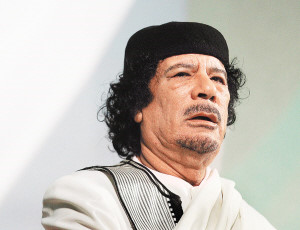
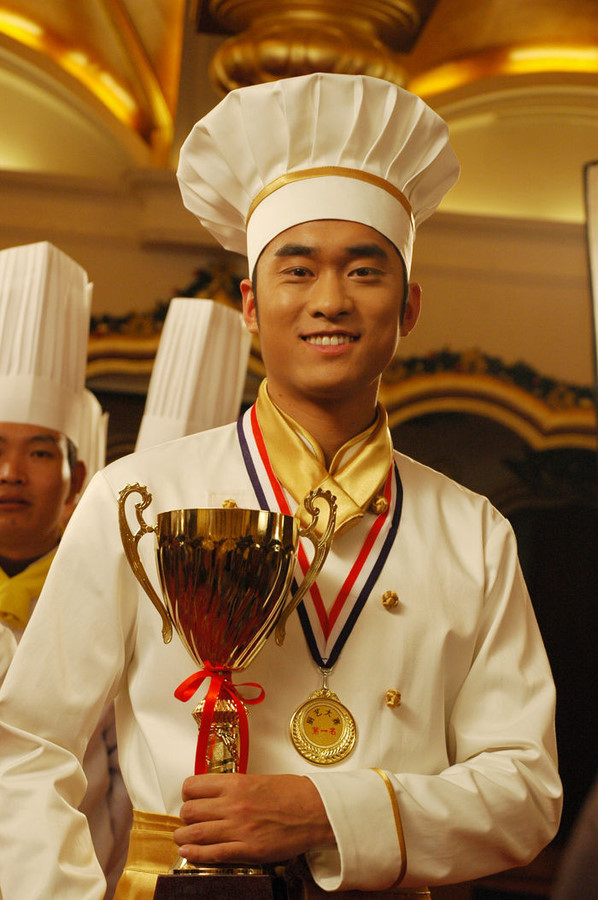

# ＜七星微语•一周状态撷萃＞第十九期：卡扎菲……乔布斯……新东方……帅哥美女一箩筐

 

# 七星微语•一周状态撷萃

## 第十九期：卡扎菲……乔布斯……新东方……帅哥美女一箩筐

  [瓢虫君](http://www.renren.com/profile.do?id=362359989)：各位读者，小瓢虫这厢有礼了。七星微语第十二期来了！如果你也想在七星微语中看到你的微博，请在人人网[@瓢虫君](http://www.renren.com/profile.do?id=362359989)或新浪微博[@七星瓢虫君](http://weibo.com/signup/signup.php?c=&type=&inviteCode=1670285792&code=&spe=&lang=)！ 在此每条微博前标注的作者名仅仅表示瓢虫君能看到的转发的最源头，大多是该微博的原创作者，**但并不排除是其转发的可能呦。**链接点点更健康！  

#### 【卡扎菲专栏】

赵伟强.ICON: 传说世界三大濒危物种是：狮虎兽、金丝猴、中国人民老朋友 。转 张汇泉: 红警2里，拥有磁能坦克的苏联垮了；拥有辐射工兵的伊拉克垮了；拥有自爆卡车的利比亚垮了；拥有恐怖分子的古巴尚在，不过其战斗力遭到玩家们一致鄙视……请听题：为什么中国玩家开发了共和国之辉并加入了中国呢？答案：他们是一小撮反华势力操纵的工具！ 刘柯艾: 卡扎菲半夜被枪声惊醒，问没有睡觉的大儿子，我们的老朋友有消息没有？大儿子说，我们的老朋友，正在陪他们的美国副总统吃完炸酱面，又去成都吃小吃的了。他们说要与美国坐一条船。卡扎菲举枪准备自杀。他儿子见状，制止。说，那儿还有几个红色网站，有数以万计的网友支持我们，他们会来救咱们的。 朱睿: 卡扎菲生于6月7日，我查了一下双子座的今日运程，上面写着：“心里预期跟现实相差较多。人际关系或环境发生变化，一味留恋以往的事物就太消极了，还是赶紧适应新环境才是最重要的。保持一颗平常心是你今天该有的心理建设！”好准哦，伦家又开始相信星座了！ 黄薄码Live: 乔布斯在辞职信里写道，我卸任苹果 CEO 的另一个原因是：最近事情的发展表明，独裁者不主动让位，下场会越来越不好。 黄薄码Live: 估计现在最恨脑残粉的就是赖斯了。 程浩松: 一个男人就因为他是所谓的独裁者，所以收集一个女人的照片就变成了变态行为……而按照一般男默女泪的习惯，这明明是一个痴情的好男儿啊~！ 

#### 【说事】

才人林晓韩: 遥想苹果今年，小乔辞职了。 姜涤非: 乔布斯发布新产品，iQuit 覃仙球: 农村的学生需要的不是更多的大学入学率。他们更需要的是各种真正的中专，高职，蓝翔技校，新东方厨师学校，南茜美容美发学校。他们在这些地方还能学到一门吃饭的技术。真上了大学，四年里学了一堆屎，毕业出来高不成低不就，这辈子才真的毁了。谁说上大学就是农村孩子改变命运最好的出路？上大学穷三代 张志华: @何帆：为什么那张美国最高法院大法官“永不起立、永不鼓掌”的帖子，传播那么广？因为非常符合大家的想象么？其实，总统入场时，大法官一样会起立鼓掌，发表完国情咨文后，起立鼓掌也很常见，有时还会拍肩鼓励。没必要因为想象，就无限拔高一张照片的意义吧？真正重要的，是独立的司法制度 刘柯艾: 【什么都变了，只有咪咪虾条是永恒的！】包子从1块钱2个变成1个了，可乐从2.5元变成3元了，麦乐鸡从6块涨到涨到8块了。排骨从10块涨到24块了。唯一没改变过的是咪咪虾条，5年前是5毛，5年后还是5毛。 

#### 【吐槽】

赵不亮: 成语：拜登腹泻 释义：贪图便宜购买劣质商品最终导致吃亏上当。引申义：形容一切贪小便宜、投机取巧最终弄巧成拙的举动。例句：“叫你喜欢在从网上勾搭妹子！见面发现被头像骗了，拜登腹泻了吧！” 张家祯: 之前有人问中国人对数学最大的贡献是什么，今天想清楚了，应该是发明了纸吧。 孙宇晨: 陳為廷「你知道為什麼念馬克思的女生，都比較正嗎？而且愈讀愈正。」「.....為什麼？」「因為，大家都學到了一套變正法。」「...................」 刘心悦: 刚看到一个帖子，说哪家的粉丝最牛逼。下面跟帖地纷纷罗列，某人用的五线谱都被粉丝用几百万买下，有的粉送偶像录音室的全套装备和名牌三角钢琴，有的粉请偶像剧组吃流水宴还送名牌护肤品……随后，某一楼很淡定滴出来说了一句：马克思的粉因为他的一本书建立了很多国家 。哦胡！！！其他的粉全败了！ 肖哲: 出国就像是去新东方，你以为你是来学英语的，但其实是来学做饭的…… 

 张治宇: 常有人这么说“女人的黄金年龄很短，只有22—26岁，男人就不一样，到了30,40岁照样不着急”。呵呵，其实男人的黄金年龄更短，只有16—18岁，在这段时期的他们，长得帅会有人喜欢，打球厉害会有人喜欢，学习好会有人喜欢，玩乐器会有人喜欢，但是到了30岁以后只要他没钱，就很少有人会喜欢了... 

#### 【杂烩】

王欣Pluto: 原来史上最伟大的动画叫做没头脑与不高兴..大部分日本动漫基本可以用此动画概括:比如樱木和流川,孙悟空和贝吉塔,鸣人和佐助,路飞和卓洛,圣德太子和小野妹子,松尾芭蕉和曾良君...而在新时代,他们又有了新的名字,叫做天然呆与傲娇帝 包文韬: 记者：“你觉得这个新版的蓝精灵好看吗？” 观众：“还可以吧......” 记者：“那你觉得这个新版的和比老版的比怎么样啊？” 观众：“说真的，俺们家以前穷，当年电视台放蓝精灵时还是用黑白电视看的，压根看不出他们是蓝的！” 记者：“......” 林蕾❤: 你们的爹会不会在每次电视上出现英文对话的时候都一脸热切地转过来问你“能听懂吗能全部听懂吗能不看字幕全部听懂吗？” 陈哲立~:众所周知科大盛产基友。我们系一个高大魁梧英俊潇洒的帅哥今天问了我一个问题：他们寝室共四个人，请问有几对基友？我想了下，回答：C42共六个。他ws地一笑：错了，是A42。我瞬间吐槽无力了……A42A42…… 草根屁民: 今天，一个交往了十多年的老朋友汇了1500元给我，我到银行柜员机取出来后发现，15张里面居然有2张是假的！！！郁闷死了，那么多年的朋友了，他为什么这样做？ 我身边有人说，干脆绝交算了！ 吴冉冉: 电影《无极》的伟大：1、《无极》里满神对张柏芝说：“你永远得不到真爱，就算得到也会马上失去！”2、《无极》里谢霆锋对张柏芝说：“你毁了我做一个好人的机会！”3、《无极》里张柏芝对百万将士说：“你们想看我脱衣服吗？”4、所有人都说《无极》是垃圾，陈凯歌说：“过三四年你们再看就懂了”。 

(责编：蔡英文）

 
