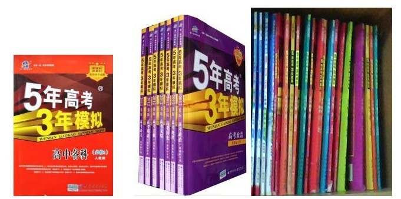
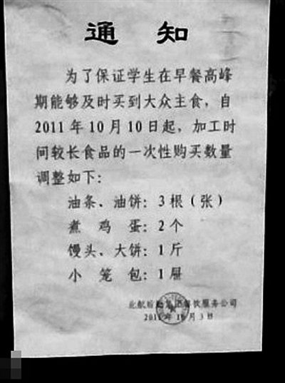

# ＜七星微语＞第二十五期：培根说，芝士就是力量

**瓢虫君：各位读者，小瓢虫这厢有礼了。七星微语第二十五期来了！如果你也想在七星微语中看到你喜欢的状态，请在人人网****[@](http://www.renren.com/profile.do?id=362359989)****[瓢虫君](http://www.renren.com/profile.do?id=362359989)！** 

#  ＜七星微语•一周状态撷萃＞

## 第二十五期：培根说，芝士就是力量

 **在此每条状态前标注的作者名仅仅表示瓢虫君能看到的转发的最源头，大多是该状态的原创作者，但并不排除是其转发的可能呦。**

### **【说事】**

**[谢一苇](http://www.renren.com/profile.do?id=328396296): ****培根说，芝士就是力量**

**[蒋卓睿](http://www.renren.com/profile.do?id=263317102): ****又到了保研的勾引考研的逛街****,****找工作的勾引考研的****DOta,****出国的勾引考研的谈理想****,****富二代勾引考研的吃喝****,****考研的勾引考研的搞基的最后****3****个月****,****快****HOld****不住了****...** **[覃仙球](http://www.renren.com/profile.do?id=242742203): ****包括那些在网络上反对政党的人，他们的结伴抱团排除异己，和沾沾自喜的信息复制狂轰滥炸，也都仍然是一样的动物性狂欢。你感觉不到他们会爱，也感觉他们并无审美。但这也并非他们本身的过失。六十多年以来生活在这个国家的人一直在被剥夺感知爱和美的权利****.** **[张铁嵘BIGCAT](http://www.renren.com/profile.do?id=309855689): ****阎连科：今天很多文学，****90%****是垃圾，在****10%****能看的作品中太注意技巧、情绪。简朴是一种境界，需要时间，需要风雨，需要人生。所以，没有技巧是最高的技巧，但是巴金的每一篇小说都在讲技巧，我们一生能够写出几篇很简朴的文章，可能就非常值得了。** **[李远正](http://www.renren.com/profile.do?id=267928073): ****转自****twitter:****乔布斯回到苹果公司之后，从根本上改变了人机交互界面，数字音乐出版，移动应用生态，当然还有****Pixar****动画工作室，并都在全世界范围内获得了巨大的成功。小弟仔细想了想中国科技****IT****界，只有一个人从根本上改变中国人使用互联网的方式，他的名字叫方滨兴** **[龚锴翔❤James](http://www.renren.com/profile.do?id=334888195): ****乔布斯果然牛逼。。。生前刷我们的卡，死后刷我们的屏！**  

### **【吐槽】**

 **[武博夫](http://www.renren.com/profile.do?id=247294540): RT@****工头坚：****"Facebook****上一位台湾朋友写道：今天我身边的朋友都在讨论苹果贾伯斯去世的消息，同时也在大陆微博上看见很多人讨论苹果乔布斯病逝的新闻。看来这两个人对苹果都做过巨大的贡献。苹果一天内失去两个人真是损失惨重！** **[王凯](http://www.renren.com/profile.do?id=250051350): ****据悉，受苹果启发，某女将****boyfriend****升级为****husband****的计划延期，拓展成了****boyfriends** **[张钊RMVB](http://www.renren.com/profile.do?id=221663277): ****燕王朱棣打到南京后，保皇派方孝孺在人人上发状态痛贬朱棣。朱棣问他：****“****难道你不怕我删你好友吗？****”****方孝孺答：****“****要删便删。****”****朱棣：****“****难道不怕我逼共同好友站队吗？****”****方孝孺：****“****不要说站队，把共同好友都拉黑了我也不怕。****”****这一下朱棣火了，在方孝孺九族之外，加上****“****共同好友****”****凑成十族，统统拉黑。**

**[高若楠](http://www.renren.com/profile.do?id=320421952): ****我国火车专用对联****,****上联****:****啤酒饮料矿泉水****;****下联****:****花生瓜子八宝粥****;****横批****:****让一下****,****让一下啊****!** **[彭小晨](http://www.renren.com/profile.do?id=313234546): ****永远不死的，是蛤蟆。永远****5****岁的，是人人。** **[李洋snoopy](http://www.renren.com/profile.do?id=340907036): ****下辈子，我要做一颗牙，至少我难受的时候，会有一个人疼****…** **[张雨谦fuck GRE](http://www.renren.com/profile.do?id=278359956): ****苍老师在微博上说**** ****我们日本没有这个假期**** ****所以我们没法休息**** ****下面一哥们回复到**** ****要是没有你们日本**** ****我们也没有这个假期****……** **[朱贤樑Joshua](http://www.renren.com/profile.do?id=271671977): ****进了大学我回的最多的短信就是****"Y"****。** **[梁峰](http://www.renren.com/profile.do?id=341720868): ****如果你的生命只剩八年，你将怎样度过？**** ****答：五年高考，三年模拟****..**

**[刘柯艾](http://www.renren.com/profile.do?id=232021512): ****一哥们儿，有次一个跟他铁了好久的美女在下雪天给他发信息****“****这么美****…****要是能一起在外面走走该多浪漫****”… ****他回****“****这么冷只有傻比才出门****”-----****哥依稀记得，那女生跟我说今天市中心广场上的月亮一定很圆****…****哥说的是：中秋节人肯定死多死多的，傻逼才会去挤着看月亮****…****然后？木有然后了****…** **[陈小柱](http://www.renren.com/profile.do?id=272292514): ****看到一女生****QQ****签名是****never give up****，在心里默默的翻译成了：不给上。** **[李敏](http://www.renren.com/profile.do?id=233074326): ****很多事情吧说到底是视角不同，比如泰坦尼克号的沉没，对于当时船上厨房里的龙虾们来说，那可是生命的奇迹啊！** **[彭炯杰Felix](http://www.renren.com/profile.do?id=232023601): ****如果哪天我出了柜 你们要记得我也直男过****……** **[龙匡夔](http://www.renren.com/profile.do?id=248926174): ****从前有个伴郎，他跟伴娘相爱了。后来有个伴郎，他跟新娘相爱了。最后有个伴郎，他跟新郎****.....** 

### **【杂烩】**

 **[周诗霞-Amber.](http://www.renren.com/profile.do?id=284101265): ****晚上和朋友聚餐，说他们毕业的时候，宿舍门被他们屋的一大胖子砸了三个洞，要赔****180****块钱（一个洞****60****块），然后****...****然后****...****然后****...****那大胖子嘭嘭嘭地把三洞砸成了一个****...** **[阿饭提](http://www.renren.com/profile.do?id=236094760): ****希望有人设计个****T****恤，下摆塞进裤子里时上面印着****“****朝廷心腹****”****，拉出下摆结果还有****“****大患****”****两个大字。** **[Ferdi 张渤隆](http://www.renren.com/profile.do?id=264466455): ****坐等校内出现如下人气日志：乔布斯临终前的遗言，不看后悔一辈子；乔帮主遗愿把骨灰埋在中国，不分享不是中国人；苹果公司机密文件曝光，乔布斯生前最后一件作品面世；原来是个阴谋，乔布斯死后隐藏的巨大秘密；**** ****乔布斯床头的****5****本必备读物；乔布斯给当代大学生的****20****条建议，看了会有收获噢～～** **[慕容嗷嗷](http://www.renren.com/profile.do?id=235259438): @****李铁根：马克思酷爱读书，他在伦敦居住时，每天像上班一样，从早上****9****点直到晚上****7****点，准时到大英博物馆图书阅览室去看书，久而久之，他得了痔疮。后来，他和恩格斯的关系便日渐疏远了。** **[王亚晖 tragedy](http://www.renren.com/profile.do?id=328510402): ****女是阴，男为阳。****“****重阳****”****为二男。故重阳节的习俗：赏菊**** ****插茱萸****……**

**[王琟林](http://www.renren.com/profile.do?id=314013031): “****请问总理先生，现在的中国有没有不贵的要死的菜可以买？****”****不少人纳闷：怎么提这种问题？大家都关注总理怎样回答。总理肯定地说：****“****有！****” ****全场哗然，议论纷纷。总理看出了大家的疑惑，补充说了一句：****“****在北航。****”****顿时掌声雷**** ****动！** **[姜超](http://www.renren.com/profile.do?id=296050762): ****起的比鸡早**** ****睡的比鸡晚。。以后网络评论员每发一条状态**** ****可去北航领鸡蛋一枚。。。**

 

**（编辑**** ****高琦琛）**

 
