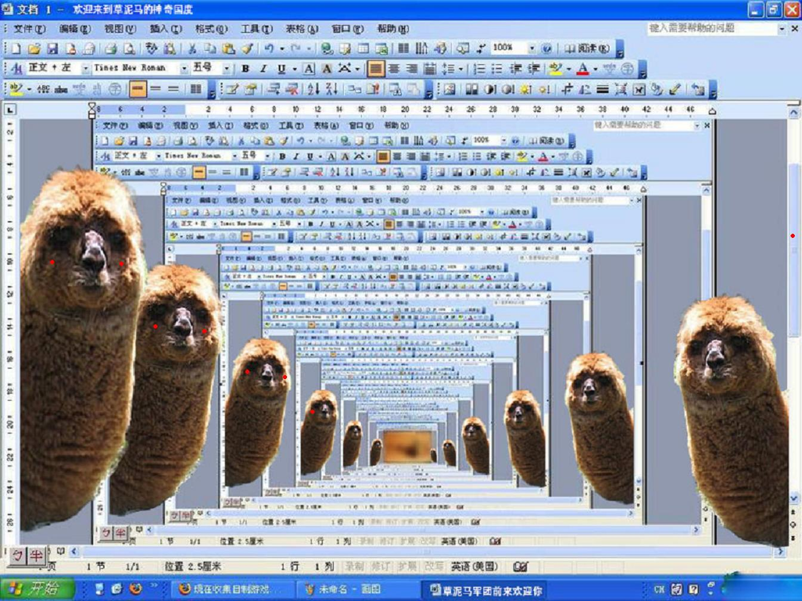
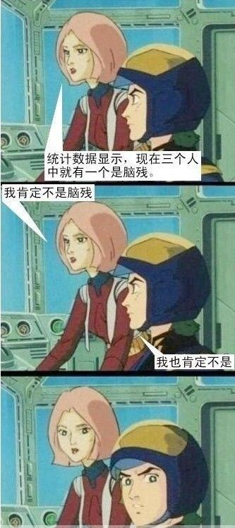
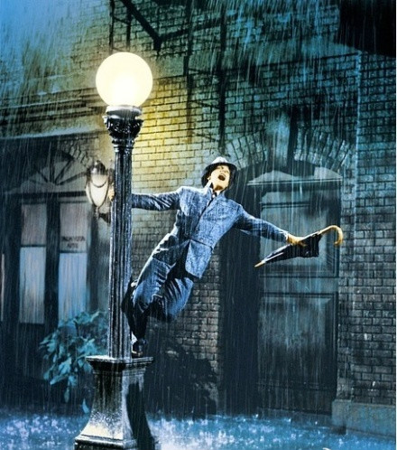

# ＜七星微语＞第二十四期：我花了几千万年爬到食物链顶端不是为了吃蔬菜的。

**瓢虫君：各位读者，小瓢虫这厢有礼了。七星微语第二十四期来了！如果你也想在七星微语中看到你喜欢的状态，请在人人网****@****瓢虫君！** **在此每条状态前标注的作者名仅仅表示瓢虫君能看到的转发的最源头，大多是该状态的原创作者，但并不排除是其转发的可能呦。**  

#  ＜七星微语•一周状态撷萃＞

## 第二十四期：我花了几千万年爬到食物链顶端不是为了吃蔬菜的

  **【说事】******

[刘一舟](http://www.renren.com/profile.do?id=264848815): 围观的人总是觉得自己很聪明，因为他们站在墙头的制高点上。

 [常遠](http://www.renren.com/profile.do?id=188752901) :带着一套判断和反应模式、一个世界“应该是这样的”框架出发，往往会痛苦而无奈。我不认识他，他为什么留言谩骂？我对她那么好，她为什么不领情？但也许，一个个这样、那样的他才构成了真实的世界。未必美好，但就是这样。用先验的“正确”去评判，未必是偏见，却可能阻挡了我们通向真实世界的努力。 [★刘新杰★](http://www.renren.com/profile.do?id=221110547) :发现有很多草泥马都有过五毛的经历 比较经典的表现有 对新闻联播和教科书都深信不疑过…而变成草泥马也无非是通过一两段视频或者是所谓禁书，最后再牢记几个要吹捧和要打倒的书籍 理论 人物 多转几个段子 传点乱七八糟的图 拍几个能喳呼的人马屁 和意见领袖加上好友 一个崭新的草泥马诞生了 

[金鑫](http://www.renren.com/profile.do?id=263426127): 地铁安检？我的包肯定比你的车安全。

[乔淼](http://www.renren.com/profile.do?id=310125776): 日记真正的价值在于供自己反思，而不是供别人对你指手画脚（起码在你活着的时候）；从这个意义上讲，所有的博客虽然名字叫“web log”，但首先都不像是日记，而像是讨好谄媚读者的广告或自我表达的小报。 ** ** **【吐槽】****** [舟亢](http://www.renren.com/profile.do?id=252531059): 有人说新刑诉法会让普通平民百姓无缘无故失踪，这些外国反动势力的言论真是可⺮ [张博然](http://www.renren.com/profile.do?id=257050221) :zz：我看了一篇文章，说的是大多数实验室都会特意招收一个无能、智障、白痴、脑残的学生。只是为了鼓舞实验室的士气，好让其他学生在遇到研究瓶颈时依旧信心满满奋勇向前。真是可笑。我环顾实验室，没有发现任何一个同学符合这种描述！ 

 [周勉之Ⓐ](http://www.renren.com/profile.do?id=348718957) :卧槽,你看看我们学的那叫什么专业选修课啊...《信号与系统》那么难的课,那么多人在底下睡觉,高铁和地铁能不出事吗!!? 

[黄薄码Live](http://www.renren.com/profile.do?id=326955432): 地铁追尾的一刹那许多人飞了出去，一男子顾不得摔倒的疼痛爬起来就找手机，赶来的救护人员拉他上担架，他按完最后几个键长吁一口气被抬上救护车，一护士瞄了眼，原来他发了条微博：《请理性看待上海地铁追尾 勿让民怨被反华势力利用》。护士嘟嚷了句：尼玛，原来是胡锡进啊！

[张家铭](http://www.renren.com/profile.do?id=21632381): 经典横批出现了：love the way you lie。出自天才的苏鑫同学。上联：subway，railway，highway，way way to die。 下联：officer，announcer，investigater，sir sir to lie 

[陶辰琦](http://www.renren.com/profile.do?id=248757298): 股票是一个老奶奶，跌了大家都在看，只有钱多的能把她扶起来。

[陈千里](http://www.renren.com/profile.do?id=229999993): 唐僧为什么不搓点脚皮之类的让那些妖怪吃，这样那些妖怪就长生不老了 [慕骋](http://www.renren.com/profile.do?id=251649923) :wake me up when september ends这首歌表达了上课无聊只好睡觉的大学生对国庆假期的强烈企盼。 佚名: 某政法学院的朋友说，他的校友的特点是：有一半的同学正在抓另一半同学 [祝祥](http://www.renren.com/profile.do?id=323711790): 学长说，他在大学四年对异性说的最多的一句话是……“三两饭”” [钱睿荪](http://www.renren.com/profile.do?id=247722879): 社会新闻的社会作用便是激励大家好好背单词。 [杨欢](http://www.renren.com/profile.do?id=226186490): 古代遇大災，棺材鋪發財；現代遇大災，新東方發財。 

[宋小乐](http://www.renren.com/profile.do?id=228074615): 范二逼说：国家福利果然好，花地铁的钱，享受高铁的待遇。

[李慕](http://www.renren.com/profile.do?id=328739022): 人人网八千万美元收购56网成功。可以考虑联合改名为人五人六网。

** ** **【杂烩】****** [陈峤 Tragödie](http://www.renren.com/profile.do?id=286464312) :每年，有大约五十万头班长由于被切取肾脏而死亡。现在，班长已被列入濒危物种。这些班长的肾中，有些被用来买月饼，有些被用来换爱疯5。即使是没被杀掉的班长，也被用来从事各种高强度劳动。如果大家都不使用爱疯，班长就会免遭这一命运。没有买卖，就没有杀戮。请关爱班长。 [郑茗露爱物理](http://www.renren.com/profile.do?id=275025472) :一个物理学霸和女朋友在公园的小湖上划船，两人坐在船头和船尾。突然学霸提议两人对调座位，调完之后他拿出卷尺量了船的位移和船的长度，然后说：原来你有一百二十斤啊。 [叫兽小星](http://www.renren.com/profile.do?id=600626367) :真正的兄弟，是你最需要女人的时候，做你的女人。 

 [王雪婷](http://www.renren.com/profile.do?id=266234873) :明天你是否会想起，昨天的双曲线系，今天你是否还惦记，弱酸根水解电极，老师们不会再教你，怎么画高尔基体，我也是偶尔被问起，才想起欧姆定律，谁成就多愁善感的你，谁卖了你的笔记，谁把你变成了背书器，谁给你做的考勤。【谨以此词献给大学学文的理科生】 [周子瑜](http://www.renren.com/profile.do?id=280119507) :学校食堂、教室、自习室每天都要上演这样的鬼故事：A同学指着一个空荡荡的座位小心翼翼地问旁边的B同学：“同学，这里有人吗？”此时B同学抬头瞟了一眼A同学，幽幽地说了一声：“有人！”A同学敬畏地望了望空座上方环绕的空气，仿佛看到了隐形的幽灵，迅速走开了。。。 [张天翔](http://www.renren.com/profile.do?id=230529310) :小撸怡情，大撸伤身……强撸灰飞烟灭 [微小说](http://www.renren.com/profile.do?id=600916099) :山路之上，一汽车驶近，路边寺庙门旁，一小和尚高举“回头是岸”横幅，大喊：施主看这里！车内一年轻人隔窗笑骂：傻逼！瞬间飞驰转弯而去。10秒钟后，碰撞惨叫坠落声传来。当晚，禅房内，小和尚对住持说：师父，是不是还是直接写“前方桥梁已断”好一些？ 佚名：坐飞机，不是故障延误就是航班取消；坐火车，不是被追尾就是被列车员消；坐大巴，不是高速塌陷就是大桥垮掉；开汽车，不是李刚追来就是双江把枪掏；坐地铁，不是开错方向就是追尾撞腰；要不咱改走道，腿儿着总成了吧？车里正练弹钢琴的小伙，他身上有刀！ [陆超](http://www.renren.com/profile.do?id=346252719): 我花了几千万年爬到食物链顶端不是为了吃蔬菜的。 [琼尼埃文斯](http://www.renren.com/profile.do?id=600660824): 姚明虽然说了一口流利的英语，却仍逃不过苦逼的四六级。在四级考场上，一双大手突然拍拍你，低沉的声音传来：“唉，同学，借我抄抄，介绍你和科比认识……” 

[秦清揚lolita](http://www.renren.com/profile.do?id=250935513): 据说：正大的员工抗议福利不好在淮海路放火引起火灾，大火蔓延到上海化工园区，导致巴斯夫硝酸装置泄漏，影响到东航和南航的导航系统，致使两架飞机相撞在停机坪，相关部门及时赶到，用地铁运送伤员，不料在乘坐10号线时发生追尾事故，愤怒的伤者家属在宜川路追杀相关负责人，追至南京东路百联将其杀死

[李云鹤❀Chiled](http://www.renren.com/profile.do?id=338630631): 在KFC里，隔桌一对男女。女生吃的很欢。男生含情脉脉的看着。过了好一会男生开口说“可以和我交往么？” 女生迅速把鸡腿放下 “很抱歉。。我有男朋友了。。”男生低下头貌似很难过的样子，又过了会女生很委屈的问“那我还可以吃么？”男生一脸无奈的抬起头说“吃吧 吃吧。。。。” [王党](http://www.renren.com/profile.do?id=355779364): 昨天晚上，宿舍哥几个刚进入梦乡，突然电话响起，离电话最近的哥们极不情愿的起来接电话，其他几位纷纷表示这是宿舍谁的电话就把谁扒了扔出宿舍，在讨伐声中电话被接起，电话那头传来一羞涩男生的声音:“麻烦叫一下汪婷婷。”接电话的哥们冷笑一下幽幽的说了句：“她睡了！”然后挂电话拔线~~~ [骆爽](http://www.renren.com/profile.do?id=331602098): 酒保说：“对不起，我们不对超过光速的中微子提供服务。” 一个中微子走进一个酒吧。 The bartender says, "Sorry, we don't allow faster than light neutrinos in here..." A neutrino walks into a bar. ---------盯了一会儿才明白，弱爆了…… 

****

 

（编辑：陈造极）

 
