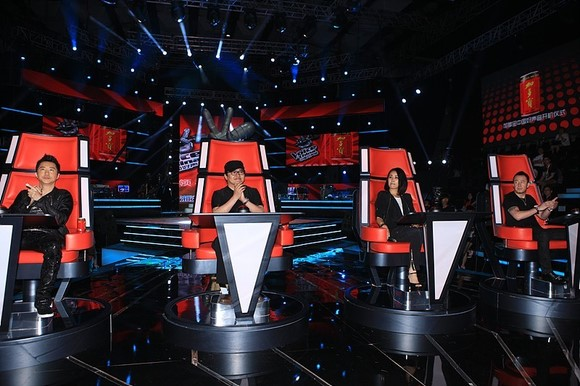

# ＜七星微语＞第五十一期：我们政府要是生气了，就不给你们找自行车了

**瓢虫君：各位读者，小瓢虫这厢有礼了。七星微语第五十期来了！如果你也想在七星微语中看到你喜欢的状态，请在人人网****@****瓢虫君！****** **在此每条状态前标注的作者名仅仅表示瓢虫君能看到的转发的最源头，大多是该状态的原创作者，但并不排除是其转发的可能呦。**  

#  我们政府要是生气了，就不给你们找自行车了

## 

 

#### **【世说新语】****“****古今多少事，都付笑谈中****”**

 [庄户刁](http://www.renren.com/profile.do?id=601490140): 今天看到的神一般的对联： 上联：1945年8月15日，战乱必宁苏联同美国逼苦日本东京；下联：2012年8月15日，京东本日苦逼国美同联苏宁必乱战。 [景辰](http://www.renren.com/profile.do?id=251049024): 刘翔退赛是一面镜子，骄傲者见骄傲，悲悯者见悲悯，洒脱者见洒脱，阴谋者见阴谋，自卑者见自卑，残暴者见残暴。 

 [✝安卡维fuckGFW](http://www.renren.com/profile.do?id=246343377): 就是是Believe，中间也有个lie；就算是百货，里面也有个日货。 [折翼の天使](http://www.renren.com/profile.do?id=600038849): 日本赶紧放人！再不放人我们政府就要生气了，我们政府要是生气了……就不给你们找自行车了，哼！ [李悦茹](http://www.renren.com/profile.do?id=262715242): 【世界六国大学生对考公务员态度】在美国，3%大学生愿意报考公务员；在法国，是5.3%；在新加坡，只有2%。在日本，就业倾向公务员排在榜单第53位；在英国，公务员甚至进入20大厌恶职业榜；而在中国，76.4%的大学生愿意报考公务员——这么多人想为人民服务吗？（数据源于各国审计署） ** ** ** **

#### **【恶搞吐槽】****“****微语是个好栏目****”**

 [姜戬](http://www.renren.com/profile.do?id=246941926): _米其林有英国厨师么？_转自[包文稻](http://www.renren.com/profile.do?id=229304769): _贝爷始终不肯承认，回国后吃得还不如丛林里好。_[包文稻](http://www.renren.com/profile.do?id=229304769): 我终于明白为什么贝爷在丛林里沙漠里能吃得下那么多奇怪的东西了——他是英国人 ！ #我保证这是我黑英国饮食的最后一弹# [沈史怡Loli](http://www.renren.com/profile.do?id=295476293): _他不写序也这样__……__我是一个很牛逼的人，我给你们说说我多牛逼，时无英雄竖子成名你们都不牛逼你们太可笑了，我有钱有名有酒有妞，我可以写自己喜欢的文字，我要用文字打败时间，好了接下来我给你说说什么是牛逼，这个牛逼啊__……_转自[徐肿胀](http://www.renren.com/profile.do?id=251708756): 发现冯唐给人家书写序都一个套路，必须把自己介绍一遍，大致是这样：小时候读唐诗以及多少多少书；十七岁时内心肿胀写了个长篇；提美国留学、学医八年、麦肯锡每周工作八十小时、坐了多少公里飞机、老爸喝浓茶老妈蒙古人。我都能背了…… [李小妹](http://www.renren.com/profile.do?id=462423778): _有你不孤单__——__白岩松。_转自[李氿凌❤☭](http://www.renren.com/profile.do?id=225846048): 神创造了破折号。没有人陪它玩儿，破折号感到很孤独。于是神又创造了白岩松。 

 [张学娘](http://www.renren.com/profile.do?id=348542064): _还有你的硬盘__……__你熟悉的亲人们会发现，这是他们最深刻了解你的一次，然而你死了__……So__，老子每次起自杀的念头随即就陷入深深的焦虑。__“__艾玛__……__还有哪些烂事儿没盖好？__”_转自[韦思斯](http://www.renren.com/profile.do?id=90706106): 可是不管怎么样，还是要好好的活着，因为你死了，你的手机收件箱和网页收藏夹就会被你爸妈看遍，你的人人就会有许多陌生人来参观，不管你的最后一条状态是否内容健康，都会变成你被转发次数最多的一条，他们还会在底下插满蜡烛。 [李楚秋](http://www.renren.com/profile.do?id=264397779): _女孩：只是因为在人群中多看了你一眼，再也不能忘掉你容颜。_转自[重庆](http://page.renren.com/600014952) : 周克华8年才抢了55.5万元，重庆女孩只看了周克华一眼，获奖励60万元。这就是人生，关键在于在对的时间遇到对的人…… 

[李示录](http://www.renren.com/profile.do?id=255114976): _神回复：__“__就说你心里除了外婆装不下别的女人。__”_转自[熊锐☼](http://www.renren.com/profile.do?id=246440626): 上火车了，外婆要我过年带女友回家。怎么办？

 

#### **【校园儿女】****“****哦，你也在这里****”**

 [林正遥](http://www.renren.com/profile.do?id=311640433): 刚刚和浙大的同学打完电话，她说一年多前，有一天她和同学去自习室，有一个高高的体育生过来问数理统计。她讲了很久他就是听不懂！最后她们无耐地对他说叹，“你实在是太笨了”。 这个被骂的学弟，正是孙杨…… 转自[孙晋](http://www.renren.com/profile.do?id=222896365): 挺贴切的类比，华少就是staff，永远当不了faculty。转自[张骁博](http://www.renren.com/profile.do?id=251871550): 今晚又有《中国好声音》，不错不错~仔细想想，如果把那四位老大拉人的招数类比学术圈也挺有意思。坤哥的话，刚刚AP拿tenure，见人就是哥今年有32篇working paper，你来了加你名字（Journal不知A.B.C级别，囧）。庾澄庆的话，非典prof，见人就说，哥带你做原子弹，狂野吧，他们paper算神马。那英姐估计就是associate了，或者正的，见人都是我认识很多其他的professor，以后写paper带你，你放心吧。。刘欢大叔估计就是professor of faculty或者dean了，直接丢一句，IAS、NASA跟他单独合作，全场冷掉。。╮(╯▽╰)╭ 

 [张汇泉](http://www.renren.com/profile.do?id=123305399): 真惊了！我国外的导师发邮件给我说：亲爱的Tony，我女儿听说在你们北京有仿冒爱马仕的手链，只需20美元左右就能买到。她想要一对，你能去秀水买了给我捎回来么？ [刘尚钰](http://www.renren.com/profile.do?id=280090660): 明天，苏宁和京东将要为我们证明寡头市场和完全竞争是等效的！竞价机制是要达到竞争均衡的！离散的动力系统是可以收敛的！家电市场是完备的！企业的会计利润是为零的！学了三年的数理经济终于到了见证奇迹的时刻！ [朱虹璇](http://www.renren.com/profile.do?id=229909492): 宿舍楼下有人在台阶上用红粉笔涂了一行大字：“台阶上不要放猫粮！””然而，一只白色圆润大猫一屁股稳稳坐住了那个“不“字。  

#### **【人生感悟】****“****感觉不会再爱了****”**

 [黄霄2.0](http://www.renren.com/profile.do?id=310366796): 父母大多喜欢用激将法,然而99%的激将法都是用错了的，常常不是激化家庭矛盾就是把小孩的缺点进一步定型下来,造成始得其反的结果。实际上，激将法是最难用且条件严苛的说服术之一，中国父母所用的激将法,多数不过是对小孩的单纯侮辱。 [牟宗达☭](http://www.renren.com/profile.do?id=254568540): 有一条恶龙，每年要求村庄献祭一个处女，每年这个村庄都会有一个少年英雄去与恶龙搏斗，但无人生还。又一个英雄出发时，有人悄悄尾随。龙穴铺满金银财宝，英雄用剑刺死恶龙，然后坐在尸身上，看着闪烁的珠宝，慢慢地长出鳞片、尾巴和触角，最终变成恶龙。（《在缅甸寻找奥威尔》） 呵呵，这就是我们的成长。 [罗天](http://www.renren.com/profile.do?id=225618178): 对于那些讽刺我们还在使用诺基亚的人，我们忠实的诺饭愿意借用胡安·费尔南多·肯尼迪（JFK）总统评价登月的一句话：We choose to use NOKIA, not because they are easy, but because they are hard. #一句话黑诺饭# 

 [苏小蛰](http://www.renren.com/profile.do?id=283550174): #不要跟购物狂讲道理#前两天有个朋友跟我说，她最近严重超支可是还不能抑制购物欲望。我说你每次买超过50块的东西的时候问自己三个问题1.如果不买会怎样2.不买有什么可以代替3.有没有便宜点的。今天她说她又败了一双鞋，我说你依我说的做了吗，她说问了啊：“如果不买会怎样？会死！”“……” [张柏仁 Byron](http://www.renren.com/profile.do?id=252194959): 【#伪语文#】原句：“其实我也是理解你的。”翻译：“好了，我现在要开始对你进行情感敲诈了。” **【杂谈杂烩】****“****啥都有****”**  [暴雨哥](http://www.renren.com/profile.do?id=266643464): 苍天啊我刚才真的是好不容易睡着了还没睡多久就做了个别人挠我痒痒的梦给尼玛活生生笑醒了我日！笑点低的人伤不起啊！ [馬欐（つ╯﹏╰）つzzy](http://www.renren.com/profile.do?id=241642953): 雅典太可怕了，你们人类快回家吧。我在问一个大妈路的时候，旁边两个擦玻璃的黑人硬要带路还要收带路费10欧（威胁曰雅典一个人走很危险的哟小姑娘）。于是我拿起擦窗拖把表演了一段太极剑，念念有词（我会告诉你们我其实在唱精忠报国吗），俩人抱起水桶连拖把都不要就跑了。 

 [拜文辉](http://www.renren.com/profile.do?id=244410465): 两个基督教传教士，大卫和麦克，行走在炽热的沙漠里，饥渴几乎要夺取他们的生命，正当这时，他们看见了一座清真寺，大卫对麦克说：“嗨，麦克，让我们假装成穆斯林，不然，会饥渴而死的。我要改名为艾哈迈德，你要改什么名字？”麦克拒绝改他的名字。之后他们来到了清真寺。清真寺的伊玛目热情的接待了他们且问他俩叫什么，大卫说：“我叫艾哈迈德。”而麦克告诉了伊玛目其真实名字。短暂的交谈后伊玛目吩咐自己的助手去厨房拿点食物和水给麦克，而深情的望着艾哈迈德说：“兄弟，斋月吉庆！” [汪子浩](http://www.renren.com/profile.do?id=223727907): 在香港生活的四年里，我时时刻刻都感觉到这是一个富有文化包容力的城市。举个例子吧，作为一个直男，我一直都可以自由地进出弯仔码头和弯仔地铁站，从来没有人对我投来异样的目光。 [潘伟](http://www.renren.com/profile.do?id=247323404): @从我浴室滚出去：孩子对山谷喊了声“喂”，四面八方传来阵阵的“喂”。孩子很惊讶：你是谁？山谷：你是谁？孩子：告诉我！山谷：告诉我！孩子：正宗好凉茶正宗好声音欢迎收看由凉茶领导品牌加多宝为您冠名的加多宝凉茶中国好声音喝启力添动力娃哈哈启力精神保健品为中国好声音加油！ 山谷：……你麻痹。 

（编辑：白告 责编：白告）

 
