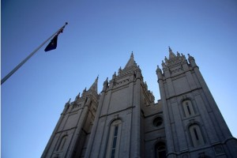
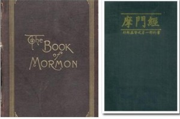

# ＜七星百科＞摩门教

根据2012年02月09日《纽约时代》的报道，“突然之间，米特•罗姆尼——这位共和党最炙手可热的候选人变成了一位愤怒的、满嘴喷火的保守派。其实他本质上是一位稳重的实用主义者，如今他却突然变得很狂躁，希望以此掩饰他的理性，以及他是一个摩门教教徒的宗教背景。摩门教是一个经常被误解甚至污蔑的少数派宗教。人们时常在揣测，罗姆尼表现出来的一些特质：充满戒备心甚至偶有防御反应，是否与神秘的摩门教有联系？他良好的精力和适应力是否拜早期在法国当摩门教传教士的经历所赐？”[1]2012年的美国总统大选激战正酣时，作为在竞选中大出风头的候选人罗姆尼为何会对自己的宗教出身感到紧张？他的宗教信仰对他的选举有什么样的影响？罗姆尼信奉的教派是什么样的教派？本期的百科将带给读者美国土生土长的宗教——摩门教。  

# **摩门教**

 

**本词条在以下文章中被使用** （1）[＜开阳＞亲爱的阿廖沙](/?p=22023) （2）[＜摇光＞费城——光阴的故事](/?p=21112) （3）[＜开阳＞谁来挑战奥巴马：2012美国共和党初选中期解读](/?p=20746) （4）[＜摇光＞在这片傻逼们自由生长的土壤上](/?p=12770) （5）[<第四十六期·天璇>嗜血的夜](/?p=1748) 

### 目录

1、摩门教的概况 2、摩门教的基本教义 

2.1摩门经 

2.2教义和圣约 

2.3无价的真珠 

2.4历代摩门教领袖得到的新启示 3、摩门教的起源与发展 

3.1 摩门教的缘起 

3.2 摩门教黑暗的前期 

3.3 摩门教在犹他州 

3.4 摩门教在今天 4、摩门教与一夫多妻制 

4.1 多妻制度的始作俑者 

4.2 多妻制度的理由 

4.3 政府对重婚的反对 

4.4摩门教的抗争 

4.5摩门教的妥协 5、 摩门教在美国的影响 

5.1对美国西部城市形成的影响 

5.2对美国社会观念的影响 

5.3对美国政治、政策的影响 6、 参考文献 7、 延伸阅读  **----------------------------------------------------------------------------------------------------**  **1****．**** ****摩门教的概况** 

摩门教（Mormonism），又称后期圣徒教会（The Church ofJesus Christ of Latter-day Saints），它由先知史密斯(JosephSmith ,1805- 1844) 于1830 年4月6日在纽约州菲亚特镇组建。 

摩门教源于基督教，继承了基督教的宗教信仰、宗教文化和机构设置，但是它还拥有自己的新生特点。摩门教的教名是由一个名叫摩门的人名得来。摩门（310-385 A.D.）是美国古时的先知，他是摩门经的前身---金版书页的作者。而摩门教教徒仅以摩门经和圣经为上帝的指示，所以他们称自己为后期圣徒教会，简称摩门教。[2]  **----------------------------------------------------------------------------------------------------**  **2.****摩门教教义** 

摩门教教义与正统基督教教义的不同之处在于其信奉多神论(poly theism)。[3]主要有以下四个方面： 

2.1摩门经：摩门教认为基督教的《圣经》是一本翻译不正确的经书，因此教会才会败坏。认为摩门经才是上帝的话。 

2.2教义和圣约：摩门教的教义就是一些史密斯．约瑟讨论教义的著作。 

2.3无价的真珠：包括摩门教自译的摩西书、亚伯拉罕书，加上史密斯．约瑟的见证和信条。 

2.4历代摩门教领袖得到的新启示：因为他们相信神“仍要继续启示许多有关神国度重大的真理”给他们。[4]  **----------------------------------------------------------------------------------------------------**  **3.****摩门教的起源与发展** 

3.1 摩门教的缘起 

1830 年，在史密斯个人魅力和上帝的指引下，摩门教诞生了。建教后的起步阶段，由于不同的宗教价值观和另类教规教条，如被人们认为野蛮的多妻制，摩门教教徒经常遭到当地居民的排挤与迫害，摩门教遇到困难重重，发展甚是缓慢。

3.2 摩门教黑暗的前期

1831 年，摩门教来到俄亥俄州东南部的科特兰。在这里，摩门教教徒开始耕作土地，建造房屋，很快就吸引了近千名信奉者，摩门教第一次得到了发展的机会。但是，由于摩门教教徒的非传统宗教信仰和非文明的多妻制，又遭到了当地人的排斥。 

1837 年，矛盾激化，摩门教又迁移到了密西西比州。意想不到的是，新来的教徒还没有扎稳脚跟，就被当地居民所孤立。因为当地政府坚信要维持当地秩序稳定，就必须赶走摩门教及其教众。 

1839 年，为了远离矛盾与冲突，摩门教跋涉到了伊利诺伊州，并得到了当地居民的的热烈欢迎。同时，摩门教传教士在整个美洲和欧洲的进行传教。商业上的成功和日益增长的政治权利重新引起了肆起的敌意。加之史密斯竞选美国总统，使摩门教徒继续陷入政党的纠葛中，更得到非摩门教教徒的憎恨，史密斯被捕入狱，被一群闯进监狱的暴民打死。史密斯死后，杨百翰继承教主之位，并于1847 年带领摩门教众迁往犹他州。 

3.3 摩门教在犹他州 

从1847年到1890 年摩门教进入一个了稳定发展期。在这一时期，摩门教形成了自己独特的发展方式和文化特点。在发展中的摩门教废除了多妻制之一决定，也正是他们逐渐融入美国精神社会主流的的具体体现。 

到了1869 年，在黄金热的驱动下，犹他州变成重要交通要道的枢纽。成千上万的人涌入了犹他州，并带来了大量的金钱。摩门教就此机会，运用手工业抓住了商机。这一时期，摩门教还表现出了政治独立立的迹象。 

1890 年，犹他州加入了联邦政府，这一事件表明了犹他州已经开始美国化了，慢慢融入了美国社会，并被美国社会主流所接受。 

3.4 摩门教在今天 如

今，全球的摩门教教徒已经达到1300 万，同时在各个地区正以每年成千上万的速度增加着。摩门教虽然发迹于犹他州，但是摩门教不是仅在犹他州才能发展立足的小宗教组织，因为犹他州只有百分之二十的少数人口参加了摩门教。大部分的教徒都生活在国外。如墨西哥、南美洲，还有太平洋上的一些岛屿。由于传教工作的不断被重视起来，还有更多的摩门教教徒的影子出现在了非洲、欧洲还有亚洲。所以，再称摩门教为一个美国宗教组织就不是很确切了，实际上他已经是一个世界性的宗教了。[5]  **----------------------------------------------------------------------------------------------------**  **4.**** ****摩门教与一夫多妻制** 

4.1 多妻制度的始作俑者 

摩门教最有争议之处在于他们倡导并实践多妻制度(Polygamy)。作为该教支柱之一的一夫多妻制在其存在的近50 年时间里(1843——1843年7月，据说斯密约瑟得到了一份有关多妻的启示，鼓励信徒多娶妻子。1852 年摩门教公开宣布实行多妻制。教会早期的领袖如斯密约瑟、杨百翰、伍惠福(W.Woodruff，1807－1898) 等都娶妻众多，此后一些富有的摩门教男性信徒也公开迎娶多位妻子。 

4.2 多妻制度的理由 

摩门教以宗教的理由实行多妻制并鼓励生育，认为多妻制可以约束男人的不忠行为。既然他们可以公开迎娶多个妻子，那么没有必要偷偷摸摸地搞婚外恋，这意味着他们的孩子永远不会成为单亲家庭儿童，也减少了寡妇及其子女的生活压力。然而，多妻制却在美国社会引起了轩然大波，有人将其与奴隶制并称为“野蛮主义遗毒的双胞胎”(twin relics of barbarism)。 

4.3 政府对重婚的反对 

1862 年7 月8 日，林肯总统签署了“莫里尔反重婚法案”(MorrillAnti － Bigamy Law)，艰苦的驯服摩门教之旅由此展开。这是美国国会通过的第一部旨在惩罚和预防重婚的法案。摩门教决定主动挑战这一法案，其理由是该法案违反了宪法第一修正案有关宗教自由的规定。 

4.4摩门教的抗争 

1874 年，杨百翰的秘书雷诺德(G． Reynolds) 甘愿当实验品，检验反重婚法的效力。雷诺德是个公开的多婚者，有两个妻子。被起诉后，他在庭审中表示，根据摩门教的教义，践行一夫多妻是该教男性成员的义务，这是源自上帝的启示。但是地方法院并没有接受他的申诉，雷诺德被判有罪。 

1862 年的莫里尔法案被宣布有效，任何多妻实践都被清楚地确认为违法。摩门教他们决定予以反击。首先是运用神启来谴责和诅咒那些反对多妻制的人。同时摩门教也寻求舆论的帮助，认为多妻恰恰是注重家庭责任的表现，而不是相反。 

不过摩门教的这些努力并没有改善他们的处境，反而招致更严厉的埃德蒙德法案(Edmunds Act) 在1882 年出台。该法案是1862 年反重婚法的加强版。它宣布重婚是重罪，违者将被处以不超过5 年的监禁和500 美元的罚款。 

迫于严峻的形势，教会领袖约翰·泰勒(J． Taylor，1808 － 1887) 于1885 年转入地下，几位主要领导人也都藏匿起来，管理层只能秘密处理教会事务，除了求助上帝别无他法。 

4.5摩门教的妥协 

1890 年9 月24 日，摩门教发布了著名的放弃多妻制的“宣言(Manifesto)”，表明愿意遵守联邦法律，并公开告诫摩门教徒要禁绝涉入任何被法律禁止的婚姻。教会清楚表示执行婚姻的法律属于政府权力管辖的范围，而摩门教会并不参与公权力的运作。摩门教与联邦政府之间的争议暂告一段落。在此之前，大约1300 个摩门教男性信徒因重婚罪被惩罚(Van Wagoner，1989)。[6]  **----------------------------------------------------------------------------------------------------**  **5****．****摩门教在美国的影响** 

5.1对美国西部城市形成的影响 

自摩门教创始人约翰·斯密遇害之后, 摩门教徒在新首领杨百翰的带领下开始西迁之旅。摩门教徒的大量西迁使得犹他州建州之前, 其所属西部地区人口的快速增加和聚集。另外，由于摩门教实行多妻制, 且大力鼓励人口繁殖, 也同样为西部城市建立所必须的人口聚集提供了基础。 

在短短的十年时间里, 摩门教徒用辛勤劳动的汗水改变了盐湖盆地的面貌, 在那里建立了一个繁荣的城市, 改造了沙漠的水利灌溉网, 还发展了农业和制造业等, 盐湖盆地得到了初步开发。从建筑的集群化、规模化来看, 摩门教对城市形成同样起了明显的作用。 

摩门教组织机构严密, 能够有效地调动所有或绝大多数信众。摩门教的一切规定都由最高的领导者发布, 实行的是一种自上而下的垂直统治。在城市的奠基和兴起阶段, 这样严密的组织进行了有效的调动, 最大程度集中了可用的人力、物力投入到新兴城市的建设中来。摩门教严密的教会组织成为最初城市组织的原形。 

5.2 对美国社会观念的影响 

摩门教对社会观念习俗的影响, 最为深远、后果最为严重、所引起的争论最多的是多妻制。除了多妻制, 摩门教的其他教义、教规也逐渐演变成社会观念, 这一点很明显地体现在西部某些州人们日常的行为生活当中。 

首先, 作为摩门教有益的社会遗产——重视家庭亲情, 在现代这个快节奏的社会, 引起越来越多人们的关注。每周一晚, 是摩门教每个家庭的亲情日。 

其次, 摩门教的社会服务和援危助困观念被越来越多的人所接受, 使摩门教的发展环境更加和谐。 

第三, 摩门教对社会观念的影响还体现在犹他州居民的日常生活习惯之中。在摩门教徒占绝对优势的犹他州(据统计摩门教徒占72%), 摩门教义使多数犹他人的生活同多数现代美国人的生活截然不同, 它强调的是勤劳( 蜂房是摩门教教会和犹他州的恰如其分的象征) , 是家长制家庭生活, 是绝对禁止烟草、咖啡、茶和酒的严格教规。 

5.3对美国政治、政策的影响 

摩门教对美国政府是支持的, 这在罗斯福新政时期表现得最为明显。20世纪30年代初, 大萧条席卷美国全国, 美国联邦政府决定拨款救济各州,，唯有犹他州拒绝联邦政府的资助。他们自己在摩门教徒中筹集资金, 建立“互助组”, 为本州公民创设福利制度。此外, 摩门教在教义允许范围内对美国政府的国防政策也给予了很大的支持。第二次世界大战以来, 犹他大门一直朝军事基地敞开着, 可以说犹他州是美国的兵营、旧式淘汰武器的销毁场、新武器的试验场和常规武器的存储库。 

摩门教控制的犹他州对华盛顿的影响也日益增加。当共和党在1980年取得了参议院多数时, 犹他州的两位共和党保守派参议员杰克·加恩和奥林·哈奇都成了很有势力的人, 领导着以前参议院自由派所控制的一些委员会。加恩成为银行、住房事务委员会的主席, 而哈奇则接管了劳工和人力资源委员会。更不用提自08年参加总统竞选的罗姆尼了。[7]  **----------------------------------------------------------------------------------------------------**  **6****．****参考文献** 

[1][罗姆尼：摩门教背景是劣势还是优势](http://review.cnfol.com/120209/436,1594,11713924,00.shtml)

[2]《宗教词典》.任继愈.上海辞书出版社,1981. 

[3]《谈谈美国摩门教及其文化》，郝雁南，《山东师大外国语学院学报》2000年第2期 

[4] [耶稣基督末世圣徒教会](http://www.lds.org/?lang=eng)

[5]《论摩门教的起源和发展》，陈光，《安徽文学》2009年第8期 

[6]《从边缘到主流:政府管制与摩门教的变迁》，卢云峰，《社会研究》 

[7] 《透视犹他, 看摩门教的势力——兼论摩门教对美国的影响》，杨松，《黑龙江教育学院学报》2008年8月第27卷第8期  **----------------------------------------------------------------------------------------------------**  **7****．****延伸阅读** 

[[1]《美国摩门教一夫多妻制初探》，安钰峰，《史学月刊》 

[[2]摩门教历史年表,世界宗教资料, 1994 

[[3][BBC: religions: Mormonism](http://www.bbc.co.uk/religion/religions/mormon/)

[[4]《美国摩门教保障计划的起源与发展》，安钰峰，《东北师大学报(哲学社会科学版)》1995年第5期  **------------------------------------------------------------------------------------------------**** 

**来自**[**北斗网**](http://rrurl.cn/vNE0s4)**旗下连接七星百科栏目**

**关注七星百科**** **

如果你喜欢七星百科的话，可以采用以下的方式关注我们: 

关注[瓢虫君](http://rrurl.cn/2yNkp0)、[瓢虫妹](http://rrurl.cn/uRUkdk)

关注[北斗网](http://rrurl.cn/vNE0s4)、[北斗网新浪微博](http://rrurl.cn/0NAtu7)

更多[七星百科词条](http://rrurl.cn/uAsEoh)

 

（编辑：曹海舰 责编：张金晶 高丽)

 
