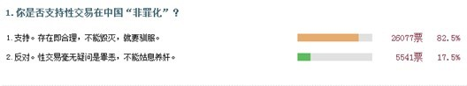

# ＜七星百科＞第三十一期：中国性产业非罪化

# **中国性产业非罪化**

**-------------------------------------------------------------------------------------------------------------------** ** ** ** ** **本词条在以下文章中被使用** （1）[<七星说法>第三十四期：再做扬州梦？——对性产业非罪化的探索](/?p=22119) （2）[<摇光杂谈>芙蓉姐姐与罗玉凤——其实我们嘲笑的是我们自己 ](/?p=3620) ** ** ** ** ** ** **---------------------------------------------------------------------------------------------------**  **词条简介** 对于性交易的产生与发展，**马克思认为：妓女是整个资本主义社会生产方式的一部分**。由于剥削的存在，社会贫穷化使一部分女性被迫投入性产业，同时结不起婚的男性也只得以买淫来解决性饥渴。资本主义社会追求利润的本质也迫使性产业高度商业化。因此只有消灭了私有制后，卖淫现象才会彻底根除。**如果不触动社会生产方式和整个制度，仅靠立法与行政手段来禁娼，反而会掩盖性产业的本质，成为政权粉饰太平的手段。**[1]   -------------------- **目录**

1、禁娼背景

2、性服务业现状

3、“非罪化”的提出及尺度拿捏

4、支持VS反对

4.1、支持

4.2、反对

5、参考文献

6、延伸阅读

**----------------------------------------------------------------------------------------------------** **1 禁娼背景** 中国共产党1949年胜利之后，地方政府承担起消除性服务业的责任。1949年2月3日，中共接管北京之后一个月，新市政府在叶剑英的领导下，宣布了一项管制市内众多妓院的规定。11月21日晚，警方出动2400余名警察进行扫荡，随后北京224间妓院全部被关闭，1286名性服务者、434名妓院老板及拉皮条者被拘留。**中共认为：“北京这次迅速、激烈的行动，很快被当作历史性的胜利和全国的模范，表明了新政府对政体革新的愿望和能力。”** 到1960年代初，这种方法基本上消灭了全国表面的性服务活动。中国政府声称，在成功管制性服务业的同时，性病也几乎从中国大陆全部被清除。**为了表现这次胜利，全国29间性病研究机构在1964年被关闭。**[2] **禁娼相关法律**  1987年《[中华人民共和国治安管理处罚条例](http://zh.wikipedia.org/w/index.php?title=%E4%B8%AD%E5%8D%8E%E4%BA%BA%E6%B0%91%E5%85%B1%E5%92%8C%E5%9B%BD%E6%B2%BB%E5%AE%89%E7%AE%A1%E7%90%86%E5%A4%84%E7%BD%9A%E6%9D%A1%E4%BE%8B&action=edit&redlink=1)》 1991年《[全国人民代表大会常务委员会关于严禁卖淫嫖娼的决定](http://zh.wikipedia.org/w/index.php?title=%E5%85%A8%E5%9B%BD%E4%BA%BA%E6%B0%91%E4%BB%A3%E8%A1%A8%E5%A4%A7%E4%BC%9A%E5%B8%B8%E5%8A%A1%E5%A7%94%E5%91%98%E4%BC%9A%E5%85%B3%E4%BA%8E%E4%B8%A5%E7%A6%81%E5%8D%96%E6%B7%AB%E5%AB%96%E5%A8%BC%E7%9A%84%E5%86%B3%E5%AE%9A&action=edit&redlink=1)》 1991年《[全国人民代表大会常务委员会关于严惩拐卖、绑架妇女、儿童的犯罪分子的决定](http://zh.wikipedia.org/w/index.php?title=%E5%85%A8%E5%9B%BD%E4%BA%BA%E6%B0%91%E4%BB%A3%E8%A1%A8%E5%A4%A7%E4%BC%9A%E5%B8%B8%E5%8A%A1%E5%A7%94%E5%91%98%E4%BC%9A%E5%85%B3%E4%BA%8E%E4%B8%A5%E6%83%A9%E6%8B%90%E5%8D%96%E3%80%81%E7%BB%91%E6%9E%B6%E5%A6%87%E5%A5%B3%E3%80%81%E5%84%BF%E7%AB%A5%E7%9A%84%E7%8A%AF%E7%BD%AA%E5%88%86%E5%AD%90%E7%9A%84%E5%86%B3%E5%AE%9A&action=edit&redlink=1)》 1992年《[中华人民共和国妇女权益保障法](http://zh.wikipedia.org/wiki/%E4%B8%AD%E5%8D%8E%E4%BA%BA%E6%B0%91%E5%85%B1%E5%92%8C%E5%9B%BD%E5%A6%87%E5%A5%B3%E6%9D%83%E7%9B%8A%E4%BF%9D%E9%9A%9C%E6%B3%95)》 1997年《[中华人民共和国刑法](http://zh.wikipedia.org/wiki/%E4%B8%AD%E5%8D%8E%E4%BA%BA%E6%B0%91%E5%85%B1%E5%92%8C%E5%9B%BD%E5%88%91%E6%B3%95)》 1999年《[娱乐场所管理条例](http://zh.wikipedia.org/w/index.php?title=%E5%A8%B1%E4%B9%90%E5%9C%BA%E6%89%80%E7%AE%A1%E7%90%86%E6%9D%A1%E4%BE%8B&action=edit&redlink=1)》 2005年《[中华人民共和国治安管理处罚法](http://zh.wikipedia.org/w/index.php?title=%E4%B8%AD%E5%8D%8E%E4%BA%BA%E6%B0%91%E5%85%B1%E5%92%8C%E5%9B%BD%E6%B2%BB%E5%AE%89%E7%AE%A1%E7%90%86%E5%A4%84%E7%BD%9A%E6%B3%95&action=edit&redlink=1)》 **----------------------------------------------------------------------------------------------------** **2 性服务业现状** 英文《中国日报》报道：中国的性产业到底有多大的规模？有人说是400-600万小姐，也有人说是上千万小姐。可以肯定的是，**改革开放以来，中国的性产业复活且遍布每一个城市。**尽管自80年代以来，政府实行禁娼制度和扫黄政策，但是性产业并没有因为扫黄和道德上的谴责而消失。 **“****找小姐”****几乎成了男性（尤其是生意场）一个重要的社交文化。** **“小姐”的生存现状： ** 现代性产业的**组织形式**也是多样化的。（1）**半奴隶制度**。这种制度下小姐与老板的关系是几乎奴隶与奴隶主的关系，小姐没有完全的人身自由，没有独立的收入。有些是以红灯区发廊的形式存在，也有以鸡头控制某个小姐的个体形式存在。（2）**人身依附制度**。典型的是 “包吃包住”的形式，小姐有自由来去的自由，但是受妈咪的控制。（3）**雇佣制度**。这种制度的特征是：小姐实行的是“上下班”制度，可以随时随意退出和离开。（4）**个体经营制度**。小姐自己独立经营，或夫妻店式的经营。 **陷于半奴隶制的小姐，比自由雇佣制度和个体经营制度下的小姐，往往处于更加劣势的地位，更加容易遭受暴力，也更加容易得病以及传播疾病。** **经济因素是女性进入性产业的一个重要原因**。从我们的研究经验看，家庭贫困（包括绝对贫困和相对贫困）、就业机会少，或者其他就业机会条件太差（比如工厂打工妹）等通常是小姐入行的重要动力。也有部分小姐的合理化解释具有更加积极的含义，如“为了更好的生活”，做小姐自由“好耍”，“能接触更多的人”，相对于原来的生活有更多上升的机会、外出的机会等等。 性产业出现国际化趋向，跨境流动的情况有所增加；性产业更加向大中城市集中；为中年的、中低收入的男性提供的性服务有所增加；性服务的价格基本持平，略有降低的趋势；一些高档小姐开始向下流动；中国社会的性网络在扩大；毒品、冰台带来新的风险；某些地方进入性产业的渠道出现家族化倾向；性产业的网络化与性服务更加多样化；性产业中社会性别开始多样化，男性性工作者、跨性别性工作者开始显性化；性服务工作者面临的暴力开始显性化。 [3] **性交易屡禁不止：** 因为社会依然存在私有制和市场经济，只要有需求，在利益的驱动下，就会有人铤而走险以身试法。我国解放初期的禁娼运动之所以取得了成功，正是因为建国后真正消除了市场经济，彻底地消灭了性交易生存的土壤。如果不是这样的话，一段时间后性交易又会死灰复燃。[1] **----------------------------------------------------------------------------------------------------** **3 “非罪化”的提出及尺度拿捏** **2005年年末，迟夙生以建议的方式紧急向全国人大提出性产业非罪化提案。**06年3月份，在全国人大会议上，迟夙生建议刑法的358条、359条和360条做联动修改。虽然议案没有成功，刑法的条文没有修改，但是以后这个刑法的条文也引起了一些法学家的重视。** ** **非罪化不同于合法化。非罪化在香港称为非刑事化，**指将原本被法律所处罚的行为变成法律不处罚的行为。一般而言，非罪化是经由修改法律、对法律加以解释或由法院停止适用某一法律而达成。非罪化往往仅指免于国家施以的刑罚或行政罚，并不必代表免除全部的法律责任，就算非罪化，同样必须面对民事的损害赔偿责任。[1] 在介绍性交易非罪化对社会产生的影响时，黄盈盈博士认为，很多人担心非罪化会使得性产业泛滥，其实不然；一些地方的经验表明**，性交易非罪化恰恰能更好地将隐藏在性产业中的黑恶势力和暴力犯罪分子，这些本应该被国家司法力量打击的群体和性工作者有效地分离开。**非罪化模式下**，性工作者自我管理的组织也更加有可能配合政府打击这些侵害他们自身利益，同时危害社会的恶势力**；**对于性产业中的疾控工作而言，免受法律制裁的性工作者才有可能真正地、积极地配合政府的工作。** 性交易非罪化在西方得到很多支持的原因就是：性交易非罪化在法律精神上和道义上依然不赞成性交易，但在实际操作层面上默许性交易的存在。[1] **----------------------------------------------------------------------------------------------------** **4 支持VS反对** **4.1 支持**  数据来源：[凤凰网调查](http://survey.news.ifeng.com/result.php?surveyId=956) 1892年12月22日，恩格斯在给德国社会民主党人倍倍尔的信中写道：“我们首先考虑的是作为现存社会制度的牺牲品的妓女本身的利益，并尽可能地使她们不致遭受贫困。绝不应该损害她们的人格，也不应该损害她们的尊严。”恩格斯还写道：“在卖淫现象不能完全消灭以前，**我认为我们最首要的义务是使妓女摆脱一切特殊法律的束缚，完全停止对卖淫进行追究并使妓女不受剥削！**”[1] 支持性产业非罪化的人一般从边缘人群的人权和就业问题，社会不公平与腐败，还有艾滋病的防治等方面出发，呼吁通过非罪化的方式来缓解“小姐”艰难的生存现状，使整个行业公开透明化；他们认为，与其屡禁不止，不如通过非罪化把性产业纳入到正规的监督范畴内，使行业相关人员的福利得到真正的改善。在客观环境不能给“小姐”们的生活带来保障的前提下，禁娼扫黄无异于逼良为娼。[4] 目前，中国支持性产业非罪化的学者有：迟夙生、李银河、潘绥铭等。  **4.2 反对**  资料来源：[凤凰网](http://bbs.ifeng.com/talk/special/chisusheng/) 对于性产业非罪化持反对态度的人，则多从传统道德的角度入手。按照一般的社会道德标准，免费的性才是道德高尚的，而不免费的性是道德低下的。 用法律的形式来处罚公民的不道德行为，这是一种立法上的道德清高主义。一个现代法律体系的基本原则在于：不应当以社会上一部分人的道德标准作为依据订立法律，去惩罚社会上另一部分人不侵害他人权利的行为。[5] **----------------------------------------------------------------------------------------------------** **5 参考文献** （1）凤凰文化：[灵肉纠缠：性交易遭遇“中国式”尴尬](http://culture.ifeng.com/abroad/200905/0531_4088_1181826.shtml). 2009-05-31 （2）[罗瑞卿一夜扫除北平妓女](http://www.booker.com.cn/gb/paper23/23/class002300006/hwz162063.htm) （3）Chinadaily：[中国的性产业：生存现状与走向](http://www.chinadaily.com.cn/zgrbjx/2010-05/31/content_9908937.htm). 2010-05-31 （4）潘绥铭：[扫黄注定无效 ](http://blog.sina.com.cn/s/blog_4dd47e5a0100omg4.html) （5）李银河：[我为什么主张卖淫非罪化](http://view.news.qq.com/a/20061128/000028.htm) **----------------------------------------------------------------------------------------------------** **6 延伸阅读** （1）潘绥铭：[扫黄注定无效](http://blog.sina.com.cn/s/blog_4dd47e5a0100omg4.html) （2）李银河：[我为什么主张卖淫非罪化](http://view.news.qq.com/a/20061128/000028.htm)  ** ------------------------------------------------------------------------------------------------**  **来自****[北斗网](http://rrurl.cn/vNE0s4)****旗下连接七星百科栏目** **关注七星百科** 如果你喜欢七星百科的话，可以采用以下的方式关注我们: 关注[瓢虫君](http://rrurl.cn/2yNkp0)、[瓢虫妹](http://rrurl.cn/i3tz65) 关注[北斗网](http://rrurl.cn/vNE0s4)、[北斗网新浪微博](http://rrurl.cn/0NAtu7) 更多[七星百科词条](http://rrurl.cn/uAsEoh)   (助理：查启晨 编辑：董宸 责编：董宸)
