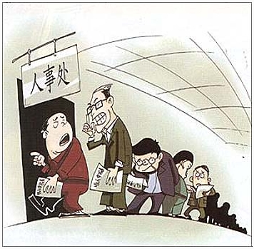
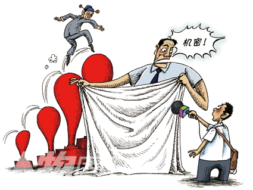

# ＜七星百科＞第三十二期：中国官员晋升制度

 

# 中国官员晋升制度

## 

 

### 词条简介

**晋升**或升迁指在工作组织内沿着层级序次安排的管理职位上升的路线。在政府等公共部门中，晋升是组织成员孜孜追求的核心目标之一，而晋升激励也成为主要的激励手段。通过一定的考核指标和选拔标准来决定官员的晋升，官员的政绩观与发展观联系在一起，就可以推动官员朝着特定的方向努力，从而实现既定的发展目标。因此，确定官员晋升的决定因素并使其发挥作用，就可以实现政府组织的有效管理。本期百科介绍的将是当代中国官员的晋升制度。

 

### 目录

 **1.中国官员的分级** **2.历史缘起** **3.决定因素** 3.1.政府文件规定 3.2绩效制度 3.3 官员绩效考核的技术手段 **4.我国官员晋升制度现状** **5.参考文献** **6.延伸阅读**  

### 1 中国官员的分级

 一级：中共中央政治局常委 中华人民共和国主席、副主席 委员长 总理 中华人民共和国中央军事委员会主席 全国政协主席 二级：政治局成员 书记处成员 副委员长 副总理 国务委员 军委副主席 全国政协副主席 最高法院院长 最高检察院检察长 三级：部长 部党组书记 省委书记 省长 省人大主任 省政协主席 四级：副部级 副省级 五级：司长 厅长 地级市长 巡视员 六级：副厅级 副市级 助理巡视员 七级：处长 市局长 县长 调研员 八级：副处级 副县级 助理调研员 九级：科长 市处长 县局长 乡镇长 主任科员 十级：副科长 股长 乡镇助理 副主任科员 十一级： 科员 县以下官员 十二级： 办事员[1]  

### 2 历史缘起

在上世纪80年代初邓小平提出了改革党和国家领导制度的重要思想,包括强调干部队伍的年轻化、知识化和专业化,鼓励老干部的离休退休,引入任期制和年龄限制。改革开放以来，我国干部管理体制中一个重要变化就是考核标准的变化,官员在任期内的经济绩效取代了过去的政治挂帅，形成了以经济建设为中心的政绩观。这种转变的契机是党中央在十一届三中全会以来拨乱反正和全党工作重心从阶级斗争转向经济建设。经济改革和发展成为各级党委和政府的头等大事,经济绩效也就成了决定官员晋升的主要指标之一。干部管理体制的巨大改革使得地方官员的政治激励在我国经济发展过程中发挥了重要作用。

在这种新型的干部管理体制下，地方官员为了得到政治晋升或者避免降级，致力于推动辖区经济发展，力求辖区经济增长率记录排名位居前列。在这个买方垄断的市场上，地方官员为了个人的政治前途，形成了一种基于上级政府评价的锦标赛式的经济增长竞争。

 ** **

### 3 决定因素

政府官员晋升的决定因素是多种多样的，既包括官员自身的素质、能力和努力程度，也涉及官员所在政府组织和辖区的状况。

#### 3.1.政府的文件规定

中国官员晋升规定：

官员晋升职务，应当具备拟任职务所要求的思想政治素质、工作能力、文化程度和任职经历等方面的条件和资格，同时在规定任职资格年限内的年度考核结果均为称职以上等次。 晋升县处级以上领导职务的官员，应当具备《党政领导干部选拔任用工作条例》和有关法律、法规、章程规定的资格。

#### 3.2.绩效制度

绩效考核与干部选拔任用居于干部人事制度的核心，决定着干部的进退升黜，并会影响制度安排和权力配置。因此，政府官员的绩效考核与晋升模式就成为国内外研究关注的焦点问题。

所有的对象或系统都存在绩效，而政府管理的核心问题就是改进绩效。从字面上理解，政府绩效指“政府所做的成绩和所获得的效益”，但其内涵却十分丰富，既包括政府公共服务和社会管理的产出与结果，也包括政府行使职能的过程。政府绩效是评判政府治理水平和运作效率的重要依据，是一个由经济绩效、社会绩效、政治绩效综合而成的多维复合概念。政府绩效是政府实现其组织日标的相对表现，涵盖了从政府获取资源到组织内部运作，再到社会感知政府行政成果的全过程。尽管政府绩效代表一级政府或其职能部门的组织绩效，但党委领导下的行政首长负责制决定了官员政绩与政府绩效的同构性，特别是对党政“一把手”而言更是如此。

晋升是人力资源管理的重要环节之一，也是组织实现人员激励和稳定发展的前提条件。特别地，组织高层领导人的离职(turnover)是学者们最为关注的现象，针对他们的绩效、声望、支持率等的分析，是公共管理研究的一个热点。学者们多从政府绩效的信息公开及其对选民的影响出发，考察绩效问责对政府官员支持率的影响。在西方民主国家，选民的支持是政府官员任免升黜的决定因素，地方政府绩效信息的公开使选民能够利用它们来影响官员的，尽管中国政府官员的任免在法定程序上是通过人民代表大会和党员大会或党委常委会实现的，但是真正的人事任免权却在上级党组织，特别是上级党委书记手中。因此，政府绩效必须影响上级领导(而非选民)，才能实现基于绩效的晋升(Chow，1988)。多数选民与少数上级领导对绩效信息的获知、判断和利用的程度和方式是不同的，这种差异导致中西官员晋升的不同逻辑。

由于决定政府官员任免升黜的主体不同，考察的主要内容和研究的方法也存在差异。中国各级政府每年都会由行政首长向同级人民代表大会做工作报告，并向社会公开发布，人民代表和社会公众都能对政府绩效作出感知，并会依据感知予以投票。但由于上级党委控制着下级党政“一把手”的人事管理权，它对下级政府绩效的评判才是决定其任免的根本，这也是中国有别于其他国家的地方。最后，政府绩效的标杆得分和分级排序更加易于比较，也是现实中采用最多的模式。这种分析比相对绩效考核更进一步，因为排名或排序式的简单相对比较，显然比基于绝对数据的相对考核更为容易和便于观察，也更有可能是选民和人事部门使用的策略。

长期以来，我国各级政府顺应“以经济建设为中心”的发展方针，政府的合法性和官员的政绩均建立在GDP等经济增长数字上。自科学发展观提出以来，若干省份已经开始试点新的党政领导干部考核新体系的工作。该体系除了经济发展内容外，还加入了环境保护、能源消耗、社会治安、公共教育等环境和社会内容。党政领导干部政绩考核体系的变化表明，政府正逐步从单纯注重经济增长向注重社会全面发展转变。因此，已有研究对政府绩效的测量存在不足，未能将体现科学发展观要求的指标纳入考察，分析结果也受到影响。

#### 3.3 官员绩效考核的技术手段

国家官员的考核工作是整个人事考核的重要组成部分。人事考核有广义和狭义之分。从狭义上讲，人事考核是指用人单位对工作人员或业绩成绩的质量、数量进行考核审查；从广义上讲，它还包括对工作人员的现在和潜在的能力、品行、学识、性格、健康等进行考核审查。官员考核，主要是指后者。具体来说，国家公务员考核指的是国家行政机关按照国家官员法规的相关规定，对国家官员的品行、学识、工作成绩等进行定期和不定期的考察，并给出评价结果，作为对国家公务员进行调整职务、级别和工资以及奖例、培训、辞退的依据，考核的对象主要是非领导成员官员

考核是官员管理的基础，通过考核，可以全面了解官员的政治思想表现、工作能力、文化专业知识和工作实绩，对官员是否胜任现任职务、是否具备担任更高级职务的条件做出正确的评价和预测。通过考核，可以根据官员的特长、缺陷和职位要求进行有目的的培训，根据官员完成工作任务的数量和质量决定是否晋级增资，由此可见，考核直接关系到整个官员管理制度的建设和实施。

 

### 4 我国官员晋升制度现状

我国是处于社会主义初级阶段，官员制度发展历程很短，还处于摸着石头过河的探索阶段，自从《中华人民共和国官员法》实施以来，官员队伍的整体素质有了明显提高。但从制度实践的情况来看，我国官员工作岗位缺乏科学的工作分析和明确的岗位说明。绩效考核纬度和指标没有从根本上改变其原有的那种内容空洞、针对性以及可行性差的缺陷，致使官员考核与评估往往走过场流于形式，有的甚至演变为人际关系的考核，而不是对实际工作完成情况和工作能力的评估，我国目前官员绩效评估依然停留在将考核结果作为奖惩依据的水平上，强调事后惩戒，而通过评估来推动组织目标实现以及为人才成长提供积极环境的作用很难得到发挥。通过考察我国现行的官员考核制度，我国官员考核制度无论在理论上还是在实践中都存在很多问题。我们可以把我国官员绩效考核制度的缺点归结为以下几点：

**1．考核指标不明确，过于笼统，可操作性不强**

一般来说，考核应以职位分类为基础，不同部门的不同类别、不同层次的官员应制定不同的考核指标体系，以便全面、具体地反映官员在工作中的各方面表现。现行的考核制度将考核内容分为“德、能、勤、绩、廉”五个部分，考核标准也只是定性地做了些说明。而许多单位仅依此作为考核依据，考核内容大体相同，没有将单位业务绩效与个人的工作绩效相扣，没有体现不同类型、不同层次，不同岗位官员的具体要求，只注重同一性，忽视了差别性。同时，“由于工作性质、工作特点差异大，部门之间、被考核者之间缺乏可比性，考核者无所适从"

**2．考核方法不科学**

首先是考核形式不科学。长期以来，官员的考核就是以科、处或一个部门为单位进行的，先个人小结，再民主评议，然后领导总结，集体评优，再填考核表，最后由考核委员会审定。这个过程看起来比较规范、无懈可击，实际上不少环节亟需改进。处长、科长、科员、办事员放在一起进行评比，没有可比性，显然不合理、不科学。不能按照处长的工作标准去考核处长的工作，不同的岗位，不同的职务工作标准是不一样的。因此，把不同职务人员放在一起进行考核评比显然不科学。此外，考核方法定性有余，定量不足。我国官员考核虽然明确强调采取定性与定量相结合的原则，但在实际的考核中，对官员的考核仍然以定性考评为主，这就造成了考核既缺乏科学性，又难以避免随意性和片面性，这就很难保证实绩考核工作的顺利进行。

**3．平均主义和宽大化倾向**

即所有被考核者的成绩评定相差无几，以致无法拉开档次，一方面造成你好我好大家都好的局面，另一方面对有些被考核者的评价高于实水平，出现拔高，造成考核结果与实际脱节。在实际操作中一些行政首长由于好人主义怕得罪人影响属下对自己的评价考核结果除了优秀以外都是称职没有不称职。

**4．考核程序不规范**

我国国家官员考核制度规定，进行年度考核时，必须设立非常性的考核委员会或考核小组作为考核的工作机构，并且要由各部门负责人直接领导。年度考核要经过个人小结、群众评议、主管领导评语、考核委员会审核、部门负责人确定考核等次的基本程序。但是在实际考核过程中，有些单位以及一部分单位的一些部门不能严格按照规定程序进行考核，依然“依据民主评议结果来确定考核等次”，存在“以评代考”的现象@。个别地方和个别单位在官员年度考核中不搞公开述职。此外，还有一些单位不按照规定将考核结果以书面形式通知受考者本人。违反程序的官员考核，既影响了考核工作的准确性和实际效果，也弱化了群众评议和群众监督，违背了官员考核的客观公正原则和民主公开原则。

**5．考核过程形式化**

考核过程中，很少有群众参与到官员的考核中来。一方面是由于群众的参与意识薄弱，而更重要的是有些部门根本没有设置群众参与的渠道，另一方面就是领导独断专行，一人说了算，这样一来民主测评只会流于形式，考核过程的公开性也很欠缺，官员考核一般都是在部门内部进行，既不对外公布官员平时考核的情况，也不公布定期考核的标准、方法、程序和结果。

**6．考核中缺乏监督和反馈机制**

有关法律法规虽然规定官员如果对考核结果有异议，可以申请复核和申诉，但由于复核和申诉机制不完善，致使在实践中考核工作实际上处于缺乏监督和反馈机制的状态。

**7．考核结果难以兑现**

官员考核的激励功能就体现在通过考核，确定等次，然后根据工作成绩的大小，有赏有罚、有升有降，并且把这种赏惩、升降同物质利益联系起来。然而，我国官员考核在兑现环节上，还缺乏力度。首先，对优秀官员的奖励力度不够。其次，考核与晋升、培训等环节脱钩的现象还比较普遍。最后，对不称职的官员的处理较难圆。

 

### 5 参考资料

 （1）[中国行政官员级别一览表](http://www.douban.com/group/topic/22890597/) （2）[官员职务任免与职务升降规定（试行）](http://www.cnca.gov.cn/rjwbgs/ztxx/ldgzhbz/40814.shtml) （3）[中国地方官员晋升机制再考察](http://q.sohu.com/topic/45766703) （4）《政府绩效与官员晋升研究综述》， 吴建南、马亮，公共行政评论2009年第2期。 （5）《我国公务员绩效考核体系改革探索》，李琼瑛，华中师范大学硕士学位论文  

### 6 延伸阅读

 （1）《官员考核规定（试行）》 （2）《当代中国行政管理体制沿革研究》，杨冠琼，北京师范大学博士生论文。 ** ** 

( 助手:何凌霄 编辑：曹海舰 责编：董宸)

 

#### **来自[北斗网](http://rrurl.cn/vNE0s4)旗下连接七星百科栏目**

### 关注七星百科

如果你喜欢七星百科的话，可以采用以下的方式关注我们:

关注[瓢虫君](http://rrurl.cn/2yNkp0)、[瓢虫妹](http://rrurl.cn/i3tz65)

关注[北斗网](http://rrurl.cn/vNE0s4)、[北斗网新浪微博](http://rrurl.cn/0NAtu7)

更多[七星百科词条](http://rrurl.cn/uAsEoh)

 
