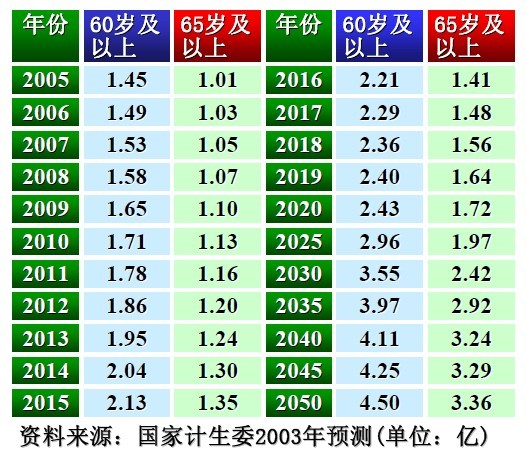
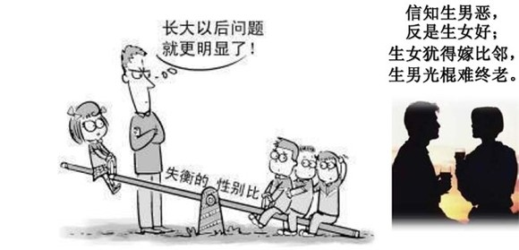

# ＜七星百科＞第二十七期：计划生育制度

 

# **计****划****生****育****制****度**

## 

### **本词条在以下文章中被使用**

（1）摇光杂谈：[《当傻逼的优越感丛生并成功将自己感动》](/?p=13970)

（2）天玑连载：[《我的基层观察（一）乡镇基层政权观察》](/?p=1973)

（3）开阳高论：[《民族国家的穷途末路》](/?p=4623)

** **

### **词条简介**

**计划生育政策是中华人民共和国的人口控制政策，是中国的一项基本国策，**此政策限制城市户口已婚汉族男女只能生育一名子女，但许多地区对农村夫妇、少数民族和夫妇均为独生子女等几种情况作出了例外规定[1][2][3]，民族自治地方也普遍设定了自己的计划生育政策。**为了减轻人口增长过快对中国的经济、社会、资源、环境造成的负面影响，中国政府在****1970****年代开始推行计划生育；**1979年，中国政府进一步将“实行计划生育，控制人口数量，提高人口素质”确立为其基本国策之一。[4][5]根据中国计生委相关机构的研究成果，这项政策自其实施开始，至2000年时共减少了2.5亿孩子的出生。在2002年以前，超生、多生的中国公民会被处以数额不等的计划生育罚款。[3][6]

但从2002年9月1日实施《中华人民共和国人口与计划生育法》后，违规生育子女的公民被要求“依法缴纳社会抚养费”，[7]其中社会抚养费的征收标准按省级（即省、自治区和直辖市）规定，主要参考的是当地城镇和农村居民的人均收入。[8]每级政府均设有人口和计划生育委员会，负责宣传计划生育相关的法律法规，并监督和检查该政策的实施情况。[9]在收取社会抚养费的过程中，甚至出现地方政府为获得社会抚养费作为地方财政收入而“没收”小孩的极端犯罪事件。**尽管有计划生育政策存在，但仍有许多中国公民以缴纳罚款或不上户口的形式生育了一名以上的子女。**** **

### **目录**

1、历史

1.1、背景

1.2、官方宣传

2、现状

2.1、相关法律

2.2、评价

2.2.1、支持

2.2.2、反对

3、政策未来

4、参考文献

### **1 ****历史**

**1.1****背景**

1798年英国牧师**托马斯****·****罗伯特****·****马尔萨斯**发表《人口学原理》。认为只有**自然原因、灾难、道德限制和罪恶**才能限制人口过度增长。

1950年代**马寅初**首先提议在中华人民共和国进行人口控制（非计划生育）。但当时人口控制并未真正实行，中国家庭生育未受政府影响。

1960年代末中国人口急剧增长，因人口压力巨大，政府最终设立**国家人口和计划生育委员会**（计生委），计划生育成为中华人民共和国国策，此后计划生育逐步强化实施。

1977年8月12－18日中共第十二次全国代表大会：“到本世纪末，必须力争把我国的人口控制在十二亿以内。”

1979年，中国政府进一步将“**实行计划生育，控制人口数量，提高人口素质**”确立为其基本国策之一。

2000年代初许多地区（特别是经济发达城市）政策调整，1980年代的第一批独生子女已达适婚年龄，**计划生育有一定放松，**如独生子女夫妻允许生2胎。

2005年中国大陆媒体出现有关富人超生造成穷人不平等地位的讨论。随后政府立法，根据违反计划生育法规者的家庭收入决定具体罚款额。

2011年河南省完善了计划生育政策，规定夫妻双方都是独生子女的经批准可以生育第二胎。**至此，中国大陆****31****省市均已放开双独家庭生二胎政策**[10]

**1.2 ****官方宣传**

中华人民共和国国务院新闻办公室1995年八月发布的政府白皮书中这样宣传中国计划生育：“计划生育有效地抑制了中国人口增长过快的势头。。从中华人民共和国成立到1964年的15年间，中国人口从5亿增加到7亿，每增加1亿人口平均需要7.5年的时间。从1964年到1974年，是中国人口高速增长的时间，10年内人口由7亿增加到9亿，每增加1亿人口的时间缩短为5年；1973年，中国在全国范围内实行计划生育，从1973年到1995年2月，中国人口由9亿增加到12亿，每增加1亿人口所需时间，又延长到7年左右。1994年与1970年相比，人口出生率由33.43‰下降到17.70‰，人口自然增长率从25.83‰下降到11.21‰，妇女总和生育率从5.81下降到2左右。”“**计划生育为中国经济的发展和人民生活水平的提高创造了有利条件。****”**

** **

### **2 ****现状**

**2.1 ****相关法律**

《中华人民共和国宪法》第25条规定：“国家推行计划生育，使人口的增长同经济和社会发展计划相适应”。第49条规定：“夫妻双方有实行计划生育的义务”。第89条规定国务院领导和管理全国计划生育工作。第107条规定县级以上地方各级人民政府管理本行政区域的计划生育行政工作。一法三规：一法是指《中华人民共和国人口与计划生育法》，三规是指《流动人口计划生育工作条例》、《计划生育技术服务管理条例》、《社会抚养费征收管理办法》。[11][12][13][14]

**2.2 ****评价**

**2.2.1**** ****支持**

中国计划生育的主要支持学者李小平认为计划生育目的是为了提高中国经济发展，其认为家庭中第二个孩子是多余的，对中国经济没有意义。进一步的希望在2200年将中国人口控制在3亿。[15]

另外，在民间的计划生育支持者多认为计划生育为中国经济的发展和人民生活水平的提高创造了有利条件，有效地抑制了中国人口增长过快的势头，使中国在这些年，特别是改革开放之后，甩掉了经济增长的包袱，为中国的经济腾飞奠定了基础。

**2.2.2**** ****反对**

反对计划生育的理由有以下几点：

**1****、生育权**

**生育权是属于公民的。**在未有政府之前，早已存在生育权了。《中华人民共和国人口与计划生育法释义》也承认：“公民的生育权是一项基本的人权，公民的生育权是与生俱来的，是先于国家和法律发生的权利，作为人的基本权利，生育权与其他由宪法、法律赋予的选举权、结社权等政治权利不同，是任何时候都不能剥夺的。”既然如此，如果政府要限制本来属于公民的生育权，就**不能实行强制的方式**。正如捐款，那些钱本来是属于施主的，如果施主自愿捐款，这是合法的；如果施主不愿捐款，这也是合法的，不应该强迫。假如强迫施主捐款，这就变成抢劫了。1968年5月，在德黑兰召开的世界人权会议通过的**《德黑兰宣言》**第16条规定：“父母享有自由负责地决定子女人数及其出生间隔的基本人权。”1969年12月，联合国大会通过的**《世界进步和发展宣言》**充分肯定了这一原则，该宣言第4条规定：“父母有自由而负责地决定其子女的数量和出生间隔的专有权。”

**2****、人口结构及其带来的社会经济问题：老龄化，男女比例，民族和城乡发展不平衡，人口迅速下降等**

我国已经成为世界上出生性别比失衡最为严重、持续时间最长的国家。２００５年我国出生性别比为１１８．８８，与正常值１０４—１０７有严重的偏离。[16]

联合国人口基金会驻华代表希瑞•泰丽雅(Siri Tellier)女士说，20世纪70年代发达国家逐渐达到更替生育水平当时人口学家就警告其长期影响将导致老龄化，但大多数发达国家的政治家花了近20年时间才完全意识到老龄问题的影响。

北大人口所乔晓春教授曾静说过：“**经过人为努力，将生育率从高降到低是可能的，而将长期以来已经较低的生育率提高则是不太可能的，除非人们的生育意愿高于实际的生育水平。****”**[17]

#### **3****、执法问题：强制上环与堕胎**

各地方政府在执行计划生育政策时，普遍存在着暴力执法和强制执法的情况，这也使得计划生育政策的民怨越来越大。

各地计生宣传语摘录如下：

超生就扎！ 湖南

该扎不扎，见了就抓 四川

一人结扎，全家光荣 山东

宁添十座坟，不添一个人 安徽

宁可家破，不可国亡 山东菏泽

结贫穷的扎，上致富的环 湖南

该流不流，收田牵牛 山东临沂

一人超生，全村结扎！ 云南楚雄

一孩上，二孩扎，不扎就动法 山东临沂

通不通，三分钟；再不通，龙卷风！ 湖北

一胎环，二胎扎，三胎四胎杀杀杀！ 广西

投水不救人，吃药不夺瓶，上吊不解绳 湖南

谁不实行计划生育，就叫他家破人亡 安徽

该扎不扎，房倒屋塌；该流不流，扒房牵牛 四川

一胎生，二胎扎，三胎四胎 **—— **刮！刮！刮！ 四川

谁超生叫谁倾家荡产，谁超生叫谁家破人亡 湖北

#### **4****、家庭结构：独生子女，四二一负担**

全国政协委员、中国科学院研究员叶廷芳认为**“****四二一****”****的家庭结构**不合理，特别是面对“上学难、看病贵”的当前国情，一对青壮年夫妇负荷显然过重。[18]

在中国，对于计划生育政策主要的反对者有：

    * 易富贤（网名中山水寒，水寒），中国中南大学药理学博士，美国威斯康星大学妇产科学者，旅美科协会员。北京大军经济观察研究中心特约研究员。中国改革发展研究院中国改革论坛网络专家。中国生产力学会特约研究员。他率先在海内外中文网络媒体掀起了一股反思中国计划生育政策的思潮。拥有数千万人次网络读者，是民间计划生育政策讨论中影响最大者 。著作有《大国空巢—走入歧途的中国计划生育》（中国经济学家茅于轼、仲大军作序，香港大风出版社出版，ISBN 9789889972530，《大国空巢》摘要导读—全面系统反思人口政策(连载)，《大国空巢》幻灯片：《大国空巢》幻灯片），活跃于天涯社区，光明网，人民网。天益网_天益思想库_易富贤，光明网_光明观察_易富贤文集。
    * 何亚福，雅典学园_何亚福，和讯_何亚福。
    * 茅于轼 经济学家，北京天则经济研究所创办人，《计划生育问题》
    * 邹至庄，经济学家，普林斯顿大学经济学讲座教授，邹至庄：中国人口问题已解决 放松控制会促进经济发展
    * 汪苹，中国全国政协委员，北京工商大学教授，化学工程和环境工程专家。在中国全国政协十一届二次会议上，递交提案《关于“人口政策”适当放开的建议》，中国共青团网_年轻一代生育愿望下降，汪苹委员：建议适当放开“人口政策”，经济观察网_全国政协委员汪苹：生孩子是对社会做贡献。
    * 黄敬孚，中国全国政协委员、天津市儿童医院儿科研究所所长。在2000年3月召开的中国全国政协九届三次会议上，递交提案《关于建议考虑调整计划生育政策，逐步将独生子女政策改为“二胎”政策的提案]》，在2002年3月召开的全国政协九届五次会议上，再次提交了《建议从更全面的角度考虑计划生育政策的提案》。
    * 王翔，中国全国政协委员，江西民生集团董事长。在2005年3月召开的中国全国政协十届三次会议上，递交提案，建议统筹推行“二胎制”。
    * 叶廷芳，中国全国政协委员、中国科学院研究员。在2007年3月召开的中国全国政协十届五次会议上，叶廷芳等29名委员联名提交提案，要求尽快停止独生子女条例的执行，恢复原先的“一个不少（但必须是自愿），两个正好”的方针 。
    * 温思美,中国全国政协委员，中国民盟中央副主席、广东省政协副主席、华南农业大学副校长,教授，农村经济管理学专家。在2009年3月召开的中国全国政协十一届二次会议上，递交提案《关于调整我国现行人口生育政策的建议》。
    * 杨支柱，中国青年政治学院副教授。
    * 余杰：是当今中国最具争议性的作家之一，2008年9月写了一篇长文《谁也不能杀死孩子——写给所有的母亲，也写给所有的父亲》，反对强制计划生育。
    * 刘军宁，中国政治学者。2008年8月，他写了一篇题为《自由主义视野中的计划生育政策》的文章全面批判计划生育理论。
    * 贺卫方，中国学者。
    * 黄钟，中国学者。
    * 十年砍柴，中国学者。
    * 展江，中国学者。
    * 旷新年，北京清华大学中文系副教授，大国的博弈归根结底是人口的博弈——《大国空巢》书评。
    * 顾宝昌，中国人民大学人口与发展研究中心教授、中国人口学会常务理事，韩国、伊朗低生育率之惑
    * 纪宝成，中国人民大学校长。他建议将目前的“一孩化”政策逐步转变为“提倡生一个，允许生两个，杜绝生三个”。计划生育谋变？——国际视野下的中国人口政策
    * 陈光诚，中国维权律师与持不同政见者。由于在陈的家乡山东临沂的计生办曾推动计划生育政策而对疑似超生孕妇强制堕胎与节育，受害家属曾向其求助。

### **3 ****政策未来**

对计生政策作出调整，应主要考虑以下几个因素。一是，现行政策实行30年来，中国的人口数量得到了有效控制，因此有了调整空间，如果现在中国人口增长得还很凶猛，那么政策完善和调整的基础就不存在了。二是，随着中国人口结构矛盾逐步突出，应该未雨绸缪地进行前瞻性的调整。三是，计生政策调整要稳妥、有过渡，避免人口的突升突降。这些问题都要全面考量。[19]

但是目前官方暂时并没有松动的说法，在可以预见的10年之内，计划生育政策可能还会被继续执行。[20]

** **

### **4 ****参考资料**

1、李海霞. [北京规定夫妻双方均为独生子女可要二胎](http://news.sina.com.cn/china/2000-4-15/81986.html). 生活时报. 新浪网.2000-04-15 [2009-07-31]

2、黄戎杰. [福州计生委：现行政策不允许普遍生育二胎](http://www.fj.xinhuanet.com/news/2007-07/16/content_10583169.htm). 福州日报. 新华网福建频道.2007-07-16 [2009-07-31]

3、[China steps up 'one child' policy](http://news.bbc.co.uk/2/hi/asia-pacific/941511.stm). BBC News.2000-09-25 [2009-07-31]

4、[中国的计划生育](http://www.gov.cn/zwgk/2005-06/02/content_3845.htm). 中华人民共和国国务院新闻办公室. 中央政府门户网站. 1995年8月 [2009-09-31].

5、Rocha da Silva, Pascal. [La politique de l'enfant unique en République populaire de Chine](http://www.sinoptic.ch/textes/recherche/2006/200608_Rocha.Pascal_memoire.pdf). 日内瓦大学: 22－28 页 [2009-07-31] .

6、薛冬. [我国实行计划生育20年少生2.5亿个孩子](http://dailynews.sina.com.cn/china/2000-09-22/129501.html). 光明日报. 新浪网.2000-09-22 [2009-07-31].

7、[中华人民共和国人口与计划生育法](http://www.gov.cn/banshi/2005-08/21/content_25059.htm). 第九届全国人民代表大会常务委员会. 中国政府门户网站.2001-12-29 [2009-07-31].

8、[社会抚养费征收管理办法](http://www.gov.cn/zwgk/2005-06/02/content_3793.htm). 中国政府网.2002-08-02 [2009-07-31].

9、[国家人口和计划生育委员会各司（厅）工作职责内设机构和人员编制规定](http://www.chinapop.gov.cn/xwzx/zwyw/200902/t20090217_165590.html). 人口和计划生育委员会.2009-02-17 [2009-07-31]

10、[河南放宽计划生育政策 双独家庭可以生二胎](http://politics.people.com.cn/GB/14562/16395124.html) 人民网 2011－11－25

11、[中华人民共和国人口与计划生育法](http://www.gov.cn/banshi/2005-08/21/content_25059.htm)

12、[流动人口计划生育工作条例](http://www.gov.cn/zwgk/2009-05/20/content_1320203.htm)

13、[计划生育技术服务管理条例实施细则](http://www.jincao.com/fa/01/law01.29.htm)

14、[社会抚养费征收管理办法](http://www.law-lib.com/law/law_view.asp?id=41146)

15、[李小平：多添二胎孩子对中国有经济意义吗](http://finance.sina.com.cn/economist/jingjixueren/20070406/08553478688.shtml). 新浪.2007-04-06

16、[男性比女性多出3700万—治理"性别失衡"刻不容缓](http://www.gov.cn/jrzg/2007-07/06/content_674626.htm). 人民日报.** ** 2007-07-06

17、[生育率太低 300年后中国人口将只剩下2800万?](http://finance.anhuinews.com/system/2005/12/15/001406384.shtml) . 南方周末.2005-12-15

18、叶廷芳：[尽快停止独生子女条例的执行](http://news.163.com/07/0316/08/39MMAIAQ000127FF.html). 网易.2007-03-16

19、[中国人口学会副会长：是时候调整计划生育政策了](http://news.ifeng.com/opinion/special/jihuashengyu/detail_2011_09/13/9139040_0.shtml). 瞭望.2011-09-13

20、[张维庆：建人口质量替代数量的人力资本储备战略](http://www.gov.cn/gzdt/2007-07/04/content_672652.htm) . 中国政府网.2007-07-04

** **

（编辑：查启晨 责编：董宸)

 

#### **来自[北斗网](http://rrurl.cn/vNE0s4)旗下连接七星百科栏目**

### 关注七星百科

如果你喜欢七星百科的话，可以采用以下的方式关注我们:

关注[瓢虫君](http://rrurl.cn/2yNkp0)、[瓢虫妹](http://rrurl.cn/i3tz65)

关注[北斗网](http://rrurl.cn/vNE0s4)、[北斗网新浪微博](http://rrurl.cn/0NAtu7)

更多[七星百科词条](http://rrurl.cn/uAsEoh)

