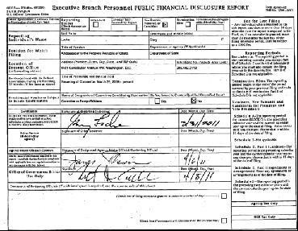
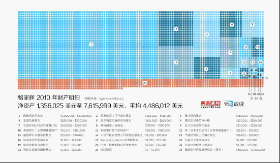
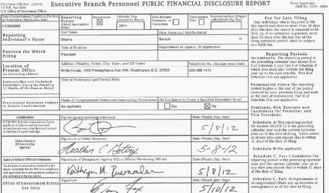
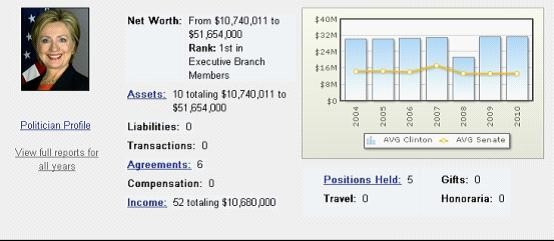
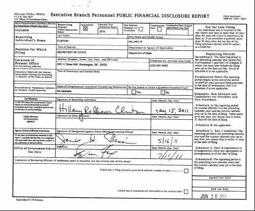
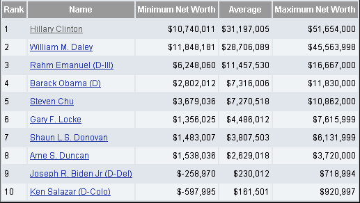

# ＜七星百科＞第二十四期：美国官员财产公示制度

**公款吃喝、腐败贪污、行贿受贿……当这一系列为老百姓所愤恨的行为得不到明确的解答时，要求官员公示个人财产的呼声也日渐高涨。上期[七星视点：第二十三期——官员财产公示，离我们还有多远？](http://blog.renren.com/blog/362359989/849593655)就骆家辉事件引发的网络评议狂潮进行了综合和评述，也于结尾简述了对中国的官员财产申报制度。** **骆家辉事件中，以北京日报为代表的中国媒体对此的呼吁叫嚣着实摆了一场乌龙。对于骆家辉而言，申报公示财产有法可依，并不可不公开。本期百科则跟随这个话题，继续宪政一把。对比他国执政之道，希望中国执政党和政府能壮士扼腕，力挽狂澜。**  

# ＜七星百科＞第二十四期：

## 美国官员财产公示制度

 

#### 词条目录

**1、 制度简介** **2、 发展历程** **3、 制度产生的条件及阻力** **4、 个人财务公示状况案例** **5、参考资料** **6、延伸阅读**  

### 1、美国财产公示制度简介

政府伦理法最重要的内容现在被列为美国法典第五篇的一部分，其中的核心是它的第一篇“联邦政府官员财务申报公示规定”。

其中规定，有义务申报财产的官员包括了**立法部门、行政部门和司法部门**。

行政部门需要公开财产申报的有：总统，副总统，政府行政部门行政15级及以上的官员，不在行政级别序列、但是基本工资等于或高于行政15级最低工资120%的官员(2011年GS-15级最低基本工资为99628美元，120%即是119554美元)，前面所述没有包括、但是并非公开招聘的、与制定政策有关职位的官员，前面所述没有包括、但是由总统任命的委员会成员，军职人员工资等于或高于O-7 级者，政府各部门根据美国法典第五篇第3105节任命的法律顾问，邮政总局局长、副局长及邮政系统基本工资等于或高于行政15级最低工资120%的官员，其他经政府伦理办公室主任认定的高级官员，政府伦理办公室主任以及政府各部门伦理办公室的主管官员。

立法部门需要公开财产申报的有：所有国会议员，国会雇员其基本工资等于或高于行政15级最低工资120%者，如果某位议员的下属没有任何人的基本工资等于或高于行政15级最低工资120%，则至少有一位主要助理人员需要申报公示其财产。

司法部门需要公开财产申报的有：最高法院首席大法官，最高法院大法官，上诉法院法官，地区法院包括海外领地、贸易、税务、军事上诉等法院及其他国会立法设立的法院法官，以上法院的雇员其基本工资等于或高于行政15级最低工资120%者。

#### 政府官员们需要公开的财产主要有以下这些：

从联邦政府之外的任何来源得到的超过200美元的红利、租金、利息、资本利得以及它们的来源、种类和数量或价值，从非亲属收受的累积价值超过250美元的所有礼品，包括来源和礼品说明，价值超过1000美元的贸易或业务投资所得，任一时间对任何债权人负债超过10000美元的债务，本人主要住所除外，超过1000美元的房地产购置、出售或交换，超过1000美元的股票、债券、期权或其他证券的买卖或交换。

#### 财产申报需要遵循的程序：

**申报机构及管辖对象：**

一般而言，申报适用官员向自己所在部门或将要工作部门的伦理官员申报。总统、副总统、独立检察官以及独立检察官任命的工作人员直接向联邦伦理办公室主任申报。其他直接向联邦伦理办公室主任申报的有：邮政总局局长、副局长及邮政系统其他申报适用官员。其他负责接受与发布官员财务申报的机构及其管辖对象是：司法会议——负责最高法院首席大法官和大法官，上诉法院和地区法院包括海外领地等法院以及其他国会立法设立的法院法官，以及上述法院雇员的申报;各军兵种部长——负责军职人员的申报;联邦选举委员会——负责总统或副总统候选人的申报;众议院书记——负责众议员、众议员候选人及众议院管辖机构(如国会图书馆)雇员的申报;参议院秘书——负责参议员、参议员候选人及参议院管辖机构(如政府问责办公室)雇员的申报。

如果申报者尚未上任，或正在等待有关部门审议批准，或者是民选官员候选人，则接受申报的部门需要将申报材料副本提交相应的机构。例如需要经过参议院或参、众两院审议批准的官员向联邦伦理办公室主任申报之后，联邦伦理办公室须将副本送交国会相应部门。国会议员候选人的申报材料副本须按照联邦选举法的规定在30天内由众议院书记或参议院秘书送交该候选人所在州的有关部门。而联邦选举委员会也必须定期向参、众两院的书记或秘书通报候选人登记的进展情况。知道了这些规定，老百姓或民间团体就可以有的放矢，到相应的机构去查找自己关注的官员或候选人的财务情况，发现问题就可以提出质疑，或者在竞选过程中挑战该候选人的资格。

**申报时间规定：**

联邦政府行政、立法和司法三大系统所有申报适用对象，包括总统、副总统、国会议员和最高法院大法官都必须在就职的30天内向相应部门申报。总统提名、需要由参议院审议批准任命的官员，在总统向参议院提名的5天之内需要全面申报财务状况。在不迟于第一次提名听证会举行的当天，须提交更新报告，包括收入、年度累积超过200美元的酬金、以及用获得的酬金向慈善机构捐款等。总统或当选总统只要在公开场合宣布打算任命某人担任某项要职，该人可以在该项宣布后的任何时间提交财务报告，但是不得晚于总统正式向参议院提名后5天。按照联邦选举法的规定取得总统、副总统或国会议员候选人资格的30天之内，或者不迟于该选举年的5月15日，但是最晚不得晚于选举日的30天之前，上述候选人必须提交财务报告。在一个日历年内担任申报适用职务超过60天的官员，须在次年5月15日之前提交包括收入、年度累积超过200美元的酬金、以及用获得的酬金向慈善机构捐款等财务申报。担任申报适用职务的官员在终止担任该项职务后的30天内，须提交包括收入、年度累积超过200美元的酬金、以及用获得的酬金向慈善机构捐款等财务申报。

#### 附录参考：

申报财产的对象并不局限于本人，配偶和受抚养子女的各种收益也涵盖在内，这就杜绝了官员本人财产寥寥，但亲属子女赚的满盆钵的现象。

白宫今年4月份公布的美国总统家庭报税单，就是由奥巴马和第一夫人米歇尔联合填写。税单显示2011年奥巴马和米歇尔总收入是78.9674万美元，有一半是总统薪水，另一半则来自奥巴马的书籍销售所得，其中还有超过1万美元的股息收入。相比2010年的173万美元和2009的500多万美元，奥巴马夫妇的收入已经大幅缩水。

应申而不申或造假后果严重。如果各部门的伦理办公室或接受申报的机构有充足的理由认为某位官员伪造申报信息，或者明知规定但是故意不按时间申报，须将案情通报联邦司法部长。司法部长将通过地区法院对该名官员提起民事诉讼。伪造申报信息者最高罚金5万美元，或一年有期徒刑，或二者并罚。明知规定但是故意不按时间申报的最高罚金为5万美元。一般的逾期申报也会面临处罚。

1989年美国众议院议长詹姆士·赖特提出辞职，有关部门发现他曾经69次违反国会对议员财产收入的法规，还曾超规定赚取讲课费，他的妻子贝蒂则曾超额收取别人赠送的礼品等。詹姆士·赖特成为过去200年第一位因此被迫辞职的众议院议长。

 

### 2、发展历程

官员申报并公示财产，已在世界约一半的国家陆续推行。相对于美国建国的两个多世纪历史，这个国家的官员实行财产申报并公示制度的时间，也就30多年。

在最新一期的《学习时报》中有文章指出，因统计、折算和监控三大困难，乐观估计中国的官员财产申报真正实行至少还需10年时间。然而现在的情况是官员能等，民众可等不了，美国的官员财产申报制度，同样是在腐败和丑闻之下诞生的。反腐提案历来是有效赢取选票的杀手锏，美国国会和各州议会永远会有关于加强官员财产申报的新提案等待审议，一旦出现比较明显的腐败案件造成政治危机，这些提案就会有较大几率进入表决程序，并获得通过。

二战期间，美国政府项目与公共开支急剧增加，官员权责随之上升，监督政府成员的经济行为尤显重要。二战刚结束，美国参议员莫斯就提出让该国官员财产公开的法案。稍后，参议员巴内特也提出官员廉洁的行为规范，但遇到很大阻碍。但随着白宫主管、联邦前众议员和新罕布什尔州前州长阿丹姆斯受贿案（具体见本节末附录参考）的发生，美国国会终于在1958年通过《政府服务道德规定》，要求政府人员不得接受可能影响其职务公正的礼物与帮助，无论官员本人是否做出回报。到上世纪60年代中期，白宫和国会正式做出规定：官员的经济利益不得与其担任的政府公职发生冲突，国会开始了对议员财产来源的全面监督。

1974年爆发的水门事件，再次震惊了全美，造就了整整一代美国人对政府的严重不信任感。保守主义传统强大的美国立法机构也一改过去审慎多疑的态度，接连推出约束官员行为的法案。1978年，国会总结以前的各项规定，通过了《政府伦理法案》，对立法、司法、行政三种政府机构的官员统一做出规定，所有官员必须填写统一的财产登记表格如实报告其财产和收入。对于由此而来的官员财产登记表格，则由《政府伦理法案》规定建立的美国廉政署来审阅监察。《政府伦理法案》还进一步规定，无官职但有意参加竞选公职的公民也必须公开其财产和收入。换言之，假如一个普通公民的财产和收入被认为和他要竞选的职位有利益冲突，那么他就必须先出售有利益冲突部分的资产再来竞选。

水门事件之后一项比较大的丑闻，当数1987年众议院议长赖特通过卖书变相从游说集团收受酬金的丑闻。这桩丑闻也促成了官员财产监督的进一步严格化。1989年生效的《伦理改革法案》除了对财产登记做了增补规定之外，还进一步规定，国会议员在卸职后一定年限内不得出任和在职期间的职权有利益冲突的公司职位，联邦雇员不得接受类似“车马费”一类的礼节性酬金。同时根据这项改革法案，美国廉政署脱离人事署，成为独立向总统负责的强势机构。十几年后的2007年，围绕国会共和党的一系列游说集团丑闻又促使美国加重在官员财产申报方面的处罚力度。在财产申报表格上作假不仅要付出高达5万美元的罚金，还构成足以判作假者入狱的刑责。

#### 附录参考：

1958年，艾森豪威尔总统的幕僚长，“美国的影子总统”阿丹姆斯爆出受贿丑闻，收受了纺织商古德凡一件名贵的驼毛外套和一条东方风格的地毯，虽然没有证据显示阿丹姆斯因此为古德凡谋取了什么特殊赦免，但这种收礼行为本身显然已经超出了美国公众对政客的容忍度。“影子总统”因此挂冠离去后，艾森豪威尔内阁一下子陷入混乱不能自拔，直到这届政府任满结束。

阿丹姆斯丑闻彰显了监督官员收入来源的必要性，美国国会在1958年通过了《政府服务伦理规定》，要求任何在政府工作的人员都不得接受可能会影响其职务决策的礼物和帮助。这项规定直接禁止了接受礼物和帮助的行为，而不考虑官员随后是否有回报行为，是规范官员行为的一大进步。

但在1958年这项规定仅仅只是一个行政指导意见，约束力很弱。直到60年代中期，在国会再次连续发生腐败丑闻的背景下，白宫和国会才正式规定官员的经济利益不得和其政府职务有利益冲突，国会两院分别成立官员行为标准委员会，开始对官员的财产来源进行全面监督。

 

### 3、制度产生的条件及阻力

#### 美国财产申报制度构建的条件

**民主政治运动的发展**

在反腐败问题上，美国的政府改革和民间运动是两股重要的推动力量。美国的民主化运动可以追溯到19世纪中期。当时，美国正处于建国以来腐败最严重的时期。政党分肥制度模糊了官员的道德准则，急速膨胀的公共开支又使道德低下的官员们获取了大量谋取私利的机会，各种利益集团轻易地收买官员。这种情况下，美国出现了进步主义运动和人民党运动，给予政府强大的改革压力。运动的结果是分肥制的结束和“利益冲突”概念的建立。浩大的民主运动使美国摆脱了最严重的腐败。

从20世纪60年代开始，美国的民权运动、黑人运动等相关运动中，强烈要求政治公开化、透明化。这些运动推动了行政部门结构性的变化，使政府改变了公共事务的管理方式。民主化运动使得如下观念得以确立：公职人员的隐私权和财产权应受公职职位透明度义务的限制，任何人出任公职，都必须部分地放弃普通人所能享受的基本权利，承担政府公职人员所必需的道德义务。这也可以叫做公务员个性的法定自我丧失，正是这种个性的法定自我丧失，为官员财产申报制度奠定了合法性基础。

**文官制度的确立和完善**

美国的文官制度确立于1883年《彭德尔顿法》(Civil Service Act of 1883)的颁布。该法案奠定了联邦政府以“才能”制度为原则的文官制度的基础，并成立了文官事务委员会，确立了“考试制”，规定公务员的录用公开竞争、择优录用，还规定了职位分类、功绩考核等文官制度的一般原则。美国公共人事管理现代化进程由此开始。随着文官制度的建立，职业公共管理在全国的层次上确立起来，并扩大到州和地方政府。

1978年，美国国会通过了《文官制度改革法》（Civil Service Reform Act of 1978），确立了功绩制的九项原则。该法撤销了具有96年历史的文官事务委员会，而代之以三个新成立的机构：人事管理总署（Office of Personnel Management OPM）；功绩制保护委员会（Merit System Protection Board MSPB.）和联邦劳工关系局（ Federal Labor Relation Authority FLRA.）。《文官制度改革法》还设立了相对独立的高级文官（Senior Executive Service）系统。也正是这一年，《政府道德法》正式出台。文官制度的确立和完善为财产申报打下了良好的制度基础。

**政治领导人的决心与能力**

美国是一个总统制的国家，总统是高度集权的行政领导者，也是政治领袖。强有力的总统和他的政治决心是美国政府制度变革的重要推动力量。在美国人看来，理想的总统要具有勇气、诚实、正直、经验、远见、政治能力、服务精神等等特质。美国历任总统为赢取民心也要尽量展示自己的上述特质。大打廉政牌，推动公共道德立法，建立官员财产申报制度无疑是一剂妙方。从罗斯福起，杜鲁门、艾森豪威尔、肯尼迪、约翰逊，到20世纪80、90年代的里根、布什，无不积极突破重重阻力，推行财产申报制度。尽管由于个人魄力和能力的不同，努力的效果也不尽相同。但总统们都有改革的政治决心，为财产申报制度的法治化打下了政治基础。

**丑闻和危机是改革的催化剂**

促使杜鲁门政府建立道德标准的是公众对政府腐败问题的严厉批评。杜鲁门在任期间曾由于政府丑闻而声誉大跌。批评者说，“密苏里帮”（密苏里是杜鲁门的家乡，杜鲁门曾是来自该州的参议员）的成员利用其同总统的密切关系中饱私囊。

约翰逊政府时期，助理商业部长赫伯特•W.克洛茨（Herbert W. Klotz）被指依靠内部消息购买了得克萨斯海湾硫磺公司的股票。在克洛茨购买股票之前，该公司已经在一个地区发现了价值20亿美元的锌、铜和银矿藏储量。他所购买的股票价值在上述发现被宣布后从最初的每股29.7美元一下子上涨到大约70美元。克洛茨事后否认他得知了具体的情报。虽然没有为克洛茨定罪的证据，但1965年4月，克罗茨向约翰逊政府提出了辞呈，而媒体报道说是约翰逊政府要求他辞职。这最终使约翰逊政府意识到有必要进一步建立关于利益冲突的规则。1965年初，约翰逊总统提出了11222号行政令——《行政官员道德准则》。

1972年发生的水门事件，是美国历史上最不光彩的政治丑闻之一，直接导致了尼克松政府的垮台。在此期间副总统阿格纽被控在任马里兰州州长和副总统期间接受贿赂，被迫以辞职作为撤销进一步起诉的交换条件。几乎与此同时，国会也爆出了“朝鲜门”丑闻。1970年，尼克松政府准备从南朝鲜撤走两万名美军，遭到南朝鲜总统朴正熙的强烈反对。为阻止美国撤军，朴正熙便策划通过南朝鲜商人朴东善对华盛顿政界进行大规模的贿赂活动。朴东善将85万美元的现金和礼物送给了115名国会议员。丑闻被揭露后，美国人民掀起了反对受贿国会议员的浪潮。一连串的丑闻和政治事件引发了人们对政府官员从政道德的广泛关注，加快了美国道德立法的进程，推动了1978年《政府道德法》的出台。

**个人信用系统为财产申报制度提供了技术保障**

20世纪70年代，遍布全美国的2250多家信用报告机构通过合作、兼并和收购，逐渐形成几家全国性的大公司，以及1000多家与其合作的小公司，建立了庞大的信息资料库，自发汇总到信用局。信用局有偿向消费者本人或者法律规定的合法机构和个人提供信用报告。

信用报告包括四个方面的内容：1、个人识别信息，除通常的个人信息外，还包括社会保险号、工作、职务以及雇主信息。2、公共记录信息，包括个人破产记录、法院诉讼判决记录、税务扣押记录和财产判决记录。3、个人信用信息，包括每个信用帐户的开始日期，信用额度和贷款数量、余额，每月偿还额，以及过去7年的贷款偿还情况。4、查询记录，包括查询人的名字以及查询目的。庞大严密的个人信用系统为实现官员个人及家庭财产的审查提供了可能性，是美国财产申报制度得以建立的技术基础。

#### 美国财产申报制度构建的阻力因素分析

**政党的利益之争**

美国的选举历来就是金钱政治的产物，需要大量的资金来宣传、运作。但财产申报制度要求各政党公开竞选期间各项政治捐赠的基本情况，公开各项竞选费用的开销情况。这无疑堵住了大规模政治献金的入口，必然会遭到部分政治候选人的反对。另外，由于“国会成员的权力和影响是由其所在的政党是否掌控了众议院或参议院来决定的”，议员们往往选择对所在的政党忠诚，而忠诚的表现之一就是在讨论重要议案时团结一致抵制另外一党的议员。政党之争严重阻碍了财产申报制度的立法进度。例如，在杜鲁门总统向国会提出建立《行政部门道德标准》时，共和党议员担心民主党想要利用这些措施来使选民相信它要清扫门户，因而竭力阻挠，最终迫使提案流产。

**既得利益群体的反对**

任何制度的变迁都很难使所有的人都得到正的纯收益，并且往往它还可能会使一些人的利益遭受损失（至少在短期内如此）。官员财产申报制度显然就是这样一种制度。由于它涉及的是立法、行政、司法三个系统全体高级官员的利益，而这些人正是政策的决策者，因而很难得到采纳和实行。即使总统或是部分议员试图对当时的制度进行变革，也会遭到其他人的竭力压制而难以推动。这个既得利益者和改革推动者的博弈过程贯穿于美国财产申报制度构建与发展的始终。

**关于隐私权的顾虑**

尊重个人隐私，限制执法和情报单位过度地监视美国公民，是美国的政治文化传统，也是民主党和共和党共同的主张。但财产申报制度需要相关利益主体如实地公布个人财产和相关资料，尤其是申报家庭成员的有关情况，不可避免地会触及这个问题的底线。在竞选过程中，很容易成为一党攻击另一党的口实，进而影响选情。因此，无论是民主党还是共和党，主动地提出有关该问题的政策建议都会比较谨慎。而且，这也是美国财产申报制度建立初期往往得不到真正有效执行的重要原因。约翰逊总统的11222号行政令就因此在很长时期内没有得到落实。

 

### 4、个人财务公示状况案例

#### 4.1 骆家辉

**（图为骆家辉大使去年申报财产时填写的OGE 278表签字页）**

**（来自网易数读专栏）**

骆家辉大使自从从政以来，差不多年年都要按照地方政府或联邦政府的规定申报财产。按照他去年3月31日签字的OGE 278表，他在美国联邦政府行政部门的官员当中是第六富人，拥有资产23笔，总值在235到812万美元之间，债务1笔在50到100万美元之间。他的工资在当商务部长的时候，年薪为191300美元，现在作为驻华大使，年薪为179700美元，他们夫妇的孩子每人每年可以有3万美元左右的教育费补贴。

原文：[http://blog.sina.com.cn/s/blog_67f297b00102e1b7.html](http://blog.sina.com.cn/s/blog_67f297b00102e1b7.html)

#### 4.2 奥巴马

2011年，奥巴马总统夫妇的总资产在$260万到$830万美元之间，比前一年2010年的$180万到$1,200万美元之间有变化。

美国制度性要求的公职人员申报和公示个人财产，其申报单对资产填写有一个范围空间，且较大，比如说在$100万到$500万之间，因此对于净价值难于得出一个准确的数据。其中一个原因是，资产包括所拥有的诸如国库债券、退休帐号内的资产与股票证券市场的市值变化有关、房地产的市场价值估价以及房贷的债务、甚至可能的某些其它债务等等，只能按照估值算。

奥巴马总统夫妇2011年的资产情况大致如下：

1）在摩根大通银行支票帐号的存款：$50万－$100万美元之间。

2）国库券价值约：$100万－$500万美元之间。

3）财政部票据以及在退休帐号及其支票帐号的资金价值约：$50万－$100万美元之间。

4）出版3本书的版权费：$25万－$210万美元之间。

5）在芝加哥的房地产价值约$50万－$100万美元之间，30年房贷利率为5.625%。显然，奥巴马夫妇还没有还清房贷。不过，应该不是还不起，而是从减税考虑。

此前，白宫已经公开过奥巴马总统夫妇2011年报税表（详见[奥巴马夫妇公布个人2011年交税和捐款情](http://rrurl.cn/p7V14T)）。

原文来自：[http://www.whitehouse.gov/blog/2012/05/15/president-and-vice-presidents-2011-financial-disclosure-forms](http://www.whitehouse.gov/blog/2012/05/15/president-and-vice-presidents-2011-financial-disclosure-forms)

#### 4.3 希拉里

对于如美内阁首富的财今全务状况，首先插播一个五年前的新闻，可以从反面对美国官员财务公示制度有一定的了解。

2007年2月27日，美国媒体报道当时已经宣布竞选总统的参议员希拉里·克林顿在填写参议员年度财产申报表时漏报她和前总统比尔·克林顿共同掌管的家庭慈善基金。此事披露后，希拉里办公室马上表示，在26日晚些时候接到质询后，立即在财产申报表中补报了这笔基金。

据报道，自2001年克林顿夫妇建立家庭慈善基金以来，希拉里从未按照国会道德准则的要求，对该基金加以申报。对此，希拉里的发言人菲利普·莱因斯表示：“克林顿夫妇家庭慈善基金的详细情况以及希拉里在其中的角色早已为公众所熟知。因此这一事件只是这对夫妇的‘一次疏忽’，是无意中被遗漏申报的，并且这一漏报的错误已经被改正。”

报道称，克林顿夫妇的家庭慈善基金总额已经接近400万美元，从成立以来所支付的善款总额累计已经达到125万美元。这笔家庭筹款主要来自克林顿夫妇出书的稿酬以及比尔·克林顿2001年离开白宫之后，到各地讲演的劳务费和出场费。（来源：新京报）

**源自：open secrets.org**

注：Open secrets是一家跟踪、记录美国政界人士个人财产和竞选资金状况的非盈利机构，旨在告知公众，政界的金钱正在如何影响他们的生活，并倡导透明政府。机构网站上不仅有各级政界人士的资产明细，还上传了他们资产公布报告的电子版，报告上附有签名，具有法律效力。而该非盈利性机构组织的运营资金来源于公众捐款。

详见：[http://pfds.opensecrets.org/N00000019_2010.pdf](http://pfds.opensecrets.org/N00000019_2010.pdf)

从以上三张图表可直观了解希拉里2010年财务状况。美国联邦政府官员的财产公示，希拉里以3120万美元居于总统和内阁个人财产榜首。奥巴马以732万居第四位。身家估值看上限和下限的平均值（Average）。

 

### 5、参考资料

 [1][《美国的官员财产申报制度：超过200美元要公开》](http://rrurl.cn/aS9maS) [2] 郇天莹.美国官员财产申报制度构建的路径分析与启示.中国行政管理.2009. [3][《环球时报：美国官员财产申报的启示》](http://rrurl.cn/gAQua2) [4][《美国官员财产申报制度构建的路径分析与启示》](http://rrurl.cn/bi8Jn4) [5] [财经网王新民博客](http://rrurl.cn/6BMubi) [6] [今日新闻网](http://rrurl.cn/s4Br5M) [7] [美国驻华大使馆博客](http://rrurl.cn/ihcarA) [8] opensecrets.org  

### 6、延伸阅读

 [1] [中国官员实行财产申报至少还需10年 ](http://rrurl.cn/2T8RrO) [2] [中国实行官员财产申报制度咋这么难？](http://rrurl.cn/l7Z1vx) [3] [存在统计、折算、监控三大困难,中国实行官员财产申报制需10年](http://rrurl.cn/iPImd6) [4] 郑秉敏.中国公务员财产申报制度探析.2011  

（编辑：高丽、尹航 责编：张正、张金晶）

 

## 

 

#### **来自[北斗网](http://rrurl.cn/vNE0s4)旗下连接七星百科栏目**

### 关注七星百科

如果你喜欢七星百科的话，可以采用以下的方式关注我们:

关注[瓢虫君](http://rrurl.cn/2yNkp0)、[瓢虫妹](http://rrurl.cn/i3tz65)

关注[北斗网](http://rrurl.cn/vNE0s4)、[北斗网新浪微博](http://rrurl.cn/0NAtu7)

更多[七星百科词条](http://rrurl.cn/uAsEoh)

 
