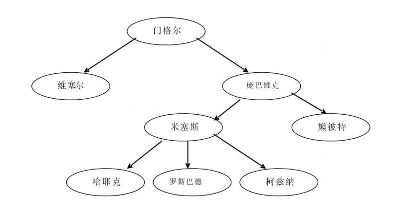
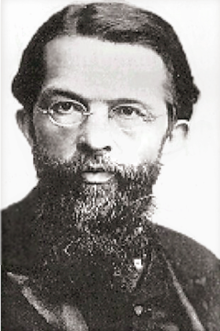
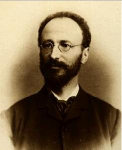
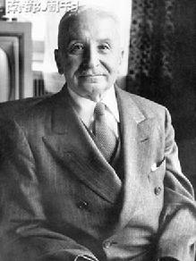
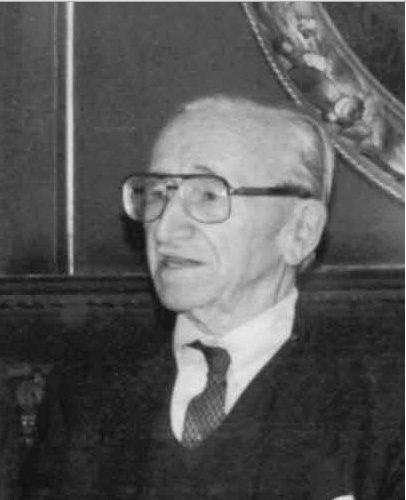

# ＜七星百科＞第五十一期：奥地利学派

**奥地利学派**

** **

**本词条在以下文章中被使用：**

（1） [北斗荐书：奥尔森三部曲之我见 ](/?p=25524)

（2） [＜开阳＞谁来挑战奥巴马：2012美国共和党初选中期解读 ](/?p=20746)

（3） [＜开阳＞时间偏好之于人的行为 ](/?p=22074)

**词条简介：**

**奥地利学派**，或奥地利经济学派，是指形成于19世纪奥地利的一个经济学流派及其追随者。一般说来，这个学派坚持**边际主义**和**主观主义**的分析方法，**极度推崇自由市场，反对国家干预经济**，在经济学思想的谱系中处于**“极右”**的位置。

**目录**

1、 历史演进和代表人物

1.1 奥地利学派的兴起

1.2 奥地利学派被人遗忘的年代

1.3 奥地利学派的复兴

2、 奥地利学派的主要观点

2.1 边际效用价值论

2.2 方法论上的“先验论”

2.3 商业周期理论

2.4 极度推崇自由市场，反对政府干预

3、 对奥地利学派的批评

4、参考资料

5、延伸阅读

**1****、历史演进和代表人物：**

** **

奥地利学派的主要传承关系

** **

** **

**1.1 ****奥地利学派的兴起**

一般认为, 奥地利经济学派形成于1871年**卡尔·门格尔**( Carl Menger , 1840~1921)《国民经济学原理》一书的发表，门格尔也被视为奥地利学派的开创者。随后, 门格尔的追随者**庞巴维克**（Eugen Bohm-Bawerk，1851～1914）和**维塞尔**( Friedrich Von Wieser , 1851~1926) 在著作中发展了门格尔的观点。庞巴维克和维塞尔详尽阐述和探讨了门格尔在价值、成本与价格方面的核心思想和主观主义观点（即**“边际效用价值论”**，认为**商品的价值取决于消费者**对商品在何种程度上能满足其需要**的主观评价**）。由于这三人都是奥地利人，并且都在维也纳大学任教，因此作为其论敌的德国历史学派给予了他们**“奥地利学派”**这一称呼。此外，庞巴维克还创立了奥地利学派的利息理论，认为利息的实质是“时间的成本”，即资本所有者在某一时期内放弃资本使用权而获得的报酬。

卡尔·门格尔( Carl Menger , 1840~1921)

欧根·冯·庞巴维克（Eugen von Bohm-Bawerk，1851～1914）

**米塞斯**（Ludwig von Mises，1881~1973）是奥地利经济学派的第三代代表人物,在20世纪20年代的社会主义大论战中出尽风头,他的观点集中体现在他本人晚年的综合性专著《人的行为》中。米塞斯**否认计划经济的有效性**，认为离开了自由市场及由其派生出的价格体系，人们根本不可能理性地计算出商品的成本，也不可能将有限的资源最大限度的利用起来进行生产。

路德维希·冯·米塞斯（Ludwig von Mises，1881~1973）

**1.2 ****奥地利学派被人遗忘的年代**

上个世纪30年代到70年代，随着大萧条后凯恩斯主义经济学的横空出世，主流经济学完全统一在凯恩斯主义经济学的旗帜下，世界上盛行的要么是苏联式的社会主义计划经济，要么便是西方世界政府积极干预经济的凯恩斯主义。尽管米塞斯极力抨击凯恩斯的宏观分析方法，哈耶克也在呐喊计划经济是“通往奴役之路”，但这一时期仍然很少有人认同奥地利学派的主张。曾享誉世界的奥地利经济学派，在这段时间几乎完全被经济学界和整个世界遗忘，几乎沦为一个经济思想史上的名词。

** **** 1.3 ****奥地利学派的复兴**

20世纪70年代，西方世界爆发经济危机，原始的凯恩斯主义无法解释和解决这一危机。于是，主流经济学开始重新将目光投向奥地利学派。1974年，米塞斯的学生**哈耶克**（Friedrich August von Hayek，1899~1992）获得诺贝尔经济学奖。哈耶克以其自由主义的立场及**对国家干预经济的坚决反对**而著称，他的获奖是奥地利学派复兴的重要标志。这一时期奥地利学派的代表人物还包括**柯兹纳**（Israel M.Kirzner,1930~）、**罗斯巴德**（Murray Rothbard，1926~1995）等。一大批年轻学者开始认真研究奥地利学派的思想，从各个不同的角度开始重新阅读门格尔、庞巴维克、维塞尔、米塞斯的著作，奥地利经济学派的经典作品先后被翻译成英文出版发行。1990年代以后，随着苏东地区脱离计划经济，以及中国的改革开放的深入发展，世界上迎来了自由市场研究和奥地利学派研究的新高潮。这一批学者又被称为**“新奥地利学派”**，以与大萧条前的奥地利学派相区分。

弗雷德里希·冯·哈耶克（Friedrich August von Hayek，1899~1992）

**2****、奥地利学派的主要观点：**

**2.1 ****边际效用价值论**

古典经济学家如亚当·斯密、大卫·李嘉图等曾认为，价值主要是受资源成本支配（如原料、劳动等）；而门格尔在《国民经济学原理》中则认为，价值取决于消费者对商品满足其需要的实用性的判断。

庞巴维克扩充了门格尔的观点，认为价值是**由消费者对产品的评估和欲望的强度所决定的**。按照“消费者对产品的评估和欲望的强度”，实际上是**按照“边际效用”在评价物品**，按照这一观点，**越是稀缺物品，其边际效用就越高，价值也就越高**。

考虑著名的“钻石与水悖论”。这一问题最早由亚当·斯密在《国富论》中首先提出，“没什么东西比水更有用；能用它交换的货物却非常有限；很少的东西就可以换到水。相反，钻石没有什么用处，但可以用它换来大量的货品”。按照奥地利学派主张的“边际效用价值论”的解释，商品的价值取决于人们对商品的评价和欲望强度，而人们的欲望强度又取决于其已消费的商品数量。已消费的商品越多，对新的一单位商品的欲望就越低，对其评价就越差，其价值也就越低。在正常情况下，人们往往占有并消费着大量的水，在占有一桶水的情况下，一滴额外的水对人们而言并无很大区别，人们对这一滴水的需求也就不迫切，因此水的价值就相对较低。而钻石产量稀少，人们往往很难得到，对于没有钻石的人来说，拥有一颗钻石与没有钻石就有着天壤之别，人们对这一颗钻石的欲望也就相对更强，因此钻石的价值就相对较高。倘若是对于一个在沙漠之中干渴而生命垂危的人，水显然比钻石的边际效用要高得多，此时，“钻石与水的悖论”在他那里就不再是悖论了，他也许愿意为了一瓶水付出许多颗钻石。

**2.2 ****方法论上的“先验论”**

米塞斯在《人的行为》中发展了奥地利学派的方法论，彻底抛弃了前期奥地利学派的心理学基础，以纯粹演绎推理的方法来阐发一切行为学理论。按照米塞斯的观点，经济学是一门演绎科学，经济学就像数学和逻辑一样，是**“先验的”**科学理论，其正确与否只取决于内在逻辑的自洽性，而**不依赖于历史经验材料的检验**，因此，他反对一切实证主义和历史主义的的研究方法。

**2.3 ****商业周期理论**

奥地利学派商业周期理论主要是由米塞斯和他的学生哈耶克共同创立。

在《货币、方法与市场过程》一书中，米塞斯详细地阐释了商业周期的过程。米塞斯认为，任何商品的**价格**都是**由供给量和消费者对该商品需求的紧迫程度**（即商品的边际效用）**所决定的**，因此一单位货币的购买力（也就是其能买到的商品的数量），也是由同样的市场过程来决定的。如果超过了一定限度，**货币供应量的增加**对社会不会有任何好处，**只能稀释货币的购买力**而已，也就是引发“通货膨胀”。

考虑一个简单的例子。假设一个社会中某种商品（如苹果）的均衡交易量（这是由苹果的供给和消费者对苹果的需求所共同决定的）是100个，在这个水平上，没有人能再多卖出一个（除非亏本），也没有人能再多买到一个（除非付出比他自己所愿意为这个苹果付出的更大的代价）。假设此时这个社会中有100元钱（货币），并且全部给消费者用来买苹果，那么苹果的价格就是1元/个。如果货币的供应量扩大一倍，也就是说，通过印钞票，现在这个社会中的货币由100元变成了200元，那么，根据米塞斯的观点，这一行为的唯一后果就是苹果的价格上涨到2元/个，此时就发生了“通货膨胀”。

米塞斯认为，通货膨胀对政府的吸引力在于**并不是每一个人同时立刻得到了同等数量的货币**。如果是大家都同时得到等量的货币，那就意味着个人的境况并没有什么改变。事实上，多发的货币量首先往往是到了政府及相关的利益集团手里，他们可以悄无声息又行之有效地获取好处，而代价则是牺牲民众的利益社会的福利，让他们去承受通货膨胀的恶果。

继续看苹果的例子，如果这新印出来的100元平均发放到每个消费者手里，那么，大家的收入都增加了一倍，同时苹果的价格也增加一倍，所有人的境况都与以前没有变化。但如果这新印出来的100元不是平均发放到每个消费者手里，而是被政府及相关的利益集团所占有，那么，苹果的价格还是会上涨到2元/个，占有这全部100元的少数人可以消费到比以前更多的苹果，但民众手上的货币却并没有增加，他们将不得不减少对苹果的消费，于是他们的境况就变坏了。

当民众购买力下降，人们便减少投资，而投资的减少又会引起失业。如此循环，经济就陷入了衰退。在这种情况下，经济的周期性波动就难以避免了。米塞斯认为，真正的市场本身是不存在周期性波动的，他对经济周期开出的药方是，首先要**停止货币扩张**，但不必要急剧紧缩，不要人为控制工资、价格、消费或投资，**让经济自行清除那些垃圾**，从而走回正轨。米塞斯更进一步指出，**自由银行制度**将会有助于抑制通货膨胀，维持经济平稳。

米塞斯的“商业周期”理论实际上已经包含着反对政府干预经济的思想，20世纪70年代后，这一思想又由哈耶克、罗斯巴德等人发扬光大，哈耶克在《货币的非国家化》、《通往奴役之路》、《自由宪章》等著作中都旗帜鲜明的**主张自由市场，反对政府对经济的干预**，认为政府对经济的干预是“通往奴役之路”。

罗斯巴德在其著作《美国大萧条》中深入研究了20世纪30年代的经济危机，他认为大萧条的根源在于20世纪20年代美国政府通过鼓励银行发放贷款、扩大货币发行量等手段扩大信贷，以通货膨胀的方式刺激经济增长，从而产生了虚妄的繁荣假象。一旦这种假象被戳破，经济就会陷入衰退，进入萧条。与主流经济学观点不同，罗斯巴德**认为大萧条并不是因为政府管制太少造成的，而恰恰是政府对经济干预过多而造成的**。政府的管制和干预扭曲了市场的价格机制，同时，政府扩张的货币政策和财政政策也加剧了经济动荡的风险，罗斯巴德的这一观点与米塞斯关于商业周期的看法一脉相承。

** **

** **

**3****、对奥地利学派的批评：**

在方法论上，奥地利学派的经济学家，自门格尔起，一直到米塞斯、哈耶克等，都强调分析方法上的主观主义，反对数学推导方法或是计量经济学方法在经济学中的使用。而在二战后，数学方法与经济学理论的结合成为主流经济学的发展趋势，因此，主流经济学家们一直诟病奥地利学派的研究方法，认为其不够准确和严谨。

在理论上，当代主流经济学普遍认为，在短期，货币扩张并非只能带来通货膨胀，而往往也会伴随产量和就业的增长。所以，政府可以利用财政政策和货币政策在一定程度上减少经济的波动，从而改善整个经济的运行。因此，奥地利学派自由市场至上，反对任何形式的政府干预的思想并不为主流经济学所接纳，往往被认为是过时的或是过度理想主义的。

同时，奥地利学派坚持的“边际效用价值论”与马克思主义坚持的“劳动价值论”是格格不入的，因此，几乎从奥地利学派诞生之日起，其与马克思主义学派的论战就从未中止过。

** **

** **

**4****、参考资料：**

[1] 黄雄.奥地利经济学派：一个文献综述.社会科学战线，2008（04）.

[2] 李华芳.维也纳的回声——关于奥地利学派的经济思想.读书，2008（04）.

[3] [李华芳.奥派视野中的金融危机.](http://blog.sina.com.cn/s/blog_49275b420100b9yr.html)

[4] 黄雄.奥地利经济学派的方法论演进：从门格尔到米塞斯.世界经济情况，2008（12）.

**5****、延伸阅读：**

[1] 路德维希·冯·米塞斯，《自由与繁荣的国度》，ISBN: 9787500416494

[2] 弗雷德里希·冯·哈耶克，《致命的自负：社会主义的谬误》，ISBN: 9787500427933

[3] 弗雷德里希·冯·哈耶克，《自由宪章》，ISBN: 9787500424178

[4] 默里·罗斯巴德，《美国大萧条》，ISBN: 9787208083158

（编辑：戴青 责编：海舰）
