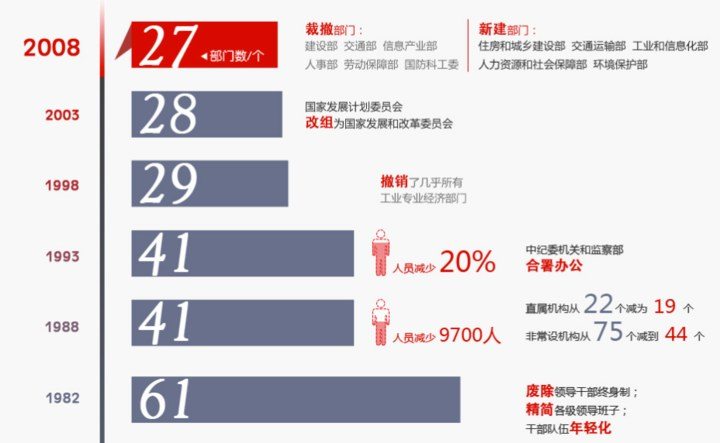
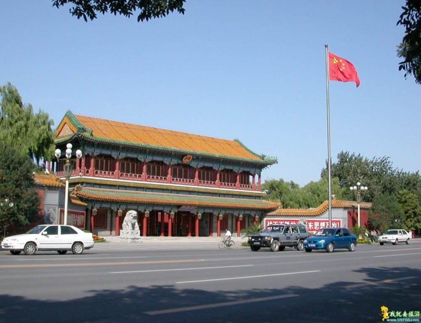
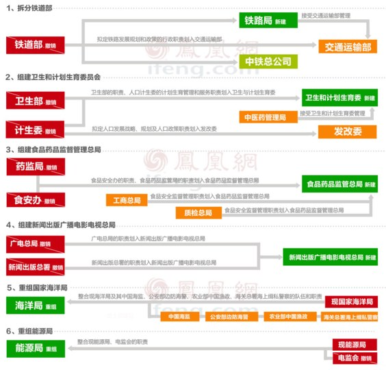

# ＜七星百科＞第五十七期：国务院机构改革

**编者按：**前段时间的铁道部改革引起了很多讨论，作为烜赫一时的“铁老大”如今走下了历史的舞台。不少人走到铁道部门口，排起长龙，来观瞻铁道部的遗容。铁道部的是非对错，只能留给历史评说，正如某国家领导人所言：知我罪我，其惟春秋。不过国务院机构的改制在共和国历史上并不是罕见的，自其1954年成立以来，国务院经历了数次较大的机构改革，总的趋势是趋向于减少机构数量，降低行政成本。正如本期百科将为读者呈现的。 

**国务院机构改革**

**本词条在以下文章中被使用：** [<七星视点>今日视点：铁道部——一个时代的终结？](http://rrurl.cn/aT1e0y)   **词条简介：** 中华人民共和国国务院，即中央人民政府，是最高国家权力机关的执行机关，是最高国家行政机关。国务院机构改革指中华人民共和国国务院内部机构和部门的调整和重组，自其1954年成立以来，国务院经历了数次较大的机构改革，总的趋势是趋向于减少机构数量，降低行政成本。  **目录** 1. 1980年代前的国务院机构改革 2. 1980年代到21世纪前的国务院机构改革 3. 21世纪的国务院机构改革 4. 参考资料： 5. 延伸阅读：  **1. 1980****年代前的国务院机构改革** 建国初期，《中央人民政府组织法》规定，政务院是国家政务的最高执行机关。政务院设置了4个综合委员会及其所属部、委、院、署、行、厅共35个。从1952到1953年，为了配合计划经济的建设，政务院的部门由35个增加到42个，其中经济部门增加到22个。 1954年，第一届全国人民代表大会召开，成立了国务院，同时为了加强中央对经济建设的集中统一领导和加强省、市、自治区的领导，撤销了各大区行政委员会，部委调整为35个，机构总数增加到64个。各级地方政府比照中央政府对口设置了厅、局，形成了自上而下的以中央为主的、与计划经济相一致的部门管理体制。这是中央政府第一次较大的行政改革。这次改革奠定了我国行政管理体制的基本模式。 1955年和1956年，为了适应当时正进行的社会主义改造，国务院部委调整为48个，机构总数达到了81个。毛泽东在《论十大关系》一文中批评了权力过分集中的现象。根据这一思想，1956年下半年，中央提出了《关于改进国家行政体制的决议(草案)》，并从1958年开始将中央直属的大部分企事业单位下放给地方管理，形成了新中国历史上第一次“权力下放”。与此同时，国务院部委到1959年底减少到了39个，机构总数为60个，形成了第二次较大的国家行政改革。 上世纪六十年代初期到六十年代中期，由于中央重新强调集中管理，于是将1958年以来下放的单位先后收回中央管理。因此中央政府开始恢复和增加机构，到1965年底，国务院部委达到了49个，机构总数急速膨胀，增加为79个。 文化大革命开始后，国务院机构受到了严重的破坏，经历了一次不正常的精简过程。国务院机构在近乎瘫痪的情况下，进行了大撤并，部委剩下了26个，机构总数为32个，国务院实际能够管理的仅有19个，其余部委或局分别是由“中央文革”和军队管理。这是一场极不正常的可称之为“畸形”的改革。截止1975年，部委才逐渐恢复到29个，机构总数为52个，但其行政管理职能仍受到极大限制。【1】 

1980年代前的国务院机构改革（图片来源：凤凰网）

  **2. 1980****年代到****21****世纪前的国务院机构改革** “文革”结束后，国务院逐步恢复了部门管理体制，同时又增加了一些新的机构，到1981年，国务院机构总数达到了100个之多。 在这段时期，国务院共进行了四次机构改革。 一是1982年改革。这次机构改革采取了撤委并部、削减直属机构的改革方针，使国务院副总理由13人减为2人(后又增加4人)，国务院部委、直属机构、办公机构由100个减为61个，工作人员总编制缩减了1／3。 第二次是1988年改革。这次机构改革按照定职能、定机构、定编制的方案进行，国务 院部委由改革前的45个减少为41个，人员按编制减编4900人，实际减少9700人。 第三次是1993年改革。此次机构改革的是重点加强宏观调控和监督部门，强化社会管理职能部门，减少具体审批事务和对企业的直接管理。改革后的国务院共设置59个部门，比改革前的86个减少了27个；国务院机构共精简人员20％。此次改革协调解决了一些部门之间职责交叉、重复问题，精简了机构和人员编制并重新核定领导职数。 第四次是1998年改革。这次机构改革的重点是调整和撤销直接管理经济的专业部门。经过调整，国务院组成部门由原来的40个减少到29个；国务院所属机构人员精简一半，分流17000人。【2】 

1980年代至2008年国务院机构改革（图片来源：凤凰网）

中华人民共和国国务院

  **3. 21****世纪的国务院机构改革** 2003年3月10口，十届人大一次会议举行第三次全体会议，表决通过了《关于批准国务院机构改革方案的决定草案》。这次机构改革的重点是：解决行政管理体制中的一些突出矛盾和问题，为促进改革开放和现代化建设提供组织保障。这次改革设立了国有资产监督管理委员会，将国家发展计划委员会改组为国家发展和改革委员会，设立银监会，组建商务部，裁撤了国家经济贸易委员会、对外贸易经济合作部。这次改革是1988、1993、1998年三次机构政革的深化和完善。【2】【3】 2008年3月15日，十一届全国人大一次会议通过关于国务院机构改革方案。国务院组成部门减少为22个，直属机构减少为16个。从数量上来说，本次机构改革是最精简的。本次机构改革加大机构整合力度，探索实行职能有机统一的“大部门体制”，涉及调整变动的机构达15个之多，正部级机构就减少了4个，裁撤了建设部、交通部、信息产业部、人事部、劳动保障部、国防科工委，组建了住房和城乡建设部、交通运输部、工业和信息化部、人力资源和社会保障部、环境保护部。 2013年3月10日，国务院机构改革和职能转变方案披露，这次国务院机构改革围绕转变职能和理顺职责关系，推进大部门制改革，实行铁路政企分开，整合加强卫生和计划生育、食品药品、新闻出版和广播电影电视、海洋、能源管理机构。将铁道部改组为中国铁路总公司，其行政职能则划入交通运输部；撤销卫生部和计生委，组建新的卫生和计划生育委；撤销国家食品药品监督管理局和国务院食品安全委员会办公室，组建新的食品药品监管总局；撤销了广电总局和新闻出版总署，组建新的新闻出版广播电影电视总局；重组了海洋局和能源局。这次改革后，国务院正部级机构减少4个，其中组成部门减少2个，副部级机构增减相抵数量不变。改革后，除国务院办公厅外，国务院设置组成部门为25个。【4】  

2013年国务院机构改革示意图（图片来源：凤凰网）

 **4. ****参考资料：** 【1】崔华华，苗鹏凯.新中国成立以来我国历次国务院机构改革述评.山西大学学报（哲学社会科学版）2011，34（1）. 【2】范希春.改革开放以来国务院机构历次重大改革比较研究.北京行政学院学报，2003（6）. 【3】《第十届全国人民代表大会第一次会议关于国务院机构改革方案的决定》 【4】[中国经济网：国务院机构改革和职能转变方案(全文)](http://rrurl.cn/liFFbO)  **5. ****延伸阅读：** 【1】[中国经济网：国务院机构改革和职能转变方案(全文)](http://rrurl.cn/liFFbO) 【2】[网易专题：国务院机构改革](http://rrurl.cn/n0QemP) 

(编辑：戴青 责编：海舰)
