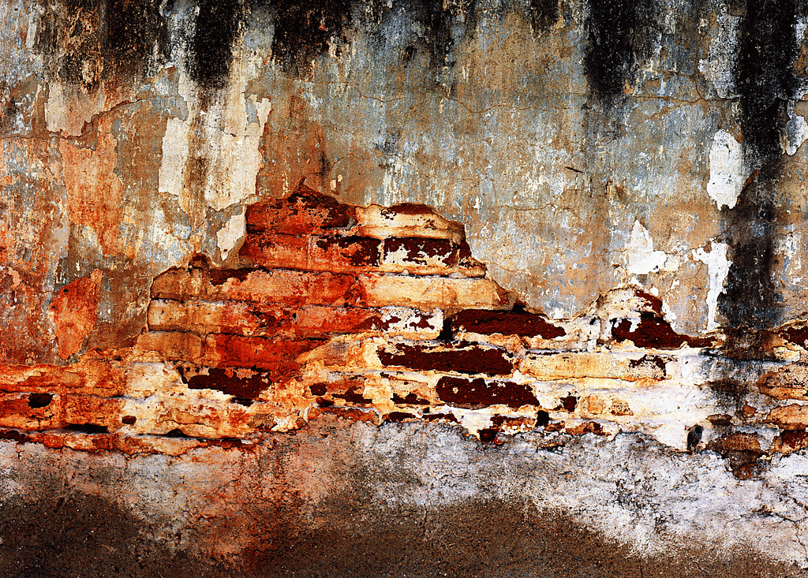

# ＜七星百科＞第五十四期：七星百科——年终特稿（下）

**编者按：**原本计划的年终特稿因为篇幅过长，不方便阅读，经过考虑不得已将其分为上下两期，向呈现百科从建立至今的历程以及百科全部内容的索引。上期百科介绍百科的基本状况以及百科索引的法学和政治部分，不过这些知识百科的一部分，百科在后期的转型和开拓已经成功为读者带来其他的词条。希望通过百科索引，能够帮助读者全面、准确的了解这些词条，更方便阅读文章。 

**七星百科——年终特稿（下）**

 目录 1. 生活百科 2. 人物百科 3. 经济百科 4. 热点百科 5. 哲学百科 6. 社会百科 7. 文艺百科   **1.生活百科** [第一期：番茄是蔬菜还是水果](http://blog.renren.com/blog/362359989/785990402?bfrom=011300082) 在植物学意义上，果实是从被子植物或显花植物的花的部分组织发育而来，以单个或多个子房为主体而形成。在此严格意义上，这个定义排除了很多常识意义上的“水果”。另一方面，植物学意义上的果实又包含了通常不被称为水果的结构，譬如豆荚，玉米粒，小麦粒，番茄，甚至真菌产生雹子的部分。 蔬菜通常是指植物非甜味果实或种子的可食用部分，通常意味着植物的叶，茎和根。 然而，蔬菜并非科学词汇，在很大程度上依据的是烹饪和文化传统。因而，这个词的应用带有任意性和主观性。例如，尽管蘑菇并非植物，但仍被一些人当作蔬菜，同时被另一些人当作单独的食物种类。有些蔬菜可以生吃，有些可以熟食，而有些必须经过烹饪方可食用。 因此番茄在植物学意义上属于果实（fruit)，在烹饪意义上属于蔬菜。  [第十六期：北斗网](http://blog.renren.com/blog/362359989/844113969?bfrom=011300082) 北斗网（ibeidou.org），致力于在当代中国大学生中弘扬人文精神、普及社科常识，推动中国大学生的思想交流，服务于当代大学生的自我启蒙。北斗网是零经费纯公益网站，由来自全国各地和海外的大学生志愿者经营和运作，既刊载大学生的优秀原创文章，也独立创作思想性栏目。  [第二十六期：美国高考制度](/?p=21956) 美国的高考SAT，是大多数美国高校认可的招生考试。 SAT考试不等同于美国“国家”大学入学考试，而是由私营部门管理运营的标准化考试。 SAT考试注重学生“学术能力测试”，是对将来学习潜能的考查，而这正是各高校所关注的。 美国大学在录取新生时，对学生的评定是整体综合性的，对其中任何一项因素没有绝对的标准。因此会出现SAT成绩很高，但其他方面平平的考生未被大学录取的情况。相反，也会出现SAT成绩不十分高，但其他综合素质较好的考生被录取的情况。当然，一般而言，名牌大学录取的是考试成绩和综合素质都高的学生。这从一个侧面说明，美国对中学生的评价是注重整体综合的。  [第五十二期：民主小清新](/?p=29510) “民主”偏重公共生活领域，而“小清新”们则通常沉浸在个人世界中。因此，“民主小清新”这一称谓在构词上本身就自相矛盾，将“民主小清新”简单理解为具有“小清新”气质的民主派并不妥当。事实上，使用这一称谓的人只是借他们对“小清新”们的不屑，来讽刺他们眼中过于理想主义的那些民主派人士。 “民小”的特点大致如下：首先，“民主小清新”认为在大一统或统一的前提下实现中国的民主化变革是可能的，反对认为中国将以前苏联式的解体来实现民主化变革的“解体论”。其次，在手段和途径上，“民主小清新”主张通过不流血的、非暴力的方式实现变革，赞成台湾所走过的民主化道路。再次，“民主小清新”往往带有一定的理想主义色彩，他们往往认为民主制度的实行即便无法解决所有问题，也至少是解决所有问题的前提。又次，“民主小清新”重视个体的作用，认为在每一个个案上，每一个个人的努力都是必要且有效的，主张“积跬步以致千里”。最后，在讨论政治问题或公共议题时，“民主小清新”经常存在一种煽情倾向。 。    **2. 人物百科** [第五期：瓦茨拉夫•哈维尔](http://page.renren.com/601178811/note/814831701) 瓦茨拉夫·哈维尔（Vaclav Havel，1936.10.15-2011.12.18）捷克剧作家，诗人，持不同政见者，共产主义垮台后，担任捷克斯洛伐克（1989-92）和捷克共和国（1993-2003年）总统。  [第十九期：林昭](/?p=21368) 林昭（1932年12月16日－1968年4月29日），原名彭令昭，中国苏州人，持不同政见者。1954年，林昭考入北京大学中文系新闻专业。林昭在1957年的反右运动中因公开支持北京大学学生张元勋的大字报 “是时候了”而被划为右派，后因“阴谋推翻人民民主专政罪、反革命罪”在1960年起被长期关押于上海提篮桥监狱，在狱中她坚持自己的信仰，并书写了二十万字的血书与日记。1968年4月29日林昭在上海被秘密枪决。  [第三十四期：高华](/?p=22399) 高华， 男，**1954年生于南京，2011年12月26日卒于南京****，**“文革”期间曾做过8年工人，1978年考入南京大学历史系，获历史学学士，硕士，博士学位。曾为南京大学历史系教授、博士生导师，华东师范大学历史系讲座教授，博士生导师，中国人民大学国际关系学院兼职教授。 主要从事中国现代史、民国史、中国左翼文化史、以及当代中国史的研究。 主要学士成就有：《红太阳是怎样升起的：延安整风运动的来龙去脉》、《革命年代》、《身份和差异：1949-1965年中国社会的政治分层》、《在历史的“风陵渡口”》  **3. 经济百科** [第十五期：重商主义](http://page.renren.com/601178811/note/843347086) 重商主义(Mercantilism)又称为商业本位，是指中世纪末期西欧、南欧国家从封建制度转向资本主义过渡时期的资产阶级最初的经济学说。其基本思想是把货币看成财富的惟一形态；财富的源泉来自流通领域，主要是贱买贵卖；只有在对外贸易中保持顺差，才能增加一个国家的财富；国家应实行干预经济的政策，以保证金银财富的流入。  第五十一期：奥地利学派（因为主站改版，责编在发文时出现错误，暂缺）  **4. 热点百科** [第十八期：黄岩岛](/?p=21309) 黄岩岛：原名民主礁，国际上称斯卡伯勒浅滩（Scarborough Shoal），菲律宾方面称“帕纳塔格礁”（Kulumpol ng Panatag），是南中国海中沙群岛中惟一露出水面的岛礁，为海盆中的海山上覆珊瑚礁而成。 目前，在中华人民共和国行政区划里黄岩岛隶属于海南省西沙群岛、南沙群岛、中沙群岛办事处，而菲律宾自1997年开始也宣称对黄岩岛拥有主权。在黄岩岛问题上两国官方与民间一直冲突不断。目前菲律宾政府已提出向国际海洋法庭申请仲裁，但中国政府拒绝，并坚持仅进行中菲之间的双边讨论。   [第二十七期：计划生育制度](/?p=22009) 计划生育政策是中华人民共和国的人口控制政策，是中国的一项基本国策，此政策限制城市户口已婚汉族男女只能生育一名子女，但许多地区对农村夫妇、少数民族和夫妇均为独生子女等几种情况作出了例外规定，民族自治地方也普遍设定了自己的计划生育政策。 为了减轻人口增长过快对中国的经济、社会、资源、环境造成的负面影响，中国政府在1970年代开始推行计划生育；1979年，中国政府进一步将“实行计划生育，控制人口数量，提高人口素质”确立为其基本国策之一。  [第二十九期：养老保险制度](/?p=22088) 所谓养老保险（或养老保险制度）是国家和社会根据一定的法律和法规，为解决劳动者在达到国家规定的解除劳动义务的劳动年龄界限，或因年老丧失劳动能力退出劳动岗位后的基本生活而建立的一种社会保险制度。世界各国实行养老保险制度有三种模式，可概括为传统型、国家统筹型和强制储蓄型。  [第三十期：农村养老保险制度](/?p=22132) 我国农村社会养老保险工作, 是在 1986年开始探索、1991年进行试点的基础上逐步开展起来的。 1992年民政部颁布《县级农村社会养老保险基本方案(试行 )》, 第一次以部门规章的形式确定了农村养老保险管理的基本原则和框架, 成为我国农村社会养老保险 (俗称“老农保” )立法的初步形态。2009年 9月 1日, 国务院关于开展《新型农村社会养老保险试点的指导意见》， 以中央行政法规的形式颁布, 标志着新型农村社会养老保险 (简称“新农保” )试点工作全面推开。根据制度内容和主管部门的不同, 农村社会养老保险大体经历了民政部主管 ( 1986- 1998年 )、原劳动和社会保障部主管 ( 1998- 2008年 )与人力资源和社会保障部主管 ( 2008年至今 )三个阶段。  [第三十一期：中国性产业非罪化](/?p=22132) 中国共产党1949年胜利之后，地方政府承担起消除性服务业的责任。1949年2月3日，中共接管北京之后一个月，新市政府在叶剑英的领导下，宣布了一项管制市内众多妓院的规定。 到1960年代初，这种方法基本上消灭了全国表面的性服务活动。中国政府声称，在成功管制性服务业的同时，性病也几乎从中国大陆全部被清除。**为了表现这次胜利，全国29间性病研究机构在1964年被关闭。**  [第三十六期：什邡钼铜事件](/?p=22756) 人民担心，随着钼铜项目的的开发运营，势必导致水土资源被不断污染，而什邡是全国最著名的天然矿泉水基地。如此一来，什邡将不再能提供优质矿泉水，而且，钼元素的开发更将导致癌症患病率的极速增高，从此什邡将成为全国最大的癌症重灾区，人的寿命也将大大缩短。多金属项目的开发，必然存在着不可预计的污染，群众最关心是生存大问题。  [第三十七期：中国运动员权利保护](/?p=23059) 运动员权利是指运动员依据其在社会生活和竞技体育中的法律地位，在宪法和法律规定的范围内，依照法定形式，可作为或不作为某种行为，也可要求国家和其他组织、公民作为或者不作为某种行为，从而实现其物质利益和精神利益的法律手段。由此可见，运动员的权利可分为两个部分：一是宪法和法律直接赋予的基本权利，即作为普通公民应享有的基本人权；二是作为履行特殊训练和比赛职责的专业人员享有的职业权利，它是基本权利在竞技体育行业中的演变和延伸。  [第三十八期：奥林匹克精神](/?p=23414) 《奥林匹克宪章》指出，奥林匹克精神就是相互了解、友谊、团结和公平竞争的精神。奥林匹克精神对奥林匹克运动具有十分重要的指导作用。 享有欧洲文明发源地之称的古希腊是古代奥林匹克运动会的发祥地。在希腊首都雅典西南面，在湍急的阿尔菲斯河和克拉德河交接处的奥林匹克“圣地”，就是古代奥运会的会址。从公元前776年有文字记录的第一届古代奥运会开始，到公元393年共举办293届，历时1169年。古代奥林匹克运动会是人类体育文化宝库中一颗璀璨的明珠，它所倡导的公平竞争的精神构成了后来奥林匹克精神的基础，对后来奥林匹克运动的发展有着深远 的影响。其精神内容的实质在古代奥运会的《神圣休战》条约中得到了充分体现。  [第三十九期：体育商业化](/?p=23395) 体育商业化就是指以竞技体育为主体的各类体育运动，采取商业化的运作方式，以获取最大利润作为推动和发展体育运动的杆杆。 主要表现形式有：1、以投资的方式经营某一运动项目。2、以合作的方式赞助某一体育赛事。3、 以广告利润回馈的方式盛邀体育明星。 成功的商业运作模式给体育事业带来的促进作用，一方面赞助为体育活动的开展提供了巨大的资金支持；另一方面商业化的宣传也提高了体育项目的知名度，扩大了公众参与和群众参与；但也有不免有负面效应：1.对违禁药物及禁用技术的使用起到推波助澜的作用。 2.对维护良好的体育道德行为构成巨大冲击。  [第四十三期：美国总统大选电视辩论](/?p=24867) 美国总统大选电视辩论是指美国总统候选人在选前一个月左右，通常有两到三次面对面电视辩论的机会，副手也有一次。这并非美国有电视以来就有的传统，第一次的电视辩论是1960年的肯尼迪和尼克松的对抗，随后停了3次，到1976才恢复。 1960年，美国三大电视网在9月与10月共主办四场大选电视辩论，是美国政治史上首次全国性的总统大选辩论。 电视辩论在某种意义上是一种形式重于内容的政治秀，但也不失为比较公平的竞争。不管辩论究竟有无实质意义，两个竞争对手能够走到一起，在公众面前进行争辩，而又没有引发骚乱、仇恨、诉讼和丑闻，这本身蕴涵着一些值得考究的政治竞争规则。 美国这样大规模的周期性的政策辩论给我们许多有益启示。 第一，政策辩论是民主政治的一种重要形式。 第二，政策辩论有利于推动政治体制改革。 第三，政策辩论是决策科学化的必经过程。  [第四十六期：十八大](http://page.renren.com/601178811/note/881484734) 十八大是中国共产党第十八次全国代表大会的简称，于2012年11月8日在北京召开。中华人民共和国全国人民代表大会是最高国家权力机关。它的常设机关是全国人民代表大会常务委员会。全国人民代表大会和全国人民代表大会常务委员会行使国家立法权。全国人民代表大会由省、自治区、直辖市、特别行政区和军队选出的代表组成。各少数民族都应当有适当名额的代表。 十八大的主要职权为：修改宪法；监督宪法的实施；制定和修改刑事、民事、国家机构的和其他的基本法律；选举中华人民共和国主席、副主席等。 全国人大代表理论上代表人民参加全国人民代表大会，届任期都是5年，是由选举产生的。 中国共产党第十八次全国代表大会将于11月8号上午9时在北京人民大会堂开幕，会期11月8日至11月14日，共7天。 十八大的看点：新领导班子的建立，中共党员的结构变化，对全球经济的助推作用，改善民生的举措，外交的动向以及未来中美关系。  **5. 哲学百科** [第三十三期：功利主义](/?p=22357) **功利主义（Utilitarianism），即效益主义，是伦理学中的一个理论。提倡追求「最大幸福」（Maximum Happiness），认为实用即至善的理论，相信决定行为适当与否的标准在于其结果的实用程度。** 其**正式成为哲学系统是在18世纪末与19世纪初期，由英国哲学家兼经济学家边沁和密尔提出。其基本原则是：一种行为如有助于增进幸福，则为正确的；若导致产生和幸福相反的东西，则为错误的。幸福不仅涉及行为的当事人，也涉及受该行为影响的每一个人。**  [第四十五期：犬儒主义](/?p=25507) 犬儒学派的奠基人叫安提斯泰尼，他是苏格拉底的学生。一切精致的哲学，他都认为毫无价值，凡是一个人所能知道的，普通的人也都能知道。他信仰“返于自然”，并把这种信仰贯彻得非常彻底。他主张不要政府，不要私有财产，不要婚姻，不要确定的宗教。 早期的犬儒是极其严肃的。 后来的犬儒派们发表宏论，竭力鼓吹清贫生活的无比美好，甚至把人们正常的感情也讥为愚蠢。早期的犬儒派是依据一种道德原则去蔑视世俗的观念,后期的犬儒派依然在蔑视世俗的观念但却失去了依据的道德原则。犬儒一词正好变成了它的反面，只认外在的世俗的功利，否认内在的德性与价值。 犬儒主义不是中国特有的现象。在西方，犬儒主义同样引起人们的忧虑。   [第四十八期：奥卡姆剃刀](/?p=26361) 奥卡姆剃刀定律，由14世纪欧洲一位叫威廉的哲学家提出，被称为“如无必要，勿增实体”，即保持事情的简单性，抓住根本，解决实质，不需要人为地把事情复杂化，且多出来的东西未必是有益的，相反更容易使我们为自己制造的麻烦而烦恼；其另外一种阐释是：当你有两个处于竞争地位的理论能得出同样的结论，那么简单的那个更好。 在管理企业制定决策时，应该尽量把复杂的事情简单化，剔除干扰，抓住主要矛盾，解决最根本的问题，才能让企业保持正确的方向。 面对复杂当投资市场，应拿起奥卡姆剃刀，把复杂事情简单化，简化自己的投资策略，对那些消耗了大量金钱、时间、精力的事情加以区分，然后釆取步骤去摆脱它们。 奥卡姆剃刀也是一种生活理念。它要求我们在处理事情时，要把握事情的本质，解决最根本的问题。  **6. 社会百科** [第四十期：下流社会](/?p=24096) "下流社会"一词出自日本三浦展的书《下流社会》中，它并非特指经济地位差的人。年轻一代面临就职难的困境，好不容易有了工作，面对职业、婚姻等方面的竞争和压力，不少人选择了逃避：既不结婚，也不当事业和家庭的"中流砥柱"，而心甘情愿地将自己归入自我满足的"下流社会"的行列。年轻一代源源不断加入的“下流社会”，其最大的特征并不仅仅是低收入，更在于沟通能力、生活能力、工作意愿、学习意愿、消费意愿等的全面下降，也可以说是“对全盘人生热情低下”。  [第四十一期：摩门教](/?p=24620) 摩门教（Mormonism），又称后期圣徒教会，它由先知史密斯 于1830 年4月6日在纽约州菲亚特镇组建。 摩门教源于基督教，继承了基督教的宗教信仰、宗教文化和机构设置，但是它还拥有自己的新生特点。摩门教的教名是由一个名叫摩门的人名得来。摩门是美国古时的先知，他是摩门经的前身—金版书页的作者。而摩门教教徒仅以摩门经和圣经为上帝的指示，所以他们称自己为后期圣徒教会，简称摩门教。 摩门教最有争议之处在于他们倡导并实践多妻制度。作为该教支柱之一的一夫多妻制在其存在的近50 年时间。据说斯密约瑟得到了一份有关多妻的启示，鼓励信徒多娶妻子。1852 年摩门教公开宣布实行多妻制。为此摩门教受到美国社会各界的压力，最终于1890 年9 月24 日，摩门教宣布放弃多妻制。 第四，通过政策辩论凝聚民族意志并形成社会共识。  [第五十期：认知失调](/?p=27928) 认知失调理论最早是社会心理学家, 里安·费斯廷格于1957 年的《认知失调论》一书中所提出的。在费斯廷格看来,认知是认知结构中的“要素”, 一个要素即一个认知。它们是一个人意识到的一切。它们可以是一个人对自己的行为、自己的心理状态、人格特征的认识, 也可以是对外部客观事物的认识。 但是, 后来的很多研究, 包括美国著名的心理学家阿伦森( Ellio t Aronson)等人的研究都发现, 并不是所有的认知不一致都会令人同样地不舒服, 认知失调最强烈而且最令人不舒服的情况, 是一个人的行为威胁其自我形象时。它之所以令人不安, 正是因为逼迫我们去面对我们的看法和行为之间的差距。所以。后来阿伦森等人将认知失调定义为: 因为做了一件和自己习惯的而且通常是与正面的自我概念不符的行为而产生的不舒服行为或感觉。  **7. 文艺百科** [第四十四期：蒸汽朋克](/?p=25308) “蒸汽”代表一个特定的时代和与之相对应的特定科技水平。“朋克”的精神本质在于反对除了朋克之外的一切规则，拒绝雷同，反对传统，提倡标新立异。把这两个看似风马牛不相及的概念结合起来，就诞生了蒸汽朋克这种新颖的艺术形式。蒸汽朋克架空幻想了一个科幻场景：当代甚至未来的一切信息时代的科技成果，依然存活于蒸汽时代，却拥有信息时代产物的功能，其本质就是在工业科学革命的基础上，展现在现实中不存在的空间。  [第四十七期：魔幻现实主义](/?p=25929) 魔幻现实主义是在现代拉丁美洲形成和发展起来的一种文学流派。此流派的作家取材于拉丁美洲各国的现实生活, 暴露社会的黑暗, 反映人民的疾苦, 抨击军事独裁统治者、教会、大资本家与大庄园主。其特点是给现实披上一层光怪陆离的魔幻外衣,却又始终不损害现实的本质。 德国艺术评论家弗朗茨·罗最早使用魔幻现实主义一词，用来形容一群20世纪20年代生活在德国的画家所使用的被称做“新的客观性”的绘画风格。“ 魔幻现实主义文学的产生是与拉美大陆的种族结构和文化结构分不开的。 魔幻现实主义文学流派的形成也是与西方现代派文学的影响和刺激分不开的。拉丁美洲的文学传统一方面来自于印第安民间文学和古代玛雅文学, 尤其是其中古老神话、民间传说与巫术中奇幻、怪诞的成分已成为拉美作家们的创作滋养。一方面来自于是欧洲文学传统。  [第四十九期：浮世绘](http://page.renren.com/601178811/note/888821702) 浮世绘是日本的一种绘画艺术形式，起源于17世纪，主要描绘人们日常生活、风景、和戏剧。初以墨色印刷，称“墨折绘”；后发展为“丹绘”、“红折绘”、“锦绘”等多色的表现样色。以色彩明艳、线条简练为特色。曾得到广泛的流传和发展，至18世纪末逐渐衰落。 代表人物除了创始人菱川师宣外，比较著名的还有揭开浮世绘的黄金时代帷幕的铃木春信；美人绘大师鸟居清长与喜多川歌吕：戏剧绘巨匠东洲斋写乐：还有写实派大师葛饰北斋，以及将风景绘技巧推向顶峰的一立斋广重等名师。以上六人被称为“六大浮世绘师”。
