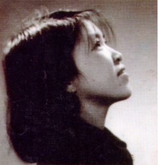
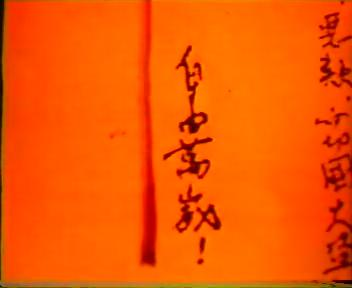
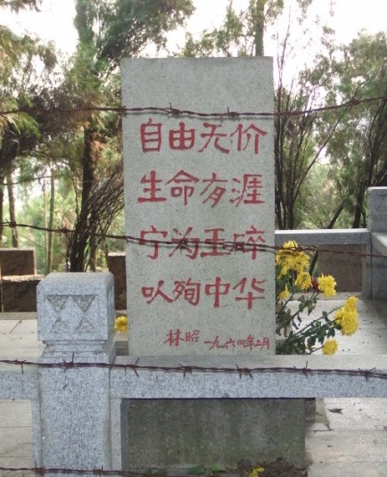

# ＜七星百科＞第十九期：林昭

 

# **林昭**

------------------------------------------------------------------------------------------------ **本词条在以下文章中被使用** （1）天枢时评：[《自由华夏，铁骨灵岩——纪念林昭》](/?p=1296) （2）地震特稿：[《六十六年的时间跨度》](/?p=7011) （3）摇光杂谈：[《你的单纯可以适可而止》](/?p=9645) （4）清华百年校庆特稿：[《中国知识人解不开的羁绊——献给清华大学建校一百周年》](/?p=8121)  **--------------------** **词条简介** **林昭（1932年12月16日－1968年4月29日），原名彭令昭，中国苏州人，持不同政见者。**林昭在1957年的反右运动中因公开支持北京大学学生張元勋的大字報“是时候了”而被划为右派，后因「阴谋推翻人民民主专政罪、反革命罪」在1960年起被长期关押於上海提篮桥监狱，在狱中她坚持自己的信仰，并书写了二十万字的血书与日記，控诉了中国当局的对她残酷政治迫害和压迫，表达自己追求人权、自由和平等的信念和追求。1968年4月29日林昭被当局在上海秘密枪决，当局从未正式公布过判处林昭死刑的罪名。 

 -------------------- **目录**

1、人物简介

2、家庭背景

3、大学生涯

4、牢狱生涯

5、平反

6、民间高调纪念

7、参考文献

8、延伸阅读

**----------------------------------------------------------------------------------------------------** **1 人物简介** **人物简介**：**林昭（1932年12月16日－1968年4月29日），原名彭令昭，苏州人**。林昭在1957年的反右运动中因公开支持北京大学学生张元勋的大字报“是时候了”而被划为右派，后因“阴谋推翻人民民主专政罪，反革命罪”在1960年起被长期关押于上海提篮桥监狱，在狱中她坚持自己的信仰，并书写了二十万字的血书与日记。1968年4月29日林昭在上海被秘密枪决。 **1980****年8月22日，上海高级法院“沪高刑复字第435号”刑事判决书，撤销上海市静安区人民法院1962年度静刑字第171号和中国人民解放军上海市公检法军事管制委员会1967年度沪中刑字第16号两次判决，**宣布林昭以精神病为由平反为无罪，结论为“这是一次冤杀无辜”；而**1981年1月25日上海高院的“沪高刑申字第2346号”刑事判决书中认为80年的判决书宣告无罪的理由为精神病不妥，**“在病发期间的行为不应以反革命罪论处……林昭的行为既不构成反罪……沪高刑复字第435号判决在适用法律上亦属不当，均应与前两个判决一并予以纠正”，撤销了1980年“沪高刑复字第435号”判决书，但依旧对林昭宣告无罪。另在1980年12月在北京举行追悼会。[1] **----------------------------------------------------------------------------------------------------** **2 家庭背景**

她出生前5年，她的舅舅许金元，大革命时期中共江苏省的负责人，1927年“四·一二”事变中遇难，尸体被沉入长江。

母亲许宪民，自16岁便在哥哥影响下投身革命。1946年，在史良的支持下，许宪民参加国民党伪国大竞选，并当选。在一系列有利身份的掩护下，她资助共产党地下电台的建立，提供收发电报的场所，并帮助地下党进行策反活动。

林昭的父亲彭国彦，早年留学英国。1928年在国民政府举办的第一届县长考试中获第一名，随后被任命为苏州吴县县长。因为政清廉，不擅逢迎，只任两届便赋闲在家。日本投降后，他又任中央银行专员。[1]

**----------------------------------------------------------------------------------------------------** **3 大学生涯**

在景海中学高中毕业后，林昭不顾母亲反对，于1949年7月考进“革命摇篮”苏南新闻专科学校，决心“与家庭生不来往，死不吊孝”，投身到革命中去，甚至曾经无中生有地揭发过自己的母亲，多年后，林昭对此感到很不安：“他们要我井里死也好，河里死也好，逼得我没办法，写了些自己也不知道的东西，我不得不满足他们……我没存心诬陷你”。[2]

**1954****年，林昭以江苏省第一名的成绩考入了北京大学中文系新闻专业。**在北大自由的学风中，她开始思考并反思。在想到自己曾亲自揭发母亲的“罪行”时，她痛苦得哭出来，写信给母亲发誓说：“今后宁可到河里、井里去死，决不再说违心话！”[2]

由于林昭勤学多思，受到游国恩教授的赞赏，建议林昭调入文学专业，未果。林昭与另一位才女张玲任校刊编辑，负责副刊《未名湖》。**1955年春，林昭参加了北大诗社，任《北大诗刊》编辑**。1956年秋，《北大诗刊》停办后，林昭成为综合学生文艺刊物《红楼》的编委会成员之一，被称为“红楼里的林姑娘”。该刊物主编是乐黛云。《红楼》第2期的责任编辑是林昭和张元勋。

1957年5月19日，张元勋等贴出大字报《是时候了！》，这是为了响应中央的鸣放号召，随后几天北大的大字报越来越多，学生互相辩论，有人认为大字报中的右倾言论是反革命煽动。**5月22日，林昭在辩论中公开反对那些上纲上线的批评，并说：“我料到一旦说话也就会遭到像今晚这样的讨伐！我一直觉得组织性与良心在矛盾着！”**5月29日，《红楼》编辑部举行会议，宣布将张元勋与李任开除出《红楼》编委会，原因是他们参加右派刊物《广场》编委会，林昭在发言批判时对张元勋说：“我有受骗的感觉！”[3]6月8日，《人民日报》发表社论《这是为什么？》，将提意见的言论说成是右派分子乘机向党进攻。

1957年秋，张元勋、林昭等人被打成右派分子，林昭吞服大量安眠药自杀，但被及时抢救过来。于是她被认定为对抗组织、“态度恶劣”，遭到加重处分：劳动教养三年。**林昭不服，跑到团中央质问：“当年蔡元培先生在北大任校长时，曾慨然向北洋军阀政府去保释‘五四’被捕的学生，现在他们（指北大领导）却把学生送进去，良知何在？”**[3]

1957年12月25日，张元勋被秘密逮捕，判刑八年。北大当时约有八千学子，其中约有1500名师生被打成右派，他们中的许多人，被开除公职与学籍，发配到边疆荒野，20多年后才得以平反。

**1958****年6月北京大学中文系新闻专业并到中国人民大学新闻系，林昭也从北京大学到了中国人民大学。**北京大学中文系新闻专业主任罗列到人大新闻系来后是副主任，正主任是安岗。林昭是被打成右派分子后由罗列带过来的，她是北大第一批右派分子。后因罗列怜其体弱多病，冒险为之说情，林昭得以留在中国人民大学新闻专业资料室接受群众“监督改造”。**林昭在新闻系资料室监督劳动期间与同在资料室“劳动考察”的人大学生“右派分子”甘粹产生爱情，他们提出结婚申请，但上级批评他们谈情说爱是抗拒改造，不准他们结婚。**

1959年9月，甘粹被发配到新疆进行劳动改造。林昭病情加重，冬天咳血加剧，请假要求回上海休养。1960年春，人大校长吴玉章先生批示准假，林昭由母亲接回上海。

**----------------------------------------------------------------------------------------------------** **4 牢狱生涯** 通过调养，林昭病情渐有好转，并在上海认识了兰州大学的研究生顾雁、徐诚，当时兰大的张春元等人，正在准备筹办针砭时弊的《星火》杂志，随后林昭的长诗《海鸥之歌》和《普鲁米修斯受难之日》，在《星火》第一期上发表。但很快涉及《星火》的人员，都被抓捕。1960年10月，林昭被逮捕入狱。 1962年初，林昭得以保外就医。9月，林昭在苏州与黄政商量并起草了《中国自由青年战斗同盟》的纲领和章程。期间还曾要求上海的无国籍侨民阿诺，将《我们是无罪的》、《给北大校长陆平的信》等带到海外发表。 1962年12月，林昭又被捕入狱。在狱中林昭曾多次绝食、自杀，并分别两次给当时的上海市长柯庆施、《人民日报》写信，反映案情并表达政治见解，都没有回音。林昭在狱中，没有笔和纸，竟然都是用血在白色的被单上写作[4]。另外，由于林昭拒绝违心地服从，被狱卒视为表现恶劣，遭受较严重的虐待，林昭在血书中写到：“光是镣铐一事人们就玩出了不知多少花样来：一副反铐，两副反铐；时而平行，时而交叉，等等不一。臂肘之上至今创痕犹在不消说了，最最惨无人道酷无人理的是：不论在我绝食之中，在我胃炎发病痛得死去活来之时，乃至在妇女生理特殊情况期间，不仅从未为我解除过镣铐，甚至从未有所减轻！--比如在两副镣铐中暂且除去一副”。[5] 1965年3月23日，林昭开始写《告人类》。 1965年5月31日，开庭审判，林昭被判有期徒刑20年。林昭随后血书《判决后的申明》。 1965年7月至12月，第三次给《人民日报》写信。 1966年5月6日，北大同学张元勋来到上海，同林昭母亲许宪民到上海提篮桥监狱看望她。 1968年4月29日，林昭接到改判的死刑判决书，随即在上海龙华被枪决。5月1日，公安人员来到林昭母亲家，索取5分钱子弹费（事件在1981年在打倒四人帮的报道“历史的审判”一文中提到）。 

 **----------------------------------------------------------------------------------------------------** **5 平反** 1980年8月22日，上海市高级人民法院“沪高刑复字第435号”刑事判决书，撤销上海市静安区人民法院1962年度静刑字第171号和中国人民解放军上海市公检法军事管制委员会1967年度沪中刑[1]字第16号两次判决，宣布林昭以精神病為由平反为无罪，结论为“这是一次冤杀无辜”；**而****1981年****1月25日****上海高院的“沪高刑申字第2346号”刑事判决书中认为80年的判决书宣告无罪的理由为精神病不妥，**“在病发期间的行为不应以反革命罪论处……林昭的行为既不构成犯罪……沪高刑复字第435号判决在适用法律上亦属不当，均应与前两个判决一并予以纠正”，撤销了1980年“沪高刑复字第435号”判决书，但依旧对林昭宣告无罪。另在1980年12月在北京举行追悼会，但其檔案仍被中共绝密封存五十年。 **----------------------------------------------------------------------------------------------------** **6 民间高调悼念** 2012年4月29号，是因当年批评毛泽东而被划为“右派”的北大才女林昭，被秘密枪决四十四周年的祭日，作家韩寒与一批网友集体高调地悼念她，林昭在苏州的陵墓更有大批民众前往献花。据香港《明报》30号的报道，内地媒体虽然没有任何的报道和评论，但新浪微博对相关的悼念文章和大量纪念林昭的留言却并没有屏蔽，微博上不仅可以搜寻到林昭的名字，还能搜出20多万个相关结果。大陆最大的搜索网站《百度》亦罕见地解禁了〝林昭〞的相关搜索。连〝林昭血书〞、〝历史将宣告我无罪〞等内容也可随意阅读。 与此同时，赛车手及作家韩寒也在微博留言说：“五一国际劳动节之前还应该有一个属于中国人的纪念日，1968年的4月29号，林昭被枪决，但我身边很多年轻的朋友甚至至今都不知道这个名字。生命有涯，自由无价，历史已经宣判了林昭无罪，但历史也收了她五分钱的子弹费，让子弹就飞到这里为止吧”。韩寒的这条留言已获得3万多网友的转发。 此外，在林昭位于苏州的墓地前，大批来自各地的民众自发前往悼念，大约有一百多人，更有家长带着孩子前来。民众朗读林昭作品、默哀，墓碑前摆满鲜花，并有一条写有“圣女林昭永垂不朽”的横额。尽管当局在林昭墓前设有监控录像，可以看到全过程，但却并未阻止这些纪念活动。但据维权网消息，两名湖南籍人士上午因为试图前往苏州拜祭林昭被国保带走，傍晚获释。 **----------------------------------------------------------------------------------------------------** **7 参考文献** 1、新华网：[林昭逝世41周年:有的人永远不会被历史忘记](http://www.sd.xinhuanet.com/book/2009-04/30/content_16403629.htm) 2、陈伟斯. [林昭之死](http://http//www.aisixiang.com/data/46673.html). 民主与法制. 1981年第3期 3、 张元勋. [北大往事与林昭之死](http://www.taosl.net/wcp/memo_linzhao_zhangyx.htm) 4、彭令范，林昭之妹. [我的姐姐林昭](http://www.taosl.net/wc102.htm) 5、林达. [林昭在为我们寻找——《寻找林昭的灵魂》观后](http://www.oioj.net/blog/user1/8879/archives/2005/47469.shtml) 6、全文广泛参考摩罗著. 林昭年表 **----------------------------------------------------------------------------------------------------** **8 延伸阅读** 1、赵锐著.《祭坛上的圣女——林昭传》. 台湾秀威资讯2009年3月版 2、黄河清著.《话说林昭》 3、许觉民编.《林昭，不再被遗忘》 

 **------------------------------------------------------------------------------------------------** **来自[北斗网](http://rrurl.cn/vNE0s4)旗下连接七星百科栏目** ** ** **关注七星百科**** ** 如果你喜欢七星百科的话，可以采用以下的方式关注我们: 关注[瓢虫君](http://rrurl.cn/2yNkp0)、[瓢虫妹 ](http://rrurl.cn/i3tz65) 关注[北斗网](http://rrurl.cn/vNE0s4)、[北斗网新浪微博 ](http://rrurl.cn/0NAtu7) 更多[七星百科词条](http://rrurl.cn/uAsEoh)  

（ 编辑：尹航 责编：董宸）

