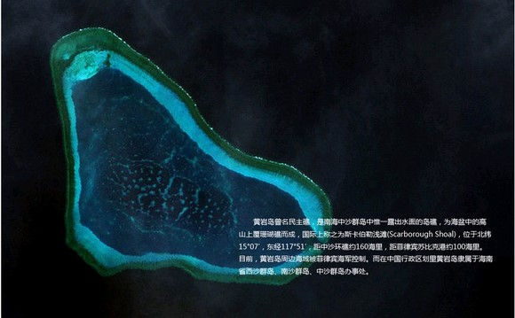
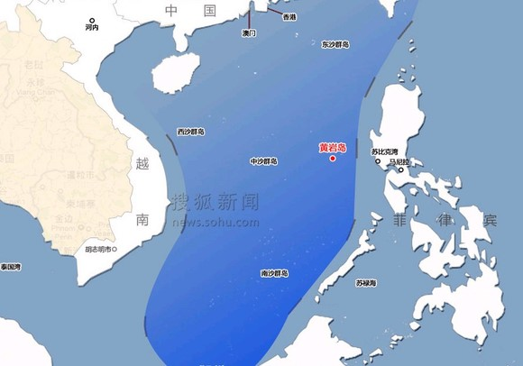
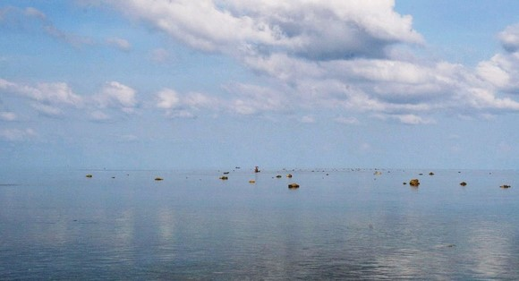

# ＜七星百科＞第十八期：黄岩岛

**编者语：大家好，七星百科在今天终于跟主站的读者见面了！七星百科是北斗推出的一个社科类栏目，栏目秉持为读者答疑解惑的理念，给北斗文章中经常出现的学术性词汇，提供一个简明而准确的解释，以消除阅读障碍。为了能够进一步提高栏目的质量，以期在将来更好的为大家服务，小编特地准备了一篇问卷调查，请大家帮助百科完成这一次的飞跃！** 问卷调查地址：[http://www.sojump.com/jq/1521044.aspx](http://www.sojump.com/jq/1521044.aspx) 谢谢大家支持！ 

 

# ＜七星百科＞第十八期：

## **黄岩岛**

 

#### **本词条在以下文章中被使用**

（1）七星说法：[《＜七星说法＞第二十七期：黄岩岛属于中国的法律论证》](/?p=21193)  ****----------------------------------------------------------------------------------------------------**** 

#### **词条简介**

**黄岩岛：原名民主礁，国际上称斯卡伯勒浅滩（Scarborough Shoal），菲律宾方面称“帕纳塔格礁”（Kulumpol ng Panatag）**，是南中国海中沙群岛中惟一露出水面的岛礁，为海盆中的海山上覆珊瑚礁而成。该岛位于北纬15°07′，东经117°51′，距海南岛约500海里，距西沙群岛约340海里，距中沙环礁约160海里，距菲律宾苏比克港约100海里。目前，在中华人民共和国行政区划里黄岩岛隶属于海南省西沙群岛、南沙群岛、中沙群岛办事处，而菲律宾自1997年开始也宣称对黄岩岛拥有主权。[1] ** ** **----------------------------------------------------------------------------------------------------** 

#### **目录**

1、地理位置 2、领土争议 2.1、中方声明 2.2、菲方声明 3、国际海洋法相关 4、主权争议事件回顾 5、参考文献 6、延伸阅读 **----------------------------------------------------------------------------------------------------**  

### **1 地理位置**

**黄岩岛四周为距水面0.5米到3米之间的环形礁盘，礁盘周缘长55公里，面积150平方公里，礁盘外形呈等腰直角三角形，其内部形成一个面积为130平方公里、水深为10~20米的潟湖。**黄岩岛发育在3500米深的海盆上，是深海平原上的一座巨大的海底山峰露出水面的部分。黄岩岛潟湖东南端有一个宽400米的通道与外海相连，这条水道水深9~11米，宽360~400米，中型渔船和小型舰艇可由此进入，从事渔业活动或者避风。[2]

**环礁四周有星罗棋布的礁块露出，礁块表面大小一般为1—4平方米。**以北、南两端的礁块最为密集，北端者称为北岩，南端者称为南岩。南岩是在礁盘上露出海面的巨大的礁石之一，形似大石柱，上部面积约3平方米，海拔1.8米。

黄岩岛以东是幽深的马尼拉海沟，这是中沙群岛与菲律宾群岛的自然地理分界。

黄岩岛卫星鸟瞰图

黄岩岛地理位置

黄岩岛浅滩及其周边地区是资源丰富的渔场。在1998-2001年，相当数量的中国渔民被菲方以涉嫌采用非法方式和捕捞濒危品种鱼类的罪名逮捕。

 ****----------------------------------------------------------------------------------------------------****  

### **2 领土争议**

#### ******2.1 中方声明**

**中华人民共和国（大陆方面）和台湾都声称，在元代，黄岩岛及周围浅滩就被中国发现并进行地图绘制，**早在1279年中国渔民就在周边进行捕鱼活动。在1279年，中国天文学家郭守敬对中国南海进行测量，测量的终止点就是黄岩岛。1935年以后，无论是中华民国还是中华人民共和国，都视黄岩岛为中沙群岛的一部分。在1947年的浅滩被命名为民主礁。在1983年,中国人民共和国将其改名为黄岩区，民主焦岛预留作为第二个名字。[3]

**1956年，中国当局（大陆方面）发表声明，我国采用12海里领海。**即中华人民共和国领海宽度为十二海里。这适用于中华人民共和国所有领土，包括中国大陆及其沿海岛屿，以及台湾及其周围各岛，澎湖列岛，东沙群岛，西沙群岛，中沙群岛，南沙群岛以及其他属于中国的岛屿。从大陆及其沿海岛屿；从大陆或岛屿向海洋延伸12海里，以内为中国领海，以外为公海。[3]但此时中国当局（大陆方面）并没有公布领海基线。直至1992年，人民大表大会正式通过《领海法》，才公布中国的领海基线。[4]

#### **2.2 菲方声明**

**菲律宾声称，早在菲律宾的西班牙殖民初期，菲律宾渔民就已将帕纳塔格礁（黄岩岛）作为传统的渔场和躲避海上恶劣气候的避风港。**[3]1957年，菲律宾政府和一起美国海军对该地区的海洋进行了调查，当时该地区实际受美国海军基地苏比克湾的控制。1965年，菲律宾在帕纳塔格礁（黄岩岛）上树立了一个8.3米高的旗杆悬挂菲律宾国旗。同一年在该地建成了一个小灯塔。[5] 1992年，菲律宾海军将该灯塔报告给国际海运组织。截至2009年，这个军事维护灯塔都是非经营性的。[6]

**西班牙和美国在18世纪和20世纪的几个官方公布的菲律宾地图显示斯卡伯勒浅滩（黄岩岛）为菲律宾领土。**[7]

前菲律宾总统马科斯于1978年6月发行了1599号总统令，声称菲律宾的经济专属区（EEZ）从其领海基线量向外延伸200海里（370公里）。[8]2009年，总统格洛丽亚·马卡帕加尔·阿罗约颁布菲律宾领海基准法（RA9522）。[9]该法律将南沙群岛和斯卡伯勒浅滩（黄岩岛）视作菲律宾共和国的岛屿。

目前三个国际条约都支持中国对那些岛屿拥有主权。它们分别是《1898年美西巴黎条约》、《1900年西美华盛顿条约》和《1930年英美条约》。它们都规定菲律宾领土边界限制在东经118度线，此范围不包括黄岩岛。[10]

 **----------------------------------------------------------------------------------------------------**  

### **3 联合国海洋公约相关**

**关于岛屿，《联合国海洋公约》第八章第121条岛屿制度中规定：**

**1、**岛屿是四面环水并在高潮时高于水面的自然形成的陆地区域。

**2、**除第3款另有规定外,岛屿的领海、毗连区、专属经济区和大陆架应按照本公约适用于其他陆地领土的规定加以确定。

**3、**不能维持人类居住或其本身的经济生活的岩礁,不应有专属经济区或大陆架。

说是岛屿，其实只是落潮时勉强露出海面的环形珊瑚礁

**目前，菲律宾政府已经提出向国际海洋法庭申请仲裁，但中国政府已经拒绝了，并坚持仅进行中菲之间的双边讨论。**[11]

然而，联合国海洋公约还规定，只有在争议双方都同意由国际海洋法庭进行仲裁，仲裁才能进行。

 **----------------------------------------------------------------------------------------------------**  

### **4 主权争议事件回顾**

50年代初，驻菲苏比克湾的美国军队将黄岩岛开辟成为靶场。

1977年10月、1978年6月，中国科学院南海海洋研究所的科研队登上岛进行考察活动。

1980年后，菲律宾政府将黄岩岛划在其200海里专属经济区内，但由于当时黄岩岛由驻菲美军实际控制，菲律宾并未提出主权要求。

1994年《联合国海洋法公约》有关专属经济区的法规颁布实施后，菲律宾政府以黄岩岛位于其200海里专属经济区内为理由，宣称对黄岩岛拥有海洋管辖权，后来又改为对黄岩岛拥有主权。

1997年4月30日，中国无线电运动协会组织的中美日无线电探险队登上黄岩岛进行无线电探险活动[6]，期间菲律宾多次出动军舰和军用飞机对此进行跟踪、监视和干扰。5月20日，一艘菲律宾海军巡逻艇在黄岩岛外11千米处拘捕了一艘准备航行到马绍尔群岛的中国渔船，拘留了21位中国渔民。8月5日，菲律宾和美国联合在黄岩岛附近举行飞机和战舰的实战演习。

1998年1月起，中国海南省四艘渔船在两个月时间内，相继在黄岩岛海域被菲海军拦截，51位渔民遭到非法入境的指控，被菲拘押近半年时间。

1999年5月23日，中国一艘渔船在黄岩岛遭菲军舰追击并被撞沉，导致11名渔民落水。据报道，菲海军在追赶渔船时，曾使用机枪扫射。中国外交部发言人就此向菲提出严正抗议和交涉。

1999年6月，菲律宾教育部在新版地图中将黄岩岛，连同整个南沙群岛列入版图。8月，菲政府把“南沙群岛是菲律宾领土”列为修宪的内容，试图以法律的形式进行领土扩张。11月3日，菲海军一艘舰艇在黄岩岛巡逻时搁浅。菲宣称军舰是在参加救援时发生故障，经中国多次交涉后，仍不将船只拖走。

2009年1月28日，菲律宾参议院通过2699号法案（Senate Bill 2699），即“制定菲律宾领海基线的法案”；2月2日，菲律宾众议院通过第3216号法案（House Bill 3216），将南沙群岛部分岛嶕（包括太平岛），以及中沙群岛的黄岩岛划入菲国领土。2月4日，中华民国外交部强调，无论就历史、地理、事实及国际法而言，南沙群岛、西沙群岛、中沙群岛、东沙群岛及其周遭水域属于中华民国固有领土及水域，其主权属于中华民国，不容置疑。中华民国对4群岛及其水域享有一切应有权益，任何国家无论以任何理由或方式主张或占据，中华民国政府一概不予承认。3月15日，中华人民共和国最大的渔政巡航船开抵西沙群岛，担负起在中国南沙群岛和西沙群岛护渔护航的任务，并宣示中国对南海诸岛的主权。但黄岩岛距西沙群岛的驻地永兴岛约340海里，象征意义大于实际的护航效果。

2010年4月23日，据联合早报报道，英国广播公司引述日本外交部一名不愿透露姓名的官员说，1992年美军撤出黄岩岛驻军后，中国就迅速“夺取”该岛，由这个教训来看，中国现在可能正瞄准美军驻冲绳基地未来去向不定的局势，开始探讨以军事夺取钓鱼岛的可能性。但此报道牵扯到日本的立场，无法直接证实黄岩岛可能实际在谁的控制之下。

2012年4月10日，菲律宾军舰“德尔皮拉尔号”护卫舰对在黄岩岛潟湖内捕鱼的中国渔民进行检查，发现中国渔船上非法获得濒危珊瑚和巨蛤，违反菲律宾渔业行为守则及国际濒危物种国际贸易公约。因此进行扣留中国渔民。 此时中国海监船赶到，挡在菲律宾军舰与潟湖出口间阻止菲律宾海军。并和菲律宾海军舰船在黄岩岛发生对峙，双方对峙一直在持续。5月3日，菲律宾将黄岩岛正式改称为“帕纳塔格礁”（Panatag Shoal）。此前菲政府曾用过斯卡伯勒礁（Scarborough Shoal）和巴约的马辛洛克（Bajo de Masinloc）称呼黄岩岛。5月7日外交部副部长傅莹再次约见菲律宾驻华使馆临时代办蔡福炯，就当前黄岩岛事件向菲方提出严正交涉。傅莹表示，我们对形势难以乐观，中方也做好了应对菲方扩大事态的各种准备。5月8日，在马尼拉，菲律宾极端分子在中华人民共和国使馆门前焚烧五星红旗，要求中国船只撤出黄岩岛。另据央视报道，菲律宾一个侨民组织拟于5月11日发动大规模游行。5月8日，中国驻菲律宾大使馆发布通知称，近日菲律宾将举行大规模示威，要求在菲中资机构人员重视安保工作，注意人身财产安全。5月9日，菲律宾煽动将于11日大规模反华示威。5月9日，菲律宾总统阿基诺有关联的民间社会和团体已经计划于5月11日在美国、加拿大、澳大利亚、意大利和其他亚洲国家的首都的中华人民共和国大使馆和领事馆举行类似的示威活动，抗议中华人民共和国在黄岩岛问题上的立场和行为。菲方坚持，黄岩岛海域属于菲律宾管辖范围内。[12]

 ****--------------------****--------------------****--------------------****--------------------****-----------------****  

### **5 参考文献**

 1、[PRESIDENTIAL DECREE No. 1599](http://www.lawphil.net/statutes/presdecs/pd1978/pd_1599_1978.html). lawphil.net. 2、 ["Phl and China seek diplomatic solution on Scarborough issue"](http://www.pia.gov.ph/news/index.php?article=2271335414573). [Philippine Information Agency](http://en.wikipedia.org/wiki/Philippine_Information_Agency). 26 April 2012. 3、Keyuan Zou著. Law of the Sea in East Asia: Issues And Prospects 4、任筱锋译. [美国对中国领海基线的看法](http://www.lawyee.com.cn/html/text/art/3355758/335575858.html) 5、[What’s become of the MMDA?](http://philstar.com/archives.php?aid=2008040198&type=2). Philippine Star. 2 April 2008 6、[COAST GUARD DISTRICT NATIONAL CAPITAL REGION - CENTRAL LUZON LIGHTSTATIONS](http://web.archive.org/web/20100116144632/http:/www.coastguard.gov.ph/LHS_Luzon.htm) . 2010-01-16 7、[In a Troubled Sea: Reed Bank, Kalayaan, Lumbay, Galit, and Panacot - Yahoo! News Philippines](http://ph.news.yahoo.com/troubled-sea-reed-bank-kalayaan-lumbay-galit-panacot-20110327-201305-702.html) 8、["PRESIDENTIAL DECREE No. 1599 ESTABLISHING AN EXCLUSIVE ECONOMIC ZONE AND FOR OTHER PURPOSES"](http://www.chanrobles.com/presidentialdecrees/presidentialdecreeno1599.html). Chan Robles Law Library. June 11, 1978. 9、[Philippine Baselines Law of 2009](http://www.gmanews.tv/story/152232/President-Arroyo-signs-baselines-bill-into-law). GMA News. March 11, 2009 10、[菲律宾投资家论证黄岩岛属中国 称只是讲出事实](http://news.sina.com.cn/c/2012-05-10/032924393285.shtml) 11、[China deploys gunboat"](http://globalnation.inquirer.net/34021/china-deploys-gunboat). Philippine Daily Inquirer. April 20, 2012. 12、维基百科:[中菲黄岩岛之争](http://zh.wikipedia.org/wiki/%E4%B8%AD%E8%8F%B2%E9%BB%84%E5%B2%A9%E5%B2%9B%E5%AF%B9%E5%B3%99)  ****--------------------****--------------------****--------------------****--------------------****----------------****  

### **6 延伸阅读**

 1、任筱锋译：[美国对中国领海基线的看法](http://www.148cn.org/data/2006/1201/article_30278.htm) 2、南方周末：[海南渔民：去黄岩岛会坐牢 到南沙可能命都没有](http://news.ifeng.com/mil/2/detail_2012_05/04/14316159_1.shtml) 3、李金明：[从历史与国际海洋法看黄岩岛的主权归属](http://oldweb.cqvip.com/qk/83314X/200104/12258614.html) 4、中国青年报：[专家称菲就黄岩岛问题打国际官司只会留笑柄](http://news.sina.com.cn/c/2012-05-14/035924410121.shtml)  **------------------------------------------------------------------------------------------------** 

#### **来自[北斗网](http://rrurl.cn/vNE0s4)旗下连接七星百科栏目**

** ** **关注七星百科**** ** 如果你喜欢七星百科的话，可以采用以下的方式关注我们: 关注[瓢虫君](http://rrurl.cn/2yNkp0)、[瓢虫妹](http://rrurl.cn/i3tz65) 关注[北斗网](http://rrurl.cn/vNE0s4)、[北斗网新浪微博](http://rrurl.cn/0NAtu7) 更多[七星百科词条](http://rrurl.cn/uAsEoh)  

（ 编辑：张金晶 责编：董宸）

 
