# ＜七星百科＞第四十七期：魔幻现实主义

 **编者按：中国作家莫言因为结合了魔幻现实主义和意识流两种写法而获得今年的诺贝尔文学奖。作为一种文学或者美学流派，魔幻现实主义并不为我们所陌生，自流派诞生以来，它或多或少的融入到我们所接触到的艺术作品当中。本期百科将用较长的篇幅为读者介绍这种源于拉美的文学流派以及其衍生的艺术品。** 

#### 本词条在以下文章中被使用

 （1）[＜独立影像＞第三十三期：人间疲软，大地沉重](/?p=25154) （2）[＜天枢＞莫言：沉默者的胜利](/?p=24849) （3）[＜独立影像＞第二十八期：人在地球，怎能没有一招半式防身](/?p=23557) （4）[＜玉衡＞岁月的愁容](/?p=12499) （5）[<第四十期·开阳>超越拉贝日记的是人类的“利他主义精神”](/?p=1278)  

### 词条解释

魔幻现实主义是**在现代拉丁美洲形成和发展起来的一种文学流派**。这个流派的作家, 以写小说见长。他们取材于拉丁美洲各国的现实生活, 暴露社会的黑暗, 反映人民的疾苦, 抨击军事独裁统治者、教会、大资本家与大庄园主。但它与传统的批判现实主义只是精神上暗合,在创作方法上则超越了传统现实主义。其特点是把现实放到一种魔幻的环境和气氛中客观地、详细地加以描写, 换言之, 也就是**给现实披上一层光怪陆离的魔幻外衣,却又始终不损害现实的本质**。【1】

 

### 目录

 1.流派风格特点 2.流派历史沿革 3.流派产生原因 4.文学代表作品 5.影视代表作品 6.绘画代表作品 7.参考文献 8.延伸阅读  

### 一、流派风格特点

我们可以将魔幻现实主义定义为**“一种美学风格或文学叙事模式”**。在作品中,魔幻的元素与现实的气氛融合在一起以获得对现实的更深理解。它的主要特点包括以下几个方面:

1.魔幻现实主义作品包括两种矛盾但又统一的视角。一个是基于对现实的理性的看法,而另一个则接受超自然现象为生活中的一部分。

2.在魔幻现实主义作品中,超自然的事物不会受到怀疑,它与叙事者和人物的观念融合在一起。

3.作者对于事件的真实性和作品中表达的世界观的可信性不作丝毫的评论。

简而言之,**在作品中魔幻与现实非 常自然地并存着,以至于“读者看到超自然现象时****并不觉得它与我们传统的现实观念有何矛盾之处”。**【2】

 

### 二、流派历史沿革

**德国艺术评论家弗朗茨·罗最早使用魔幻现实主义一词**，用来形容一群20世纪20年代生活在德国的画家所使用的被称做**“新的客观性”的绘画风格**。“那个时候对魔幻现实主义的理解还不是现实与虚幻的结合，而是一种发掘隐藏在寻常事物和日常生活中秘密的方法。"弗朗茨·罗认为魔幻现实主义与超现实主义有关，但又有所区别，魔幻现实主义的世界侧重于实物和实际存在的东西，而不是超现实主义所探索的大脑的、心理的和潜意识的现实。

弗朗茨·罗有关魔幻现实主义的理论对拉丁美洲和欧洲文学有很大的影响。1927年，西班牙作家和哲学家奥尔特加把弗朗茨·罗的著作翻译并登载在他创办的《西方评论》上面，此后这个词很快就被拉丁美洲的作家在文学领域广泛应用。【3】

拉丁美洲的魔幻现实主义文学起始于**20世纪40年代**，最早明确使用“魔幻现实主义”这个概念的作家是委内瑞拉的**乌斯拉尔****・****彼特里**，他在短篇小说《雨》（1948）发表后明确指出，作品中老农在玉米地看到的裸体小孩就是雨的化身；在老农心目中这是百分之百的“真实”，是隐藏在日常现象后面更加真实的“现实”。由于找不到合适的概念加以界定，就先借用德国文艺评论家**佛朗茨****・****罗**关于魔幻现实主义的提法。

1949年，古巴著名作家卡彭铁尔在长篇小说《这个世界的王国》的序言里，指出了“神奇的现实”的重要性，认为拉丁美洲日常现实本身所具有的“神奇性”，对于文学创作具有重要意义。危地马拉著名作家阿斯图里亚斯的长篇小说《玉米人》，更把印第安人中大量存在的传说、神话故事、民族观念和习俗等，当作社会现实的重要部分加以描写，该作品问世后引起强烈反响。1955年墨西哥著名作家胡安・鲁尔福发表了中篇小说《佩德罗・帕拉莫》，他借助墨西哥农民的传统观念，在作品里打破了人和鬼魂之间、阳间和阴间的界限。这种生死无界的写法，使得人物可以自由往来于过去、现在和将来的三维空间里，把人们的信仰、观念和神话传说当作不可或缺的“深层真实”加以描写。1967年哥伦比亚著名作家加西亚・马尔克斯的长篇小说《百年孤独》出版，作品中除采用大量历史事件的资料之外，还虚构了小镇马孔多及布恩迪亚家族，并运用丰富的神话和民间传说，着力描述离奇怪诞、充满象征意味的人物情节和自然现象。作者强调这些“都是真实的，是现实生活的组成部分”。到了1982年，智利女作家伊萨贝尔・阿连德出版长篇小说《幽灵之家》，这是一部家族史，讲述了三个家族四代人的兴衰荣辱和恩怨纠葛，作家非常重视人物观念中的魔幻因素，认为魔幻因素可以更深刻地揭示心灵的变化和奥秘。西语文学评论界认为，这是又一部魔幻现实主义的力作，称作者是“穿裙子的加西亚・马尔克斯”。从上述发展过程可以看出，这一批拉美作家，把观念、想像、神话、传说当中种种魔幻因素，很巧妙地嫁接到丰富的现实生活中去，形成了一个有鲜明特色的文学流派，开启了拉美文坛的一次重大变革，并产生了重大的影响。

**从1940年到1950年，拉丁美洲魔幻现实主义创作达到最高峰，涌现了许多著名作家。**魔幻现实主义作家认为，“拉丁美洲是两种不同文化碰撞的地方：一个是美洲印第安人的文化，一个是白人殖民者的文化。魔幻现实主义作品反映了这种文化的二元性。一方面包括了原住民普遍相信的神话、传说和民间故事，一方面又遵从现实主义作品的传统。除了这些文化因素，魔幻现实主义也反映了拉美的社会和政治问题。是对南美洲多数政府的独裁政策的一种文学反映，表达了被压迫人民的呼声”。

到了20世纪60年代，虽然拉美评论家仍然认为魔幻现实主义只应在南美洲和加勒比海地区的背景下进行讨论，但是魔幻现实主义作为一种文学的表现形式已经被许多拉丁美洲以外的作家所接受，且在内容和形式上也都有所变化。

 

### 三、流派由来及产生原因

拉丁美洲过去被西班牙、葡萄牙殖民主义者直接统治, 自19世纪以来, 各国相继获得名义上的独立, 但劳动人民仍然没有摆脱帝国主义、大资本家和大庄园主及其代理人的政治统治。那些具有强烈民族意识和民主意识, 反映民族资产阶级愿望和利益, 同情人民的苦难生活和不幸遭遇的拉丁美洲作家们, 迫切希望拿起笔来加以揭露、控诉和鞭笞。然而, 促使他们走上接近现实主义却又超越现实主义的“魔幻”之路, 有这样两个契机:“拉丁美洲意识”的觉醒与政府当局的政治高压。20世纪以来相继发生了墨西哥大革命、十月社会主义革命、两次世界大战、资本主义世界经济危机等重大社会事件。这一系列事件无疑震撼了整个西方世界和拉丁美洲, 也促使拉丁美洲人民民族独立、民主解放意识的进一步觉醒。在此形势下, 拉美社会各阶层人民中间逐步形成了一种“拉丁美洲意识”。这种“拉丁美洲意识”实际上是一种深化了的民族主义思潮, 它打破了只顾及一个人、一个地域或一个国家的狭隘眼界, 注重拉丁美洲各国在遭受殖民统治以及外国资本掠夺方面的共同经历, 在反对外来剥削和压迫、维护民族独立的共同利益时, 把拉丁美洲作为一个整体来看待。正是这种“拉丁美洲意识”大大激发了拉美作家的创作激情与创作灵感, 促使他们运用文学手段将拉丁美洲的真实面目公之于世。**但是, 作家要公开地、直率地揭露社会弊端, 为统治当局所不容。慑于当局的高压政策, 于是不得不借助迂回曲折、晦涩隐喻的艺术手法, 以图描述和反映拉丁美洲错综复杂的历史、社会和政治现象。**

魔幻现实主义文学的产生也是与拉丁美洲特殊的自然环境分不开的。拉美当代一些著名作家认为, 魔幻现实主义文学之所以在拉美繁荣昌盛, 是因为**“它适应和根植于我们生活的这个现实世界”**。哥伦比亚当代著名作家加西亚·马尔克斯曾经说过:“拉丁美洲的日常生活告诉我们, 现实中充满了奇特的事物。为此, 我总是愿意举美国探险家F·W·厄普·得格拉夫的例子。上世纪初, 他在亚马孙河流域做了一次令人难以置信的旅行, 大开眼界。他亲眼看到许多东西, 比如: 有一条沸腾的河流, 鸡蛋放进去五分钟就能煮熟; 有一个地方, 人一说话就降倾盆大雨; 在阿根廷南端的里瓦达维亚海军准将城, 极风把一个马戏团全部吹上了天空, 第二天渔民们用网打上了死狮和长颈鹿。”马尔克斯强调, 他在作品中所描写的一切都是以**“神奇的现实”**为基础的。“我们每前进一步, 都会遇到属于其他文化的读者来说似乎是神奇的东西, 而对我们来讲则是每天的现实。”他曾这样概括具有魔幻色彩的拉丁美洲:“拉丁美洲的生活就是这样的, 即使是日常的生活也光怪陆离。这是一块放浪形骸又极富想象的土地,因孤独而耽于幻觉和种种错觉的土地。”

魔幻现实主义文学的产生也是与拉美大陆的**种族结构**和**文化结构**分不开的。拉丁美洲种族混杂,除土著印第安人外, 还有来自欧洲各国的移民和被贩运到这里的非洲黑人。在这里, 白人、黑人、印第安人、混血人种可以同属一个民族。这种异常独特的民族构成使拉美不排斥任何外来文化的影响, 形成了欧洲、印第安和非洲文化相互渗透、彼此融合的特殊文化结构。在这块人种混杂、文明蒙昧并存的土地上, 人们不难看到: 随欧洲工业文明的浪潮席卷而来的科学活动与土著印第安人的原始巫术活动并行不悖, 印第安古老神话、黑非洲民间传说和5圣经6故事同时在一个地区流传, 最现代的西方生活方式与最古老的当地风俗礼仪同样为人们所接受, 这里的现实被蒙上了一层奇特、神秘、荒诞的色彩, 给人以光怪陆离、不可思议的感觉。古巴著名作家阿莱霍·卡彭铁尔说, 美洲由于它的原始景物、它的结构本体、它的印第安人、它的黑人和混血儿, 是个神奇的世界。美洲的一切都扑朔迷离, 移人神思, 它的神话如滔滔亚马孙河, 永不枯竭; 它的现实似五彩缤纷的万花筒, 神秘莫测。因此, 美洲作家无须挖空心思地寻找超现实的材料, 只须把“神奇现实”这块“璞玉”提炼、雕琢成艺术品。

魔幻现实主义文学流派的形成也是与**西方现代派文学的影响和刺激**分不开的。拉丁美洲的文学传统来自两个方面。一个方面是**印第安民间文学和古代玛雅文学, 尤其是其中古老神话、民间传说与巫术中奇幻**、怪诞的成分已成为拉美作家们的创作滋养。另一方面是**欧洲文学传统**, 讲拉丁语系的葡萄牙语(巴西)、法语(海地)、西班牙语(多数拉美国家)的拉美作家都有深厚的欧美文学修养, 拉伯雷、赛万提斯的夸张、奇特、讽刺, 巴尔扎克、左拉、陀斯妥耶夫斯基的批判、暴露、细腻、深邃, 都为拉美作家所吸收。20世纪以来, 在西方现代派文学强大潮流冲击下, 拉美文坛也发生了巨大变化。拉美作家意识到, 只有极力吸收西方现代艺术精神, 在艺术手法上不断创新, 用现代艺术手法表现20世纪拉美现实生活, 才有可能使拉美文学在世界文坛上取得一席之地。拉美的一些杰出作家, 都先后到欧洲游历、深造过。危地马拉的安赫尔·阿斯图里亚斯、古巴的阿莱霍·卡彭铁尔, 在旅居巴黎期间曾加入过法国超现实主义文学团体。哥伦比亚的加西亚·马尔克斯深受乔伊斯、卡夫卡和福克纳等欧美现代派作家的影响。当然,西方现代派文学尤其超现实主义对拉美作家的影响, 并不是像某些人所说的那样“教会他们写什么和怎么写”, 而是启迪他们以新的眼光审视拉美“神奇的现实”, 刺激他们以新的手法描写拉美“现实的神奇”。【5】

 

### 四、文学代表作品：

[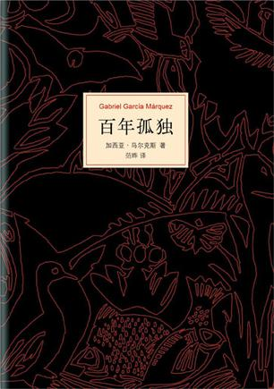](0a1ebc79-6263-4ca5-9f29-7575263ab8a7.png)

加西亚·马尔克斯《百年孤独》

《百年孤独》是魔幻现实主义文学的代表作，描写了布恩迪亚家族七代人的传奇故事，以及加勒比海沿岸小镇马孔多的百年兴衰，反映了拉丁美洲一个世纪以来风云变幻的历史。作品融入神话传说、民间故事、宗教典故等神秘因素，巧妙地糅合了现实与虚幻，展现出一个瑰丽的想象世界，成为20世纪最重要的经典文学巨著之一。

[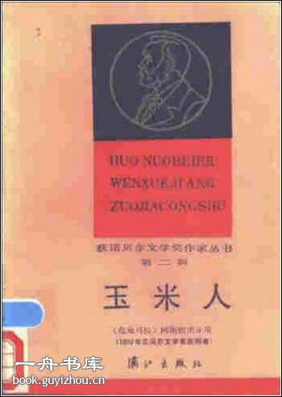](51678a53-f5e3-4c69-b27c-cbcc9480db47.jpg)

（危地马拉）阿斯图里亚斯，《玉米人》

[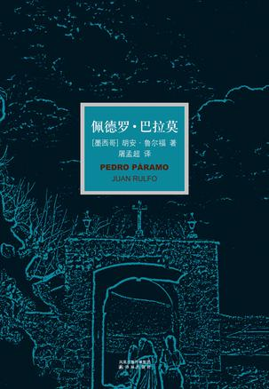](78727b06-af68-427c-9f38-5fd7e0ab3000.jpg)

（墨西哥）作家[胡安·鲁尔福](http://baike.baidu.com/view/769624.htm)的《佩得罗·巴拉莫》

[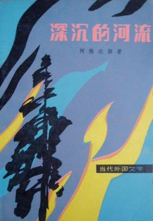](b0cd33e8-bb35-4c52-9cb8-984524db3081.jpg)

(秘鲁)作家J.M.阿格达斯，《深沉的河流》

（中国）莫言《蛙》

 

### 五、影视代表作品：

《地下》 导演：埃米尔·库斯图里卡（前南斯拉夫）

[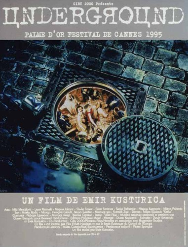](b3a5af3b-417a-4865-9db3-9d59558df9af.jpg)

《灵异第六感》 导演：M· 奈特·沙马兰（印度）

[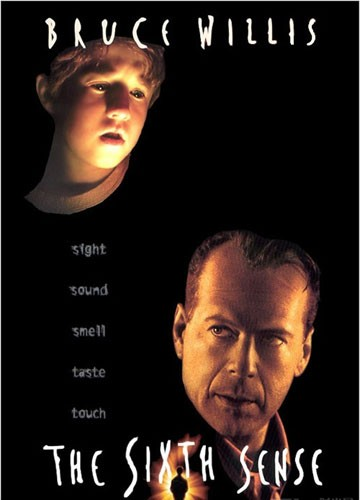](871566de-5ccd-4a99-b11b-2214e687c856.jpg)

《小英雄托托》 导演：雅克·范·多梅尔（比利时）

《月亮情人》 导演：巴克迪亚·库唐纳扎洛夫（塔吉克斯坦）

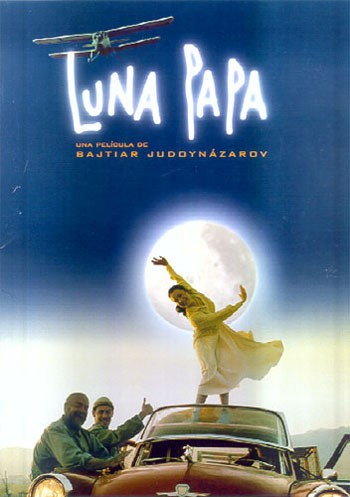

《大鱼》 导演：蒂姆·波顿（美国）

《国王和电影》 导演：卡洛斯.索林（阿根廷）

[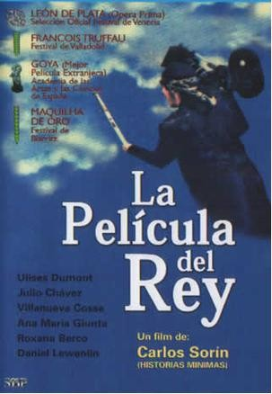](5efa1a9c-6c84-4685-b2cb-4e7936d09c44.jpg)

《太阳照常升起》 导演：姜文（中国）

《铁皮鼓》 导演：施隆多夫（德国）

[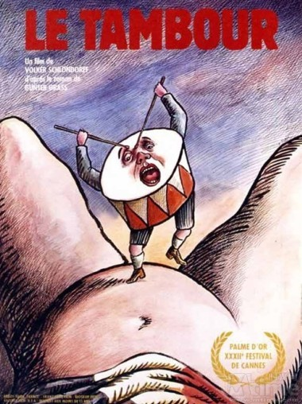](64193bc2-95e8-4636-a6c9-44a1765d1a1d.jpg)

《LE SUD》导演：费尔南多·索拉纳斯（阿根廷）

[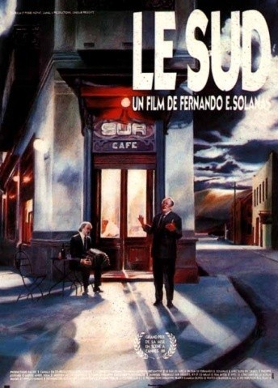](edfc4640-1306-4115-aa4f-218ebc6c7f5c.jpg)

《潘神的迷宫》 导演：吉尔莫·德尔·托罗（墨西哥）【6】

 

### 六、美术代表作品

[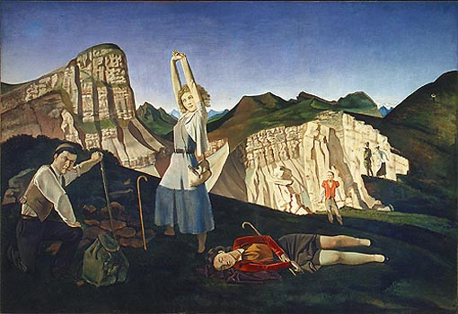](e5b346ed-135d-4917-ba22-448811f63f40.jpg)

The Mountain (1937) by Balthus (FR)

The Gray and Gold (1942) by John Rogers Cox (US)

[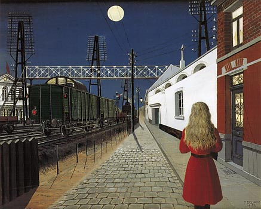](fcbdffdd-965b-4ffb-b00a-bcf3e9f286fd.jpg)

Solitude (1955) by Paul Delvaux (BE)

Water Tower in Bremen (1931) by Franz Radziwill (DE)

[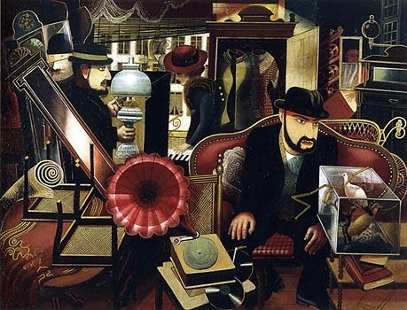](e34b7b16-1561-4c34-b9c7-bc0120ee9039.jpg)

Troedelladen (1926) by Ernst Thoms (DE)

The Dream (1912-13) by Felix Casorati (IT)

[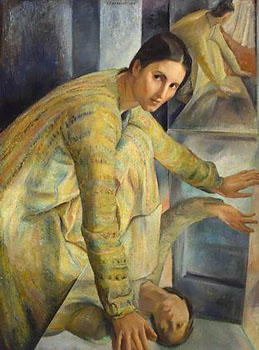](7335d786-2b46-45b8-92e6-c85fd2bff704.jpg)

Orizia agli specchihe (1925) by Ferruccio Ferrazzi (IT)

 

### 七、参考文献

 【1】徐静，《魔幻现实主义文学再解读》，《安徽大学学报（哲学社会科学版）》，2005，29（2）. 【2】邓建华，《论魔幻现实主义在<保留区蓝调>中的成功运用》.《东北大学学报（社会科学版）》，2011，13（1）. 【3】 【4】绍文,《[魔幻现实主义来到中国之后](http://cul.sohu.com/20121013/n354794570.shtml)》中华读书报. 【5】徐静《魔幻现实主义文学再解读》，《安徽大学学报（哲学社会科学版）》，2005，29（2）. 【6】时光网：[因为现实而魔幻：影迷必看的十部魔幻现实主义佳片](http://i.mtime.com/1395733/blog/4834746/) 【7】[What is Magic Realism Art](http://histonehart.blog.163.com/blog/static/4353928820107100840657/)  

### 八、延伸阅读

 马尔克斯，《百年孤独》，ISBN: 9787544253994  

（助理：戴青 编辑：海舰 责编：海舰）

 
