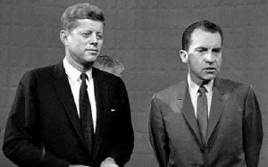
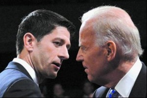
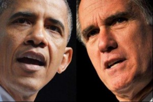

# ＜七星百科＞第四十三期：美国总统大选电视辩论

**编者按：前不久刚结束的美国总统大选首场电视辩论落下帷幕，媒体、社交平台以及民众纷纷对辩论双方进行各种评判，并对后续选情的进展提出猜想。美国大选是没有硝烟的战场，它把印象中充满血腥和杀戮的政治斗争变得和平公正。电视辩论更是兼有面向大众和娱乐大众的特点。现在电视辩论在其他国家和地区，诸如法国、台湾，在大选之年也会举办。那么美国的电视辩论是何时开始的？对于民主制国家又有什么特殊的意义呢？本期百科将给读者介绍有关美国总统大选电视评论的内容，希望能帮助读者了解美国大选的流程。**  

# 美国总统大选电视辩论

## 

 

### 本词条在以下文章中被使用

[（1）<开阳>：谁来挑战奥巴马：2012美国共和党初选中期解读](/?p=20746)

[（2）<荐书>：密室里的孤独——保罗·奥斯特专题](/?p=5747)

 

### 词条简介

**美国总统大选电视辩论**是指美国总统候选人在选前一个月左右，通常有两到三次面对面电视辩论的机会，副手也有一次。这并非美国有电视以来就有的传统，第一次的电视辩论是1960年的肯尼迪和尼克松的对抗，随后停了3次，到1976才恢复。【1】

 

### 目录

 **1、制度起源及发展**

1.1总统大选辩论委员会简介

**2、对美国选举制度的影响** **3、引发的思考** **4、参考文献** **5、延伸阅读**  

### 1.制度起源及发展

**1960年**，美国三大电视网在9月与10月共主办四场大选电视辩论，这也是美国政治史上首次全国性的总统大选辩论。辩论是除了主持人外，每场搭配四位媒体记者担任提问人，从晚间九点半到十点半进行一个小时，程序是8分钟开场词、紧接着提问人就内政问题提问，候选人每人答询2.5分钟，回答与相互质疑之后，最后各有三分钟结辩。这四场辩论大致确立了总统电视辩论的形式，选民第一次透过电视“看清楚”总统候选人的政见立场与人格特质。

**从1980年起**，美国总统大选电视辩论取消候选人8分钟开场词，直接进入媒体代表轮流提问，并且开始分上下半场，并限制每场辩论的议题。**从1992年起**，每次总统候选人辩论的第二场开始采用“市民会议”方式进行，提问人不再是媒体记者，而是209位经过抽样挑选的自由选民，扩大了选民直接参与层次。从**1996年**的总统候选人电视辩论起，不再有媒体提问人，除了第二场的市民会议外，其余两场都是只有主持人全程负责提问，因为负责组织辩论的“总统大选辩论委员会”认为，这是最好的方式，能让候选人提供最足够的信息给美国民众。

**2008年**美国总统大选时，“总统大选辩论委员会”当时的主席说：“公众有权在电视转播的限制下，尽量多地知晓候选人对国是的看法。”民主、共和两党因而议定新的候选人电视辩论规则，引入了辩手讨论的时间。新规则是每场辩论总计90分钟，分成8个10分钟小节，其余时间为开场白和总结。每个小节谈一个话题，由主持人引入话题，然后两名候选人分别有1分钟时间表达观点，然后有7分钟时间相互诘辩。通过放宽发言时间的限制，主持人可以让候选人相互提问。

#### 1.1总统大选辩论委员会简介

总统大选辩论委员会（CPD）成立于1987年，是为举办全国性总统大选而设立的常设机构，目的是为确保选民能获得最足够的信息。这个组织，经费全由民间募款而来，从正式成立起就确定了非营利性质和“不接受政府与政党的捐赠”的原则。并且自1992年起就做到信息完全公开，网站上清楚公布企业或是个人赞助者名单。不仅是全国性的总统、副总统候选人电视辩论会，甚至属于地方选举或是其他教育性质的辩论会，都经过了一定程序的审核，务求符合美国联邦选举委员会（the Federal Election Commission）的要求--辩论赞助者必须是预先设定以及客观（pre-established，objective）原则。

从1988年总统辩论委员会成立时开始，24年来美国共和、民主两党持续商讨和策划总统候选人电视辩论事宜，以协议的方式建立一套辩论的规则，这套规则着重参考全国民调结果。两党合意的规则规定：只有在五家全国性民调机构最新民调结果平均超过15%支持度的总统候选人方可参加电视辩论。最近几次美国大选，竞选力度不够、支持率不高的第三党和独立候选人，如1996年的改革党候选人佩罗、2000的绿党候选人纳德和今年的自由党候选人约翰逊，都会以“控诉总统辩论委员会歧视第三方”这个技巧来提升人气并宣传“两党轮班制需要改革”的政纲。【2】

 

### 2.对美国选举制度的影响

“君子协定”式的电视辩论协议，显示政治竞选规则形式上比较公平。美国总统候选人在电视上公开辩论始于1960年，在尼克松和肯尼迪之间进行。后因在任总统拒绝参加而中断，到1976年才恢复。辩论并不是美国宪法的法定要求；只有在候选人双方感到都愿意的时候，才会有辩论。一般来说，竞选连任的在任总统不太喜欢电视辩论，因为他本来就有足够的机会可以直接面对全国公众；反之，挑战一方的候选人则特别热衷于此，因为这是他在全国公众前亮相的绝好机会。

根据2004年总统竞选电视辩论规则：（1）辩论须有可争辩之分歧，须相互碰撞、迎战对方的观点。否则，辩论就变得有名无实。（2）辩论须由第三方主持，让辩论双方在公众面前进行“对决”，避免辩论方出现情绪失控或由任何一方掌控辩论规则而发生的纷争。（3）辩论须由第三方提问。提问者须相当自律，必须严守中立，不能以谄媚一方而敌视另一方。（4）辩论须有中立环境。现场观众保持沉默是一般规则；唯一例外的是，在第二场辩论，观众可以提问一次（因为他们立场未定），提问之后必须关闭面前的麦克风。（5）辩论须确保机会均等，主持人必须在辩论双方之间平均地分配时间。（6）辩论须在旗鼓相当的对手之间进行。

纵观历次辩论，虽然不乏唇枪舌剑的观点交锋和有节制的互相攻击，却整体上表现出鲜明的秩序和精湛的政治手段。电视辩论在某种意义上是一种形式重于内容的政治秀，但也不失为比较公平的竞争。不管辩论究竟有无实质意义，两个竞争对手能够走到一起，在公众面前进行争辩，而又没有引发骚乱、仇恨、诉讼和丑闻，这本身蕴涵着一些值得考究的政治竞争规则。辩论中一方甚至不能直接质问另一方，必须经主持人同意才能继续反击。辩论中，主持人都对双方“发号施令”，纠正他们“越轨”的地方和提醒双方严格遵守发言时间。在第二场 “市政厅式” 辩论中，辩论人可以走到观众身边，与普通民众近距离交流。两位候选人都在意自己在潜在选民面前的领袖形象，每次回答问题还不忘表示感谢提问人，以赢得观众的尊重。总之，君子协定下的电视辩论规则，至少在形式上从一个方面体现了政治契约下政治竞选行为规则的公开性和平等性，是对美国选举制度公平竞争原则的充实和诠释。【3】

 

### 3.在我国引发的思考

我国对于美国的政策辩论的态度，经历了微妙的变化。上世纪50~70年代，我国政府往往把美国的政策辩论视为美国统治阶级内部分赃不均引发的争吵，形容为“狗咬狗，两嘴毛”。上世纪80年代以后，随着中美关系的改善和两国交往的日益密切，我们往往将其视之为“选举秀”和“口水仗”。近年来，我们对美国的政策辩论开始有所重视，但是往往停留在对于美国外交政策的关注，而且仍然坚持“中美关系的基本面不会发生变化，美国政策可能会发生暂时的某些变化，但最终会回到正常的轨道上来”的观点。我国学术界对美国的政策辩论基本上持“淡漠的远距离注意”的态度，很少有人予以深入地研究。

如果我们能够透过习惯贴上的标签，抛开美国文化特有的政治喧嚣，不难发现，美国这样大规模的周期性的政策辩论其实有着非常丰富和深刻的内涵，可以给我们许多值得借鉴的有益启示。

**第一，政策辩论是民主政治的一种重要形式。**现实生活中，民主的含义及其包括的内容，可以从很多不同的角度定义。民主的内涵尽管非常丰富，从政治权力运行的角度，仍然可以简单概括为：人民的利益和意志通过一定的制度安排和程序设计使之得到充分体现的政治制度。

**第二，政策辩论有利于推动政治体制改革。**近年来，我国在民主政治制度建设的实践层面进行了许多尝试，基层政权的直接选举、党内民主的改革探索等等，取得了一定的进展。但就实践层面而言，民主政治的建设除了需要关注正确的路径之外，还应该注意系统的整体综合推进。在民主的各项基本制度之间，还存在某些重要的节点，通过这些节点把各个核心制度联系在一起，形成民主政治的整体运行机制，政策的公开辩论就是这样的节点。

**第三，政策辩论是决策科学化的必经过程。**随着社会的发展和进步，政府决策影响的范围越来越大，持续时间越来越长。社会越来越难以忍受政府的决策错误或决策瑕疵。政府决策的科学化越来越受到重视。但是随着社会生活的日益复杂，影响决策效果的各种内外因素越来越多，政府决策的难度越来越大。从近年来我国政府决策的情况来看，在某些事关稳定大局和国计民生的重大事务中，政府决策意图与决策效果之间出现明显差距，甚至背道而驰的现象也时常出现。除了客观原因之外，从政府决策的过程来看，缺乏充分的决策论证和科学周密严谨的政策设计是重要原因之一。虽然中国政府正在逐步建立决策咨询系统，努力听取专家和研究机构的咨询意见，但是这种集中在少数精英分子中间的有限咨询，其局限性非常明显，在某些情况下，选择性咨询甚至成为某些权力部门掩盖内幕交易、制造虚假论证的方法。

**第四，通过政策辩论凝聚民族意志并形成社会共识。**我国在经历了长期的快速发展之后，正在进入内外决策风险快速扩大的发展阶段。在面对将要出现的大量危机问题时，迫切需要全国人民团结一致，需要国内某些社会阶层、社会群体付出更多的牺牲，需要全民族在重大历史时刻，有勇气付出重大民族牺牲，以维护国家的统一，争取民族生存和发展的机遇。 【4】

 

### 4.参考文献

[（1）《台媒：美大选辩论影响选情 或成罗姆尼背水一战》，搜狐新闻](http://news.sohu.com/20121009/n354512507.shtml)

（2）《美国大选辩论：重规则不重吵架》，石头，网易评论

（3）《2004年美国大选对美国选举制度的影响》，唐晓，《外交学院学报》，2005(81）

（4）《由美国大选政策辩论引发的思考》，胡训珉，《上海党史与党建》，2008(6）

 

### 5.延伸阅读

（1）唐晓：《2004年美国大选对美国选举制度的影响》，《外交学院学报》，2005(81)

（2）金敏：《美国大选中的电视辩论》，《观察与思考》，2004(20)

 

（编辑：高丽 ； 责编：海舰）

 
