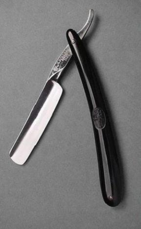
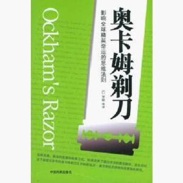

# ＜七星百科＞第四十八期：奥卡姆剃刀

 

# 奥卡姆剃刀

## 

 **编者按：奥卡姆剃刀不是一把刀，而是“刀法”，颇像《九阴真经》中的奥义：天之道，损有余而补不足。事实上奥卡姆剃刀定律是一个逻辑上的定律，经常被用在哲学、政治、经济等领域，用来表示区分极其相似的定理。不仅如此，它时常出现在论证严密的文章当中，甚至它的原理还能被应用于实际生活当中。本期百科将向读者介绍这种以“刀”为名，颇具侠客气息，并能在论证中如砍瓜切菜般犀利的定律。** 

#### **本词条在以下文章中被使用**

 [（1）<开阳>我为什么反对中医](/?p=12016) [（2）<天玑>带你进兔子洞，带你磕红药丸：前言](/?p=11834)  

### 词条简介

 **奥卡姆剃刀定律**被称为**“如无必要，勿增实体”**，即保持事情的简单性，抓住根本，解决实质，不需要人为地把事情复杂化，且多出来的东西未必是有益的，相反更容易使我们为自己制造的麻烦而烦恼；其另外一种阐释是：当你有两个处于竞争地位的理论能得出同样的结论，那么简单的那个更好。**【1】** 

 

### 目录

 **1.历史渊源** **2.现实应用** **2.1 适用条件** **3.社会评价** **4.参考资料** **5.延伸阅读**  

### 一、历史渊源

奥卡姆剃刀不是刀，而是一句话：如无必要，勿增实体。这句话是由**14世纪**欧洲一位叫**威廉**的哲学家提出的，由于他**出生在英国的奥卡姆地区**，所以人们把这句话叫做奥卡姆剃刀原理。威廉曾经用这个原理分析了许多哲学问题，包括宗教中的上帝，他认为“通过思辨不能得出上帝存在的结论”，惹恼了罗马教皇，于是威廉逃到了德意志皇帝那要求庇护，对那个皇帝说出了他的第一句名言：“请你用刀剑保护我，而我用笔来捍卫你。”不过历史证明，逃往后的威廉的“笔”远不如他的“剃刀”那么影响深远。

威廉当年提出奥卡姆剃刀原则时，其实是这样说的：**“能以较少者完成的事物，若以较多者去做，即是徒劳。”**这也就是说，在科学乃至其他领域，如能用假设较少的理论解释某一事物，那么我们就不必去选择假设较多的理论。【2】

 

### 二、现实应用

 **科学**

对于科学家，奥卡姆剃刀原理还有一种更为常见的表述形式：**当你有两个处于竞争地位的理论能得出同样的结论，那么简单的那个更好。**这一表述也有一种更为常 见的强形式：**如果你有两个原理，它们都能解释观测到的事实，那么你应该使用简单的那个，直到发现更多的证据。**对于现象最简单的解释往往比较复杂的解释 更正确。**如果你有两个类似的解决方案，选择最简单的。**需要最少假设的解释最有可能是正确的（或者以这种自我肯定的形式出现：让事情保持简单！）。注意这个原理是如何在上述形式中被加强的。严格的说，它们应该被称为**吝啬定律 (Law of parsimony)，**或者称为朴素原则。最开始的时候我们使用奥卡姆剃刀**区分能够做出相似结论的理论。**现在我们试图选择做出不同结论的理论。这不是奥卡 姆剃刀的本意。我们不用检验这些结论吗？显然最终不是这样，除非我们处于理论的早期阶段，并且还没有为实验做好准备。我们只是为理论的发展寻求一种指导。

这个原理最早至少能追溯到**亚里士多德的 “自然界选择最短的道路”。**亚里士多德在相信实验和观测并无必要上走得太远。朴素原理是一个启发式的经验规 则，但是有些人引用它，仿佛它是一条物理学公理。它不是。它在哲学和粒子物理中使用的很好，但是在宇宙学和心理学中就不是特别好，这些领域中的事务往往比 你想象的还要复杂。或许引用莎士比亚的一句话要胜过引用奥卡姆剃刀：“天地之大, 赫瑞修, 比你所能梦想到的多出更多”。

许多科学家接受或者（独立的）提出了奥卡姆剃刀原理，例如**莱布尼兹**的“不可观测事物的同一性原理”和牛顿提出的一个原则：如果某一原因既真又足以解 释自然事物的特性，则我们不应当接受比这更多的原因。奥卡姆剃刀以结果为导向，始终追寻高效简洁的方法，600 多年来，这一原理在科学上得到了广泛的应 用，从牛顿的万有引力到爱因斯坦的相对论，奥卡姆剃刀已经成为重要的科学思维理念。

 ** 管理学**

奥卡姆剃刀不断在哲学、科学等领域得到应用，但使它进一步发扬光大，并广为世人所知的，则是在近代的企业管理学中。好的理论应当是简单、清晰、重点 突出，企业管理理论亦不例外。**在管理企业制定决策时，应该尽量把复杂的事情简单化，剔除干扰，抓住主要矛盾，解决最根本的问题，才能让企业保持正确的方向。**对于现代企业而言，信息爆炸式的增长，使得主导企业发展的因素盘根错节，做到化复杂为简单就更加不易。企业管理是系统工程，包括基础管理、组织管理、 营销管理、技术管理、生产管理、企业战略，奥卡姆剃刀所倡导的简单化管理，并不是把众多相关因素粗暴地剔除，而是要穿过复杂，才能走向简单。通过奥卡姆剃 刀将企业最关键的脉络明晰化、简单化，加强核心竞争力。

 **经济学**

投资需要策略，在投资市场，太保守不行，太冒险也不行。投资市场是复杂的，不少投资者整天在忙忙碌碌地分析、研究和频繁操作，投入了大量精力，却依然难 以应付市场中庞杂的信息。面对复杂当投资市场，应拿起奥卡姆剃刀，把复杂事情简单化，简化自己的投资策略，对那些消耗了大量金钱、时间、精力的事情加以区分，然后釆取步骤去摆脱它们。

 **日常生活**

作为一种思维理念，当然并不仅仅局限于某一些领域，事实上，奥卡姆剃刀在社会各方面已得到越来越多的应用。奥卡姆剃刀同时也是一种**生活理念。**这个原理要求我们在处理事情时，要把握事情的本质，解决最根本的问题。尤其要顺应自然，不要把事情人为地复杂化，这样才 能把事情处理好。爱因斯坦说：“如果你不能改变旧有的思维方式，你也就不能改变自己当前的生活状况。”当你用奥卡姆剃刀改变你的思维时，你的生活将会发生改变。在运用奥卡姆剃刀时应牢记爱因斯坦的一句著名的格言：万事万物应该都应尽可能简洁，但不能过于简单。如果将这一理念与中国儒家的**《中庸》**思想结合起来，那么会使我们的行为更趋于完美。【3】

#### 2.1 适用条件

**1.对同一事物要有两种以上的解释**

注：a.这里的“解释”指的是让人能接受的解释。比如，震动论在天涯科学论坛上不被接受，要排出它只能用其它方法而不能用奥卡姆剃刀； b.这个事物在当时的情况下很难、甚至不可能得到科学的解释。所以，只有患“科学癖”（我发明的词）才努力地去将奥卡姆剃刀原则“科学化”。

**2.因特殊的需要，我们必须从中选择一种**

比如：在任何论坛上，我们允许各种能够接受的解释同时存在，那么就不能用奥卡姆剃刀【4】

 

### 三、社会评价

近年对于奥卡姆剃刀的效力出现很多争议。

**哲学家埃里奥特·索伯**1994年写过一篇论文《让我们剃掉奥卡姆的剃刀》，他问：“我们凭什么有理由认为，作为一个普遍的做法，最简单的假定最有可能是正确的假定？一种可能是，最简单的解释往往是对的，是因为从某种意义上说宇宙是简单的。这是一个古老的观念，托马斯·阿奎那就说：‘如果通过一种手段就能完成某事，用几种手段去做就是多余，因为我们观察到，在一种手段足够的情况下，大自然不会使用两种手段。’”实际上，宇宙并不真的如此简单，除了在数学意义上。

2000年，**美国印第安纳大学哲学教授保罗·文森特**在《奥卡姆的唯名论形而上学》中说：“在实践中，奥卡姆的剃刀在奥卡姆构建他的本体论时没有发挥什么特别的作用。毕竟，经济原则也不是奥卡姆的创新。在亚里士多德和奥卡姆中世纪的前辈那里都能找到它的各种版本。有一些哲学家提出了反剃刀，以保证假设的实体不少于必须的数目，他们只是转移了着重点而已，没人说要假定不必要的实体。奥卡姆和他的批评者之间的差异在于哪些实体是必须的，剃刀本身不能决定这一点，因为这需要深入的论证。”

**匹格里奇**说，奥卡姆的剃刀在本体论上得不到辩护，但它在认识论上是有用的：喜欢简单的答案使找到正确的答案变得更容易，这在很多领域都是正确的，但不是因为什么神秘的事实。它在物理学上有用跟它在生物学上有用可能是由于不同的原因。在大多数情况下，可以偏爱较简单的解释是因为，在简单性背后存在大量非常复杂的背景知识。因为这些背景知识，我们才能提出简单的观念。“奥卡姆剃刀是一个锋利但并非普遍适用的工具，需要小心使用。”

**哲学家凯文·凯利**在《科学哲学手册》中说，剃刀的意义不在于它能帮助我们发现真理，而在于它是一种思维工具，可以让我们更快地得到真理。他写道：“奥卡姆的剃刀不会指向真理，哪怕只是高度可能的真理，但它却有助于我们以独特的最高效的方式抵达真理。所谓高效，是以犯错误的总量和会聚到真理之前取消之前的意见的数量来衡量的。因此，奥卡姆的剃刀是从具体事实引出普遍真理的最具真理传导性的方法。”你不能在辨证中毫无疑义地引用奥卡姆剃刀，它只有在漫长、持续的探索过程中才真的有用。【5】

 

### 四、 参考资料

 [1. 《生活中的定律—奥卡姆剃刀定律》](http://www.mifengtd.cn/articles/occam-razor-life-tips.html) 2. 任晓龙，《一把锋利的科学剃刀--奥卡姆剃刀》，《大科技》2006年04期 [3. 《奥卡姆剃刀原理》](http://blogs.tkiicpp.com/tag/economics/) [4.《奥卡姆剃刀定律》](http://waihuixuexi.fx678.com/xuexilist_8182.html) [5.《奥卡姆剃刀的效力》](http://www.lifeweek.com.cn/2011/0608/33491.shtml)  

### 五、 延伸阅读

 1.任晓龙，《一把锋利的科学剃刀--奥卡姆剃刀》，《大科技》2006年04期 2.果壳网：《奥卡姆剃刀到底是个怎样的法则？》  

（编辑：高丽；责编：海舰）

 
