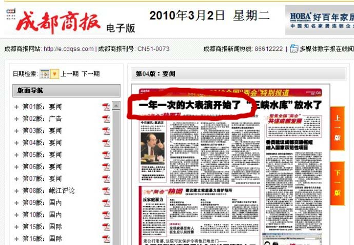
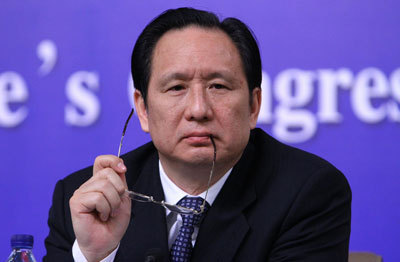
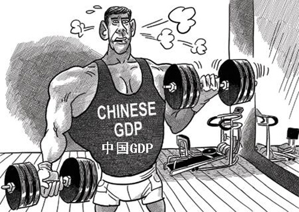
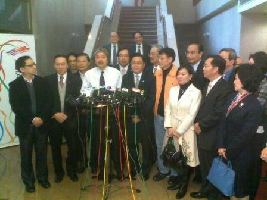
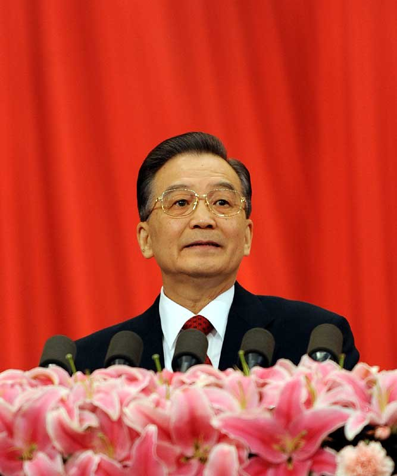

# ＜七星视点＞第七期： 代表敲锣，委员打鼓

# 七星视点

## 第七期：代表敲锣，委员打鼓

  

### 1．代表敲锣 委员打鼓

帝都北京，两会开幕。 代表敲锣，委员打鼓。 提案无数，于事无补。 成都商报，才最靠谱。 这次两会，流传最广的提案当数天津刘美丽委员提的“煎饼果子“案，结果[该提案却被证实系编造](http://news.sohu.com/20110304/n279644031.shtml)。但这件事却给了我们一个启示，两会大表演，我也可以编台词。 **七星视点：** 为庆祝第十一届全国人民代表大会第四次会议和政协第十一届全国委员会第四次会议的胜利召开，北斗网七星视点栏目组举办了[“如果你是刘美丽，你会提什么提案”的征集活动](http://xiaozu.renren.com/xiaozu/191912/thread/332955909?ref=minifeed&sfet=131&fin=4&ff_id=264848815)。 本活动不抽奖不送ipad2，但网友仍然踊跃参与，现精选几条作品公布如下： 规范长三角小吃市场，要卖小馄饨必须有馅！ **By ****闇缇浦**** **** ** 大力开展直男掰弯运动，缓解男青年数量多于女青年男青年没妹子问题! ** By ScrewyouguysI’mgoinghome** 改变现有领养政策，允许家庭在拥有一个非残疾子女的情况下再领养一个子女，允许单身男子（女子）领养年龄差距小于30的女儿（儿子）。 **By ****萝莉控徐**** ** 是否可以调整师范类学校的男女招生比例……o(∩_∩)o 哈哈。 **By ****西瓜**  强烈建议把逻辑学、概率论和经济学设为大学的必修课。看谁以后再TM说“虽然我不懂经济学，但是我认为……”=_,= **By****西南联邦发言人**  中国电影一律以红歌为主题曲，弘扬红色经典，传承红色精神。把社会主义荣辱观与科学创新精神融为一体。再拍一部弘扬红色精神的主旋律大片，名叫《我的英吉利岁月之红歌伴我闯牛津》。 **By ****华政萧以南** 

### 2 ipad这么快就二了

小编刚花了四千多块买了个ipad，用它看了一场电影然后满足地睡去，结果一觉醒来[乔布斯](http://baike.baidu.com/view/226002.htm)拿着[ipad2 ](http://www.huanqiu.com/zhuanti/tech/ipad2/) 在开发布会了。新的ipad2比ipad要更薄更轻更快，还有摄像头，但关键是ipad全线降价一千块。小编顿时觉得自己手里的ipad像砖头一样沉重，心像ipad的金属外壳一样冰凉。Ipad已经过时，再买ipad2又要破费，拿什么来拯救我的装逼啊。想知道乔布斯是如何不地道，请移步北斗天枢[《苹果的骗局——我对苹果哲学的理解》](/?p=6470 )。** **  **七星视点：** 我上初中的时候曾经幻想自己的课本里能夹着一个跟课本一样大的电脑，可以上课偷偷看电影上网玩游戏，当时觉得那是个遥不可及的梦想。这才几年，苹果还有其它科技巨头就让这个幻想实现了。虽然苹果在营销战略上是不怎么地道，但是我一直觉得ipad是一个具有很大意义的产品。在现在的社会，每个人都需要一个便捷的信息终端机好把自己融入到信息网络中去。Iphone和ipad都是向这个方向的有意义的尝试。苹果领先科技，人们追逐苹果就是追逐最先进的科技体验。 但是现代人们最大的问题就是相信先进的科技会带来幸福，所以有了领先的科技就要迫不及待地去体验。我买了ipad才发现自己最需要的仅仅是个电纸书而已，可是当我买了电纸书才发现自己纸质书还没看完呢。我们一直相信进步发展会带来幸福，但也许仅仅是个现代性的谎言而已。 **By ScrewyouguysI’mgoinghome**  

### 3背后大树倒，裸官要裸奔

近日，随着前铁道部长刘志军被撤查，被称为高铁建设中起着领军人物，刘志军的“左膀右臂”[张曙光也被停职审查](http://www.cnnsr.com.cn/jtym/cszx/20110301/2011030111460087808.shtml)，并发现他有[裸官** **](http://baike.baidu.com/view/1823944.htm)之嫌。刘志军在2月12日被免去铁道部党组书记职务，接受调查后，外界便有传言认为，张曙光作为刘志军的嫡系将难逃干系，被调查是迟早的事。 **七星视点：** 所谓一朝天子一朝臣，铁道部也不例外，老大折了，小弟距离折的那天也就不远了。在我们这样的国度，其实岂止是我们这样的国度，只要是有人的地方就会有类似的现象出现.每一个团体都有着共同的或相互牵制的利益关系，牵一发而动全身。料想未来的某一天（也许是明天，也许是明年），铁道部某位处长抑或局长被停职审查，“据内部人士称他是原铁道部运输局局长、副总工程师张曙光的二大爷”之类的东西也就跳出来了。 **By ****蓝昊 ** 

### 4 富有的代价

2008年奥运之后，日本、德国等多个发达国家纷纷削减对华援助。随着2010年中国GDP超越日本成为世界第二大经济体，[发达经济体又掀起了一轮削减、甚至叫停对华援助的浪潮 ](http://news.v1.cn/gj/2011-3-5/1299250242869.shtml)。 统计数据显示，日本2009年对中国的[ODA](http://baike.baidu.com/view/105422.htm) 为6300万美元，其中包括技术和资金援助。2006年，英国国际发展部启动了《2006年—2011年对华援助计划》，在五年时间里对华提供发展援助1.05亿英镑。 ** ****七星视点：** 全国在一片喜庆的气氛中迎来了GDP超越日本,媒体们歌功颂德，政府丰功伟绩，人民在憧憬着GDP超越美国的同时却发现手中货币的购买力却变得薄弱起来。国富民弱,只看到中国在经济数据上强大了起来,却忘记了中国所需要面对的现实问题。 英国和日本叫停了对华援助，这只是个信号，相信会有更多的国家会思考是否应该继续给这个全球第二大经济体以经济援助。援助的叫停，势必影响国内贫困地区的妇孺医疗教育状况。在国内民间组织尚不完善，贫困地区医疗教育资源匮乏以及官员若有若无地避重就轻，那些最需要援助的人的命运将何去何从。是否我们国内有能力填补外国援助减少的缺口？国内近年天灾不断，政府应接不暇，减少外国援助是否又绝了一个能解决问题的源水。 欲彰之，必先抑之，中华既怀有强国之志，又何必慕虚名而处实祸，宁可安隅一方，默默耕耘，他日定有收获。望观者思量，孰优孰劣？ **By ****凤先生**  楼上还是站在一个民族主义国家视角上看问题。按这个视角的话，中国不缺这点好钢，问题是好钢都用不到刀刃上。 **By ScrewyouguysI’mgoinghome** 

### 5 香港天上也掉钱了！

香港特别行政区财政司司长曾俊华3月2日再次约见特区立法会建制派议员，商谈预算案的问题。曾俊华在会后宣布，向每名成年市民派发6000元(港币，下同)，以及减薪俸税七成半，上限6000元。 **七星视点：**** ** 什么是真正的国力盛衰的衡量标准？GDP?世界排名？军备竞赛名次？老百姓是活在这些指标中，还是活在自己的柴米油盐中？连续N个月的CPI连续上涨超过3%已经让普通百姓不堪重负，而新一轮的粮食危机更加加剧了这种形式。对比香港的向普通民众发放补贴，内地似乎更愿意走传统的集中力量办大事的路线。但是这路线，又有多少好处能落到百姓头上？拿出四万亿来解决经济危机，百姓的生活却没见多少好转；刺激内需的力量再大，百姓的手上可支配资金也没见多，没有钱，怎么促进消费？高储蓄代表了低消费，所以GDP只能靠投资驱动的时代，不再能是一个让民众满意的时代。面对越来越深的社会矛盾，或许藏富于民才是最好的出路。把买美国国债的万亿美元拿一部分出来，消费力能上涨多少，其实政府心里的帐算得很清楚。但是究竟是什么阻碍了藏富于民措施的实行，只有政府自己才明白。 **By ****钱慕白**

### 6 北大女硕士为逃离北京甘当油漆工！

北京大学硕士研究生毕业的39岁女子苏黎杰，2005年从北大毕业留京后，总感觉工作和生活状态不理想，毅然放弃大城市的工作，回到了家乡。但回乡后找不到适合的工作。近日，她看到一家装饰企业免费培训油漆工的时候，就果断地报名参加。 联想到此前的新闻“[大学生月薪1200元可接受 农民工称2000不考虑](http://edu.163.com/11/0221/19/6TELBJ8K00294IJJ.html)”，以及去年数百大学生竞聘五个掏粪工岗位，大学生现在的处境真是十分尴尬。朱军曾说：[大学生掏粪工将改变中国掏粪现状](http://news.163.com/10/0307/08/615LVUSH000146BD.html)，看来硕士生回乡当油漆工，“无论在思维，还是油漆工具的使用上，硕士生都具备优势，从而将使中国摆脱传统意义上的漆油工了。” **七星视点：** 咱们的北大女硕士说从来不觉得体力劳动有什么丢人的，诚然工作不分高低贵贱，硕士当然也可以做油漆工，但是硕士学位代表了国家在其身上相当程度的教育资源投入，培养出如此高端人才却去油漆工，一来大材小用，二来浪费了教育资源。另一方面，苏黎杰并不是完全找不到工作，更多的是难以融入大城市，心中多有落寞之情。这恐怕是北漂一族的普遍心情吧，融入一个异乡大城市真的不是件容易事。苏黎杰在饱尝其寒冷后，决心返回故乡，自力更生，这点不该被质疑，反而应当送上祝福。 从更广的范围来看，大学生就业难，而有一技之长者吃香的状况很普遍，这也反映了大学扩招之后教育质量的下降明显，大学生泛滥。如今有些学生学到了些知识，却又没有可致用的一技之长，有些甚至混了四年一无所获，适应社会需求的能力自然不如有专业技能的务工者了。 **By ****登峰**

### 7维稳重于国防，攘外必先安内

据《2011年中央和地方预算草案》报告显示，中国的军费开支增幅，去年出现7.8%的个位数增长后，今年又回到12.7%的双位数增幅；但另一方面，公共安全开支增幅达13.8%，虽较去年增幅回落1.8个百分点，但无论总额还是增幅仍再次超过军费开支，反映当局对内部维稳的重视程度。 国务院总理温家宝近日在政府工作报告中称，要“建设现代化武装警察力量，增强执勤、处置突发事件和反恐维稳能力”。** **  **七星视点：** 这个财政支出的细目可以公开吗？ **By Reader S**  

（采编：钱思韵、张岐、陈造极、杨再爽、刘一舟 责编：刘一舟）
