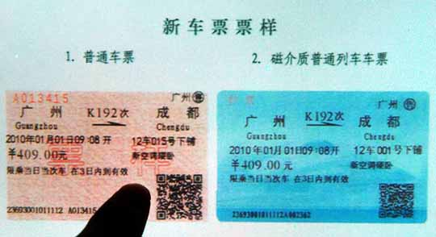
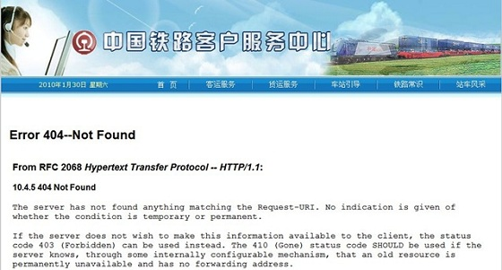
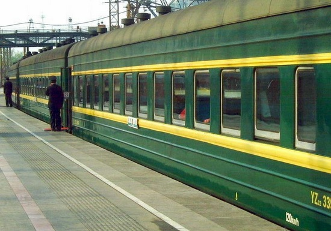
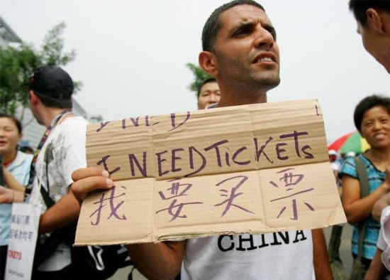
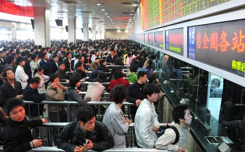

# ＜七星视点＞第三十三期：车票的故事

春运再次来到了。每到这个时候，人们总是会想尽种种办法，奔波往返，只为了一张回家的车票。在一张车票背后，又背负着什么样的故事呢？请关注本期七星视点。

**排队、网站、以及插件**

**——谈火车票的订票问题**

自从铁道部开通网上售票以后，12306订票网站受到广泛的关注。在春节这个每年最大的购票高峰期，票源短缺的问题自然显得非常突出。针对网上订票的困难，有多家公司推出了“抢票插件”的服务软件。但铁道部向工信部投诉后，360、金山、搜狗等抢票软件被约谈叫停。面对临近春节的抢票高峰，人们对抢票插件又怎么看呢？

**一、抢票有理！**

[@中华网新闻](http://weibo.com/zhonghuanews)：大连日报：叫停抢票软件既荒谬又不可行- 叫停通知是没有用的，因为抢票软件作为一种网络技术存在并不违法；而且，使用行政干预的手段勒令某种并不复杂的网络技术禁止使用，本身就是很荒谬的。该禁令“最好的执行结果...

[@魏震维](http://weibo.com/weizhenwei)：铁道部用三亿建立的订票平台不仅被大量访问搞到死机，而且对付不了抢票插件，不去想如何提高自己，反而铁道、工信部约谈金山、搜狐等网站，自己笨先想着把别人弄傻，不知所谓！

在“约谈”事件发生以后，网民纷纷表示出了不屑与调侃。而且不止网民，连新华社都发表评论称“自己傻就怨别人太聪明”，矛头直指铁道部的订票网站。由于订票困难的根本原因来源于票源紧张，而且订票网站的服务质量本身也饱受质疑，所以铁道部将责任推卸给“抢票插件”确实无法服众。

大家有着订票回家的急切需求，相关软件只是迎合了这一需求，这种市场行为本身并不违法违规。由于没有直接获利，软件的性质与“黄牛”也不应该是相同的。而且铁路运量固定、票数固定，无论有无“抢票软件”，其最终结果并无任何区别。很多人在多次网上订票失败后，也是处于无奈才求助于抢票插件，面对别人的指责，他们自然不屑一顾。

** **

**二、凭什么抢票？**

[@新华08网中国财经](http://weibo.com/u/3070643880)：[“一票难求”下春运怪象：退票激增、空座成排]春运火车票一票难求，但近日据媒体曝光，售票大厅退票的比买票的人还多，高铁部分车厢乘客寥寥无几，但在售票处却被告知无票。有网友评论:别让“空车”“捂票”抹黑公平春运。

[@李智斌](http://weibo.com/lizhibin)：看到新闻节目里农民工劳累一年却买不到回家的车票感觉这事太操蛋了强烈谴责360的抢票插件请你们把聪明劲用到公益事业中你们这叫趁火打劫无孔不入！从中不立刻反省还觉得创新举措什么价值观！该刑拘的是你们

而另一种观点，则将目光放在了无法订票的返乡农民工身上，并更多地从公平的角度谈问题。由于一部分以农民工为代表的人不能熟练地操作电脑上网，更遑论使用“抢票插件”。所以实行网上订票和使用“抢票插件”在某种程度上，也可以说使得这一部分人群的订票变得更加困难。于是，“抢票插件”就被认为是有违公平的。

票数有限，需求庞大，所以订票的程序公平就显得尤为重要。但事实上不同的人的订票成功率却大不一样。我们常常看到在有人一票难求的情况下，却有大量被“抢”到的票被退回。当一部分人使用了抢票插件后，人们不禁要问道：“凭什么他们就比被人更有机会获得一张回家的票呢？”

**三、公平与效率**

[@德州日报官方微博](http://e.weibo.com/dzdaily)：1月26日，2013年春运正式拉开帷幕。与去年有所不同的是，许多“抢票软件”倍受青睐，导致票卖光的速度也越来越快。昨日，全民抢票再度上演。对此，包括铁道部在内有不少人质疑，“抢票软件”相当于“插队”，这对不熟悉网络的农民工等群体十分不公平，让他们买票回家变得艰难。这个指责站得住脚吗？

其实很多人不只是不会使用抢票插件，他们甚至没有条件在网上订票，而网络订票的实行无疑给他们带来了困难。以这样的角度看，也许铁道部的订票网站本身就带有不公平的性质。

但推出12306的订票网站的初衷是为了方便大家订票，以减少售票点排队的不便。网上订票本应是一种有效率的方式。但由于网民常常抢不到票，所以求助于“抢票插件”，以提高订票成功率并减少麻烦。于是，使用“抢票插件”成了一种更有效率的订票方式。无可置疑的是，无论是订票网站还是抢票插件都不同程度地方便了一部分人的购票。

我们可以把“抢票风波”归结为一个更基本的问题：公平还是效率？在一个社会的发展过程中，公平和效率往往需要进行取舍。人们在利益最大化的驱动下尽力提高着效率，但往往以公平的丧失为代价。现实中，我们为了提高订票效率却忽视了订票过程的公平。订票方式的改变使得一部分人本来基本的买票需求得不到满足。

效率的提高肯定不是一件坏事，但公平问题也应该受到足够的重视。尤其是面临着春节回家这一件对于每个人都同等重要的事情。实行网上订票、使用抢票插件这两件事本身也许没有问题，但我们是否应该关注一下不会上网更抢不过“抢票插件”的的人群呢？

目前，有部分志愿组织义务帮助农民工买票。但这只能解决少数人的买票需求。对于中国人数庞大的春节农民工返乡大军，如何通过一种制度性的安排解决他们的出行需求仍然在考验着中国的交通运输系统，以及管理者的能力。

**折价、全价、还是高价？**

**——谈火车站票的价格问题**

站票，即火车的无座票，是由于火车座位数有限而产生的，目前主要针对普速旅客列车硬座车而设。长期以来，站票的价格一直与坐票相同，但舒适度、服务水平却大大低于有座乘客，一直为人们所不满。今年春运期间，凭借微博的力量，站票票价问题得以受到巨大关注。

[@卫庄](http://weibo.com/206065806)：【呼吁无座火车票应该半价】中国铁路每年售出大量无座票，然长期以来，无座车票依然全价出售。无座旅客以农民工兄弟居多，他们因为条件知识等因，抢不到属于自己的有座票。按照市场价值规律，他们没能享受与车票价钱所匹配的服务，因此无座车票全价不合理。庄哥认为：无座半价！支持的朋友转起来

一天之内，这条微博被转发近14万次，近8成网友投票赞成站票半价。

事实上，人们对“站票半价”的呼吁声早已发出。2007年1月，重庆律师王彦就曾向铁道部发出公开信，呼吁对站票施行半价优惠。他提出，《铁路客运运价规则》中的火车票价仅针对有座位的硬座票和软座票，不针对站票，站票与坐票收取相同的价钱，缺乏合理性。2012年，东北师范大学政法学院的郭帅、骆玲发表论文《火车票“站票座价”法律视角的探究》，认为现行铁路运输法律将站票排斥在外，火车票票务制度急需改革。而此前也有一些旅客上诉，但都以败诉告终。

那么，为什么不实行站票半价或折价呢？铁道部给出了多方面的回应：

首先是相关专家——中国工程院院士王梦恕提供的解释：

“火车实际上没有设置站票的位置，原因在于有站票会影响座票位置，对火车造成管理混乱、效率低、厕所不够用等影响，导致整个运营质量下降。实行站票半价，会出现列车员、乘客出入不方便等问题。从安全角度出发，一旦出现问题就要承担责任，所以宁愿不卖票，也不能有太多的站票。”

这个回答简单来说就是，如果站票半价了，就会有更多的乘客买站票，这样会对运营质量造成伤害。但是，有网友却立即对此进行了反驳：

[@尹名兴](http://weibo.com/234525251)：【铁道部的"安全考虑"是无稽之谈】……铁道部说，如果站票半价，会使更多人挤向铁路，造成列车严重超员，危及行车安全。而实际上站票一直是有限额的，即便更多人涌向铁路也完全可控，除非铁道部超量发售站票。

接着，在2013年1月23日，[铁道部](http://t.qq.com/chineserailways#pref=qqcom.keyword)相关负责人再次回应，称火车站票不实行半价有三方面的原因：

[@人民日报](http://weibo.com/rmrb)：【铁道部：站票不半价有3原因】1.实行适度超员，出售部分无座票，目的是让更多旅客回家。2.超员出售无座票，给铁路的客运服务、设备维修等带来了困难，需投入大量人力物力和财力给予支撑。3.每年春运要停开大量货车增开客车，将卧铺改为硬座，这些都会减少运输收入。

该回应在第二条中提到了成本问题，不过，对于成本多少、是否与有座票成本相当，却没有说明。于是有网友评论到：

[@南望河北](http://weibo.com/u/1881042047)：【中国铁道部回应春运火车站票不实行半价缘由】完全驴唇不对马嘴。大家关心的是站票全价，给出的答案更像是为什么要限制超员，站票的价格和超员售票好像没必然联系，原来该售多少张就售多少张，你把价格改动下就得了呗。

另外，铁道部给出的理由还包括：

【铁道部专家回应站票半价：有人坐空闲座如何算】近8成网友支持火车票半价。铁道部专家称，火车票价格由基础票价等几方面组成，基础票价占全票价的60%以上，坐席环境仅是构成票价的一部分。比如列车从北京开往郑州，中途有乘客下车，有人就会坐到空闲座位上，这又如何算呢？

【铁道部专家回应站票半价：票价构成复杂】火车票价构成复杂，比如一张100元的火车票中，包含有高铁票、快车票、卧铺票、空调车票等，即使是一张硬座的火车票，也包含除基本票价以外的快车票价、高铁票价、空调票价等，而基本票价指普通旅客慢车，也就是“绿皮车”的硬座票价。一张车票的基础票价可能仅为十几元到二十几元，所以也不能简单地以打对折来换算。再有，无座车票打折或半价出售，还存在统计乘坐区间的难题。

对于全价的做法，《中国南车报》主编、网名“高铁见闻”的博主发表博文谈到：

> _在人们乘坐交通工具时，除了票价与坐席外，与乘客切身利益相关的还有乘车的秩序……车票价格的高低是价格本身与维持良好乘车秩序两种因素共同决定的。_
> 
> _作为公共交通，在票价制定的时候其实已经考虑了超员的情况，也就是说现在的座席票价已经考虑了座票与无座票两方面情况，如果实行分别定价必然会出现下列情况：（1__）设立了单独的无座车厢；（2__）座票价格提升，无座票价格降低。这是一种大家都不愿意看到的情况。所以在公共交通领域里面，座票价格与无座票价格一样是一种通例，火车是这样，公交车也是这样、地铁也是这样。除了公共交通领域，在电影院等一些服务中也是如此，不同的座位，售卖一样的价格。_
> 
> _从纯粹市场经济的角度分析……购票人所付出的实际成本除了票价之外，还包括时间、精力等，先购买的人在这方面付出的成本往往更高，这也构成了票价的一部分。这背后实际上遵循的仍是价高者得的市场逻辑。_

网友们的口水战还没平息呢，根据最新的一则新闻，“站票更高价”的想法似乎已经得到了实践：

[@新华视点](http://weibo.com/xinhuashidian)：【新华微评】据安徽商报，广州东-合肥L491次临客，无座票居然比硬座票还贵。中国铁路客户服务中心解释，因为你是站在软座车厢。铁道部曾表示卖站票为让更多人回家。同样是站，价格却不同，这家让人回得真窝心！看来火车票以后得标明软站和硬站。价格规律在某些行政指令面前，实在太柔弱了。

站票价格的走向，越来越难以看清了。

（编辑：刘迎，李靖恒；责编：张舸）
