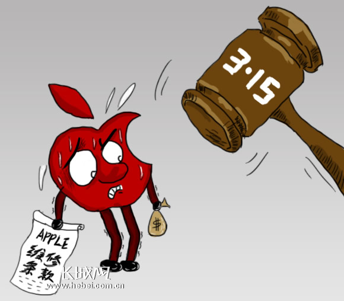
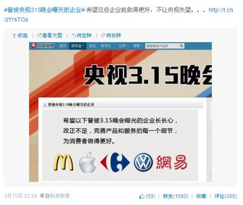

# ＜七星视点＞第三十五期：315晚会——如何选取负面典型？

揪出负面典型是315晚会的主要内容。然而在今年的晚会中，这些典型却引来了比往年广泛得多的争议。这些争议从何而来呢？央视的动机又为什么受到如此的质疑？本周问政频道“315专题”的第一篇文章，希望能够为您作出解答。

**315晚会——如何选取负面典型？ **

揪出负面典型是315晚会的主要内容。今年的晚会中，被曝光问题的有：苹果售后涉嫌歧视；大众汽车双离合器变速器存隐患；江淮同悦车身用劣质钢材易生锈；周大生黄金掺假；网易默认第三方挂代码窃取用户邮箱信息；高老太降糖贴请演员作虚假广告。然而，在央视为消费者“替天行道”的时候，许多消费者却如“月光博客”中写的那样：**“晚会结束后，我们看到的不是群众的愤怒和媒体对不良企业的谴责，而是对央视本身的质疑”。**而这种质疑，来自对晚会选取的负面典型的不满。

[@北京厨子](http://weibo.com/u/1619962527)：“今年央视315晚会曝光企业，哪个最让你震惊？”我最震惊的是：一个国家的国家电视台，放着自己最大城市的母亲河、穿城河飘过的上万头死猪不去关注，跑去研究一家手机厂商不给换后机盖。我不知道这个国家的良心死到那里去了。真的。

与往常一样，这条微博迅速被网友热烈转发，迅速成为热门微博。但仔细想一想，死猪事件发生在3月初，大量打捞在10日左右，查明原因更要在这之后；另一方面，该事件又是否属于315应解决的问题呢？以它来指责央视的315晚会的“良心”，似乎有些不理性，只是一种义愤的宣泄罢了。

事实上，央视作为一家媒体，不可能做到解决消费者的一切问题，如果仅仅因为它曝光了A而没有曝光BCD就进行指责，未免有些过分。我们要不要批评、怎样批评，关键要看，它是在类型相似的ABCD问题中随机抽取一个问题进行曝光、然后在另一类型另一层次的EFGH中随机抽取曝光，还是忽略掉一些重要领域的问题、仅在某个特定领域、层次曝光问题？又或者，是否是为了某种利益专门挑选一些企业进行曝光？弄清楚了这些问题的答案，我们才能对其进行批评或赞扬，而不是发泄式的为黑官媒而黑。

那么，315晚会的典型选取到底有没有问题呢？有网友从不同角度对此问题发表了看法。首先，有人认为，315揭露的企业及其问题危害相对较小，真正严重的问题却没有得到批评：

[@冠新天杰](http://weibo.com/u/3219509464)：今年央视315晚会，挑刺的都是苹果、网易等优秀企业，给人留下了只从优秀的企业身上“鸡蛋里挑骨头”，而不敢直接指摘国企垄断、政府不负起监管责任的核心问题。

其次，有人认为，晚会把“为消费者维权”变为“为富裕的中产阶级消费者”维权，而忽略了中下层消费者所面临的问题。或者，换一种方式来说，晚会关注的都是“耐用消费品”的问题，而没有关注与日常生活关联度最大的“生活必需品”：

[@余胜海](http://weibo.com/n/%E4%BD%99%E8%83%9C%E6%B5%B7):315晚会忽视了最主要的问题：3.15晚会把重点放在维护富人消费权益上，拿苹果、大众汽车转移视线，避重就轻。而与十多亿民众生活密切相关的如奶粉、食品、医疗、教育、水源、环境等方面的问题却只字不提。

还有人认为，晚会选取这些典型，除了为消费者维权外，还有其他考虑：

[@林景新](http://weibo.com/linjingxin)：1991年央视315晚会第一次播出。作为央视最重要的节目之一，22年来晚会批判对象从“打苍蝇，不打老虎”渐变为“既打苍蝇，也打老虎”，开播动机从纯为消费者维权，转向央视追逐自我媒体集权影响力建构。

华尔街日报：在过去一年中，央视展示了自己严重影响外资品牌日常经营的能力……中国领导人最近几周表示，他们将推动解决食品安全丑闻以及服务质量差等问题，以提升消费者信心并增加国内消费。

有人指出，央视作为一家媒体，也许没有能力、也没有必要承担这些指责。但是，正如公众人物在收获了巨大的关注后要承担一定的道德义务一样，作为影响力最大的媒体，我们希望央视在一些问题上需要具有一定的担当，因为：

[信海光](http://xinhaiguang.blog.caixin.com)：央视不是法院，也不是消协，但在315晚会上，它的权力似乎比法院还大，对于被曝光的企业来说，这一夜没有可辩护、商榷的余地，被央视如此强大的媒体曝光，其后果超过多数最严厉的法院判决，可谓审、判加执行一体。比如2008年，分众传媒的无线业务在晚会上被曝光后从此一蹶不振，到年底，分众正式宣布终止剩余的无线广告互动营销业务时，由此直接在当年第四季度产生的非现金性一次性减损支出达2000万美元。其实，如果一年中最严重的损害消费者利益事件都能“享受”在315晚会上被曝光的待遇也不错，但客观上央视显然做不到这一点，即便在主观上，他们选取的打击对象也都是对老百姓危害不是最大的，这样就令人们产生另一个疑问:央视以什么标准选择打哪个企业或行业？如果存在“选择性的揭黑”，人们难免会对央视曝光谁不曝光谁的动机产生怀疑。

_ _

（编辑：刘迎；责编：刘迎）
