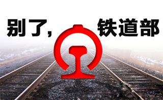
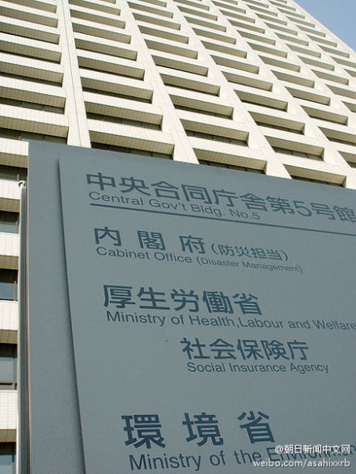
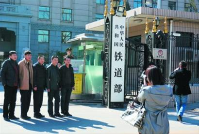

# ＜七星视点＞第三十六期：设官分职——2013年国务院机构改革

**多了更多，少了不少**

2013年3月10日，已经被议论了许久的《国务院机构改革和职能转变方案》终于被呈现在公众面前了。

此次机构改革一共涉及六个领域的部门，包括：铁路实行政企分开，组建国家卫生和计划生育委员会，组建国家食品药品监督管理总局，组建国家新闻出版广播电影电视总局，重组国家海洋局，重组国家能源局。经过这次改革，国务院减少正部级机构4个，其中国务院组成部门减少2个。

从1979年开始，每一届国务院的机构设置都在发生着变化。在这个过程当中，国务院的组成部门数量上在不断减少，尤其是随着时代的变迁，一些已经过时的部门消失了，而新的部门也在被创造出来。本期七星视点，将带大家观察这次发生的变化，分析变化将会带来怎样的未来。

**最后的政企分开**

1988年的国务院机构改革，是第一次强调“政企分开”的机构改革。当年的机构改革撤销了12个部委，其中经济和工业领域撤销了8个。而在更早的时候，1987年，中国民航解散，民航总局不再承担企业职能。到1998年，所有的专门工业部委都被撤销。从那时起，铁道部就成为了唯一一个兼具行政职责和企业职责的国务院组成部门。

从多年前开始，撤销铁道部的意见就被反复讨论。2008年，在新的交通运输部组建的时候，关于将铁道部并入的呼声也相当高涨。对此，铁道部方面称：

> “铁路对国土开发、国防建设、维护国家民族统一作用明显，服从国家战略的需要。……保留铁道部，有利于现阶段发挥体制优势、资源优势、机制优势，集中力量又好又快的办大事。”

实际上，早在1988年，铁道部就进行了网运分离、地区包干的尝试。然而，就在当年，就发生了“1·24”贵昆铁路脱轨事故，时任铁道部长丁关根引咎辞职，而这次改革尝试也由于安全考虑而停滞了。此后，铁道部的政企分开虽然屡被提及，却终于没有付诸现实。

在这次的机构改革中，铁道部的政企分开终于“千呼万唤始出来”，然而，这究竟将带来什么样的结果呢？新成立的巨型国企——掌握超过一万亿资产的中国铁路总公司，究竟会有什么变化呢？

> [@冬眠熊2010](http://www.weibo.com/u/1446475417)：『熊眼夜视215』铁道部行政职能并入交通部，运营方面成立总公司管理，只完成了政企分开，能否引入竞争机制并让民众有竞争带来的好处（如降价和服务提升及民资进入）还要看发展。同理，税总并入财政，撤销地税，会给企业带来便捷，但分税制改革和事权科学划分才是关键。大部制是要真改革吗？再观察。

**“National Health and Involuntary Abortion Commission”**

另外一个从第一届国务院开始就存在的部门——卫生部，也在这次机构改革中不复存在。取而代之的是承担原卫生部职能和国家人口和计划生育委员会的计划生育职能的国家卫生和计划生育委员会。

近年来，对人口政策及其执行的批判，正变得越来越严厉。对于计划生育政策究竟要不要继续，也有过多个角度的争论。而在这个新的部门的名称中，我们似乎能够看到对这个政策的进一步强调。似乎我们有理由预言，至少在本届政府任期内，这一政策不会发生根本上的改变了。

另一方面，新的部门究竟能不能适当执行好这两个职能？很多人对此是持怀疑态度的。

> [@医生哥波子](http://weibo.com/liaoxinbo)：卫生部将不存在,人们的心情是可以理解的。我身在北京，也想在卫生部门前留个影，留住历史的瞬间、永恒的悲伤。全世界部门的设置诸多，惟有卫生部的设立是各国共同愿望，卫生部担负着人的生老病死何止一个计划生育这么简单。生育、节育、优育哪一项不是医疗的概念？
> 
> [@傅蔚冈](http://www.weibo.com/fuwg)：有朋友在计生委工作，我问他对此次调整的态度。他说，调整好啊，到发改委后，我们这些做战略的再也不要背负恶政的骂名。不过卫生部可麻烦了，医改本来就没做好，这次再加上计生工作，不知他们如何应对？
> 
> [@木碗清](http://weibo.com/qiludelu)：卫生部和计生委合并为国家卫生和计划生育委员会，一个救人的部门和一个杀人的部门，合二为一，这好像是神医平一指啊，救一人杀一人。以前超生可以在医院出生，可现在医院被计生委也掌控了。在国外可没有“计生委”这个叫法，连人口计划管理这么一个部门也没有，以后卫生部的人是不是拐带的不能出国了？

颇具讽刺意味的是，国家卫生和计划生育委员会的英文译名，是颇为温情脉脉的“National Health and Family Planning Commission”。对此，网友们进行了尖锐的讽刺：

> [@谢泼德](http://www.weibo.com/burrito)：National Health and Involuntary Abortion Commission（国家卫生和强制堕胎委员会）

**一个很长的名字**

国家广播电影电视总局，和国家新闻出版总署，这两个部门在这次机构改革中合并成了一个新的部门：国家新闻出版广播电影电视总局。这个主管媒体事业的部门，成为了国务院历史上最长的机构名称。正因为如此，网民们已经开始将这个部门称为“天下第一局”了。当然，想象力丰富的网友们也想出了很多更加奇妙的名字。

> [@夜骸](http://www.weibo.com/n/%E5%A4%9C%E9%AA%B8)：国家新闻出版广播电影电视总局，其职能无非是洗、剪、吹——不会吹牛逼的洗脑者不是好剪刀手。所以直接叫“国家洗剪吹总局”不就完了。
> 
> [@小姬AI](http://www.weibo.com/jishaoting)：看到大家都觉得“国家新闻出版广播电影电视总局”名字好长，纷纷建言献策，我觉得不用担心，反正他们会剪短的。
> 
> [@田書韜](http://www.weibo.com/n/%E7%94%B0%E6%9B%B8%E9%9F%9C)：还叫“国家广播电影电视电话电脑电码电驴及新闻出版报刊杂志书籍文章博客微博安全生产监督审查屏蔽删除销毁管理总局”的好。

这样的长名字，困难在哪里呢？中央编制办副主任王峰做出了堪称无奈的回答：

> “你说，这个名字减哪一个字？要准确完整表达我们新机构的职责范围，我只能拉这么长，如果你有什么高招，让这么长的字段减下来，那你是高手。”

然而，这个表态除了引来了网友调侃，更招致了“太君之怒”，一个例子就出色地将这个名字置于尴尬之中。

> [@朝日新闻中文网](http://weibo.com/asahixxrb)：【名字不好起】厚生劳动省，是日本政府中央省厅之一。医疗、劳动政策、社会保险、公积金等行政职能都由其负责。“厚生”一词出自中国古典《尚书·大禹谟》：“正德利用，厚生惟和”，“厚生”大意为“使人民生活更富足”。因此社会福利与劳务、医疗、卫生、养老金等事务，都由厚生劳动省掌管。

很明显的是，网友们的批评并不仅限于这个名字本身。这个部门本身已经成为了媒体管制的一个象征。而这次重组，究竟是意味着管制的松动还是管制的强化呢？这是我们还难以断言的。然而这里有一个规律：政府的一切不受约束的改变，都走向自身权力的扩大。而这个名字，也显现出了“把一切都管起来”的决心。

终于，在经过了几天的争议后，这个最长的全名被修改成了“国家新闻出版广电总局”。然而，对它的未来的争论，还将持续下去吧。

**结语：改革，改革？**

本次改革新设立的六个机关，我们只论及了其中的三个。所有这些部门都是直接关联到我们的生活的，然而这三个却引发了最大的波澜。一方面，这些部门本身就是饱受争议的；另一方面，它们的变化也暗示着改革“进入深水区”之后的方向选择。

在国务院对人大作的说明中，提到：

> “这次改革，要以更大力度，在更广范围、更深层次上加快国务院机构职能转变，重在向市场、社会放权，减少对微观事务的干预，同时改善和加强宏观管理，严格事后监管。这项任务更加艰巨、更为复杂。”

的确，政府的走向“守夜人”地位，是很多人长久以来所呼吁的。如果这真正变成现实，那么改革的未来应该是包含着希望的。然而，在这次改革的细节上，我们还看不清楚这句话究竟是真实决心，还是一句空谈。

> [@冬眠熊2010](http://www.weibo.com/u/1446475417)：『熊眼夜视202』尽管他们已经熟知托克维尔说的“对一个坏政府来说，最危险的时候通常就是它开始自身改革的时候”，仍然高调宣称要进行攻坚克难的深度改革，以获取改革红利并变成“好政府”。但由于拒绝了宪政民主改革，又使改革前景扑朔迷离，捏成几个大部，收放若干权力，改变一下作风，大概就是改革了。

（编辑：张舸，责编：刘迎）
